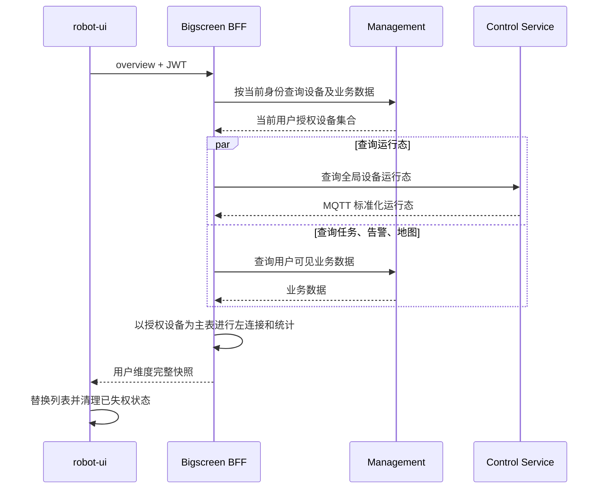
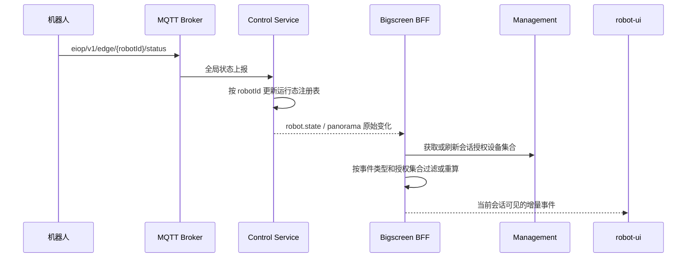

# 大屏设备数据权限与缓存边界设计说明书

| 属性 | 内容 |
| --- | --- |
| 状态 | 整改实施中 |
| 适用模块 | Management、Bigscreen BFF、Control Service、robot-ui |
| 更新日期 | 2026-08-28 |

## 1. 目的

本文统一规定大屏设备数据在管理端查询、MQTT 状态接入、BFF 聚合、WebSocket
推送、前端展示和控制指令中的权威来源、权限边界及缓存策略，避免出现以下问题：

- 当前用户看到其他用户的设备或统计数据。
- MQTT 上报设备绕过管理端授权进入大屏。
- 用户 Token 刷新或权限变化后继续使用旧设备集合。
- Control 后台线程从任意用户缓存中取得设备档案。
- REST 快照与 WebSocket 增量使用不同数据来源，导致类型、摄像头或在线状态跳变。

本文只定义跨模块边界和约束。字段结构仍以大屏 BFF 接口文档、字段来源映射文档
和客户端事件协议文档为准。

## 2. 核心原则

以下规则是后续实现必须保持的系统不变量：

1. **管理端决定设备是否存在以及当前用户是否可见。**
2. **MQTT 和 Control 只提供设备运行态，不能授予用户设备权限。**
3. **BFF 返回或推送的设备集合必须是“用户授权设备集合”与“运行态集合”的交集或左连接结果。**
4. **Control 的全局运行态可以跨用户复用，用户授权集合和页面快照不得跨用户复用。**
5. **REST 首屏快照与 WebSocket 增量必须使用相同的权限集合、设备标识和字段权威来源。**
6. **权限数据查询失败时关闭访问，不得回退到其他用户、全局设备或 MQTT 已知设备。**
7. **控制指令在执行前必须按当前用户重新校验目标设备权限，不能仅依赖页面曾经展示过该设备。**
8. **Control 后台线程没有用户身份时不查询 Management，也不从任意用户缓存补充设备档案。**

用集合表达：

```text
用户可见设备 = Management 按当前身份返回的设备集合
页面设备快照 = 用户可见设备 LEFT JOIN Control 全局运行态
设备实时事件 = Control 原始事件 INTERSECT 当前 WebSocket 会话可见设备
```

## 3. 服务职责与数据归属

| 数据或行为 | 权威来源 | 其他模块职责 |
| --- | --- | --- |
| 设备存在性、序列号、名称、类型、厂商、型号 | Management | Control/BFF 只读取，不自行补造档案 |
| 用户可见设备集合 | Management 按当前 JWT 查询结果 | BFF 用于 REST 聚合和 WebSocket 过滤 |
| 设备类型字典 | Management | BFF/Control 可短期缓存显示名称，不自建固定映射 |
| 在线心跳、电量、速度、控制模式、位置、设备运行状态 | MQTT，经 Control 标准化 | BFF 只聚合和转换页面事件 |
| 摄像头、上装设备、设备能力 | Management 档案与 Control 实时状态按字段规则合并 | 不允许用旧用户档案补齐当前用户数据 |
| 任务、告警、地图、固定摄像头 | Management | BFF 转换为稳定页面 DTO |
| 用户维度设备、任务、告警和统计快照 | BFF 按当前用户即时计算 | 不保存为全局快照 |
| 页面选中项、展开状态、当前播放会话 | robot-ui | 用户或权限切换时清理无权限状态 |
| 控制命令校验与执行 | Control | BFF 透传当前认证上下文，Control 再校验设备权限 |

### 3.1 身份信息边界

- JWT 中的发行方、用户主体和组织是身份依据。
- `X-User-Id`、`X-Org-Id`、`X-Roles` 只能由可信 BFF 根据已验证身份覆盖后传，
  不能接受浏览器任意指定，也不能单独作为授权事实。
- 用户缓存键至少包含 JWT `issuer + subject + orgId`。无法取得稳定主体时，使用
  Token 指纹作为隔离键，不保存明文 Token。
- 下游 Management 请求必须携带当前有效 Token；Token 刷新后使用新 Token 发起请求，
  缓存身份仍可保持稳定，但不得延长旧授权结果的有效期。

### 3.2 设备标识边界

| 标识 | 含义与用途 |
| --- | --- |
| `robotId` | 等于 Management 设备档案的 `serialNumber`，是 REST、WebSocket、MQTT 和 Control 的统一机器人标识 |
| Management `id` | 管理端设备记录主键，只用于调用 Management 详情、关联关系等接口 |
| `deviceId` | 机器人摄像头、云台、车灯、发射器等上装设备标识 |
| `cameraId` | Management 固定摄像头主键，是固定摄像头授权和业务操作标识 |
| 设备名称 | 只用于展示，不参与关联、缓存键、权限判断或控制寻址 |

禁止使用 Management 主键或设备名称代替 `robotId`。跨服务关联时必须先从 Management
设备档案取得 `serialNumber`，再转换为 `robotId`。

`robotId/serialNumber`、`deviceId` 和 `cameraId` 均区分大小写。服务端接收时只去除首尾
空格，不转换大小写；Management、MQTT Topic、缓存键、数据库和前端必须保持原值，
禁止前端自行统一为大写或小写。

固定摄像头不属于机器人，不使用 `robotId`。固定摄像头视频源统一表示为：

```text
sourceType = FIXED_CAMERA
sourceId = cameraId
```

固定摄像头是否可见和能否播放，以 Management 按当前用户返回的固定摄像头集合为准；
Control 只能补充已授权固定摄像头的在线和推流状态。固定摄像头事件按授权 `cameraId`
过滤，不能套用机器人 `robotId` 规则。

固定摄像头在线状态的目标来源是 Camera Gateway 专属状态或心跳。Management 的 `enabled=true`
只表示业务启用，视频会话或 LiveKit 房间存在也不能表示摄像头在线。固定摄像头使用独立
心跳超时，不刷新或覆盖机器人在线状态。

当前代码已接入 Gateway 独立心跳与 RTSP 健康：只有配置启用且完整、Gateway 在线、最近
RTSP 探测成功时 BFF 才返回 `status=online`。缺失或过期、配置停用均为 `offline`；视频会话状态
仍不参与长期在线推导。

### 3.3 字段合并边界

| 字段 | 权威来源 | 合并规则 |
| --- | --- | --- |
| 机器人名称、类型、厂商、型号 | Management | MQTT 和 Control 运行态不得覆盖 |
| 在线状态 | `eiop/v1/edge/{robotId}/status`，经本项目 Control 注册表标准化 | BFF 首屏和 WebSocket 使用同一注册表；Management Control 实时状态不得覆盖；注册表无记录时为 `offline` |
| 电量、速度、控制模式 | 本项目 Control 注册表和 `robot.state` | 按 `runtimeUpdatedAt` 合并，未知为 `null`，媒体心跳不推进版本；独立于在线状态版本，不由控制画像覆盖 |
| 位置 | Management Control 实时状态及 Control MQTT 定位事件 | 保持当前坐标与地图关联链路，不参与在线判定 |
| 摄像头档案、通道和基础参数 | Management | 以 Management 当前用户查询结果为准 |
| 摄像头实时在线、推流和会话状态 | Control | 只能补充已存在的摄像头档案，不新增无权摄像头 |
| 上装设备档案和能力 | Management | Control 请求链路可使用当前用户身份查询 |
| 上装设备实时状态 | Control/MQTT | 按 `deviceId` 补充，不覆盖档案字段 |

装备弹窗仅在选中时调用设备详情补齐型号和非 `BODY` 组件数量；Overview 不逐设备查询。
详情先验证当前用户设备列表，再解析唯一目标的 `device/components`，无权 ID 不建立详情缓存。
前端分别合并档案、在线状态与运行态；重复/旧事件不能覆盖较新字段，未知数量和速度不显示成零。

Control 后台生成的运行态事件允许名称、类型、摄像头和上装设备档案为空；BFF 向具体
用户推送前，使用该用户已授权的 Management 数据补充页面字段。这样可以避免 Control
后台为了丰富事件而借用用户 Token 或用户缓存。

Management 中存在的摄像头或上装设备即使没有 Control 实时状态也保留在集合中，其
实时状态返回 `null`，不能直接判定离线。Control 上报但 Management 档案中不存在的
摄像头或上装设备不加入面向用户的集合。

BFF WebSocket 已按 `issuer + subject + orgId` 复用最长 30 秒的授权设备档案快照；REST
请求仍按各聚合接口的当前身份查询，不直接复用 WebSocket 内存快照。实时事件按
`robotId` 与有效快照合并；WebSocket 即使早于 Overview 建立，也必须独立取得权限。
档案加载失败时按权限加载失败处理，不能把 Control 原始全局事件直接下发。具体实现和
验收边界见《生产调用链路风险与整改清单》PROD-005。

### 3.4 三层权限边界

| 权限层次 | 作用 | 权威来源 |
| --- | --- | --- |
| 菜单权限 | 决定 robot-ui 是否显示页面和菜单入口 | Management 菜单权限 |
| 接口资源权限 | 决定用户能否调用 REST/WebSocket 能力 | API Gateway/BFF 资源授权 |
| 数据权限 | 决定用户能看到哪些设备、任务、告警、地图和固定摄像头 | Management 当前用户查询结果 |

三层权限相互独立：隐藏菜单不能替代接口鉴权，拥有菜单或接口资源权限也不能自动获得
业务数据权限。前端只负责按菜单权限改善交互，所有安全判断必须在服务端继续执行。

## 4. REST 聚合流程

`GET /api/bigscreen/panorama/overview` 的设备处理顺序必须固定：



规则：

- 设备数组只能从 Management 当前用户设备列表开始构造。
- Management 设备列表必须根据响应总数或末页标识连续翻页直至取完，禁止把固定
  `pageSize=500` 当作完整授权集合。HTTP 成功且记录为空表示用户确实没有设备；超时、
  认证失败或响应结构异常表示查询失败，两者不得使用相同降级逻辑。
- Control 注册表、历史状态和 MQTT 已知设备只能补充同一 `robotId` 的运行态字段，
  不得向设备数组追加记录。
- Management 中存在但暂无运行态的设备仍可返回；运行态字段为空或使用明确的未知态，
  不得因 Control 查询失败直接判定设备离线。
- 所有设备统计必须从本次请求的授权设备集合计算，不能使用 Control 全局设备总数。
- Overview 内部的中间结果只在本次请求中复用，禁止保存全局完整响应。

## 5. MQTT 与实时事件流程



### 5.1 Control 处理规则

- 运行态注册表按 `robotId` 全局保存，不带用户权限语义。
- 只有收到 `eiop/v1/edge/{robotId}/status` 才刷新机器人在线时间；媒体状态、控制结果、
  任务进度和其他 Topic 均不能刷新机器人在线时间。
- 在线时间使用 Control 收到 MQTT 消息的服务器时间 `receivedAt`，不能使用边缘端时钟。
- `status` Topic 必须使用 `retain=false`。Control 收到 retained 状态时可读取字段用于
  初始化，但不能刷新在线时间，也不能据此推送设备恢复在线。
- 边缘端状态上报间隔不超过 10 秒，因此默认连续 30 秒未收到状态消息才判定离线，
  Control 离线扫描周期应不超过 1 秒。超时时间始终保持为最大上报周期的至少三倍，
  为单次丢包、网络抖动和调度延迟留出余量。
- Management 或 Control 下游查询失败不能改变最后一次有效 MQTT 心跳计算出的在线状态。
- 同一 `robotId` 的状态消息按 MQTT 接收顺序处理；消息载荷的 `timestamp` 只作为业务
  数据时间展示。若可确认消息为同一来源的旧消息，则不允许其覆盖更新的数据。
- 设备处于离线状态时，收到第一条合法状态消息必须立即恢复在线并推送状态变化；在线
  期间的重复心跳只刷新边缘状态接收时间，不更新 `statusChangedAt`。当前每条合法状态仍广播
  `robot.state` 以同步电量、控制模式等运行字段。
- 后台线程没有用户身份时不查询 Management，也不得从“最近一个用户”的缓存中取档案。
- MQTT 不带设备档案时只保存最小运行态，名称、类型、摄像头和设备能力保持为空；BFF
  依据当前用户 Management 查询结果进行补充。
- Control 重启后、设备首次状态上报前注册表无记录；BFF 对 Management 已登记但注册表无记录的
  设备返回 `offline`，不引入 `unknown`。第一条合法非 retained 状态立即切换为在线。

MQTT 设备凭据、Topic ACL 和设备防冒用不属于当前阶段实施范围，后续接入设备身份体系时
单独设计；该暂缓不改变 Control 必须以 Topic 路径中的 `robotId` 处理状态的约束。

### 5.2 BFF 事件授权规则

| 事件类型 | 授权处理 |
| --- | --- |
| `robot.state` | 必须带 `robotId`，仅推送给包含该设备权限的会话；内嵌的 `cameras[].cameraId` 及上装状态相机字段属于机器人本体相机，继承 `robotId` 权限，不按固定摄像头二次校验 |
| `panorama.device.status.changed` | 同 `robot.state` |
| `panorama.device.location.changed` | 同 `robot.state` |
| `panorama.task.changed` | 不根据 Control 全局数据推断权限；按当前会话身份重查 Management 用户可见任务后推送 |
| `panorama.alarm.changed` | 按当前会话身份重查 Management 用户可见告警；无关联设备告警也只能在 Management 返回给该用户时展示 |
| `panorama.stats.changed` | 必须按每个会话的授权集合重新计算，禁止转发全局统计 |
| 系统级事件 | 当前白名单为空，默认不广播；后续仅可逐项加入不包含业务数据的事件 |

默认策略是拒绝：无法解析的事件、应包含 `robotId` 却缺失的设备事件，以及未登记的
业务事件不得因为“没有提取到 robotId”而广播给所有会话。多设备事件应裁剪为当前会话
有权查看的记录；无法安全裁剪时整条丢弃并记录审计日志。

任务和告警事件在既有 `event + timestamp + data` 外层结构中使用 `data.changeType` 表达
集合变化，不增加新的事件名称：

| `changeType` | 含义 | 前端处理 |
| --- | --- | --- |
| `UPSERT` | 新增或更新，包含当前可见的任务或告警数据 | 按 `taskId` 或 `alarmId` 新增或覆盖 |
| `REMOVE` | 记录已删除、用户已失权或不再满足当前查询条件 | 按 `taskId` 或 `alarmId` 从列表移除 |

BFF 对 Management 重查前后的当前用户快照进行比较后生成 `REMOVE`，不能把其他用户
仍可见的数据删除事件广播给当前会话。

### 5.3 WebSocket 会话权限刷新

以下条目已经落入当前代码。BFF 在自身轮询发现资源集合变化后会通知前端；Management
主动推送权限版本仍属于可选时延优化，当前正确性由 30 秒硬过期独立保证。

- 握手时使用当前认证信息加载设备权限集合。
- 前端在 Token 到期前使用刷新后的 Token 主动重连，允许新连接携带新 Token。
- BFF 到达原 Token 的 `exp` 后必须关闭仍未更新的连接，不能让过期连接继续接收事件。
- 会话存续期间授权快照最大陈旧时间为 30 秒；轮询间隔不能替代快照硬过期检查。
- 若后续收到可靠的权限版本变化通知，应立即失效相关快照；该通知属于可选时延优化，
  不能成为 30 秒硬过期的唯一保障。
- 同一身份的多个 WebSocket 会话共享一份最长 30 秒的授权档案快照，避免逐连接重复查询；
  共享键必须包含完整身份键，不同用户或组织绝不共享。
- 权限刷新失败时不保留旧权限，立即停止业务事件推送并关闭连接。
- 权限集合变化后立即按新集合过滤，并发送不含资源明细的
  `bigscreen.authorization.changed`；前端先清空旧资源和本地播放，再使用当前 Token 重拉
  Overview，WebSocket 只承担后续增量。
- WebSocket 断线重连成功后前端也重拉 Overview，覆盖断线期间发生的权限增减。

应用关闭码统一为：`4001` 表示 Token 已过期，`4003` 表示权限加载失败或权限失效。
前端收到 `4001` 后立即刷新 Token 并重建唯一连接；收到 `4003` 后以约
2、4、8、16、30 秒的指数退避重连，每次增加 0 至 500 毫秒随机抖动，持续失败时保持
30 秒低频重试并展示权限服务不可用提示。连接稳定保持 10 秒后清零退避次数，避免初始
权限加载失败在握手 `onopen` 后立即 `4003` 时反复回到 2 秒间隔；主动退出不重连。

权限缓存 TTL 内的数据属于当前有效快照；TTL 到期后必须刷新。刷新失败不设置额外宽限期，
REST 返回 `503`，WebSocket 使用 `4003` 关闭。任何链路都不得继续使用已过期权限快照。

当前 WebSocket 继续通过 `access_token` 查询参数完成握手，不要求本阶段修改前端。Nginx、
API Gateway 和 BFF 的访问日志、异常日志不得记录该参数值；握手必须校验 `Origin`，Token
只用于认证且不得进入业务事件。后续可升级为一次性 WebSocket Ticket，但不属于当前阶段。

## 6. 控制指令流程

```text
robot-ui 发起控制
  -> BFF 验证 JWT 并透传可信身份
  -> Control 使用当前身份向 Management 校验 robotId
  -> 校验设备能力和控制租约
  -> 下发 MQTT 指令
```

页面设备列表、WebSocket 会话授权集合和历史控制会话都不能替代执行时授权。权限校验
失败、Management 不可用或设备已被移出授权范围时，Control 必须拒绝命令。

为避免高频控制帧反复请求 Management，控制权限校验按以下时机执行：

- 获取或接管控制租约时使用当前身份查询 Management。
- 租约有效期内，同一用户、机器人和控制范围的连续控制帧不重复查询。
- 不依赖租约的独立控制命令可使用最长 30 秒的当前用户授权缓存。
- 权限刷新发现失权后立即释放相关租约，后续命令全部拒绝。

用户退出、WebSocket 权限失效或设备权限被移除时，BFF/Control 应结束该用户对相关
设备的控制租约并停止连续控制帧；前端同时关闭相关视频和语音会话。实现采用现有会话
关闭和租约释放路径，不新增第二套控制协议。

### 6.1 视频会话权限

- 创建机器人视频会话时，Control 校验当前用户的 `robotId` 权限。
- 创建固定摄像头视频会话时，Control 校验当前用户的 `cameraId` 权限。
- 获取观看 Token、恢复已有会话时，Control 使用最长 30 秒的视频源权限缓存再次校验。
- Media Service 不调用 Management；Control 完成视频源权限校验后才调用 Media。
- 视频会话可以被多个有权用户复用，但会话存在不代表用户自动获得观看权限。
- 用户失去视频源权限后停止签发 Token，并移除该用户 Viewer；其他有权 Viewer 不受影响。
- 对讲继续要求当前用户和终端持有对讲操作权，不因共享观看会话而共享对讲权限。

### 6.2 Media 8088 机器人上传边界

Media Service 的 `8088` 端口允许机器人直接上传文件，但只把以下路径视为机器人入口：

```text
POST /api/media/files/multipart-uploads
POST /api/media/files/multipart-uploads/{uploadId}/part-urls
POST /api/media/files/multipart-uploads/{uploadId}/complete
GET  /api/media/files/{fileId}/status
```

机器人通过 `X-Robot-Id` 传递设备标识，当前阶段以可信机器人网段 CIDR 作为入口边界。
对象分片由机器人使用 Media 签发的短期预签名 URL 直接上传对象存储。

现有 Python 机器人客户端上传协议保持不变，不新增 `X-Org-Id`：

- `X-Robot-Id` 在机器人上传白名单接口中必须存在，并且是唯一权威机器人标识。
- 请求体中的 `robotId` 为空时使用 Header；非空时必须与 Header 一致，禁止覆盖 Header。
- `part-urls`、`complete` 和 `status` 必须校验上传任务或文件所属 `robotId`。
- 不属于当前 `robotId` 的 `uploadId/fileId` 统一返回 `404`，不暴露资源是否存在。
- 上传文件继续归入 `MEDIA_FILE_DEFAULT_ORG_ID`，当前机器人直传能力只支持一个上传组织。
- 在需要机器人跨多个组织上传之前，必须另行设计可信组织归属机制；不能直接信任机器人
  自报 `X-Org-Id`，也不能在未改协议时推断组织。

开放 `8088` 不代表开放全部 Media API：

- `/internal/media/**` 仅允许 Control 等内部服务访问。
- `/api/media/video-sessions/**`、文件查询、播放、下载和删除仍由 BFF/Control 受控调用。
- 生产部署应通过网络策略或反向代理实现路径和来源限制，不能仅依赖调用方自觉。
- Media 应用层还必须执行来源和路径白名单：服务内网来源可访问内部接口，可信机器人
  网段只能访问上述上传路径，其他来源直连 8088 一律拒绝。
- 当前机器人直接访问 8088，Media 只使用 `request.getRemoteAddr()` 判断机器人来源，
  不读取客户端传入的 `X-Forwarded-For`。
- 以后机器人上传改经 Nginx 时，只有请求直接来源属于已配置的可信代理地址，Media 才能
  解析代理设置的真实来源 IP；不可信请求携带的 `X-Forwarded-For` 必须忽略。
- 浏览器传入的 `X-User-Id`、`X-Org-Id`、`X-Roles` 不得在 8088 直连入口被信任。
- 当前可信网段模式不能防止同一网段内伪造 `X-Robot-Id`；该风险与设备身份体系一并延期，
  但不得因此扩大机器人可调用的接口白名单。

### 6.3 服务间可信链路

- 浏览器业务请求只进入 Nginx/API Gateway/Bigscreen BFF，不直接访问 Control 或 Media。
- 可信入口先删除外部请求自带的 `X-User-Id`、`X-Org-Id`、`X-Roles`，再根据已验证 JWT
  重新生成下游身份 Header。
- BFF 调用 Management 时继续传递当前有效用户 Token，由 Management 执行数据权限过滤。
- Control `8082` 和 Media `/internal/media/**` 只允许服务内网访问。
- Media `8088` 的机器人上传白名单是设备网直连例外，不改变其他 Media 接口的访问边界。
- 后续服务跨不可信网络部署时使用服务 Token 或 mTLS，不能只依赖可伪造的身份 Header。

## 7. 缓存设计

| 缓存 | 所属模块 | 缓存键 | 建议 TTL | 刷新与失效 | 失败策略 |
| --- | --- | --- | --- | --- | --- |
| 用户授权设备/摄像头 ID 集合 | BFF | `issuer + subject + orgId` | 最长 30 秒，代码封顶 | WebSocket 按身份异步提前刷新；集合变化后通知前端重拉 Overview；Management 主动版本通知为可选增强 | 无本用户有效缓存则关闭连接，不跨用户回退 |
| 用户授权设备档案快照 | BFF | 当前 REST 请求身份 | 请求或接口既有短缓存边界 | REST 不读取 WebSocket 内存快照；新增设备未命中时允许一次受控强制刷新 | 只使用同身份未过期数据 |
| Control 请求鉴权结果 | Control | Bearer 身份摘要 + `robotId` | 最长 30 秒，代码封顶 | 到期后使用当前请求 Token 查询 Management | 后台线程不得使用该缓存；刷新失败拒绝操作 |
| 设备类型字典 | BFF/Control | 字典编码 | 5 至 30 分钟 | 到期或字典版本变化刷新 | 保留类型编码，名称可为空 |
| MQTT 运行态 | Control | `robotId` | 心跳超时驱动 | 每次状态上报覆盖，超时标记离线 | 不影响设备授权事实 |
| 地图和点位 | BFF | `mapId + 数据版本` | 1 至 5 分钟 | 地图变更主动失效 | 返回当前请求可得数据或空数组 |
| Overview 中间结果 | BFF | 当前请求 | 请求生命周期 | 请求结束释放 | 禁止跨请求、跨用户复用 |
| 统计快照 | BFF | 身份键 + 统计维度 | 1 至 3 秒 | 相关设备/任务/告警变化触发 | 不得使用全局统计替代 |

缓存实现还必须满足：

- 定时清理过期条目，限制最大条目数，避免旧 Token 或长期不活跃用户造成内存增长。
- 缓存值使用不可变快照或防御性复制，不能被后续聚合修改。
- 日志只记录身份摘要、设备 ID、命中状态和耗时，不记录完整 Token。
- “受控强制刷新”每个身份和设备在短窗口内最多执行一次，防止缓存穿透。
- 权限缓存不能采用 `X-Roles`、固定字符串 `background` 或最近访问用户作为共享键。

当前阶段不引入分布式缓存。各实例只保存不影响授权正确性的短 TTL 本地缓存，独立向
Management 刷新；任何缓存未命中都不能跨实例或跨用户回退。后续只有在多实例负载证明
Management 压力不可接受时，才引入 Redis，并继续使用完整身份键隔离。

当前阶段 Control Service 按单实例部署，因为 MQTT 心跳和设备运行态保存在本地内存。
扩展为多实例前，必须保证每个实例都收到全部设备状态 Topic，或者将运行态迁移到共享
存储；不能使用共享订阅把不同设备状态分散到各实例后仍由任意实例返回完整设备状态。

本地缓存采用有界 TTL：用户维度缓存最多 1000 个身份，设备详情最多 20000 条，字典
最多 100 条；每 60 秒清理过期项。超过容量时优先淘汰最久未使用项。具体容量允许通过
环境变量调整，但生产环境不得使用无界 `ConcurrentHashMap` 保存用户数据。

### 7.1 事件可靠性

- 不改变现有 `event + timestamp + data` 外层结构。
- MQTT 事件优先使用原始 `messageId` 去重；设备状态使用 `stateSeq` 或同来源接收顺序
  防止旧事件覆盖新状态。
- BFF 只保存短期去重窗口，不承担永久消息存储或离线补发。
- WebSocket 断线重连后，前端必须先重新请求 Overview 建立完整快照，再消费增量事件。
- 无法判断顺序的重复事件允许幂等覆盖，但不能倒退任务终态、权限状态或设备状态版本。

## 8. 异常与降级

| 场景 | 处理要求 |
| --- | --- |
| Management 设备权限查询失败 | 有当前用户未过期缓存时短暂使用；否则返回明确的服务不可用，禁止返回全局或其他用户设备 |
| Control 运行态查询失败 | 保留 Management 授权设备，运行态字段返回空值并记录降级；不能批量判定离线 |
| MQTT 上报未知设备 | Control 可保存最小运行态用于诊断，BFF 不向用户展示，直到 Management 授权查询包含该设备 |
| Token 刷新 | 后续请求使用新 Token；稳定身份键不变，但权限缓存不得续期，需按原 TTL 重查 |
| 用户退出或切换账号 | 关闭 WebSocket、清空设备/摄像头/选中项/播放会话，再加载新用户 Overview |
| 权限被移除 | WebSocket 刷新后停止事件，前端清理设备及关联播放状态，控制请求再次校验并拒绝 |
| 无 `robotId` 的未知事件 | 默认丢弃，不按系统广播处理 |
| 可选聚合数据查询失败 | 保持既有响应结构，对应标量返回 `null`、数组返回 `[]` 并记录日志；任务聚合固定返回稳定的 `dataQuality.tasks`，页面不得把降级空值解释为真实的 0；其他来源不得临时增加无契约字段 |

用户授权设备查询属于 Overview 的必要前置条件，失败时返回 `503`，不能用空设备列表伪装
成功。

本文所称文件操作只指抓拍、录像、图片、视频等通用媒体文件接口，包括
`/api/control/files/{fileId}/content`、`download-url`、`play-url`、单条删除和批量删除，
不包括前端静态资源、地图业务数据或统计报告文件。以上媒体文件操作不额外调用
Management 查询设备权限；请求仍须通过 JWT 认证。任务、告警和机器人上传等
`createdBy` 为空的文件由 Media Service 按可信身份中的 `orgId` 校验，继续采用组织共享模型；
手动抓拍和手动录像写入 Keycloak `sub` 作为 `createdBy`，列表、详情、正文、下载、播放、
扩展绑定和删除同时校验创建人。访问其他用户的私有媒体统一返回 `404`。HLS 分片使用播放
接口签发的短期访问令牌，只有通过所有权校验的用户才能取得该令牌。

Management 删除设备后，BFF 从下一次授权快照起立即停止展示和推送该设备；Control
仅在离线保留期内保存最小运行态用于诊断，之后清理运行态、控制租约和关联会话。
`serialNumber` 是不可复用的业务唯一标识；确需复用时，必须先完成旧运行态、租约和媒体
会话清理，不能让新设备继承旧设备状态。

删除设备档案不级联删除历史媒体文件、任务、告警和统计报告。历史数据继续按原 `orgId`
和各自保留周期管理；页面优先显示历史记录中保存的设备名称快照，缺失时显示原
`robotId`。历史数据物理删除必须走独立清理流程并记录审计，不能由设备删除事件触发。

### 8.1 统计报告权限与存储

统计报告采用用户私有模型，不沿用通用媒体文件的组织共享规则：

- 报告索引保存 `createdBy` 和 `orgId`。
- 普通用户只能查询、下载和删除自己生成的报告。
- 管理员查看或删除组织内报告必须具有明确的报告管理资源权限。
- 报告生成后不因设备权限变化重写历史内容，但后续访问仍校验报告所有权。
- 当前报告文件和索引保存在 BFF 本地，因此报告功能按 BFF 单实例运行。
- 每个普通用户最多保留 100 份报告，默认保留 30 天；超限时优先清理最早生成的报告。
- 删除或到期清理时同时删除报告索引和 PDF，审计日志不随报告删除。
- BFF 多实例部署前，报告索引迁移到共享数据库，PDF 迁移到共享对象存储；不能依赖
  负载均衡粘性会话维持一致性。

## 9. 审计边界

| 审计内容 | 责任模块 |
| --- | --- |
| Management 返回的用户授权范围和拒绝原因 | Management |
| BFF REST/事件因设备权限被拒绝 | Bigscreen BFF |
| 控制命令、租约、能力校验和执行结果 | Control Service |
| 通用媒体文件预览、下载、删除和批量删除 | Media Service |

日志记录用户主体摘要、组织、目标资源、动作、结果、请求 ID 和时间，不记录完整 Token、
密钥或媒体访问凭据。保存周期服从平台统一安全审计策略，不在各服务中写死不同周期。

## 10. 当前实现审计与整改顺序

| 优先级 | 项目 | 当前状态 | 目标 |
| --- | --- | --- | --- |
| P0 | Overview 设备集合只能来自当前用户 Management 查询 | 已完成 | 保持回归测试，禁止 Control 注册表追加设备 |
| P0 | 前端使用 Overview 替换设备集合并清理失权状态 | 已完成 | 账号切换和权限减少场景持续验证 |
| P0 | Control 后台设备档案来源 | 已完成 | 已移除跨用户“最新缓存”回退；后台无用户身份时不查询 Management |
| P0 | WebSocket 无设备标识事件策略 | 已完成 | 上游无资源标识事件默认拒绝；用户统计、任务、告警由 BFF 按会话重查后发送 |
| P0 | `panorama.stats.changed` 用户隔离 | 已完成 | 所有触发路径均按会话身份重算，禁止全局快照广播和非零旧值兜底 |
| P0 | Management 授权设备完整分页 | 已完成 | 自动翻页取完，空结果与查询失败分别处理 |
| P0 | Control 单实例运行约束 | 待部署确认 | 多实例前完成全量订阅或共享运行态改造 |
| P0 | 固定摄像头事件和视频授权 | 已完成 | 按当前用户授权 `cameraId` 或 `FIXED_CAMERA/sourceId` 过滤和校验 |
| P0 | 视频会话 Token/恢复授权 | 已完成 | Control 对会话查询、Token、心跳、停止、重启、切码流和录像按视频源校验 |
| P0 | 统计报告用户隔离 | 已完成 | 保存 `createdBy/orgId`，限制查询、下载和删除，并按 30 天/100 份清理 |
| P0 | Media 8088 暴露范围 | 待部署确认 | 机器人仅可访问上传白名单，内部和浏览器业务接口保持受控 |
| P0 | 机器人上传任务归属 | 已完成 | `X-Robot-Id` 必填且不可被请求体覆盖，后续操作绑定同一机器人 |
| P1 | WebSocket 存续期间权限刷新 | 代码整改已完成，待生产联调 | 已实现 30 秒最大陈旧时间、按身份复用、异步提前刷新、上行消息拦截、Token 到期关闭、资源变化通知、Overview 对账和前端分类重连；Management 权限版本主动通知为可选增强 |
| P1 | 多设备任务/告警事件裁剪 | 已完成 | 按当前会话身份重查 Management 权威快照后逐项推送 |
| P1 | 任务/告警移除语义 | 已完成 | 使用 `data.changeType=REMOVE` 驱动前端删除任务、路径和告警状态 |
| P1 | 缓存清理和容量保护 | 部分完成 | 统一 TTL、定时清理、最大容量和指标 |
| P1 | 控制命令执行前授权 | 已完成 | REST/WebSocket 控制、来电和视频操作均使用当前身份校验，释放会话校验所有者 |
| P1 | 菜单、资源和数据权限分层 | 需逐入口复核 | 前端控制显示，网关控制接口，Management 控制数据范围 |
| P1 | retained 状态与服务重启初态 | 部分完成 | retained 已忽略，超时已调整为 30 秒；重启后显式 `unknown` 状态仍待补齐 |
| P1 | 固定摄像头在线来源 | 单实例代码已完成，待生产联调 | 使用 Camera Gateway 独立心跳和 RTSP 健康，不借用机器人或视频会话状态；多 Control 实例需共享短期状态或证明订阅一致性 |
| P1 | 机器人上传组织模型 | 已确认限制 | 保持 `MEDIA_FILE_DEFAULT_ORG_ID` 单上传组织，跨组织前另行设计 |
| P1 | WebSocket Token 日志保护 | 待部署确认 | 脱敏查询参数、校验 Origin，禁止 Token 进入业务日志 |
| P1 | 8088 代理真实 IP | 延期 | 当前直连只认 remoteAddr，经可信代理时再安全解析真实来源 IP |
| P1 | 设备删除后的历史数据 | 待整改 | 不级联删除，按原组织和保留周期独立清理 |

整改时不得把 P0 项拆成新的并行协议。优先复用 Management 现有授权查询、Control
现有 MQTT 运行态注册表和 BFF 现有 WebSocket 会话模型。

## 11. 分阶段实施

### 阶段一：集合边界收口

- Overview 以当前用户 Management 设备列表为唯一主表。
- 前端完整替换设备集合并清理失权状态。
- 为两个用户设备权限不相交的场景补回归测试。

### 阶段二：后台档案与事件授权收口

- Control 后台只维护 MQTT 最小运行态，不查询 Management，也不补充用户设备档案。
- 删除后台线程跨用户选择“最新设备缓存”的逻辑，运行态缺失的档案字段由 BFF 按用户补充。
- BFF 建立事件类型授权策略，处理无 `robotId`、多设备和统计事件。
- BFF 完整翻页加载授权设备，并按身份复用 30 秒档案快照。
- Control 补齐机器人和固定摄像头视频源授权，Media 保持媒体会话职责。
- Media 8088 收敛机器人上传白名单，隔离内部和浏览器业务接口。
- Media 强制机器人 Header 与上传任务绑定，不修改现有 Python 上传协议。

### 阶段三：权限时效与可观测性

- WebSocket 会话周期刷新权限，支持权限变化主动失效。
- 统计报告增加用户归属；多实例前迁移到共享数据库和对象存储。
- 增加报告 30 天/每用户 100 份的清理策略，并补齐 retained 与重启初态测试。
- 增加缓存命中率、Management 调用耗时、事件拒绝数、未知设备数等指标。
- 完成 Token 刷新、权限增减、Management 故障和多会话压力测试。

## 12. 验收场景

1. 用户 A、B 的设备权限互不相交时，REST、WebSocket、统计和控制均不能串设备。
2. 同一用户刷新 Token 后能继续查询，旧 Token 缓存不会成为长期授权依据。
3. Management 新增设备后，在缓存 TTL 内或受控刷新后可被当前有权用户查询。
4. Management 删除权限后，REST 不再返回，WebSocket 停止推送，前端清除残留设备。
5. 未登记设备持续上报 MQTT 时，不进入任何用户的大屏列表和统计。
6. Control 不可用时，Management 授权设备不会被误判为全部离线。
7. 任务、告警和多设备事件只包含当前用户有权查看的数据。
8. `panorama.stats.changed` 的设备总数与同会话 Overview 的授权设备口径一致。
9. 用户退出并切换账号后，不保留旧摄像头、播放会话、选中设备和控制状态。
10. 授权设备超过单页容量时，Overview 和 WebSocket 仍包含全部授权设备。
11. 任务或告警删除、失权后，前端收到 `REMOVE` 并移除对应记录。
12. 状态上报最长间隔 10 秒并发生一次丢包时，设备不会错误地切换为离线。
13. 同一用户多个 WebSocket 会话共享授权查询结果，不会跨用户复用。
14. Management 删除设备后，设备停止展示且旧租约、运行态和会话按生命周期清理。
15. 无固定摄像头权限的用户不能收到摄像头事件、创建会话或获取已有会话 Token。
16. 用户不能查询、下载或删除其他普通用户生成的统计报告。
17. 隐藏菜单、接口资源授权和 Management 数据范围分别生效，任一层缺失都不能越权。
18. 权限快照到期且刷新失败时，REST 返回 `503`，WebSocket 以 `4003` 关闭。
19. retained 状态不能把重启后的设备标记在线，首条真实状态可以立即恢复在线。
20. 固定摄像头在线变化不影响机器人在线状态，视频会话存在不等于摄像头在线。
21. 机器人直连 8088 时只能访问上传白名单，不能调用视频会话、文件删除或内部接口。
22. 报告超过 30 天或每用户超过 100 份时正确清理索引和 PDF，并保留审计日志。
23. 机器人不修改现有请求结构也能继续上传，缺少或伪造 `X-Robot-Id` 时请求被拒绝。
24. 可信机器人网段不能通过 8088 调用视频会话、文件删除或内部接口。
25. Camera Gateway 心跳或 RTSP 健康缺失、过期时，固定摄像头状态必须为 `offline`，不得沿用旧在线。
26. 大小写不同的设备标识不会被错误合并，前端和服务端均保持 Management 原值。
27. WebSocket、Nginx 和网关日志中不出现完整 `access_token`。
28. 当前机器人直连 8088 时忽略伪造的 `X-Forwarded-For`，只按真实连接地址判断来源。
29. Management 删除设备后历史文件、任务、告警和报告仍按原权限及保留周期可追溯。
