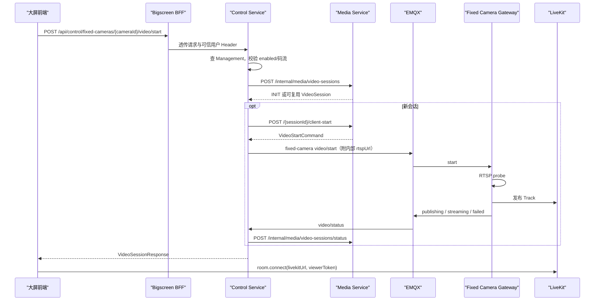

# 固定监控摄像头实时视频设计说明书

| 文档属性 | 内容 |
| --- | --- |
| 文档状态 | 当前代码基线 |
| 基线日期 | 2026-08-23 |
| 适用模块 | `bigscreen-bff`、`control-service`、`backend`、`fixed-camera-gateway` |

## 1. 目标与边界

固定摄像头与机器人在大屏 `devices[]` 中作为同级装备展示。浏览器通过 Control 创建媒体会话，固定摄像头 Gateway 拉取 RTSP 并向 LiveKit 发布 Track，浏览器直接订阅 LiveKit。

边界如下：

- Management Service 是摄像头档案、启用状态、主/子码流 URL、地图与区域归属的权威来源。
- Bigscreen BFF 只返回展示与播放所需字段，不返回 RTSP URL 和凭据。
- Control Service 校验档案、选择码流、调用 Media 并发布 MQTT 命令。
- Media Service 统一管理 `VideoSession`、Room、Token、Track、viewer 和空闲释放，不读取摄像头档案也不发 MQTT。
- Gateway 处理 RTSP 探测、发布进程、命令去重与状态上报，不上报机器人在线心跳。
- Gateway 另行上报自身心跳和摄像头 RTSP 健康；该健康不替代单次视频会话状态。

## 2. 当前架构

```text
Management Service
  -> Bigscreen BFF 聚合固定摄像头展示字段
  -> Control Service 校验 enabled/码流并选择 quality

浏览器
  -> POST /api/control/fixed-cameras/{cameraId}/video/start
  -> Control -> Media /internal/media/video-sessions
  -> Control -> MQTT gateway/fixed-camera/{gatewayId}/video/start
  -> Fixed Camera Gateway -> RTSP -> LiveKit Room
  -> MQTT video/status -> Control -> Media
  -> 浏览器直接订阅 LiveKit Track

Fixed Camera Gateway
  -> MQTT gateway/fixed-camera/{gatewayId}/status（Gateway 心跳）
  -> MQTT gateway/fixed-camera/{gatewayId}/camera/{cameraId}/status（RTSP 健康）
  -> Control 最新状态仓库 -> BFF Overview -> 大屏展示与统计
```

Gateway 入口为 `fixed-camera-gateway/cmd/fixed-camera-gateway/main.go`，核心实现为 `fixed-camera-gateway/internal/fixedcamera/gateway.go`。它只保留固定摄像头的 RTSP Probe 与 publisher，不包含机器人心跳、对讲、设备控制或文件上传。

## 3. 数据模型

### 3.1 Management 档案必要字段

| 字段 | 当前用途 |
| --- | --- |
| `id` / `cameraId` | 摄像头唯一标识；业务优先使用 `cameraId` |
| `cameraName` / `name` | 大屏展示名称 |
| `enabled` | 配置启停和 Control 启动门槛，不表示 Gateway 或 RTSP 在线 |
| `protocolType` | Control 校验后随目录快照下发；Gateway 只接受空值或 `RTSP` |
| `mainStreamUrl` | `quality=main` 的 RTSP 来源 |
| `subStreamUrl` | `quality=sub/auto` 的 RTSP 来源 |
| 地图/区域/位置字段 | BFF 用于地图展示，不参与视频路由 |

Control 查询 Management 固定摄像头列表并按 `cameraId/id` 匹配，并将当前用户授权的摄像头及码流地址作为短租约目录下发给 Gateway。Management 不可用时无法新建固定摄像头会话或续租目录；Gateway 不直连 Management。

### 3.2 Media 会话字段

```json
{
  "robotId": "camera-001",
  "sourceType": "FIXED_CAMERA",
  "sourceId": "camera-001",
  "deviceId": "camera-001",
  "channel": "visible",
  "quality": "sub",
  "reuse": true
}
```

`sourceType/sourceId` 是区分固定摄像头的权威字段。`robotId=cameraId` 是为满足 Media 当前 `@NotBlank robotId` 约束的兼容值，不表示固定摄像头属于同 ID 机器人。

Room 名称：

```text
media.fixed.{cameraId}.{channel}.{quality}
```

固定摄像头只允许 `channel=visible`。会话复用键为 `sourceType + sourceId + deviceId + channel + quality`。

固定摄像头会话是否可复用以 LiveKit Room 中的真实视频轨道为准。Gateway 上报 `streaming` 时不伪造
`trackSid`；若 Gateway 重启、发布进程退出或 Room 中已无视频轨道，Media 会将旧会话重新置为 `INIT`，
由 Control 重新下发启动命令，不能仅凭数据库遗留的 `STREAMING` 状态复用。

### 3.3 BFF 展示语义

```json
{
  "robotId": "camera-001",
  "cameraId": "camera-001",
  "typeCode": "FIXED_CAMERA",
  "equipmentType": "FIXED_CAMERA",
  "sourceType": "FIXED_CAMERA",
  "status": "online",
  "enabled": true,
  "configStatus": "READY",
  "configReady": true,
  "gatewayId": "default",
  "gatewayHealth": {
    "status": "ONLINE",
    "observedAt": "2026-08-23T10:00:00Z",
    "reasonCode": null
  },
  "streamHealth": {
    "status": "AVAILABLE",
    "observedAt": "2026-08-23T10:00:00Z",
    "reasonCode": null
  },
  "defaultQuality": "sub",
  "playable": true,
  "showControlCenter": false,
  "showController": false
}
```

- `status=online` 要求配置启用且完整、Gateway 心跳有效、最近 RTSP 探测成功。
- 对外 `status` 仅为 `online/fault/offline`；配置停用、配置无效、健康缺失或过期统一为 `offline`。
- `playable` 是兼容字段，只表示 `enabled && configReady`，不表示在线；新调用方使用 `configReady`。
- `defaultQuality` 优先 `sub`；没有子码流时为 `main`。
- `showControlCenter/showController=false` 表示页面不展示机器人控制入口。

## 4. 对外接口

### 4.1 单路启动

```http
POST /api/control/fixed-cameras/{cameraId}/video/start
Content-Type: application/json

{
  "quality": "sub",
  "reuse": true,
  "clientRequestId": "optional"
}
```

`channel` 即使传入也会被 Control 固定为 `visible`。如果请求的主/子码流未配置，Control 会回退到另一条可用码流。摄像头不存在、未启用或没有码流时请求失败。

### 4.2 批量启动

```http
POST /api/control/fixed-cameras/video/start
Content-Type: application/json

{
  "cameraIds": ["camera-001", "camera-002"],
  "quality": "sub",
  "reuse": true
}
```

结果按单路隔离，部分失败不回滚已成功会话：

```json
{
  "sessions": [
    {"cameraId": "camera-001", "session": {"sessionId": "vs_xxx"}}
  ],
  "failures": [
    {"cameraId": "camera-002", "message": "固定摄像头未配置码流：camera-002"}
  ]
}
```

空 `cameraIds` 返回两个空数组。输入会过滤空 ID 并去重。

观看 Token、心跳、停止、重启、切换码流和录像复用 `/api/control/video-sessions/**`，详见[实时视频接口与协议文档](../../03-接口与协议/实时视频/实时视频接口与协议文档.md)。

## 5. MQTT 协议与码流选择

| 场景 | Topic |
| --- | --- |
| 启动 | `gateway/fixed-camera/{gatewayId}/video/start` |
| 停止 | `gateway/fixed-camera/{gatewayId}/video/stop` |
| 人工重启、自动恢复、码流切换 | `gateway/fixed-camera/{gatewayId}/video/restart` |
| 视频会话状态 | `gateway/fixed-camera/{gatewayId}/video/status` |
| Gateway 心跳 | `gateway/fixed-camera/{gatewayId}/status` |
| 摄像头 RTSP 健康 | `gateway/fixed-camera/{gatewayId}/camera/{cameraId}/status` |

`gatewayId` 来自 Control `FIXED_CAMERA_GATEWAY_ID`，必须与 Gateway 同名配置一致。MQTT QoS 为 1，不使用 retained 命令。

Control 初次启动会将已选定的 `rtspUrl` 放入内部 MQTT 命令。该命令只应在受控内网传输，不得回传前端或记录完整 URL。手工重启、自动恢复或切换时，Media 重签的命令可能不含 `rtspUrl`；Gateway 使用 `sourceId/deviceId` 中首个非空值作为 `cameraId`，再从当前 MQTT 短租约目录选择码流。

Gateway 选择规则：

1. 命令含 `rtspUrl` 时直接使用，不读取目录。
2. 否则从当前有效 MQTT 短租约目录查询摄像头。
3. `main` 优先主码流；`sub/auto/空` 优先子码流；缺失时回退到另一条。
4. 当档案 `enabled=false`、协议非 RTSP 或无码流时上报 `FIXED_CAMERA_CONFIG_FAILED`。
5. RTSP 探测失败上报 `RTSP_PROBE_FAILED`，publisher 失败上报 `PUBLISH_FAILED`。

Gateway 心跳默认每 10 秒发布一次；异常断连由 MQTT 遗嘱发布 `OFFLINE`，正常退出主动发布
`OFFLINE`。Control 30 秒未收到心跳时转为 `OFFLINE`。Gateway 默认每 60 秒扫描当前有效短租约
目录中的摄像头，并以最多 4 个并发执行 RTSP 探测，重叠扫描会被跳过；健康超过 120 秒未更新时 Control
转为 `UNKNOWN`。Topic 与 payload 的 `gatewayId/cameraId` 不一致、状态枚举非法或乱序旧消息
均被拒绝。健康载荷只包含状态、序号、时间和原因码，不包含 RTSP URL、Token 或凭据。

`start` 是幂等的“确保发布”操作，已运行的同源 Publisher 可以复用；`restart` 是明确的 Source 操作，
Gateway 必须替换同一 stream key 的旧 Publisher，并保留同源会话绑定。浏览器 Viewer 断线、Track
局部取消订阅和 Token 换证不得触发 `restart`。只有人工操作、Media 确认 Track 中断、Gateway
`OFFLINE -> ONLINE` 或 RTSP `UNAVAILABLE/UNKNOWN -> AVAILABLE` 且会话仍有 viewer/活动录像占用时才允许触发。
Gateway 恢复时 Media 先核对 LiveKit Track，健康 Publisher 不强制替换；同源只下发一条
Publisher 命令，同 runtime 下仍有占用的失败会话由 Track 事实统一恢复。

Gateway 收到 stop 后会记录该 `sessionId` 的终止水位，后到的 start/restart 直接丢弃，
避免用户关闭与自动恢复跨 Topic 乱序时复活 Publisher。新播放会话使用新 `sessionId`，不受旧水位影响。
前端只在固定摄像头由不可播放恢复为可播放时自动补启动；其他装备遥测、首次健康快照和
重复 ONLINE/AVAILABLE 不能触发。

## 6. 运行时流程



最后一个 viewer 离开后会话进入 `IDLE_WAIT`。等待 `idle-release-delay-seconds` 后，Control 请求 Media 释放 Room，然后发布 fixed-camera stop；Gateway 只停止对应 `sessionId` 的 publisher。

### 6.1 大屏固定摄像头播放意图与消费者生命周期

大屏宫格中的 `ZQL_playingSource/ZQL_videosInfos` 表示用户当前的播放意图，LiveKit Room、Track 和全局
`activeCameras` 表示异步运行结果。固定摄像头的自动恢复只能以宫格播放意图为前提，不能仅凭全局活动会话
反向恢复已经被用户关闭的槽位。

固定摄像头在实时监控视频区使用稳定的 `consumerId` 和对应 `prefixId` 注册消费者。同一路固定摄像头可同时
被大屏宫格、地图弹框等多个界面消费；关闭、分屏收缩或页面销毁时只撤销当前界面的消费者，最后一个消费者
离开后才允许停止共享会话。机器人视频继续使用原有默认消费者和开始、停止载荷，不进入该固定摄像头专用分支。

宫格状态按以下顺序流转：

1. 选择或替换摄像头时，先写入最新槽位意图，再执行异步停止旧流和启动新流；迟到的旧操作不得覆盖新意图。
2. 人工关闭、任务结束或分屏收缩时，先同步清空所有目标槽位意图，再异步释放消费者；状态监听此时不得重启已关闭摄像头。
3. 启动过程中关闭时立即撤销当前消费者；迟到的启动响应不得重新写入全局选中态，没有其他消费者时应继续完成会话释放。
4. 机器人视频启动失败继续清理由该次启动预占的槽位；固定摄像头保留用户播放意图和失败会话，等待
   Gateway/RTSP 条件恢复或人工重启。如果用户期间已选择其他摄像头，迟到结果不得覆盖后来的选择。
5. 旧流停止失败不得阻断最新摄像头启动；残留服务端会话由状态同步和空闲释放机制收口。
6. 固定摄像头确实仍在宫格中、装备可播放且本地没有有效会话或连接操作时，状态同步才允许执行一次恢复；恢复完成后若意图已撤销，应立即释放当前消费者。
7. Gateway 离线转在线时恢复该单 Gateway 下仍有 viewer 的固定摄像头会话；RTSP 恢复时只恢复对应
   `sourceId` 的 `INTERRUPTED/FAILED/TIMEOUT` 会话。健康状态首次出现不触发恢复，避免服务启动时扰动正常流。

固定摄像头异常文案统一由装备健康与视频会话事实解析：停用、配置不完整、Gateway 离线、RTSP 不可达、
Publisher 失败或退出、发布超时分别显示对应安全文案；视频源已正常发布但浏览器无 Track 时仍显示“播放端异常”。
BFF 增量事件仅传递当前用户已授权摄像头的健康状态与枚举原因码，不传 `gatewayId`、RTSP 地址和原始错误。
宫格与 GIS 弹框共用同一解析逻辑，展示状态不得反向触发启动、停止或恢复。

## 7. Gateway 配置与进程模型

| 环境变量 | 说明 |
| --- | --- |
| `FIXED_CAMERA_GATEWAY_ID` | 与 Control Topic 中 `{gatewayId}` 一致，默认 `default` |
| `FIXED_CAMERA_HEARTBEAT_INTERVAL_SECONDS` | Gateway 心跳周期，默认 10 秒 |
| `FIXED_CAMERA_HEALTH_PROBE_INTERVAL_SECONDS` | 全量 RTSP 健康扫描周期，默认 60 秒 |
| `FIXED_CAMERA_HEALTH_PROBE_CONCURRENCY` | RTSP 健康扫描最大并发数，默认 4 |
| `MQTT_BROKER_URL`、`MQTT_USERNAME`、`MQTT_PASSWORD` | MQTT 连接 |
| `FFPROBE_PATH`、`PROBE_TIMEOUT_MS` | RTSP 探测 |
| `PUBLISHER_MODE` | 默认 `auto`，优先 GStreamer 直推并重建 H264 时间戳；启动失败时回退 FFmpeg |
| `PUBLISHER_GSTREAMER_RETRY_SECONDS` | GStreamer 失败后的 FFmpeg 冷却时间，默认 60 秒 |
| `PUBLISHER_STOP_TIMEOUT_SECONDS` | 正常停止宽限，默认 5 秒；超时强制清理进程组 |
| `FIXED_CAMERA_HTTP_ADDR` | 内部观测端口，容器默认 `:9091`；只提供 `/health`、`/metrics` |
| `GIO_USE_PROXY_RESOLVER` | Gateway 容器默认 `dummy`，避免 GStreamer 通过 HTTP 代理访问现场 RTSP |
| publisher 相关变量 | Gateway 推流进程配置 |

Gateway 以 `sourceType + sourceId + roomName` 复用 publisher，以 `sessionId` 维护 viewer 绑定，并以每个
session 最近的 `commandId` 去重。单个 stop 只解绑目标 session，最后一个 viewer 才停进程。MQTT
断开时停止全部 publisher，并允许未终止会话重放原 `commandId`；显式 stop 的终止水位继续保留，
不得被迟到命令复活。Control 的恢复调用允许重发，Media 对启动中的同一会话复用原命令，最终由
Gateway 去重，避免健康恢复与超时调度并发生成两个重启。某个进程异常退出时只清理对应流，并向
Control 回写所有受影响 session 的 `interrupted` 状态，由现有会话恢复调度重新签发发布凭证并启动推流。

默认 GStreamer pipeline 会限制下游队列并丢弃过期帧，防止处理拥塞时画面延迟持续累积。单次 RTSP 打开失败只会在冷却期内使用 FFmpeg fallback，不再在 Gateway 整个进程生命周期内永久降级。容器部署启用 init 进程，用于回收停流后退出的 FFmpeg/GStreamer 子进程。publisher Token 必须有明确到期时间且启动时剩余有效期超过 30 秒；该时间只约束新连接，已建立推流由视频会话生命周期管理，不在 Token 到期时主动清理。

Gateway 的 RTSP 是现场局域网流量，不应进入 HTTP 代理。Alpine/GLib 环境即使只存在空的 `HTTP_PROXY/http_proxy` 变量，也可能使 `rtspsrc` 触发 proxy lookup 并报 `Could not open resource`。Gateway 容器因此默认使用 `GIO_USE_PROXY_RESOLVER=dummy`；这只影响 GIO/GStreamer 的代理解析，不影响 Go 进程连接 MQTT 和 LiveKit。

现场服务器存在摄像头内网网卡和互联网出口网卡时，RTSP 拉流和 LiveKit 连接均由操作系统路由表选择出站路径。Gateway 不过滤 ICE 网卡候选，以兼容策略路由和多网卡部署；发布器优先使用 UDP，UDP 不可用时可使用 LiveKit 的 `rtc.tcp_port` 回退。

## 8. 部署与现场接入

### 8.1 云端部署平台

云服务器通常无法直接访问用户现场的 RTSP 私网地址。Camera Gateway 应部署在摄像头所在现场，同时具备到摄像头局域网和云端的网络连通性。Gateway 在局域网内拉取 RTSP，再主动连接云端 MQTT 和 LiveKit 完成指令接收、推流与状态上报。

```text
现场摄像头 --RTSP--> 现场 Camera Gateway --MQTTS/LiveKit--> 云端具身智能平台
```

现场不需要公网 IP，也不应将摄像头 RTSP 端口映射到公网；只需允许 Gateway 主动出站访问云端 MQTTS、LiveKit 信令和 WebRTC 媒体端口，受限网络可通过 TURN/TLS 或专线/VPN 补足。云端 LiveKit 位于一对一 NAT 且公网 IP 固定时，应设置 `rtc.use_external_ip=false`、`rtc.node_ip=<公网 IP>`，并放通 RTC UDP 端口范围；不要同时启用 `use_external_ip=true` 和 `node_ip`。多现场部署时，Management 需维护摄像头与 `gatewayId`（或站点）的归属关系，Control 按归属路由 MQTT 指令。

### 8.2 私有化部署平台

平台与摄像头位于同一用户内网且服务器可直达 RTSP 时，Camera Gateway 可与平台容器集群一同部署，由 Gateway 直接拉取摄像头并推送到私有化 LiveKit。

```text
用户内网：摄像头 --RTSP--> Camera Gateway --> 私有化 LiveKit
                                      ^
                                      | MQTT
                               私有化 Control
```

如摄像头与平台分属不可直达的网段、园区或分支机构，仍应在摄像头侧部署 Gateway，通过用户内网路由、VPN 或专线连接私有化平台。部署前应验证 RTSP 可达性、Gateway 到 MQTT/LiveKit 的可达性，以及并发码流所需的上行带宽。

## 9. 当前限制与后续项

1. Gateway 心跳和 RTSP 健康已形成 Control -> BFF -> 大屏短期状态链路，但只保存最新状态，未建设健康历史。
2. Control 健康状态当前保存在进程内存；多实例上线前必须使用共享短期存储，或证明每个实例都能独立获得完整消息且请求不会跨实例漂移。
3. Control 固定摄像头列表查询没有缓存或专用详情 API；Management 故障会阻断新启动和目录续租。
4. 首次 start 命令含内部 RTSP URL，需要以受控 MQTT ACL、TLS 和日志脱敏保护；Control 与固定摄像头 Gateway 的代码已禁止记录完整 payload、RTSP URL、Token 和外部推流进程输出，部署后仍需抽样验证并治理历史日志。
5. 当前所有固定摄像头共用一个配置的 `gatewayId`，尚无摄像头到多 Gateway 的调度映射。
6. 健康 Topic 不使用 retained；Control 重启后短暂显示 `UNKNOWN`，由下一次心跳和探测恢复，这是失败安全语义。
7. 手动录像使用绑定具体 Track SID 的 LiveKit Track Egress。Publisher 断开并产生新 Track 后，页面播放可自动恢复，
   但当前录像文件不会跨 Track 无缝续录；是否自动生成续录文件属于录像产品策略，不并入本轮实时播放恢复。

以上限制必须在生产部署评审和验收时显式处理，不能用 `enabled=true`、旧 `playable=true` 或某次会话 `streaming` 代替真实在线验证。

## 10. 复杂度评估与收缩结论

本轮不再增加固定摄像头独立状态机。固定摄像头仅在三个必要边界保留差异：Control 的 Gateway/RTSP
健康恢复触发、Gateway 的 RTSP/Publisher 生命周期，以及前端的消费者 ID 与具体故障文案。VideoSession、
LiveKit Track 对账、Viewer 心跳和宫格槽位生命周期继续复用现有主链路。

当前恢复闭环本身可以保持：Media 每个 runtime 只返回一个命令，Control 只负责 MQTT 路由，Gateway
负责最终命令去重，前端只在本摄像头真实恢复可播放时重试。继续把这些职责合入单层会产生第二套会话事实，
不属于有效收缩。

仍有两个可维护性热点，但不在本轮做行为重构：

1. `LeftVideo.vue` 同时承载分屏、任务联动、全屏和播放槽位。后续可把纯槽位意图操作提取为无网络副作用的
   工具模块，再同时回归机器人和固定摄像头；当前直接拆分会触及机器人播放路径，不符合本轮边界。
2. Gateway 主文件同时包含 MQTT 连接、命令调度、目录租约和健康探测。后续可按同一 Go package 拆文件，
   只调整源码组织，不改变 Topic、状态或并发模型；单纯为减少单文件行数不新增抽象层。

因此，本轮只删除已失去用途的“强制替换在途命令”分支，不再进行大范围抽类或组件拆分。
