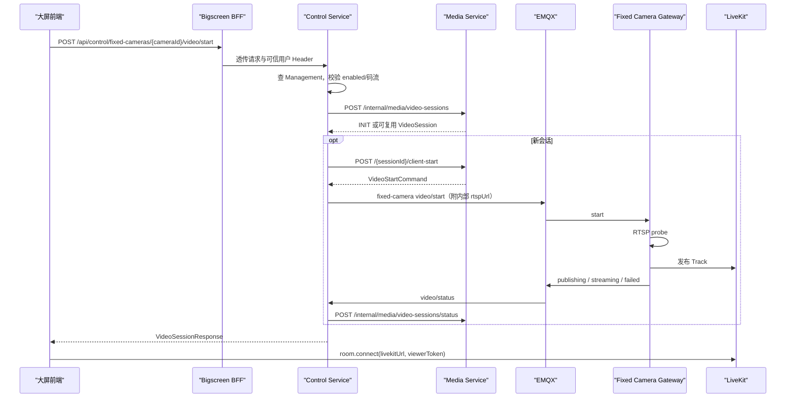

# 固定监控摄像头实时视频设计说明书

| 文档属性 | 内容 |
| --- | --- |
| 文档状态 | 当前代码基线 |
| 基线日期 | 2026-08-12 |
| 适用模块 | `bigscreen-bff`、`control-service`、`backend`、`client/cmd/fixed-camera-gateway` |

## 1. 目标与边界

固定摄像头与机器人在大屏 `devices[]` 中作为同级装备展示。浏览器通过 Control 创建媒体会话，固定摄像头 Gateway 拉取 RTSP 并向 LiveKit 发布 Track，浏览器直接订阅 LiveKit。

边界如下：

- Management Service 是摄像头档案、启用状态、主/子码流 URL、地图与区域归属的权威来源。
- Bigscreen BFF 只返回展示与播放所需字段，不返回 RTSP URL 和凭据。
- Control Service 校验档案、选择码流、调用 Media 并发布 MQTT 命令。
- Media Service 统一管理 `VideoSession`、Room、Token、Track、viewer 和空闲释放，不读取摄像头档案也不发 MQTT。
- Go Gateway 处理 RTSP 探测、发布进程、命令去重与状态上报，不上报机器人在线心跳。

## 2. 当前架构

```text
Management Service
  -> Bigscreen BFF 聚合固定摄像头展示字段
  -> Control Service 校验 enabled/码流并选择 quality

浏览器
  -> POST /api/control/fixed-cameras/{cameraId}/video/start
  -> Control -> Media /internal/media/video-sessions
  -> Control -> MQTT gateway/fixed-camera/{gatewayId}/video/start
  -> Go Gateway -> RTSP -> LiveKit Room
  -> MQTT video/status -> Control -> Media
  -> 浏览器直接订阅 LiveKit Track
```

Gateway 入口为 `client/cmd/fixed-camera-gateway/main.go`，核心实现为 `client/internal/fixedcamera/gateway.go`。它复用机器人 Go 客户端的 RTSP Probe 和 publisher，但不启动机器人心跳、对讲、设备控制或文件上传。

## 3. 数据模型

### 3.1 Management 档案必要字段

| 字段 | 当前用途 |
| --- | --- |
| `id` / `cameraId` | 摄像头唯一标识；业务优先使用 `cameraId` |
| `cameraName` / `name` | 大屏展示名称 |
| `enabled` | Control 启动门槛；BFF 当前也用它推导 `online/offline` |
| `protocolType` | Gateway 回查档案时只接受空值或 `RTSP` |
| `mainStreamUrl` | `quality=main` 的 RTSP 来源 |
| `subStreamUrl` | `quality=sub/auto` 的 RTSP 来源 |
| 地图/区域/位置字段 | BFF 用于地图展示，不参与视频路由 |

Control 通过 `GET /api/v1/management/fixed-cameras?pageNum=1&pageSize=500` 查询并按 `cameraId/id` 匹配。当前固定摄像头列表没有 Control 本地缓存；Management 不可用时无法新建固定摄像头会话。

### 3.2 Media 会话字段

```json
{
  "robotId": "camera-001",
  "sourceType": "FIXED_CAMERA",
  "sourceId": "camera-001",
  "deviceId": "camera-001",
  "channel": "visible",
  "quality": "sub",
  "reuse": true
}
```

`sourceType/sourceId` 是区分固定摄像头的权威字段。`robotId=cameraId` 是为满足 Media 当前 `@NotBlank robotId` 约束的兼容值，不表示固定摄像头属于同 ID 机器人。

Room 名称：

```text
media.fixed.{cameraId}.{channel}.{quality}
```

固定摄像头只允许 `channel=visible`。会话复用键为 `sourceType + sourceId + deviceId + channel + quality`。

### 3.3 BFF 展示语义

```json
{
  "robotId": "camera-001",
  "cameraId": "camera-001",
  "typeCode": "FIXED_CAMERA",
  "equipmentType": "FIXED_CAMERA",
  "sourceType": "FIXED_CAMERA",
  "status": "online",
  "defaultQuality": "sub",
  "playable": true,
  "showControlCenter": false,
  "showController": false
}
```

- `status=online` 当前只表示 `enabled=true`，不是 RTSP 或 Gateway 健康状态。
- `playable=true` 要求 `enabled=true` 且至少有一条码流。
- `defaultQuality` 优先 `sub`；没有子码流时为 `main`。
- `showControlCenter/showController=false` 表示页面不展示机器人控制入口。

## 4. 对外接口

### 4.1 单路启动

```http
POST /api/control/fixed-cameras/{cameraId}/video/start
Content-Type: application/json

{
  "quality": "sub",
  "reuse": true,
  "clientRequestId": "optional"
}
```

`channel` 即使传入也会被 Control 固定为 `visible`。如果请求的主/子码流未配置，Control 会回退到另一条可用码流。摄像头不存在、未启用或没有码流时请求失败。

### 4.2 批量启动

```http
POST /api/control/fixed-cameras/video/start
Content-Type: application/json

{
  "cameraIds": ["camera-001", "camera-002"],
  "quality": "sub",
  "reuse": true
}
```

结果按单路隔离，部分失败不回滚已成功会话：

```json
{
  "sessions": [
    {"cameraId": "camera-001", "session": {"sessionId": "vs_xxx"}}
  ],
  "failures": [
    {"cameraId": "camera-002", "message": "固定摄像头未配置码流：camera-002"}
  ]
}
```

空 `cameraIds` 返回两个空数组。输入会过滤空 ID 并去重。

观看 Token、心跳、停止、重启、切换码流和录像复用 `/api/control/video-sessions/**`，详见[实时视频接口与协议文档](../../03-接口与协议/实时视频/实时视频接口与协议文档.md)。

## 5. MQTT 协议与码流选择

| 场景 | Topic |
| --- | --- |
| 启动 | `gateway/fixed-camera/{gatewayId}/video/start` |
| 停止 | `gateway/fixed-camera/{gatewayId}/video/stop` |
| 码流切换 | `gateway/fixed-camera/{gatewayId}/video/restart` |
| 状态 | `gateway/fixed-camera/{gatewayId}/video/status` |

`gatewayId` 来自 Control `FIXED_CAMERA_GATEWAY_ID`，必须与 Gateway 同名配置一致。MQTT QoS 为 1，不使用 retained 命令。

Control 初次启动会将已选定的 `rtspUrl` 放入内部 MQTT 命令。该命令只应在受控内网传输，不得回传前端或记录完整 URL。手工重启、自动恢复或切换时，Media 重签的命令可能不含 `rtspUrl`；Gateway 会使用 `sourceId/deviceId/robotId` 中首个非空值作为 `cameraId`，再查询 Management 选择码流。

Gateway 选择规则：

1. 命令含 `rtspUrl` 时直接使用，不再查 Management。
2. 否则查询 `GET /api/v1/management/fixed-cameras?pageNum=1&pageSize=500`。
3. `main` 优先主码流；`sub/auto/空` 优先子码流；缺失时回退到另一条。
4. 当档案 `enabled=false`、协议非 RTSP 或无码流时上报 `FIXED_CAMERA_CONFIG_FAILED`。
5. RTSP 探测失败上报 `RTSP_PROBE_FAILED`，publisher 失败上报 `PUBLISH_FAILED`。

## 6. 运行时流程



最后一个 viewer 离开后会话进入 `IDLE_WAIT`。等待 `idle-release-delay-seconds` 后，Control 请求 Media 释放 Room，然后发布 fixed-camera stop；Gateway 只停止对应 `sessionId` 的 publisher。

## 7. Gateway 配置与进程模型

| 环境变量 | 说明 |
| --- | --- |
| `FIXED_CAMERA_GATEWAY_ID` | 与 Control Topic 中 `{gatewayId}` 一致，默认 `default` |
| `MQTT_BROKER_URL`、`MQTT_USERNAME`、`MQTT_PASSWORD` | MQTT 连接 |
| `MANAGEMENT_SERVICE_URL` / `CENTER_MANAGE_BASE_URL` | `rtspUrl` 缺失时查询固定摄像头 |
| `MANAGEMENT_SERVICE_TOKEN` | Gateway 查询 Management 的 Bearer Token |
| `MANAGEMENT_INSECURE_SKIP_VERIFY` | 仅内网自签名联调使用，生产应为 `false` |
| `FFPROBE_PATH`、`PROBE_TIMEOUT_MS` | RTSP 探测 |
| publisher 相关变量 | 与机器人 Go 客户端一致 |

Gateway 以 `sessionId` 管理 publisher，以每个 session 最近的 `commandId` 去重。MQTT 断开或进程退出时会停止全部 publisher。

## 8. 当前限制与后续项

1. BFF 的固定摄像头 `online/offline` 来自 `enabled`，还没有 Gateway 心跳、RTSP 可用性或最近一次状态的汇总模型。
2. Gateway 状态直接驱动 Media 会话，未另外持久化摄像头健康历史。
3. Control 固定摄像头列表查询没有缓存或专用详情 API；Management 故障会阻断新启动。
4. 最初 start 命令含内部 RTSP URL，需要以受控 MQTT ACL、TLS 和日志脱敏保护；当前代码的 MQTT 日志会序列化完整 payload，生产前应修复日志泄漏风险。
5. 当前所有固定摄像头共用一个配置的 `gatewayId`，尚无摄像头到多 Gateway 的调度映射。

以上限制必须在生产部署评审和验收时显式处理，不能用 `enabled=true` 代替真实在线验证。
