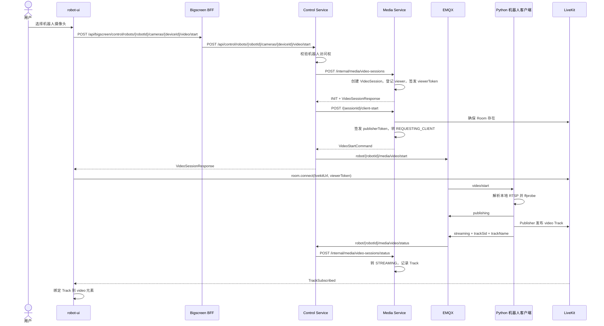

# 机器人实时视频设计说明书

| 文档属性 | 内容 |
| --- | --- |
| 文档状态 | 当前代码基线 |
| 基线日期 | 2026-09-10 |
| 适用模块 | `robot-ui`、`bigscreen-bff`、`control-service`、`backend`、`python-client`、LiveKit、EMQX |

## 1. 目标与范围

本设计说明机器人摄像头从用户发起观看、机器人侧拉取 RTSP 并发布 LiveKit Track，到多观看者复用、通道切换、断流恢复和空闲释放的完整链路。

本文档只定义机器人实时视频的架构、职责和生命周期。字段、REST、MQTT 载荷和错误码以[实时视频接口与协议文档](../../03-接口与协议/实时视频/实时视频接口与协议文档.md)为准；双向语音见[实时视频语音对讲设计说明书](../语音对讲/实时视频语音对讲设计说明书.md)；实时录像和抓拍复用通用文件服务，不在本文档中建立并行存储链路。

## 2. 架构与职责边界

```text
用户 / robot-ui
  -> Bigscreen BFF（生产认证与代理）
  -> Control Service（权限校验、会话编排、MQTT）
  -> Media Service（VideoSession、Room/Token/Track、viewer、录像）

Control Service -> EMQX -> Python 机器人客户端
Python 机器人客户端 -> 本地 RTSP -> Publisher -> LiveKit
浏览器 <-> LiveKit（WebRTC 媒体流）
Python 机器人客户端 -> EMQX -> Control -> Media（状态）
```

| 组件 | 职责 |
| --- | --- |
| Management Service | 提供当前用户可见的机器人与设备档案，作为 Control 观看权限校验依据 |
| Bigscreen BFF | 作为生产 REST/WebSocket 认证与代理边界，不传输视频数据 |
| Control Service | 校验机器人访问权，调用 Media 创建或复用会话，通过 MQTT 下发 `start/stop/switch-channel` 命令并回传设备状态 |
| Media Service | 管理 `VideoSession`、LiveKit Room/Token、Track、viewer、状态机、实时录像和空闲释放；不发 MQTT |
| Python 机器人客户端 | 从机器人本地配置解析 RTSP，探测视频源，按 `sessionId` 启停 Publisher，发布 LiveKit Track 并上报状态 |
| LiveKit | 承载 Room、参与者和音视频 Track；浏览器与设备端直接连接 |

BFF、Control 和 Media 不代理 WebRTC 媒体包；Media 不解析机器人本地 RTSP 地址；机器人客户端不创建业务会话或给浏览器签发 Token。

## 3. 视频源与会话模型

### 3.1 机器人视频源

机器人摄像头统一建模为：

```json
{
  "robotId": "robot-001",
  "sourceType": "ROBOT_CAMERA",
  "sourceId": "robot-001",
  "deviceId": "camera01",
  "channel": "visible",
  "quality": "sub",
  "reuse": true
}
```

- `sourceType=ROBOT_CAMERA` 是机器人摄像头的权威类型。
- `sourceId=robotId` 标识视频源所属机器人，`deviceId` 标识具体摄像头。
- `channel` 支持 `visible/thermal/fusion`，是否可播放取决于机器人端是否配置对应视频源。
- `quality` 支持 `sub/main/auto`；当前默认为 `sub`。

### 3.2 Room 与参与者

Room 粒度是“机器人 + 摄像头 + 通道 + 清晰度”：

```text
media.{robotId}.{deviceId}.{channel}.{quality}
```

Publisher identity：

```text
robot:{robotId}:{deviceId}
```

viewer identity 由 `userId + clientId` 组成。同一用户的不同页面或终端使用不同 `clientId`，以便独立记录心跳、停止观看和录像归属。

### 3.3 会话复用

`reuse=true` 时，Media 按以下组合查找最新可复用会话：

```text
sourceType + sourceId + deviceId + channel + quality
```

可复用状态为 `ROOM_READY`、`STREAMING`和 `IDLE_WAIT`。复用时增加当前 viewer 并重签 viewer Token；已有 Track 时不重复下发 start。机器人会话当前以已记录的 `trackSid + trackName` 判断 Track 可复用，不在每次复用时查询 LiveKit Room API。

## 4. 正常启动链路



复用已在推流的会话时，Media 直接返回新 viewer Token，Control 跳过 `/client-start` 和 MQTT start。完整分步说明另见[实时视频普通播放时序图](实时视频普通播放时序图.md)。

## 5. 机器人侧推流

### 5.1 命令接收与幂等

机器人客户端使用 QoS 1 订阅 `start/stop/switch-channel`。QoS 1 可能重投，因此 start 和 switch 按 `sessionId + commandId` 去重。stop 按 `sessionId` 精确停止；对不存在的 session 重复 stop 也应成功收口。

收到同一 `sessionId` 的新 start 或 switch 时，先停止旧 Publisher 进程，再用新的通道、清晰度、Room 和 Token 启动，保证一个 session 只对应一个视频 Publisher。

### 5.2 RTSP 选择与探测

机器人 start 命令的 `rtspUrl` 通常为空。客户端按 `deviceId + quality` 从本地 `Config.cameras` 选择 RTSP；通道对应的设备必须已在现场配置中存在。这样 RTSP 凭据保留在机器人网络边界，不通过前端或普通业务接口传播。

启动 Publisher 前先执行 `ffprobe` RTSP TCP 探测。失败时不启动外部进程，直接上报 `failed + RTSP_PROBE_FAILED`。

### 5.3 Publisher 进程

当前 Publisher 是由 Python 客户端按 `sessionId` 管理的外部进程：

1. `PUBLISHER_CMD` 非空时使用明确配置的自定义 Publisher。
2. `PUBLISHER_MODE=ffmpeg` 时使用 FFmpeg 命令。
3. `PUBLISHER_MODE=gstreamer` 时使用 `gstreamer-publisher`。
4. `PUBLISHER_MODE=auto` 时优先 GStreamer，启动失败或观察期内退出时回退 FFmpeg，冷却后再尝试 GStreamer。

外部命令使用 argv 模板渲染，不通过 shell 拼接。Publisher 以新进程组启动，stop、客户端退出或 MQTT 断开时停止整个进程组，避免 FFmpeg/GStreamer 子进程残留。

当前外部 Publisher 不向 Python 父进程回传 LiveKit 真实 Track SID，客户端以 `TR_{sessionId}` 作为稳定占位值，Track 名称为 `video.{channel}.{quality}`。这是当前机器人会话状态判定的已知约束；启动实时录像时，Media 会通过 LiveKit Room 参与者列表解析真实视频 Track SID。

## 6. 状态机与超时

```text
INIT
  -> REQUESTING_CLIENT
  -> ROOM_READY
  -> STREAMING
  -> INTERRUPTED -> REQUESTING_CLIENT（自动或人工重启）
  -> IDLE_WAIT -> STOPPING -> CLOSED

任意启动阶段 -> FAILED
```

| 状态 | 进入条件与处理 |
| --- | --- |
| `INIT` | 新建业务会话，尚未要求机器人发布 |
| `REQUESTING_CLIENT` | Media 已确保 Room、签发 publisher Token，Control 正在下发 start |
| `ROOM_READY` | 机器人上报 `publishing/room_ready` |
| `STREAMING` | 机器人上报 `streaming/track_published`，Media 记录 Track |
| `INTERRUPTED` | 机器人上报推流中断；仍有 viewer 时可进入恢复 |
| `IDLE_WAIT` | 最后一个 viewer 离开且没有对讲占用，等待延时释放 |
| `FAILED` | RTSP、Publisher、设备状态或发布超时失败 |
| `CLOSED` | Room、Track 和机器人端 Publisher 已进入关闭收口 |

Media 默认在 `REQUESTING_CLIENT` 或 `ROOM_READY` 持续 20 秒后标记发布超时。Control Scheduler 默认每 5 秒扫描；`INTERRUPTED` 持续 15 秒且仍有 viewer 时重发 start。具体时间均可由环境配置覆盖。

## 7. viewer 与资源释放

- 前端观看期间定期调用 `/video-sessions/{sessionId}/heartbeat`；当前默认 viewer 超时为 15 秒。
- `/stop` 只移除当前 `userId + clientId` 对应的 viewer，不影响其他观看者。
- 最后 viewer 离开时，如果对讲仍在进行，保留 VideoSession 和 Room；否则进入 `IDLE_WAIT`。
- `IDLE_WAIT` 默认保留 600 秒，期间重新观看可复用原会话。超时后 Media 删除 Room、关闭会话，Control 向 `robot/{robotId}/media/video/stop` 下发精确 stop。
- 迟到的 `publishing/streaming` 在会话已无 viewer 或进入释放阶段后被 Media 忽略，不得把已停止会话重新激活。

## 8. 切换、重启与恢复

### 8.1 通道和清晰度切换

Control 调用 Media 更新会话的 `channel/quality/roomName`，重建或确保新 Room，然后将新命令发布到 `robot/{robotId}/media/video/switch-channel`。机器人客户端将 switch 按同 session 的新 start 处理，停止旧 Publisher 后发布新 Track。

切换不新建独立业务会话，`sessionId` 保持不变。前端必须以返回的新 `roomName/viewerToken` 重连 LiveKit，不得继续使用旧 Room 的 Token。

### 8.2 手工与自动重启

- 手工重启会重新登记当前 viewer、重签 publisher Token 并下发 start。
- 会话进入 `INTERRUPTED` 且仍有 viewer 时，Control Scheduler 在宽限时间后自动重发 start。
- 机器人媒体客户端从 `offline` 变为 `online` 时，Control 会查询该机器人仍有 viewer 的可恢复会话并重发 start。
- MQTT 断开时，机器人客户端立即停止本地所有视频和对讲进程；重连上线后由 Control 的会话恢复逻辑决定是否重启。

## 9. 前端接入边界

1. 生产页面通过 BFF 转发 Control 的视频会话 API，不直接访问 Media Internal API。
2. 前端使用 `livekitUrl + viewerToken` 直接加入 Room，以 LiveKit `TrackSubscribed` 作为可绑定画面的媒体事实。
3. 心跳、停止、重启、切换、Token 续签和实时录像统一使用 `/api/control/video-sessions/**`。
4. 抓拍由前端对当前 LiveKit Track 截帧，再按通用 `IMAGE` 文件上传；不新增会话专用抓拍 API。
5. Media 的 `video.*` 事件由 `/ws/media` 广播；页面不得把 Control 业务 WebSocket 的到达作为播放成功的唯一条件。

## 10. 安全与生产约束

- 生产 REST/WebSocket 统一从 BFF 进入；Control 和 Media 只在受信网络中接收 BFF 注入的用户 Header。
- viewer Token 只允许进入指定 Room 并订阅；只有具备 `MEDIA_OPERATOR` 角色的互动观看 Token 允许发布麦克风音频。
- publisher Token 只发给目标机器人 MQTT Topic，且只能发布到指定 Room。Token、RTSP 凭据和完整 MQTT 敏感载荷不得记入日志。
- MQTT 必须按机器人 Topic 配置 ACL，防止一台机器人订阅其他机器人的 Publisher Token。生产环境应使用 TLS 和独立设备凭据。
- RTSP URL 与账号属于现场敏感配置，必须由环境变量或受控配置提供，不得把真实凭据写入生产默认值。
- Media Internal API 必须通过服务网络隔离或服务间身份保护，不对浏览器暴露。

## 11. 已知约束

1. 机器人客户端上报的 Track SID 不是媒体事实；Media 通过 LiveKit Webhook 和周期 Room API 对账，只有预期 Publisher Identity 下存在真实视频 Track 才进入 `STREAMING`。
2. `clientRequestId` 当前未持久化，也不参与幂等判断；会话复用应显式使用 `reuse=true`。
3. `fusion` 和 `auto` 已有协议枚举，但不代表所有机器人已配置对应视频源或自适应码流能力。
4. 当前没有独立 MQTT ACK Topic，命令结果以 `video/status` 和会话超时收口。
5. Media 的 Webhook 只触发 Room API 当前事实查询，并由周期对账补偿漏投；Publisher generation 和多实例单恢复仍由后续整改项处理。浏览器端仍应以 LiveKit Track 事件判断本地画面是否就绪。

## 12. 关键配置与验证

| 模块 | 关键配置 |
| --- | --- |
| Media | `LIVEKIT_*`、`LIVEKIT_RECONCILE_DELAY_MS`、`TRACK_PUBLISH_TIMEOUT_SECONDS`、`VIEWER_HEARTBEAT_TIMEOUT_SECONDS`、`IDLE_RELEASE_DELAY_SECONDS` |
| Control | `MEDIA_SERVICE_BASE_URL`、`MQTT_*`、`INTERRUPTED_GRACE_SECONDS`、`ROBOT_HEARTBEAT_*` |
| Python 机器人客户端 | `ROBOT_ID`、`MQTT_*`、摄像头/RTSP 配置、`PUBLISHER_MODE`、`GSTREAMER_PIPELINE`、`FFMPEG_PUBLISHER_CMD` |
| 前端 | BFF 入口、LiveKit WSS 地址、稳定的 `X-Client-Id` |

最小验证闭环：

1. Control 启动接口返回 `sourceType=ROBOT_CAMERA`、唯一 `sessionId`、Room 和 viewer Token。
2. 机器人客户端收到 start，RTSP 探测成功，并依次上报 `publishing` 和 `streaming`。
3. LiveKit Room 存在机器人 Publisher 与真实视频 Track，浏览器触发 `TrackSubscribed` 并正常出画。
4. 第二个 viewer 复用同一 `sessionId/roomName`，不重复启动 Publisher；单个 viewer 停止不影响其他 viewer。
5. 断开 MQTT 后机器人端没有残留 Publisher；重连上线后，仍有 viewer 的会话可恢复。
6. 最后 viewer 离开并超过空闲保留期后，Room、Track、会话和机器人端 Publisher 完成收口。

详细用例见[实时视频模块测试方案](../../04-测试与验收/测试方案/实时视频模块测试方案.md)和[实时视频模块验收用例](../../04-测试与验收/验收用例/实时视频模块验收用例.md)。
