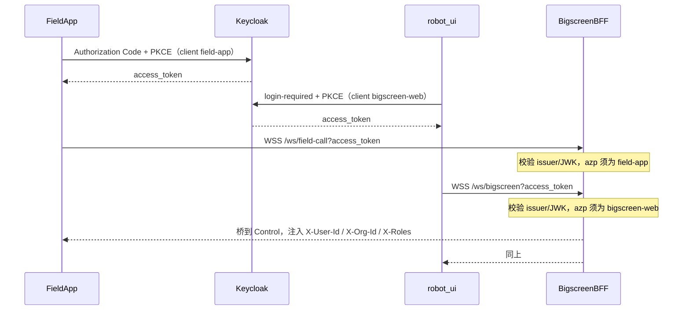
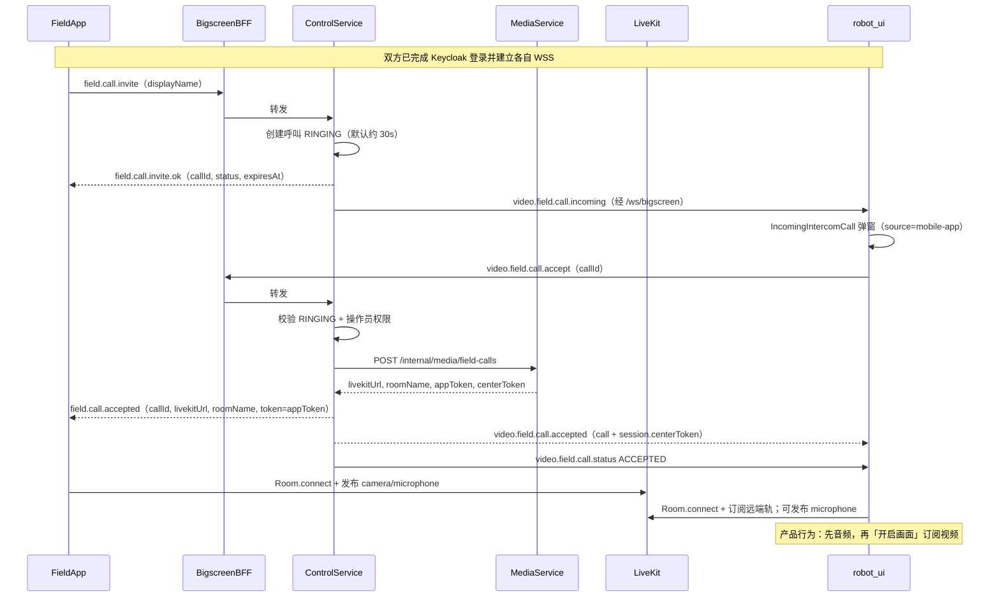

# 现场 App 视频通讯与大屏交互流程

> 状态：对齐当前已落地实现（WebSocket 信令 + LiveKit 媒体）。  
> **不走 MQTT**（MQTT 仅用于机器人对讲）。  
> 关联：[现场App视频呼叫并入大屏后端设计说明.md](./现场App视频呼叫并入大屏后端设计说明.md)、[机器人主动呼叫中心端对讲设计说明书.md](./机器人主动呼叫中心端对讲设计说明书.md)

## 1. 参与方

| 角色 | 组件 | 职责 |
|------|------|------|
| 现场 App | `eiop_mobile` | Keycloak 登录拿 JWT；WSS 发邀请；接听后推摄像头/麦克风 |
| Nginx | `:4443` | 反代 `/ws/field-call`、`/ws/bigscreen`、`/livekit` |
| Bigscreen BFF | `:8090` | 验 JWT、桥接 WebSocket；不存呼叫状态、不签 LiveKit Token |
| Control Service | `:8082` | 振铃状态机；向大屏广播；接听后调 Media |
| Media Service | `:8088` | `POST /internal/media/field-calls` 建 Room、签双方 Token |
| LiveKit | 现网 SFU | WebRTC 媒体转发 |
| 大屏前端 | `robot-ui` | Keycloak 登录；复用 `/ws/bigscreen` 收来电；接听后订阅画面 |

## 2. 连接拓扑

```text
App  --WSS /ws/field-call?access_token=<field-app JWT>--> Nginx --> BFF --> Control /ws/field-call
大屏 --WSS /ws/bigscreen?access_token=<bigscreen-web JWT>--> Nginx --> BFF --> Control /ws/control
Control 接听后 --HTTP--> Media /internal/media/field-calls
App / 大屏 <--WebRTC--> LiveKit（音视频不经过 BFF/Control）
```

要点：

- App 与大屏 **各走一条专用 / 复用通道**，互不混消息。
- 生产大屏 **不配置** `VUE_APP_FIELD_CALL_WS`，不连独立 Node。
- 接听前不建 Room、不发 LiveKit Token、App 不推流。

## 3. 认证（均未跳过）



| 端 | Keycloak Client | 连哪条 WS | BFF 要求 |
|----|-----------------|-----------|----------|
| App | `field-app` | `/ws/field-call` | Token 仅允许该 client；不可当大屏 REST/`/ws/bigscreen` |
| 大屏 | `bigscreen-web` | `/ws/bigscreen` | 操作员 JWT；接听还需媒体相关角色 |

Token 过期：BFF 会断开（如 `4001`）；端侧刷新 JWT 后重连。振铃中断则需重新 invite。

## 4. 正常接听（主流程）



## 5. 信令消息一览

### 5.1 App ↔ Control（`/ws/field-call`）

| 方向 | type | 时机 / 含义 |
|------|------|-------------|
| App→ | `field.call.invite` | 点「呼叫中心」 |
| ←App | `field.call.hello.ok` | 握手成功（含 userId/orgId） |
| ←App | `field.call.invite.ok` | 已排队振铃 |
| ←App | `field.call.accepted` | 含 `livekitUrl` / `roomName` / `token` |
| ←App | `field.call.rejected` / `timeout` / `busy` / `ended` | 拒接 / 超时 / 占线 / 结束 |
| App→ | `field.call.cancel` | 振铃中取消 |
| App→ | `field.call.hangup` | 通话中挂断 |

### 5.2 大屏 ↔ Control（经 `/ws/bigscreen`）

| 方向 | 事件 / type | 含义 |
|------|-------------|------|
| ←大屏 | `video.field.call.incoming` | 来电（含 callId、displayName、source=`mobile-app`） |
| ←大屏 | `video.field.call.status` | RINGING / ACCEPTED / REJECTED / TIMEOUT / ENDED… |
| ←大屏 | `video.field.call.accepted` | 接听成功，payload 含中心侧 session Token |
| 大屏→ | `video.field.call.accept` / `reject` / `hangup` | 接听 / 拒接 / 挂断 |
| 大屏→ | `video.field.call.query` | 连上后补拉当前 RINGING 列表 |
| ←大屏 | `video.field.call.list` | 振铃列表回放 |

## 6. 分支流程

### 6.1 拒接

```text
App invite → RINGING → 大屏 reject
→ App 收到 field.call.rejected
→ 大屏收到 status REJECTED，关闭弹窗
→ 不建 Room、不签 Token
```

### 6.2 超时

```text
App invite → RINGING → 超过 expiresAt
→ Control 置 TIMEOUT
→ App field.call.timeout；大屏 status TIMEOUT
```

### 6.3 App 取消

```text
App invite → RINGING → App field.call.cancel
→ Control CANCELED → 大屏 status 更新，关弹窗
```

### 6.4 占线

```text
同一 App 用户已有 RINGING/ACCEPTED
→ 新 invite 返回 field.call.busy（或结束旧振铃，以 FieldCallService 规则为准）
```

### 6.5 通话挂断

```text
任一侧 hangup
→ Control ENDED
→ 对端 ended / status ENDED
→ 双方离开 LiveKit Room
```

### 6.6 信令短暂断开（保活）

```text
App access_token 到期 / 弱网导致 /ws/field-call 断开
→ BFF 不对 field-call 因 JWT 到期踢断（仅握手校验）
→ 若仍断开：Control 进入约 45s 重连宽限，不立即 ENDED
→ App 刷新 JWT 后重连信令，bindAppSession 恢复，LiveKit 不断
→ 宽限内未重连 → mobile-left 结束
```

LiveKit 现场呼叫 Token 默认 **2 小时**（`LIVEKIT_FIELD_CALL_TOKEN_TTL_SECONDS`）。
App 采集默认 **360p**，降低真机上行延迟。

## 7. 状态机（Control 内存）

```text
RINGING --accept--> ACCEPTED --hangup/disconnect--> ENDED
        --reject--> REJECTED
        --timeout--> TIMEOUT
        --app cancel--> CANCELED
        --失败--> FAILED
```

规则摘要：

- 同一 `userId`（App）同时仅一通现场呼叫。
- 多路 RINGING 可并存；ACTIVE 不打断其它等待。
- 与机器人 MQTT 对讲占用分开。
- 单实例内存；重启即中断，不恢复通话。

## 8. 媒体与推流

接听成功后 Media 返回：

| Token | identity 约定 | 权限 |
|-------|---------------|------|
| App | `field-app:{userId}` | publish camera + microphone，subscribe |
| 中心 | `field-center:{userId}:{clientId}` | publish microphone，subscribe |

Room 名形如 `field.{orgId}.{callIdShort}`，与机器人 `media.{robotId}...` 隔离。

大屏 UI（`IncomingIntercomCall` / `fieldCall.js`）：

1. 接听后先连 LiveKit、开麦克风（音频对讲）。
2. 操作员点「开启画面」再订阅/展示 App 视频轨。

## 9. 与机器人对讲对比

| 项 | 机器人主动呼叫 | 现场 App 视频呼叫 |
|----|----------------|-------------------|
| 信令 | MQTT `robot/.../call/invite` | WSS `/ws/field-call` `field.call.*` |
| 大屏通道 | `/ws/bigscreen` `video.intercom.call.*` | 同连接 `video.field.call.*` |
| 接听后 | MQTT `intercom/start` + LiveKit 音频 | Media 签 Token + 双方 LiveKit（含视频） |
| App/机器人身份 | MQTT 设备 | Keycloak `field-app` JWT |

## 10. 关键代码

| 层 | 路径 |
|----|------|
| App 信令 | `eiop_mobile/lib/services/field_call_signaling.dart` |
| App 通话 | `eiop_mobile/lib/services/field_call_controller.dart` |
| 大屏 store | `robot-ui/src/store/modules/fieldCall.js` |
| 大屏 WS | `robot-ui/src/store/modules/websocket-robot.js`（`connectMediaWebSocket`） |
| 大屏鉴权 | `robot-ui/src/auth.js` |
| BFF 桥 | `bigscreen-bff/.../BigscreenWebSocketBridgeHandler.java` |
| BFF 安全 | `bigscreen-bff/.../SecurityConfig.java`（`/ws/field-call` ↔ `field-app`） |
| Control 状态机 | `control-service/.../call/FieldCallService.java` |
| Control App WS | `control-service/.../ws/FieldCallWebSocketHandler.java` |
| Control 大屏入口 | `control-service/.../ws/MediaWebSocketHandler.java` |
| Media | `backend/.../fieldcall/` |

## 11. 联调检查清单

1. App 能登录 Keycloak `field-app` 并拿到 JWT。  
2. `wss://host:4443/ws/field-call?access_token=...` 握手成功（非 401/4001）。  
3. 大屏已 Keycloak 登录，`/ws/bigscreen` 已连，且 **未** 配置 `VUE_APP_FIELD_CALL_WS`。  
4. App invite → 大屏弹窗 → 接听 → 双方进同一 LiveKit Room。  
5. App 有画面推送；大屏可先听声音再开画面。  
6. 拒接 / 超时 / 挂断状态双边一致。
