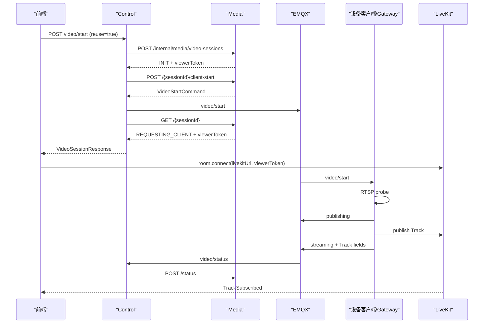

# 实时视频接口与协议文档

| 文档属性 | 内容 |
| --- | --- |
| 文档状态 | 当前代码基线 |
| 基线日期 | 2026-08-12 |
| 适用链路 | 前端、BFF、Control、Media、EMQX、机器人 Go 客户端、固定摄像头 Gateway、LiveKit |

## 1. 范围与边界

当前采用设备侧直接发布 LiveKit Track 的模式：Control 负责业务编排和 MQTT，Media 负责会话和 LiveKit，浏览器拿到 Token 后直接连接 LiveKit。BFF、Control 和 Media 都不转发 WebRTC 媒体流。

```text
浏览器 -> BFF -> Control -> Media
                           -> EMQX -> 机器人 Go 客户端 / Fixed Camera Gateway
Media -> LiveKit Room/Token
设备侧 -> LiveKit Track -> 浏览器
设备侧 -> MQTT status -> Control -> Media
```

当前代码不包含媒体源 CRUD、RTSP 探测 REST API、MQTT ACK 处理、LiveKit Webhook Controller 或服务端 Snapshot Worker。抓拍由前端对 LiveKit Track 截帧后按普通 `IMAGE` 文件上传，详见[通用文件服务接口文档](../文件服务/通用文件服务接口文档.md)。

## 2. 视频源、Room 与状态

### 2.1 视频源与 Room

| `sourceType` | `sourceId` | `deviceId` | 通道 | Room 格式 |
| --- | --- | --- | --- | --- |
| `ROBOT_CAMERA` | `robotId` | 机器人摄像头 ID | `visible/thermal/fusion` | `media.{robotId}.{deviceId}.{channel}.{quality}` |
| `FIXED_CAMERA` | `cameraId` | `cameraId` | 只允许 `visible` | `media.fixed.{cameraId}.{channel}.{quality}` |

Room 粒度是单路视频源、通道与清晰度，不是整台机器人。机器人客户端和固定摄像头 Gateway 都以 `sessionId` 管理独立 publisher。

### 2.2 通道与清晰度

| 类型 | 值 | 语义 |
| --- | --- | --- |
| `VideoChannel` | `visible` | 可见光 |
|  | `thermal` | 热成像 |
|  | `fusion` | 融合通道；代码枚举已支持，需要设备端有对应源 |
| `VideoQuality` | `sub` | 低码流，通常用于视频墙 |
|  | `main` | 主码流，通常用于单路详情 |
|  | `auto` | 代码枚举已支持；固定摄像头 Gateway 按子码流优先处理 |

### 2.3 视频会话状态

| 状态 | 当前语义 |
| --- | --- |
| `INIT` | 业务会话已入库，尚未请求设备端发布 |
| `REQUESTING_CLIENT` | Room 已确保存在，publisher Token 已生成，Control 正在下发 start |
| `ROOM_READY` | 设备端上报 `publishing/room_ready` |
| `STREAMING` | 设备端上报 `streaming/track_published`，会话保存 Track 信息 |
| `INTERRUPTED` | 设备端上报中断，可进入自动恢复 |
| `IDLE_WAIT` | 无 viewer 且对讲不占用 Room，等待延时释放 |
| `STOPPING` | 正在释放，当前枚举保留 |
| `CLOSED` | 会话已结束 |
| `TIMEOUT` | 超时，当前枚举保留 |
| `FAILED` | 设备端、RTSP、发布或会话处理失败 |

视频与对讲是两套独立状态。对讲处于 `STARTING/ACTIVE` 时，即使 viewerCount 为 0 也会保留 Room。对讲完整设计见[实时视频语音对讲设计说明书](../../02-设计/语音对讲/实时视频语音对讲设计说明书.md)。

## 3. HTTP 通用约定

生产请求应先进入 BFF，由它验证 JWT 并注入可信用户 Header。Control 和 Media 直连时信任 Header，不应暴露到不可信网络。详见 [Java 服务接口通用约定](../公共约定/Java服务接口通用约定.md)。

Java REST 和 WebSocket 业务时间字段统一输出 `yyyy-MM-dd HH:mm:ss`，语义为 `Asia/Shanghai`。MQTT 命令中的 `expiresAt` 由 Control 显式序列化为 UTC ISO-8601，设备上报时间也应使用带时区的 ISO-8601。两种边界不应混淆。

## 4. Control REST API

### 4.1 启动机器人摄像头

```http
POST /api/control/robots/{robotId}/cameras/{deviceId}/video/start
Content-Type: application/json

{
  "channel": "visible",
  "quality": "sub",
  "reuse": true,
  "clientRequestId": "optional"
}
```

| 字段 | 必填 | 缺省/语义 |
| --- | ---: | --- |
| `channel` | 否 | 默认 `visible` |
| `quality` | 否 | 默认 `sub` |
| `reuse` | 否 | 默认 `true`；是否查找可复用会话 |
| `clientRequestId` | 否 | 当前只传到 Media DTO，未持久化也未参与幂等判断 |

### 4.2 启动固定摄像头

```http
POST /api/control/fixed-cameras/{cameraId}/video/start

{"quality":"sub","reuse":true}
```

Control 固定使用 `channel=visible`，校验 Management 中的 `enabled`和码流，并在请求码流缺失时回退到另一条。批量入口：

```http
POST /api/control/fixed-cameras/video/start

{"cameraIds":["camera-001","camera-002"],"quality":"sub","reuse":true}
```

批量响应为 `{sessions:[{cameraId,session}], failures:[{cameraId,message}]}`，各摄像头独立成败。更多设计见[固定监控摄像头实时视频设计说明书](../../02-设计/实时视频/固定监控摄像头实时视频设计说明书.md)。

### 4.3 `VideoSessionResponse`

```json
{
  "sessionId": "vs_xxx",
  "robotId": "robot-001",
  "sourceType": "ROBOT_CAMERA",
  "sourceId": "robot-001",
  "deviceId": "camera01",
  "channel": "visible",
  "quality": "sub",
  "status": "REQUESTING_CLIENT",
  "roomName": "media.robot-001.camera01.visible.sub",
  "livekitUrl": "ws://livekit:7880",
  "viewerToken": "eyJ...",
  "trackSid": null,
  "trackName": null,
  "viewerCount": 1,
  "intercomStatus": "IDLE",
  "intercomAudioOnly": false,
  "intercomOperatorId": null,
  "intercomClientId": null,
  "robotAudioTrackSid": null,
  "robotAudioTrackName": null,
  "lastErrorCode": null,
  "lastErrorMessage": null,
  "createdAt": "2026-08-12 21:30:00",
  "updatedAt": "2026-08-12 21:30:00"
}
```

| 字段 | 语义 |
| --- | --- |
| `sessionId` | 后续 Token、心跳、停止、重启、切换和录像的业务 ID |
| `sourceType/sourceId` | 视频源的权威识别字段 |
| `robotId` | 机器人源为机器人 ID；固定摄像头当前为 `cameraId` 兼容值 |
| `viewerToken` | 创建和查询详情时可返回；心跳/停止等响应通常为 `null` |
| `trackSid/trackName` | 设备上报 streaming 后有值；默认 Track 名 `video.{channel}.{quality}` |
| `viewerCount` | `media_session_viewer.leftAt is null` 的计数 |
| `intercom*` | 独立对讲状态和占用信息，不得由视频 `status` 推断 |

### 4.4 会话操作

| 方法 | 路径 | 语义 |
| --- | --- | --- |
| `GET` | `/api/control/video-sessions` | 当前用户最近创建的 20 条 |
| `GET` | `/api/control/video-sessions/active` | 最近更新的 16 条可复用会话；当前代码未按用户/组织过滤 |
| `GET` | `/api/control/video-sessions/{sessionId}` | 返回详情并为当前用户签发 viewer Token |
| `GET` | `/api/control/video-sessions/{sessionId}/tracks` | 查询 Track 记录 |
| `POST` | `/api/control/video-sessions/{sessionId}/token` | 重签当前 `userId + clientId` 的 viewer Token |
| `POST` | `/api/control/video-sessions/{sessionId}/heartbeat` | 新建或刷新当前 viewer，默认超时 15 秒 |
| `POST` | `/api/control/video-sessions/{sessionId}/stop` | 移除当前 viewer；同时尝试停止该 client 发起的录像 |
| `POST` | `/api/control/video-sessions/{sessionId}/restart` | Media 重建/确保 Room 并重签 publisher Token，Control 重新下发 start |
| `POST` | `/api/control/video-sessions/{sessionId}/switch-channel` | 更新通道/清晰度并请求设备重新发布 |

`switch-channel` 请求：

```json
{"channel":"visible","quality":"main"}
```

`channel` 必填，`quality` 可选；固定摄像头必须保持 `visible`。

### 4.5 实时录像

| 方法 | 路径 | 语义 |
| --- | --- | --- |
| `POST` | `/api/control/video-sessions/{sessionId}/recordings/start` | 使用 LiveKit Egress 开始录像 |
| `POST` | `/api/control/video-sessions/{sessionId}/recordings/{fileId}/stop` | 停止录像并进入通用文件处理 |
| `GET` | `/api/control/video-sessions/{sessionId}/recordings/active` | 查询当前活动录像 |

同一会话同时只允许一条 `LIVEKIT_EGRESS` 录像。停录还会校验发起录像的 `X-Client-Id`。录像完成后复用通用文件 HLS 处理和播放链路。

### 4.6 对讲入口

| 方法 | 路径 |
| --- | --- |
| `POST` | `/api/control/robots/{robotId}/cameras/{deviceId}/video/intercom/start` |
| `POST` | `/api/control/video-sessions/{sessionId}/intercom/start` |
| `POST` | `/api/control/video-sessions/{sessionId}/intercom/token` |
| `POST` | `/api/control/video-sessions/{sessionId}/intercom/heartbeat` |
| `POST` | `/api/control/video-sessions/{sessionId}/intercom/stop` |

一台机器人、一个操作员或一个浏览器 client 同时只能占用一路对讲；冲突分别使用 `ROBOT_BUSY`、`OPERATOR_BUSY`、`CLIENT_BUSY`。

## 5. Media Internal API

基础路径 `/internal/media/video-sessions`，只供受控 Control 调用。

| 类型 | 端点 |
| --- | --- |
| 会话 | `POST /`、`POST /intercom`、`GET /`、`GET /active`、`GET /{id}`、`GET /{id}/tracks` |
| viewer | `POST /{id}/token`、`POST /{id}/heartbeat`、`POST /{id}/stop` |
| 命令 | `POST /{id}/client-start`、`POST /{id}/start-command`、`POST /{id}/restart-command`、`POST /online-restart-commands` |
| 状态 | `POST /status`、`POST /intercom/status`、`POST /{id}/switch-channel` |
| 对讲 | `POST /{id}/intercom/start|token|heartbeat|stop|expire|start-command` |
| 调度 | `GET /interrupted-restart-candidates`、`GET /idle-release-candidates`、`GET /intercom-timeout-candidates`、`POST /{id}/release-idle` |
| 录像 | `POST /{id}/recordings/start`、`POST /{id}/recordings/{fileId}/stop`、`GET /{id}/recordings/active` |

`POST /{id}/restart` 只修改 Media 会话并返回会话；对外重启需要 Control 调用 `restart-command` 并下发 MQTT。详细边界见 [媒体服务接口文档](../媒体服务/媒体服务接口文档.md)。

## 6. MQTT 协议

### 6.1 Topic

| 方向 | 机器人 Topic | 固定摄像头 Topic |
| --- | --- | --- |
| start | `robot/{robotId}/media/video/start` | `gateway/fixed-camera/{gatewayId}/video/start` |
| stop | `robot/{robotId}/media/video/stop` | `gateway/fixed-camera/{gatewayId}/video/stop` |
| switch/restart | `robot/{robotId}/media/video/switch-channel` | `gateway/fixed-camera/{gatewayId}/video/restart` |
| status | `robot/{robotId}/media/video/status` | `gateway/fixed-camera/{gatewayId}/video/status` |

以上均使用 QoS 1。当前没有独立 ACK Topic；是否已发布由 status 流转表示。

机器人客户端另上报 `robot/{robotId}/media/client/status`；该 Topic 由 Control Service 消费，不是 Media Service 直接消费。

### 6.2 start / switch / restart 载荷

```json
{
  "commandId": "cmd_xxx",
  "sessionId": "vs_xxx",
  "robotId": "robot-001",
  "sourceType": "ROBOT_CAMERA",
  "sourceId": "robot-001",
  "deviceId": "camera01",
  "channel": "visible",
  "quality": "sub",
  "livekitUrl": "ws://livekit:7880",
  "roomName": "media.robot-001.camera01.visible.sub",
  "publisherToken": "eyJ...",
  "publishIdentity": "robot:robot-001:camera01",
  "rtspUrl": null,
  "expiresAt": "2026-08-12T13:40:00Z"
}
```

| 字段 | 语义 |
| --- | --- |
| `commandId` | 命令 ID；客户端/Gateway 以 `sessionId + commandId` 去重 |
| `publisherToken` | 只能用于指定 Room 发布的短期凭证，不得记录 |
| `publishIdentity` | 设备侧 LiveKit participant identity |
| `rtspUrl` | 机器人命令通常为空，客户端查本地配置；固定摄像头首次 start 由 Control 填充内部 URL |
| `expiresAt` | publisher Token 过期时间，MQTT 中为 UTC ISO-8601 |

固定摄像头 Gateway 在 `rtspUrl` 缺失时会使用 `sourceId` 查询 Management，所以重启/切换命令仍可执行。RTSP URL 和 publisher Token 均为敏感载荷；当前 Control 的 MQTT 发布日志会序列化完整 payload，生产前必须改为脱敏日志。

### 6.3 stop 载荷

```json
{
  "commandId": "cmd_xxx",
  "sessionId": "vs_xxx",
  "roomName": "media.robot-001.camera01.visible.sub",
  "sourceType": "ROBOT_CAMERA",
  "sourceId": "robot-001",
  "deviceId": "camera01"
}
```

stop 以 `sessionId` 为精确释放单元，不得停止同一进程的其他 publisher。

### 6.4 status 载荷与映射

```json
{
  "sessionId": "vs_xxx",
  "status": "streaming",
  "trackSid": "TR_xxx",
  "trackName": "video.visible.sub",
  "errorCode": null,
  "message": "track published",
  "timestamp": "2026-08-12T21:30:00+08:00"
}
```

| 设备状态 | Media 会话状态 |
| --- | --- |
| `room_ready` / `publishing` | `ROOM_READY` |
| `streaming` / `track_published` | `STREAMING` |
| `interrupted` | `INTERRUPTED` |
| `stopped` / `closed` | `CLOSED` |
| `failed` / `error` | `FAILED` |
| 其他 | 不转移状态，只广播 `video.client.status` |

常见错误码为 `RTSP_PROBE_FAILED`、`PUBLISH_FAILED`、`CLIENT_PUBLISH_TIMEOUT`、`LK_PUBLISH_TIMEOUT`、`TRACK_INTERRUPTED_TIMEOUT`；其中具体是否产生取决于设备端与服务端实现。

完整客户端心跳、对讲、主动呼叫与设备状态见[客户端事件与载荷协议文档](../客户端事件/客户端事件与载荷协议文档.md)。

## 7. viewer、复用与恢复语义

### 7.1 会话复用

`reuse=true` 时，Media 按 `sourceType + sourceId + deviceId + channel + quality` 查找最新的 `ROOM_READY/STREAMING/IDLE_WAIT` 会话。

- 已有 Track 的 `IDLE_WAIT` 会话恢复为 `STREAMING`，Control 不重复下发 start。
- 可复用会话无 Track 时重置为 `INIT`，Control 补发 start。
- 新建会话先返回 viewer Token，再由 Control 请求 `/client-start` 生成 publisher 命令。

### 7.2 viewer 生命周期

viewer 唯一身份为 `userId + clientId`。心跳会新建或刷新 viewer；停止只移除当前 viewer，不影响其他浏览器。最后 viewer 离开且无对讲占用时进入 `IDLE_WAIT`，默认 600 秒后由 Control Scheduler 请求 Media 释放 Room 并下发 stop。

Media 应用启动时会将遗留活跃 viewer 关闭，防止重启后计数污染。

### 7.3 异常恢复

- 机器人从 offline 变为 online 时，Control 查询仍有 viewer 的会话并重发 start。
- Control Scheduler 按 `interrupted-grace-seconds` 查询 `INTERRUPTED` 候选并重启。
- 设备在会话已无 viewer、已进入释放阶段后迟到的 publishing/streaming 会被 Media 忽略。
- 固定摄像头没有机器人心跳上线恢复，主要依赖手工重启和会话中断调度。

## 8. WebSocket 实际边界

### 8.1 Media WebSocket

Media 只注册 `/ws/media`，广播：

```json
{"event":"video.session.streaming","timestamp":"2026-08-12 21:30:00","data":{}}
```

事件包括 `video.session.created/reused/streaming/interrupted/closed/failed/idle_wait`、`video.viewer.changed`、`video.room.ready`、`video.client.*`、`video.intercom.*`。Media Handler 不处理浏览器文本消息。

### 8.2 Control/BFF WebSocket

Control 在 `/ws/control` 和兼容 `/ws/media` 使用同一处理器，负责 `robot.state`、`control.command.published`、主动呼叫和 `management.task.invalidated`等事件。BFF 的 `/ws/control`、`/ws/media`、`/ws/bigscreen` 都桥接这条 Control WebSocket。

当前 Control 在将 MQTT 视频状态 POST 到 Media 后，不会把 Media 的 `video.*` 广播再转发到 `/ws/control`。因此：

- 直连 Media `/ws/media` 才能收到 Media `video.*` 事件和 TTS 二进制音频；
- 通过 BFF `/ws/media` 连接的实际上游仍是 Control，不是 Media；
- 前端视频成功还可以以 LiveKit `TrackSubscribed` 为准，但若产品依赖 BFF 下的 `video.*` 事件，当前链路存在缺口。

## 9. 正常启动时序



复用已在推流的会话时，跳过 `/client-start` 和 MQTT start，新 viewer 直接使用新签发的 Token 加入原 Room。

## 10. 已知限制与安全门槛

1. Media Internal API 当前信任 Header 且无独立服务间鉴权，必须用内网、网关或服务间身份限制访问。
2. `GET /active`、按 ID 查询会话和 Track 的当前 Java 实现未按 `orgId/userId` 过滤；生产多租户前必须补齐授权校验。
3. `clientRequestId` 不具备幂等效果；调用方不得以它推断重试一定不会创建新会话。
4. Media 不订阅 LiveKit Webhook，Track 状态以设备 MQTT status 为主；两者偏离时没有 Webhook 自动校正。
5. 固定摄像头当前无 Gateway 健康聚合，BFF `online` 仅代表 Management `enabled`。
6. Control MQTT 日志当前可能包含 publisher Token 和固定摄像头 RTSP URL，生产前必须脱敏并启用 MQTT TLS/ACL。
7. Media `IllegalArgumentException` 当前统一映射为 `404 NOT_FOUND`，因此某些业务参数问题也可能表现为 404；调用方应同时读取 `code/message`。

## 11. 关键配置与验证

| 模块 | 配置 |
| --- | --- |
| Media | `LIVEKIT_*`、`TRACK_PUBLISH_TIMEOUT_SECONDS`、`INTERRUPTED_GRACE_SECONDS`、`IDLE_RELEASE_DELAY_SECONDS`、`VIEWER_HEARTBEAT_TIMEOUT_SECONDS`、`MAX_VIDEO_WALL_STREAMS` |
| Control | `MEDIA_SERVICE_BASE_URL`、`MQTT_*`、`FIXED_CAMERA_GATEWAY_ID`、`ROBOT_HEARTBEAT_*` |
| Gateway | `FIXED_CAMERA_GATEWAY_ID`、`MANAGEMENT_SERVICE_URL`、`MANAGEMENT_SERVICE_TOKEN`、RTSP/publisher 配置 |

验证文档：

- [实时视频模块测试方案](../../04-测试与验收/测试方案/实时视频模块测试方案.md)
- [实时视频模块验收用例](../../04-测试与验收/验收用例/实时视频模块验收用例.md)
