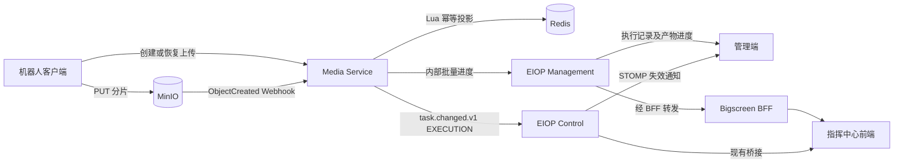
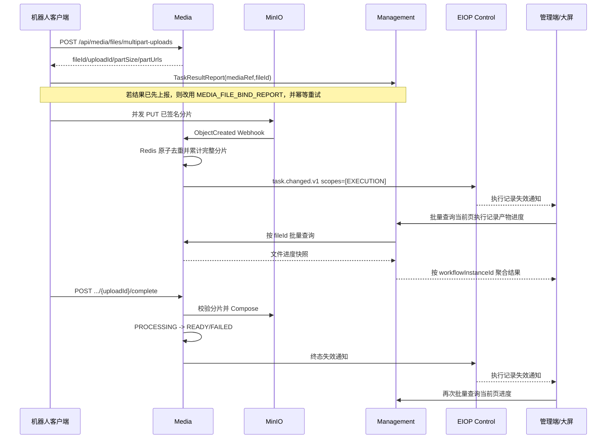

# 文件上传进度接口开发文档

> 状态：待实施
> 版本：2.0
> 代码基线：2026-09-20
> 适用模块：Media Service、EIOP Management、EIOP Control、Bigscreen BFF、管理端、指挥中心前端、机器人上传客户端

本文档定义任务产物上传进度的计算、聚合、查询和实时刷新契约，供后端实现及两个前端共同对接。通用文件的上传、下载和播放仍以[通用文件服务接口文档](./通用文件服务接口文档.md)为准。

## 1. 目标与边界

### 1.1 目标

1. Media 以较低开销计算分片上传进度，并正确区分同一机器人同时上传的可见光、热成像、轨迹等多个文件。
2. EIOP Management 将媒体文件进度聚合到任务执行记录，成为管理端和大屏唯一的业务查询入口。
3. 管理端与大屏展示同一份执行记录列表和同一套产物上传状态，不各自拼装业务关系。
4. 实时通道只发送“执行记录需要刷新”的失效通知；前端通过批量 REST 接口获取权威快照。
5. 在重复请求、重复 MinIO 事件、断线重连、多实例、Redis 临时不可用和服务重启后保持幂等且可恢复。
6. 进度能力不增加机器人逐分片回调 Media 的要求，分片数据仍直接上传 MinIO。

### 1.2 不在本次范围

- 不计算某个尚未完成的 HTTP PUT 请求内部已发送多少字节。PUT 不经过 Media，Media 只能在完整分片落盘后确认进度。
- 不把 HLS 转码百分比当作上传百分比。源文件上传完成后显示“处理中”，直到文件进入 `READY` 或 `FAILED`。
- 不让浏览器直接访问 Media 内部接口、内部 WebSocket 或 MinIO 管理接口。
- 不在 MySQL 中保存每个分片明细。MinIO 是分片存在性的事实源，Redis 是可重建的进度投影。
- 不在实时事件中携带执行记录 ID、文件 ID、百分比或当前业务状态。
- 不改变现有上传模式：小文件单接口上传，大文件使用预签名 URL 分片直传。

## 2. 当前业务事实

### 2.1 执行记录归属

- 任务执行记录由 EIOP Management 的 `TaskWorkflowInstance` 聚合维护。
- 管理端直接调用 Management 的 `/api/v1/management/task-workflow-instances/**`。
- 大屏通过 Bigscreen BFF 的 `/api/bigscreen/business/tasks/execution-records/**` 转发到同一套 Management 接口。
- Management 保存任务产物业务关系，只保存 `mediaRef/fileId` 等引用，不保存文件内容和播放地址。
- Media 维护文件、上传会话、对象存储和播放状态，不维护任务执行记录。

因此，上传进度不能分别在管理端和 BFF 再实现一套文件关系聚合。Management 应提供唯一的“执行记录产物上传进度”公开接口。

### 2.2 任务产物绑定

任务结果中的录像、轨迹等产物通过以下两种方式写入执行记录：

1. `TaskResultReport` 直接携带 `mediaRef + fileId`。
2. 结果先携带 `mediaRef` 占位，随后通过 `MEDIA_FILE_BIND_REPORT` 补充 `fileId`。

现有延迟绑定只会更新已存在且 `mediaRef` 匹配的占位项。绑定消息早于任务结果到达时，目标可能尚不存在而被忽略。因此客户端必须保存待绑定状态并幂等重试。

### 2.3 现有实时链路

- 管理端只建立一条到 EIOP Control 的 STOMP 连接，订阅 `/topic/platform/realtime-events`。
- EIOP 实时事件是最小失效通知，`task.changed.v1` 的 `EXECUTION` scope 表示执行记录数据需要刷新。
- 大屏侧 Control Service 已桥接 EIOP 的 `task.changed.v1`，并向大屏发布 `management.task.invalidated`。

本方案复用该链路，不增加 Media 到浏览器的第二条实时协议。

## 3. 总体架构



### 3.1 职责

| 模块 | 职责 |
|---|---|
| 机器人客户端 | 创建/恢复上传、并发 PUT、断点续传、完成上传、上报任务产物引用 |
| MinIO | 保存分片及源文件，产生对象创建通知 |
| Media | 上传会话、分片事件幂等、进度投影、文件状态、内部批量进度接口 |
| Redis | 进度热数据、分片去重、事件节流、多实例共享状态 |
| EIOP Management | 执行记录权限、产物关系、按执行记录聚合上传进度、对外唯一查询接口 |
| EIOP Control | 接收内部实时失效事件并通过既有 STOMP 分发 |
| Bigscreen BFF | 透明转发 Management 执行记录接口，不计算和持久化进度 |
| 两个前端 | 加载当前页执行记录，批量查询进度，收到失效通知后增量刷新 |

### 3.2 明确禁止

- 管理端和大屏不得直接调用 `/internal/media/**`。
- Bigscreen BFF 不得复制 Management 的任务产物聚合逻辑。
- Media 不得查询或维护 `TaskWorkflowInstance`。
- 前端不得依据 `robotId` 只保存一条进度；一个机器人可同时上传多个任务、多个通道和多个文件。
- WebSocket/STOMP 事件不得作为权威状态源。

## 4. 完整流程

### 4.1 上传、绑定与展示



### 4.2 客户端绑定时机

推荐顺序：

1. 录像文件关闭并稳定后，调用 Media 创建分片上传会话。
2. 创建接口成功即获得稳定的 `fileId`，不必等待所有分片上传完成。
3. 任务结果尚未上报时，在 `TaskResultReport` 中直接携带 `mediaRef + fileId`。
4. 任务结果已上报时，立即发送 `MEDIA_FILE_BIND_REPORT`。
5. 客户端本地清单保留“结果已上报、文件已创建、关系已绑定、上传已完成”等独立状态。
6. 延迟绑定至少在任务结果 ACK 后和文件上传完成后各重试一次；Management 按 `mediaRef + fileId` 幂等处理。

不要等视频上传完成后才第一次绑定。数小时视频会导致执行记录长时间无法知道该文件存在，也无法展示进度。

## 5. 进度模型

### 5.1 上传进度

```text
uploadedBytes = min(完整落盘且去重后的分片大小之和, totalBytes)
uploadedPartCount = 完整落盘且去重后的分片数
uploadPercent = floor(uploadedBytes * 10000 / totalBytes) / 100
```

- 只统计 MinIO 已成功创建的完整分片对象。
- 同一分片重复通知或重复上传只计一次；大小发生变化时按差值修正。
- `complete` 校验并合成成功后，上传百分比固定为 `100.00`。
- 进度按完整分片跳变，不承诺连续增长。

### 5.2 文件阶段

| `phase` | 含义 | 页面文案 |
|---|---|---|
| `PENDING_BIND` | 执行记录已有产物占位但尚无 fileId | 等待文件关联 |
| `UPLOADING` | 分片上传中 | 上传中 63.42% |
| `FINALIZING` | 校验分片并合成源文件 | 正在合并文件 |
| `PROCESSING` | 源文件完整，视频正在生成 HLS | 上传完成，处理中 |
| `READY` | 文件可下载，视频可播放 | 已完成 |
| `FAILED` | 上传或处理失败 | 上传失败/处理失败 |
| `EXPIRED` | 上传会话过期 | 上传已过期 |
| `ABORTED` | 上传被终止 | 上传已取消 |
| `DELETED` | 文件已删除 | 文件已删除 |
| `UNKNOWN` | Media 暂不可用或 fileId 不存在 | 状态暂不可用 |

`uploadPercent=100` 不代表视频可播放，只有 `phase=READY` 才能请求播放地址。

### 5.3 执行记录汇总状态

优先级从高到低：

1. 任一产物 `FAILED/EXPIRED/ABORTED`：`PARTIAL_FAILED` 或 `FAILED`。
2. 存在 `PENDING_BIND`：`PENDING_BIND`。
3. 存在 `UPLOADING`：`UPLOADING`。
4. 存在 `FINALIZING/PROCESSING`：`PROCESSING`。
5. 全部产物 `READY`：`READY`。
6. 无产物：`NONE`。
7. Media 不可用：`UNKNOWN`。

执行记录百分比按字节加权，不做各文件百分比的算术平均：

```text
summaryPercent = sum(uploadedBytes) / sum(totalBytes) * 100
```

没有 `fileId` 或 `totalBytes` 的占位项不参与分母，但必须计入 `pendingBindCount`。

## 6. Media 内部接口

### 6.1 批量查询文件进度

```http
POST /internal/media/files/upload-progress-queries
Authorization: Bearer <management-media-service-token>
Content-Type: application/json
```

请求：

```json
{
  "fileIds": [
    "file_visible_001",
    "file_thermal_001",
    "file_track_001"
  ]
}
```

约束：

- 单次最多 500 个 `fileId`。
- 服务端去重但保持首次出现顺序。
- 只允许 Management 服务身份调用，不接受浏览器 JWT。
- 空数组返回空结果，不报错。

响应：

```json
{
  "items": [
    {
      "fileId": "file_visible_001",
      "uploadId": "upl_001",
      "fileName": "visible_20260920_101500.mp4",
      "fileType": "VIDEO",
      "phase": "UPLOADING",
      "uploadedBytes": 68157440,
      "totalBytes": 1073741824,
      "uploadedPartCount": 13,
      "partCount": 205,
      "uploadPercent": 6.34,
      "ready": false,
      "version": 18,
      "updatedAt": "2026-09-20 10:16:12",
      "errorCode": null,
      "errorMessage": null
    }
  ],
  "missingFileIds": ["file_track_001"],
  "generatedAt": "2026-09-20 10:16:12"
}
```

### 6.2 查询策略

1. 先对所有 `fileId` 批量查询 MySQL 文件及上传会话，禁止逐文件查询。
2. 终态文件直接由 MySQL 构造。
3. 活跃会话优先批量读取 Redis pipeline。
4. Redis 缺失时提交到有界重建执行器，通过 MinIO `listParts` 重建；单请求重建并发最多 8。
5. 超出重建预算的项返回 `UNKNOWN/PROGRESS_REBUILD_PENDING`，不得无限等待或击穿 MinIO。
6. 同一 `uploadId` 使用 Redis 短锁防止多实例同时重建。

### 6.3 MinIO 事件入口

```http
POST /internal/media/file-upload-events/minio
Authorization: Bearer <minio-webhook-token>
Content-Type: application/json
```

- 只处理 `s3:ObjectCreated:*` 且对象键匹配 `.upload-parts/{storageUploadId}/part-{number}` 的事件。
- 对象键 URL decode 后严格解析；不匹配事件返回 `204` 并忽略。
- Redis 更新失败返回 `503`，由 MinIO 的持久化通知队列重试。
- 日志不得记录 Token 或预签名 URL 查询参数。

## 7. Management 对外接口

### 7.1 执行记录产物进度批量查询

```http
POST /api/v1/management/task-workflow-instances/artifact-upload-progress-queries
Authorization: Bearer <user-token>
Content-Type: application/json
```

管理端直接调用上述地址。大屏调用对应 BFF 地址：

```http
POST /api/bigscreen/business/tasks/execution-records/artifact-upload-progress-queries
Authorization: Bearer <user-token>
Content-Type: application/json
```

Bigscreen BFF 继续使用现有执行记录代理，不增加业务聚合。

请求：

```json
{
  "workflowInstanceIds": [
    "twi_10001",
    "twi_10002"
  ]
}
```

约束：

- 单次最多 100 个执行记录 ID，满足列表页分页查询。
- 调用方不能提交 `fileId`，避免绕过任务执行记录的数据权限。
- Management 对每个执行记录执行 `task.execution.record.view` 和数据范围校验。
- 请求包含已存在但无权访问的 ID 时，整个请求返回 `403002`，不通过缺失项泄露记录存在性。
- 重复 ID 由服务端去重。

响应：

```json
{
  "available": true,
  "generatedAt": "2026-09-20 10:16:12",
  "instances": [
    {
      "workflowInstanceId": "twi_10001",
      "summary": {
        "status": "UPLOADING",
        "artifactCount": 3,
        "boundCount": 2,
        "pendingBindCount": 1,
        "uploadingCount": 2,
        "processingCount": 0,
        "readyCount": 0,
        "failedCount": 0,
        "missingCount": 0,
        "uploadedBytes": 94371840,
        "totalBytes": 2147483648,
        "uploadPercent": 4.39
      },
      "artifacts": [
        {
          "artifactKey": "VIDEO:visible-main:visible-001",
          "artifactType": "VIDEO",
          "mediaRef": "visible-001",
          "fileId": "file_visible_001",
          "mediaType": "VISIBLE",
          "serialNumber": "robot-001",
          "sourceId": "visible-main",
          "label": "可见光录像",
          "phase": "UPLOADING",
          "uploadedBytes": 68157440,
          "totalBytes": 1073741824,
          "uploadPercent": 6.34,
          "ready": false,
          "version": 18,
          "updatedAt": "2026-09-20 10:16:12",
          "errorCode": null,
          "errorMessage": null
        },
        {
          "artifactKey": "VIDEO:thermal-main:thermal-001",
          "artifactType": "VIDEO",
          "mediaRef": "thermal-001",
          "fileId": null,
          "mediaType": "THERMAL",
          "serialNumber": "robot-001",
          "sourceId": "thermal-main",
          "label": "热成像录像",
          "phase": "PENDING_BIND",
          "uploadedBytes": 0,
          "totalBytes": null,
          "uploadPercent": null,
          "ready": false,
          "version": null,
          "updatedAt": null,
          "errorCode": null,
          "errorMessage": null
        }
      ]
    }
  ]
}
```

### 7.2 聚合规则

1. Management 一次读取请求中的所有执行记录及 `videoResults/trackFileResults`，禁止 N+1。
2. 从已授权执行记录内部提取非空 `fileId`，去重后批量调用 Media。
3. 以 `workflowInstanceId + artifactType + mediaRef` 还原到任务产物。
4. 没有 `fileId` 的占位项返回 `PENDING_BIND`。
5. Media 返回 `missingFileIds` 时对应项返回 `UNKNOWN/FILE_NOT_FOUND`，同时记录告警。
6. Media 整体不可用时 HTTP 仍返回 `200`、`available=false`；保留任务产物关系，已绑定项标记 `UNKNOWN`。执行记录基础列表不能因此不可用。
7. 只有请求本身非法、权限失败或 Management 自身故障才返回非 2xx。

### 7.3 为什么不直接扩展列表响应

执行记录列表是稳定的持久业务数据，上传进度是高频、短生命周期状态。独立批量接口具备以下优势：

- 列表查询不依赖 Media，可在 Media 故障时正常使用。
- 翻页、筛选和进度刷新可独立执行。
- 实时事件发生时只刷新当前页进度，不重复查询完整列表。
- 后端可以为进度设置短超时、隔离线程池和独立限流。

## 8. 实时失效通知

### 8.1 Media 发布

Media 在进度满足发布条件后调用 EIOP Control 既有内部入口：

```http
POST /internal/v1/control/realtime-events
Authorization: Bearer <media-control-service-token>
Content-Type: application/cloudevents+json
```

```json
{
  "specversion": "1.0",
  "id": "6195067081204172801",
  "source": "media",
  "type": "task.changed.v1",
  "data": {
    "scopes": ["EXECUTION"]
  }
}
```

要求：

- EIOP Control 的来源白名单增加 `media`，且仅允许其发布 `task.changed.v1 + EXECUTION`。
- `id` 使用 `uploadId + version + phase` 的 SHA-256 截取为正 63 位整数并以十进制字符串表示，保证重试和多实例下确定性一致。
- 事件不携带 `workflowInstanceId`、`fileId` 或进度值。
- 非终态进度使用 Redis 全局节流，同一集群最多每秒发布一次失效事件。
- `FINALIZING/PROCESSING/READY/FAILED/EXPIRED/ABORTED` 等阶段变化立即发布，并进行有限重试。
- 发布失败不影响上传主流程，依靠下一次进度、终态事件或前端重连补偿。

### 8.2 管理端接收

管理端继续订阅：

```text
/topic/platform/realtime-events
```

收到 `source=media`、`type=task.changed.v1` 且 scopes 包含 `EXECUTION` 时：

1. 标记当前页进度为 dirty。
2. 1 秒防抖后批量刷新当前页执行记录 ID。
3. 同一时刻只允许一个进度请求；请求期间又收到事件时，在完成后最多补一次 trailing refresh。
4. 不因每个进度事件重新加载完整执行记录列表。
5. STOMP 重连成功后重新加载列表和当前页进度。

管理端公共事件校验器需要接受 `source=media`，但仍拒绝未知 source/type/scope。

### 8.3 大屏接收

现有链路保持：

```text
EIOP Control task.changed.v1
  -> robot control-service CenterStompTaskEventBridge
  -> management.task.invalidated
  -> robot-ui taskRefreshRevision
```

大屏执行记录列表及详情页监听 `taskRefreshRevision`，采用与管理端相同的 1 秒防抖、single-flight 和 trailing refresh，只调用当前页批量进度接口。

## 9. 前端展示与请求流程

### 9.1 列表页

1. 请求执行记录分页列表。
2. 从当前页取 `workflowInstanceId`，只发一次批量进度请求。
3. 增加“产物上传”列：
   - 无产物：`--`
   - 有待绑定：`等待关联 1`
   - 上传中：`2/3，63.42%`
   - 处理中：`上传完成，处理中`
   - 全部完成：`3/3 已完成`
   - 有失败：`1 个失败`
   - Media 不可用：`状态暂不可用`
4. 行内只展示汇总，录像/产物弹窗展示每个文件的独立进度。
5. 列表翻页或筛选变化时取消旧请求，并为新页发一次批量请求。

### 9.2 详情与回放

1. 打开详情时同时查询执行记录详情和该记录的产物进度。
2. `READY` 项才请求播放地址或下载地址。
3. `UPLOADING` 显示确定进度条；`FINALIZING/PROCESSING` 显示不确定进度动画。
4. 收到失效事件时只刷新进度。
5. 某项首次从非 `READY` 变成 `READY` 时，再刷新一次 replay 数据；不得每个分片都重载轨迹和回放详情。

### 9.3 前端状态主键

- 执行记录：`workflowInstanceId`。
- 产物展示项：`artifactKey`。
- 已绑定文件：`fileId`。
- 进度版本：同一 `uploadId` 下使用 `version`，只接受更高版本。

不要以 `robotId`、`mediaType` 或文件名作为唯一 key。

## 10. Media 进度投影

### 10.1 Redis Key

```text
media:file-upload:storage:{storageUploadId} -> uploadId
media:file-upload:{uploadId}:summary       -> Hash
media:file-upload:{uploadId}:parts         -> Hash(partNumber -> size:etag)
media:file-upload:{uploadId}:rebuild-lock  -> String
media:file-upload:execution-invalidate     -> String, 1s TTL
```

`summary` 至少保存：

```text
fileId, uploadId, storageUploadId, fileName, fileType,
fileStatus, uploadStatus, phase, uploadedBytes, totalBytes,
uploadedPartCount, partCount, version, updatedAt,
errorCode, errorMessage
```

### 10.2 Lua 原子更新

每条有效分片事件在一次 Lua 中：

1. 读取该 `partNumber` 的旧值。
2. 首次出现时增加分片数；重复事件不增加。
3. 按新旧 size 差值更新字节数。
4. 有实际变化时增加 `version` 并刷新 TTL。
5. 判断是否需要发布执行记录失效事件。
6. 完全相同的重复事件不增加版本、不发事件。

### 10.3 Redis 故障

- Redis 不可用不能阻断机器人 PUT。
- Webhook 返回 `503`，依赖 MinIO 持久化通知队列重试。
- `complete` 始终以 MinIO `listParts + ComposeObject + statSize` 为准。
- Redis 恢复后可由批量查询或定时对账重建。

## 11. 上传会话正确性

### 11.1 唯一约束

```sql
ALTER TABLE media_file
    DROP INDEX idx_file_robot_source,
    ADD UNIQUE KEY uk_file_robot_source (robot_id, source_file_id);

ALTER TABLE media_file_upload
    ADD UNIQUE KEY uk_file_upload_storage (storage_upload_id);
```

迁移前先处理历史重复数据。客户端必须对同一本地文件稳定生成同一 `sourceFileId`。

### 11.2 创建幂等

- 命中已有文件时校验名称、大小、类型和 Content-Type；不一致返回 `SOURCE_FILE_CHANGED`。
- 首次并发插入发生唯一键冲突时回读既有文件并走恢复逻辑。
- 同一文件重试返回相同 `fileId` 和当前有效 `uploadId`。

### 11.3 完成幂等

`media_file_upload.status` 增加：

```text
ACTIVE -> COMPLETING -> COMPLETED
                     -> FAILED
```

- `complete` 先用条件更新抢占 `ACTIVE -> COMPLETING`。
- 只有抢占成功者执行 `listParts` 和 Compose。
- 重复请求命中 `COMPLETING` 时返回 `FINALIZING`，不重复 Compose。
- 恢复任务检查超出租约的 `COMPLETING`：目标对象正确则完成；分片完整则恢复为 `ACTIVE`；否则明确失败。

## 12. 分片与并发

### 12.1 动态分片

```text
MIN_PART_SIZE = 5 MiB
MAX_PART_SIZE = 5 GiB
MAX_PART_COUNT = 10000

requiredPartSize = ceil(fileSize / MAX_PART_COUNT)
partSize = roundUpToMiB(max(configuredPartSize, MIN_PART_SIZE, requiredPartSize))
partCount = ceil(fileSize / partSize)
```

客户端必须使用创建接口返回的 `partSize`，不能写死。单次返回 16 个预签名 URL 只是减少接口往返，不表示必须并发 16 个 PUT；默认 PUT 并发建议为 4。

### 12.2 上传限制

- 会话限制用于保护资源，不应因少量长期失败会话永久阻塞同一机器人后续任务。
- 计数前先回收过期或长时间无活动会话。
- 按机器人限制时同时设置合理全局上限，并允许相同 `sourceFileId` 幂等恢复不占新名额。
- `429` 响应必须返回 `scope/activeCount/limit/retryAfterSeconds/retryable`。
- 对 `ACTIVE` 但长期没有任何完整分片的会话使用更短空闲回收时间。

## 13. 高并发、高性能与高可用

### 13.1 性能原则

- 文件数据直传 MinIO，不经过 Media、Management、Control 或 BFF。
- 每个完整分片只执行一次 Redis Lua，不写 MySQL。
- Management 以当前页执行记录批量读取关系，再单次批量调用 Media。
- 前端收到高频事件后合并刷新；两个前端均不做固定高频轮询。
- Media-to-Control 非终态通知全局最多 1 次/秒，避免机器人和分片数量放大 STOMP 压力。

### 13.2 隔离与背压

- Webhook、进度重建、Management-to-Media 调用分别使用有界线程池。
- Management 调用 Media 使用短连接超时和总超时，不自动进行无上限重试。
- Media 批量查询最大 500 个文件，Management 外部批量查询最大 100 个执行记录。
- 前端刷新 single-flight，慢请求期间只记录一个 dirty 位。
- Redis/MinIO/Media 故障时降级进度展示，不拖垮执行记录主查询。

### 13.3 事实源

1. Management MySQL：执行记录和任务产物关系。
2. Media MySQL：文件、上传会话和业务终态。
3. MinIO：分片对象和最终对象。
4. Redis：可重建进度投影和节流状态。
5. STOMP：可丢失的失效提示。

### 13.4 多实例

- 任意 Media 实例均可接收 Webhook，Redis Lua 保证原子去重。
- 任意 Management 实例均从共享数据库读取关系并调用任意 Media 实例。
- Control 继续按 `source + id` 去重实时事件。
- 不要求负载均衡粘性会话。
- 实时通知丢失不影响正确性；前端重连、翻页和手动刷新均重新读取快照。

## 14. 权限与安全

- Management 公开接口必须执行现有用户权限和数据范围校验，不能信任前端提交的 `fileId`。
- Media 内部批量接口只接受 Management 服务凭证，并限制来源网络。
- Media 发布 Control 内部事件使用独立服务凭证，不与 MinIO Webhook Token 共用。
- 浏览器永远不持有 Media、MinIO 或 Control 内部凭证。
- 日志记录 `requestId/workflowInstanceId/fileId/uploadId/phase/outcome/durationMs`，不记录预签名 URL 和凭据。

## 15. 错误语义

| HTTP | `code` | 场景 |
|---|---|---|
| 400 | `INVALID_WORKFLOW_INSTANCE_IDS` | 执行记录 ID 为空、格式错误或超过 100 |
| 401 | `UNAUTHORIZED` | 用户未登录或内部服务凭证无效 |
| 403 | `403002` | 无执行记录查看权限或超出数据范围 |
| 404 | `FILE_NOT_FOUND` | Media 内部单项文件不存在，聚合后以 UNKNOWN 表示 |
| 409 | `SOURCE_FILE_CHANGED` | 相同 sourceFileId 的文件属性变化 |
| 409 | `UPLOAD_INCOMPLETE` | complete 时分片不完整 |
| 413 | `FILE_TOO_LARGE` | 文件或分片数超过上限 |
| 429 | `UPLOAD_SESSION_LIMIT` | 活跃会话达到资源保护阈值 |
| 503 | `MEDIA_PROGRESS_UNAVAILABLE` | Media 进度不可用；Management 对外降级为 available=false |

Management 聚合接口不因单个文件缺失返回整体 404，不因 Media 暂时不可用返回整体 503。

## 16. 配置

### 16.1 Media

| 配置 | 建议默认值 | 说明 |
|---|---:|---|
| `MEDIA_FILE_MAX_PART_COUNT` | `10000` | 单文件最大分片数 |
| `MEDIA_FILE_PROGRESS_ENABLED` | `true` | 进度投影开关 |
| `MEDIA_FILE_PROGRESS_INVALIDATE_INTERVAL_MS` | `1000` | 非终态全局失效事件间隔 |
| `MEDIA_FILE_PROGRESS_REBUILD_CONCURRENCY` | `8` | MinIO 重建最大并发 |
| `MEDIA_FILE_PROGRESS_RECONCILE_BATCH_SIZE` | `100` | 单轮对账会话数 |
| `MEDIA_FILE_COMPLETION_LEASE_SECONDS` | `300` | COMPLETING 恢复租约 |
| `MEDIA_FILE_PROGRESS_WEBHOOK_TOKEN` | 无 | MinIO Webhook 凭证 |
| `MEDIA_MANAGEMENT_SERVICE_TOKEN` | 无 | Management 查询凭证 |
| `MEDIA_CONTROL_SERVICE_TOKEN` | 无 | 发布 Control 事件凭证 |

### 16.2 Management

| 配置 | 建议默认值 | 说明 |
|---|---:|---|
| `MEDIA_SERVICE_BASE_URL` | 环境配置 | Media 内网地址 |
| `MEDIA_SERVICE_TOKEN` | 无 | 与 Media 查询凭证一致 |
| `MEDIA_PROGRESS_CONNECT_TIMEOUT_MS` | `500` | 连接超时 |
| `MEDIA_PROGRESS_READ_TIMEOUT_MS` | `2000` | 批量查询超时 |
| `MEDIA_PROGRESS_MAX_WORKFLOW_INSTANCES` | `100` | 对外单次执行记录上限 |
| `MEDIA_PROGRESS_MAX_FILE_IDS` | `500` | 单次下游文件上限 |

## 17. 模块开发清单

### 17.1 Media Service

1. 新增 MinIO Webhook、Redis Lua 投影、批量内部查询和限量对账。
2. 动态计算分片大小，限制分片总数不超过 10,000。
3. 增加文件/上传会话唯一约束、创建幂等和 `COMPLETING` 完成幂等。
4. 文件阶段变化时更新投影并向 EIOP Control 发布最小失效事件。
5. 补充批量查询、事件重复、乱序、Redis 降级和 Compose 恢复测试。

### 17.2 EIOP Management

1. 在现有 Media port 增加批量进度能力，由基础设施适配器调用 Media。
2. 新增执行记录产物进度应用服务、DTO 和公开 Controller。
3. 批量加载执行记录与产物关系，执行权限校验并聚合。
4. Media 故障时返回 `available=false`，不影响执行记录列表。
5. 为权限、待绑定、文件缺失、字节加权和下游降级增加测试。

### 17.3 EIOP Control

1. 内部实时事件来源白名单增加 `media`。
2. 限制 Media 只能发布 `task.changed.v1 + EXECUTION`。
3. 保留现有事件去重和 STOMP 广播，不增加媒体业务查询。

### 17.4 Bigscreen BFF

1. 验证现有执行记录通配代理可转发新增 POST 子路径。
2. 增加代理路径、请求体、认证头和 Management 错误透传测试。
3. 不新增 Media Client、上传进度数据库或独立 WebSocket。

### 17.5 管理端

涉及页面：

- `TaskExecutionRecordsPage.vue`
- `TaskExecutionRecordDetailPage.vue`

开发内容：

1. API 层增加批量产物进度请求。
2. 列表增加汇总列，视频/产物弹窗增加逐文件状态。
3. 事件中心接受 `source=media`。
4. 为执行记录页增加 `task.changed.v1 + EXECUTION` 监听、1 秒防抖和 single-flight。
5. 详情页仅在产物首次进入 `READY` 时刷新 replay。

### 17.6 指挥中心前端

涉及页面：

- 巡逻任务执行记录列表
- 执行记录详情/回放

开发内容：

1. `new-bi.js` 增加 BFF 批量进度接口。
2. 列表和详情复用与管理端一致的状态文案和聚合含义。
3. 监听既有 `taskRefreshRevision`，只刷新当前页进度。
4. 产物首次进入 `READY` 后再加载播放/回放数据。

### 17.7 机器人客户端

1. 创建上传会话取得 `fileId` 后尽快写入任务结果或发送延迟绑定。
2. 本地清单分别保存上传状态和绑定状态。
3. 绑定消息在结果 ACK 后、上传完成后幂等重试。
4. 继续使用服务端返回的 `partSize` 和 `partUrls`，无需逐片回调 Media。

## 18. 测试与验收

### 18.1 正确性

- 同一机器人可见光、热成像和轨迹同时上传，三条进度按不同 `fileId` 展示。
- 任务结果直接带 fileId 和延迟绑定两种路径均能显示。
- 绑定消息先于任务结果到达后，通过客户端重试最终关联成功。
- 重复发送同一 MinIO 事件 100 次只计算一次。
- 乱序事件、分片重传和断点续传均不导致百分比回退或超过 100。
- 视频按 `UPLOADING -> FINALIZING -> PROCESSING -> READY` 展示。

### 18.2 接口与权限

- 管理端与大屏对相同执行记录获得一致汇总和产物明细。
- 批量请求包含无权记录时整体返回 `403002`。
- 浏览器不能访问 Media 内部接口。
- Bigscreen BFF 只做路径代理，不改变响应字段。
- Media 不可用时列表可用，进度接口返回 `available=false`。

### 18.3 并发与故障

- 至少模拟 100 个并行文件、每文件 4 个 PUT 并发和分片集中完成。
- Management 批量查询无 N+1 SQL 和逐文件 Media 请求。
- 进度事件突发时，Control 每秒非终态失效通知不超过设计阈值。
- Redis 中断期间 PUT 和 complete 不被错误阻断，恢复后可重建。
- Media 在 Compose 前后退出，恢复任务可得到唯一正确终态。
- STOMP 断线重连后两个前端都能通过 REST 恢复当前页状态。

### 18.4 前端

- 翻页时不会把上一页响应覆盖到当前页。
- 连续事件期间只有一个在途请求，并最多追加一次刷新。
- 小屏宽度下汇总列不挤出主要操作。
- `READY` 前不请求播放，首次 READY 后自动出现播放入口。

## 19. 可观测性

至少记录以下指标：

```text
media_file_progress_webhook_total{outcome}
media_file_progress_webhook_duration_seconds
media_file_progress_duplicate_total
media_file_progress_rebuild_total{outcome}
media_file_progress_invalidation_total{outcome}
management_artifact_progress_query_duration_seconds
management_artifact_progress_query_size
management_artifact_progress_media_failures_total
control_realtime_event_total{source,type,outcome}
```

告警覆盖：

- MinIO Webhook 未发送队列持续增长。
- Redis 更新错误率升高。
- `COMPLETING` 超过租约。
- 活跃会话长时间无进度。
- Management 调用 Media 超时或 `available=false` 比例超阈值。
- Control 拒绝 Media 事件或发布失败。

## 20. 实施顺序

1. Media 先完成动态分片、唯一约束和 complete 幂等。
2. Media 完成 MinIO 事件、Redis 投影和内部批量查询。
3. Management 完成执行记录产物进度聚合接口。
4. Control 接受 Media 最小失效事件。
5. Bigscreen BFF 验证新增代理路径。
6. 管理端和大屏按同一接口、同一状态模型接入。
7. 机器人客户端调整 fileId 绑定时机和本地重试。
8. 完成跨服务联调、并发压测、故障注入和权限验收后上线。

## 21. 参考

- [MinIO Publish Events to Webhook](https://docs.min.io/aistor/administration/bucket-notifications/publish-events-to-webhook/)
- [MinIO Webhook Notification Settings](https://docs.min.io/aistor/reference/aistor-server/settings/notifications/webhook-service/)
- [Amazon S3 multipart upload limits](https://docs.aws.amazon.com/AmazonS3/latest/userguide/qfacts.html)
