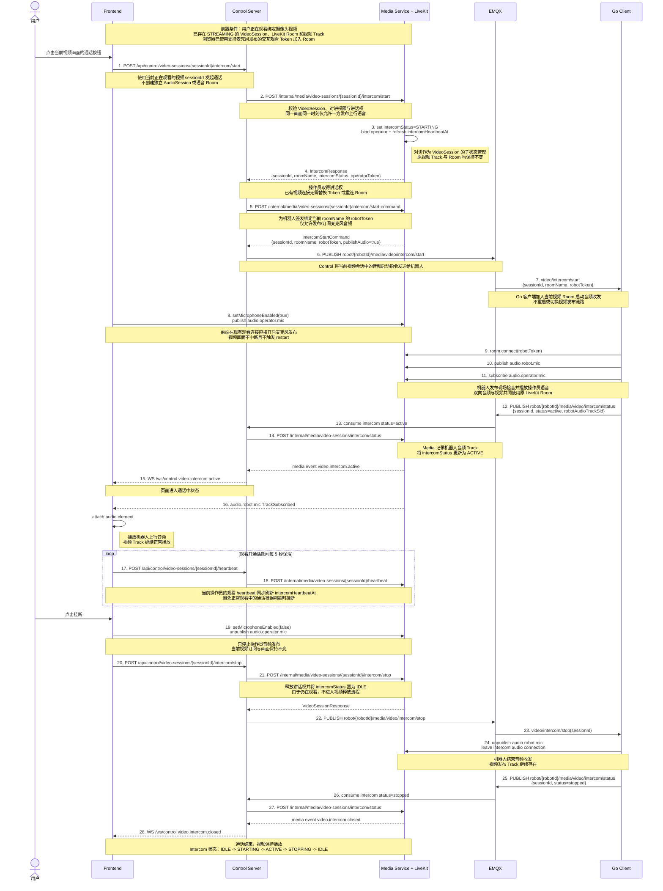

```mermaid
sequenceDiagram
    actor U as 用户
    participant FE as Frontend
    participant CS as Control Server
    participant ML as Media Service + LiveKit
    participant MQ as EMQX
    participant GO as Go Client

    Note over FE,ML: 前置条件：用户正在观看绑定摄像头视频<br/>已存在 STREAMING 的 VideoSession、LiveKit Room 和视频 Track<br/>浏览器已使用支持麦克风发布的交互观看 Token 加入 Room

    U->>FE: 点击当前视频画面的通话按钮
    FE->>CS: 1. POST /api/control/video-sessions/{sessionId}/intercom/start
    Note over FE,CS: 使用当前正在观看的视频 sessionId 发起通话<br/>不创建独立 AudioSession 或语音 Room

    CS->>ML: 2. POST /internal/media/video-sessions/{sessionId}/intercom/start
    Note over CS,ML: 校验 VideoSession、对讲权限与讲话权<br/>同一画面同一时刻仅允许一方发布上行语音

    ML->>ML: 3. set intercomStatus=STARTING<br/>bind operator + refresh intercomHeartbeatAt
    Note right of ML: 对讲作为 VideoSession 的子状态管理<br/>原视频 Track 与 Room 均保持不变

    ML-->>CS: 4. IntercomResponse<br/>{sessionId, roomName, intercomStatus, operatorToken}
    Note over ML,CS: 操作员取得讲话权<br/>已有视频连接无需替换 Token 或重连 Room

    CS->>ML: 5. POST /internal/media/video-sessions/{sessionId}/intercom/start-command
    Note over CS,ML: 为机器人签发绑定当前 roomName 的 robotToken<br/>仅允许发布/订阅麦克风音频
    ML-->>CS: IntercomStartCommand<br/>{sessionId, roomName, robotToken, publishAudio=true}

    CS->>MQ: 6. PUBLISH robot/{robotId}/media/video/intercom/start
    Note over CS,MQ: Control 将当前视频会话中的音频启动指令发送给机器人
    MQ->>GO: 7. video/intercom/start<br/>{sessionId, roomName, robotToken}
    Note over MQ,GO: Go 客户端加入当前视频 Room 启动音频收发<br/>不重启或切换视频发布链路

    FE->>ML: 8. setMicrophoneEnabled(true)<br/>publish audio.operator.mic
    Note over FE,ML: 前端在现有观看连接直接开启麦克风发布<br/>视频画面不中断且不触发 restart

    GO->>ML: 9. room.connect(robotToken)
    GO->>ML: 10. publish audio.robot.mic
    GO->>ML: 11. subscribe audio.operator.mic
    Note over GO,ML: 机器人发布现场拾音并播放操作员语音<br/>双向音频与视频共同使用原 LiveKit Room

    GO->>MQ: 12. PUBLISH robot/{robotId}/media/video/intercom/status<br/>{sessionId, status=active, robotAudioTrackSid}
    MQ->>CS: 13. consume intercom status=active
    CS->>ML: 14. POST /internal/media/video-sessions/intercom/status
    Note over MQ,ML: Media 记录机器人音频 Track<br/>将 intercomStatus 更新为 ACTIVE

    ML-->>CS: media event video.intercom.active
    CS-->>FE: 15. WS /ws/control video.intercom.active
    Note over CS,FE: 页面进入通话中状态

    ML-->>FE: 16. audio.robot.mic TrackSubscribed
    FE->>FE: attach audio element
    Note right of FE: 播放机器人上行音频<br/>视频 Track 继续正常播放

    loop 观看并通话期间每 5 秒保活
        FE->>CS: 17. POST /api/control/video-sessions/{sessionId}/heartbeat
        CS->>ML: 18. POST /internal/media/video-sessions/{sessionId}/heartbeat
        Note over FE,ML: 当前操作员的观看 heartbeat 同步刷新 intercomHeartbeatAt<br/>避免正常观看中的通话被误判超时挂断
    end

    U->>FE: 点击挂断
    FE->>ML: 19. setMicrophoneEnabled(false)<br/>unpublish audio.operator.mic
    Note over FE,ML: 只停止操作员音频发布<br/>当前视频订阅与画面保持不变

    FE->>CS: 20. POST /api/control/video-sessions/{sessionId}/intercom/stop
    CS->>ML: 21. POST /internal/media/video-sessions/{sessionId}/intercom/stop
    Note over CS,ML: 释放讲话权并将 intercomStatus 置为 IDLE<br/>由于仍在观看，不进入视频释放流程
    ML-->>CS: VideoSessionResponse

    CS->>MQ: 22. PUBLISH robot/{robotId}/media/video/intercom/stop
    MQ->>GO: 23. video/intercom/stop(sessionId)
    GO->>ML: 24. unpublish audio.robot.mic<br/>leave intercom audio connection
    Note over GO,ML: 机器人结束音频收发<br/>视频发布 Track 继续存在

    GO->>MQ: 25. PUBLISH robot/{robotId}/media/video/intercom/status<br/>{sessionId, status=stopped}
    MQ->>CS: 26. consume intercom status=stopped
    CS->>ML: 27. POST /internal/media/video-sessions/intercom/status
    ML-->>CS: media event video.intercom.closed
    CS-->>FE: 28. WS /ws/control video.intercom.closed
    Note over FE,ML: 通话结束，视频保持播放<br/>Intercom 状态：IDLE -> STARTING -> ACTIVE -> STOPPING -> IDLE
```
