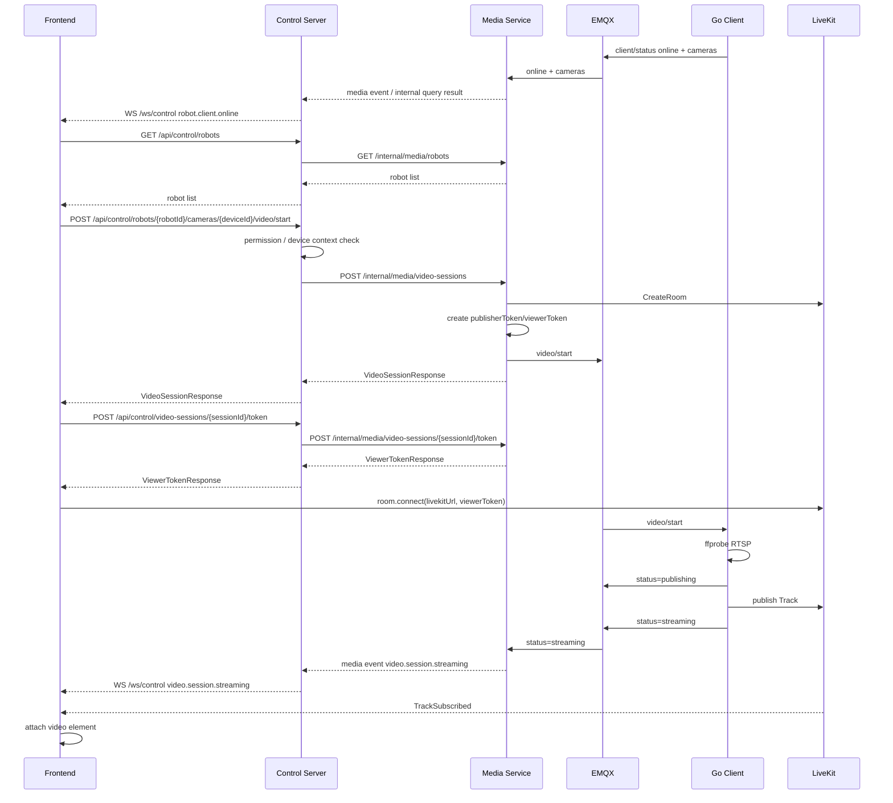

# 实时视频模块三端交互与接口文档

## 1. 文档范围

本文档按当前代码实现描述实时视频模块的前端、Control Server、Media Service、Go 云接入客户端、EMQX、LiveKit 之间的接口、事件、状态机和异常恢复流程。

当前方案仍为方案 A：机器人侧 Go 云接入客户端直接接入 LiveKit，作为 publisher 发布视频 Track；浏览器通过 Control Server 获取观看 Token 后，直接订阅 LiveKit Track。

## 2. 当前核心边界

| 模块 | 当前职责 |
|---|---|
| 前端 Vue2 调试台 | 展示机器人列表、1/4/9 宫格视频墙、调用 Control API、连接 LiveKit、单路停止、单路抓拍、观看者心跳 |
| Control Server | 面向前端提供统一业务入口，负责设备上下文、权限入口、视频操作编排和 WebSocket 入口 |
| Java Media Service | 面向 Control Server 提供媒体内部接口，负责机器人在线注册、会话编排、LiveKit Token 签发、MQTT 指令下发、状态维护、viewerCount 维护 |
| Go 云接入客户端 | 机器人侧统一客户端，启动后上报设备与摄像头列表，订阅 MQTT start/stop/switch，按 sessionId 管理多个 publisher 进程 |
| EMQX | 后端与 Go 客户端之间的控制消息、状态消息和客户端心跳消息通道 |
| LiveKit | 按摄像头维度承载 Room/Track，负责实时媒体转发 |
| MinIO | 抓拍图片对象存储 |

当前代码中 Control Server 与 Media Service 仍在同一个 Spring Boot 进程内，通过服务类直接调用完成；接口路径已按独立微服务边界拆分，后续可平滑改为 Control Server 通过 HTTP 调用 Media Service 的 `/internal/media/**`。

当前不包含：媒体源 CRUD、RTSP 探测 REST 接口、MQTT ACK、LiveKit webhook。

## 3. LiveKit Room 与机器人/摄像头模型

### 3.1 Room 粒度

LiveKit Room 按单路摄像头创建，不按整台机器人创建。

命名规则：

```text
media.{robotId}.{deviceId}.{channel}
```

示例：

```text
media.robot-001.camera01.visible
media.robot-001.camera02.visible
media.robot-002.camera04.visible
```

这样单路观看、单路停止、单路抓拍、单路 viewerCount、单路空闲释放互不影响。

### 3.2 Go 客户端部署粒度

每台机器人部署一个 Go 客户端。

示例：

```text
robot-001 -> Go Client A -> camera01/camera02/camera03
robot-002 -> Go Client B -> camera04/camera05/camera06
```

Go 客户端内部按 `sessionId` 管理多个 publisher 进程：

```text
map[sessionId]*exec.Cmd
```

收到某一路 start，只启动该路对应 session 的 publisher；收到 stop，只停止该 session 的 publisher。

## 4. 枚举与状态

### 4.1 视频通道

| 值 | 说明 |
|---|---|
| `visible` | 可见光 |
| `thermal` | 热成像 |
| `fusion` | 融合通道，当前预留 |

### 4.2 清晰度

| 值 | 说明 |
|---|---|
| `sub` | 视频墙低码流 |
| `main` | 单路高清码流 |
| `auto` | 自动，当前预留 |

### 4.3 视频会话状态

| 状态 | 说明 |
|---|---|
| `INIT` | 会话已创建 |
| `REQUESTING_CLIENT` | 后端已向 Go 客户端下发 start |
| `ROOM_READY` | 客户端上报 publishing 或 Room 已准备 |
| `STREAMING` | 客户端上报 streaming，前端可订阅 Track |
| `INTERRUPTED` | 客户端或 Track 中断 |
| `IDLE_WAIT` | 当前无观看者，等待延迟释放 |
| `STOPPING` | 正在释放 publisher/Room |
| `CLOSED` | 会话已关闭 |
| `TIMEOUT` | 超时 |
| `FAILED` | 失败 |

### 4.4 机器人在线状态

| 状态 | 说明 |
|---|---|
| `online` | Go 客户端已连接 EMQX 且持续上报心跳 |
| `offline` | Go 客户端主动退出上报，或后端心跳超时判定离线 |

## 5. HTTP 通用约定

开发环境默认入口：

```text
前端: http://{serverIp}:8090
Control API: http://{serverIp}:8088/api/control
Media Internal API: http://{serverIp}:8088/internal/media
LiveKit: ws://{serverIp}:7880
业务 WebSocket: ws://{serverIp}:8090/ws/control 或 ws://{serverIp}:8088/ws/control
```

Mock 鉴权请求头：

```http
X-User-Id: u1001
X-Org-Id: org001
X-Roles: MEDIA_VIEWER,MEDIA_OPERATOR
X-Client-Id: web-{timestamp}-{random}
Content-Type: application/json
```

`X-Client-Id` 用于区分同一用户打开的不同浏览器页面。前端当前把它保存到 `sessionStorage`，同一标签页刷新不重复计数；新标签页或新浏览器是新的观看者。

时间字段统一使用 ISO-8601 字符串。后端返回的业务时间通常为 UTC，例如 `2026-05-22T02:00:00Z`；WebSocket 和 MQTT 示例中可能带本地时区，例如 `2026-05-22T10:00:00+08:00`。前端展示时按浏览器本地时间格式化。

接口字段约定：

| 约定 | 说明 |
|---|---|
| 必填 | 请求方必须传；响应方必须返回，除非说明可为 `null` |
| 可选 | 请求方可不传；响应方可能返回 `null` |
| 枚举 | 必须使用本文档列出的取值 |
| 空字符串 | 除明确说明外，不要用空字符串代替 `null` |

### 5.1 通用 Header 参数

| 字段 | 类型 | 必填 | 说明 |
|---|---|---:|---|
| `X-User-Id` | string | 是 | 当前登录用户 ID，当前调试阶段由前端固定传入 |
| `X-Org-Id` | string | 是 | 当前组织 ID，用于后续数据隔离 |
| `X-Roles` | string | 是 | 逗号分隔角色，例如 `MEDIA_VIEWER,MEDIA_OPERATOR` |
| `X-Client-Id` | string | 是 | 浏览器页面实例 ID，用于 viewer 去重和观看人数统计 |
| `Content-Type` | string | POST 请求是 | 固定为 `application/json`，无请求体的 POST 也建议带上 |

### 5.2 `RobotDeviceResponse`

| 字段 | 类型 | 必填 | 说明 |
|---|---|---:|---|
| `robotId` | string | 是 | 机器人唯一 ID，需要与 Go 客户端 `ROBOT_ID` 一致 |
| `clientId` | string | 是 | Go 客户端实例 ID，需要与 `ROBOT_CLIENT_ID` 一致 |
| `name` | string | 是 | 机器人展示名称，例如 `松灵四轮机器人` |
| `type` | string | 是 | 机器人类型，例如 `轮式机器人`、`四足机器人` |
| `status` | string | 是 | `online` / `offline` |
| `lastHeartbeatAt` | datetime | 可选 | 后端最近收到客户端状态或心跳的时间 |
| `cameras` | array[`RobotCameraResponse`] | 是 | 机器人下挂摄像头列表 |

### 5.3 `RobotCameraResponse`

| 字段 | 类型 | 必填 | 说明 |
|---|---|---:|---|
| `cameraId` | string | 是 | 摄像头 ID，例如 `camera01` |
| `deviceId` | string | 是 | 上装设备或摄像头设备 ID；当前与 `cameraId` 保持一致 |
| `name` | string | 是 | 摄像头展示名称 |
| `channel` | string | 是 | 默认通道，取值见 4.1 |
| `quality` | string | 是 | 默认清晰度，取值见 4.2 |
| `status` | string | 是 | `online` / `offline` |

### 5.4 `VideoSessionResponse`

| 字段 | 类型 | 必填 | 说明 |
|---|---|---:|---|
| `sessionId` | string | 是 | 视频会话 ID，后续 stop、heartbeat、token、snapshot 都使用它 |
| `robotId` | string | 是 | 机器人 ID |
| `deviceId` | string | 是 | 摄像头或上装设备 ID |
| `channel` | string | 是 | `visible` / `thermal` / `fusion` |
| `quality` | string | 是 | `sub` / `main` / `auto` |
| `status` | string | 是 | 会话状态，取值见 4.3 |
| `roomName` | string | 是 | LiveKit Room 名称，规则见 3.1 |
| `livekitUrl` | string | 是 | 浏览器连接 LiveKit 的信令地址 |
| `viewerToken` | string | 可选 | 观看 Token；创建会话和查询单会话时返回，heartbeat/stop/restart 通常为 `null` |
| `trackSid` | string | 可选 | LiveKit Track SID；客户端 streaming 后有值 |
| `trackName` | string | 可选 | Track 名称，当前格式 `video.{channel}.{quality}` |
| `viewerCount` | number | 是 | 当前有效观看者数量，按 `media_session_viewer.leftAt is null` 统计 |
| `lastErrorCode` | string | 可选 | 最近一次错误码 |
| `lastErrorMessage` | string | 可选 | 最近一次错误信息 |
| `createdAt` | datetime | 是 | 会话创建时间 |
| `updatedAt` | datetime | 是 | 会话更新时间 |

### 5.5 `ViewerTokenResponse`

| 字段 | 类型 | 必填 | 说明 |
|---|---|---:|---|
| `livekitUrl` | string | 是 | 浏览器连接 LiveKit 的信令地址 |
| `roomName` | string | 是 | LiveKit Room 名称 |
| `token` | string | 是 | 当前用户当前 `X-Client-Id` 的观看 Token |
| `expiresAt` | datetime | 是 | Token 过期时间，前端不要复用过期 Token |

### 5.6 `SnapshotResponse`

| 字段 | 类型 | 必填 | 说明 |
|---|---|---:|---|
| `snapshotId` | string | 是 | 抓拍任务 ID |
| `status` | string | 是 | `PROCESSING` / `COMPLETED` / `FAILED` |
| `mode` | string | 是 | 当前为 `livekit_track` 或服务端内部实际模式 |
| `previewAccepted` | boolean | 是 | 是否接受前端预览对象 |
| `officialObjectKey` | string | 可选 | 正式抓拍图片在 MinIO 中的 object key |
| `previewObjectKey` | string | 可选 | 前端预览图 object key，当前一般为空 |
| `errorCode` | string | 可选 | 抓拍失败错误码 |
| `errorMessage` | string | 可选 | 抓拍失败错误信息 |
| `officialCapturedAt` | datetime | 可选 | 服务端实际截帧时间 |
| `createdAt` | datetime | 是 | 抓拍任务创建时间 |

### 5.7 `MediaTrackResponse`

| 字段 | 类型 | 必填 | 说明 |
|---|---|---:|---|
| `trackId` | string | 是 | 平台侧 Track 记录 ID |
| `sessionId` | string | 是 | 所属视频会话 ID |
| `trackSid` | string | 是 | LiveKit Track SID |
| `trackName` | string | 是 | Track 名称 |
| `participantIdentity` | string | 是 | 发布者身份，例如 `robot:robot-001:camera01` |
| `kind` | string | 是 | 当前为 `video` |
| `channel` | string | 是 | 视频通道 |
| `quality` | string | 是 | 清晰度 |
| `publishedAt` | datetime | 是 | 发布时间 |
| `unpublishedAt` | datetime | 可选 | 取消发布或关闭时间 |

### 5.8 `MediaEventLogResponse`

| 字段 | 类型 | 必填 | 说明 |
|---|---|---:|---|
| `eventId` | string | 是 | 事件日志 ID |
| `sessionId` | string | 可选 | 所属会话 ID；机器人上下线事件可能为空或只在 payload 中体现 |
| `eventType` | string | 是 | 事件类型，见第 7 章 |
| `eventPayload` | string | 是 | JSON 字符串，内容与 WebSocket `data` 基本一致 |
| `traceId` | string | 可选 | 链路追踪 ID，当前可为空 |
| `createdAt` | datetime | 是 | 事件创建时间 |

### 5.9 错误响应

REST 接口异常统一返回 JSON：

```json
{
  "timestamp": "2026-05-22T10:00:00+08:00",
  "code": "INVALID_STATE",
  "message": "Video session is not streaming"
}
```

字段说明：

| 字段 | 类型 | 必填 | 说明 |
|---|---|---:|---|
| `timestamp` | datetime | 是 | 后端生成错误响应的时间 |
| `code` | string | 是 | 错误码 |
| `message` | string | 是 | 错误描述 |

当前常见 HTTP 状态码：

| HTTP 状态 | code | 场景 |
|---|---|---|
| `400` | `VALIDATION_ERROR` | 请求体字段缺失、枚举非法、格式校验失败 |
| `404` | `NOT_FOUND` | 会话、机器人或资源不存在 |
| `409` | `INVALID_STATE` | 当前会话状态不允许执行该操作，例如非 streaming 时抓拍 |

## 6. Control API 接口

Control API 是前端唯一直接调用的业务接口。当前实现位于同一个 Spring Boot 应用内，路径为 `/api/control/**`；后续独立成控制服务时，接口契约保持不变，内部再调用 Media Service 的 `/internal/media/**`。

### 6.1 查询机器人设备列表

| 项 | 内容 |
|---|---|
| 方法 | `GET` |
| 路径 | `/api/control/robots` |
| 调用方 | 前端 -> Control Server |

请求参数：无。

响应类型：`RobotDeviceResponse[]`。

响应：

```json
[
  {
    "robotId": "robot-001",
    "clientId": "robot-media-client",
    "name": "松灵四轮机器人",
    "type": "轮式机器人",
    "status": "online",
    "lastHeartbeatAt": "2026-05-22T02:00:00Z",
    "cameras": [
      {
        "cameraId": "camera01",
        "deviceId": "camera01",
        "name": "前向双光云台",
        "channel": "visible",
        "quality": "sub",
        "status": "online"
      }
    ]
  }
]
```

数据来源是 Go 客户端通过 MQTT 上报的客户端状态消息。服务刚启动且没有客户端上报时，接口可能返回空列表，前端保留本地默认设备占位。

### 6.2 创建或复用观看会话

| 项 | 内容 |
|---|---|
| 方法 | `POST` |
| 路径 | `/api/control/robots/{robotId}/cameras/{deviceId}/video/start` |
| 调用方 | 前端 -> Control Server |

路径参数：

| 字段 | 类型 | 必填 | 说明 |
|---|---|---:|---|
| `robotId` | string | 是 | 要观看的机器人 ID，来自 `/api/control/robots` |
| `deviceId` | string | 是 | 要观看的摄像头 ID，来自机器人摄像头列表 |

请求 Header：见 5.1。

请求：

```json
{
  "channel": "visible",
  "quality": "sub",
  "reuse": true,
  "clientRequestId": "optional"
}
```

请求参数说明：

| 字段 | 类型 | 必填 | 说明 |
|---|---|---:|---|
| `channel` | string | 是 | 视频通道，当前通常传 `visible` |
| `quality` | string | 是 | 清晰度，视频墙通常传 `sub`，单路详情可传 `main` |
| `reuse` | boolean | 否 | 是否复用同一路已有会话；前端观看应传 `true` |
| `clientRequestId` | string | 否 | 前端请求幂等 ID，当前代码保留但不强依赖 |

响应类型：`VideoSessionResponse`。

响应：

```json
{
  "sessionId": "vs_xxx",
  "robotId": "robot-001",
  "deviceId": "camera01",
  "channel": "visible",
  "quality": "sub",
  "status": "REQUESTING_CLIENT",
  "roomName": "media.robot-001.camera01.visible",
  "livekitUrl": "ws://192.168.124.77:7880",
  "viewerToken": "eyJ...",
  "trackSid": null,
  "trackName": null,
  "viewerCount": 1,
  "lastErrorCode": null,
  "lastErrorMessage": null,
  "createdAt": "2026-05-22T02:00:00Z",
  "updatedAt": "2026-05-22T02:00:00Z"
}
```

后端行为：

```text
1. 查找同 robotId + deviceId + channel + quality 且状态为 ROOM_READY/STREAMING/IDLE_WAIT 的可复用会话。
2. 如果存在，新增或刷新当前 X-Client-Id 对应 viewer，返回新的 viewerToken，不重复下发 start。
3. 如果不存在，新建 VideoSession，创建 LiveKit Room，签发 publisherToken，下发 MQTT start，返回 viewerToken。
```

### 6.3 重新签发观看 Token

| 项 | 内容 |
|---|---|
| 方法 | `POST` |
| 路径 | `/api/control/video-sessions/{sessionId}/token` |
| 调用方 | 前端 -> Control Server |

路径参数：

| 字段 | 类型 | 必填 | 说明 |
|---|---|---:|---|
| `sessionId` | string | 是 | 视频会话 ID |

请求 Header：见 5.1，必须携带当前页面的 `X-Client-Id`。

请求体：无。

响应类型：`ViewerTokenResponse`。

响应：

```json
{
  "livekitUrl": "ws://192.168.124.77:7880",
  "roomName": "media.robot-001.camera01.visible",
  "token": "eyJ...",
  "expiresAt": "2026-05-22T02:10:00Z"
}
```

前端每次连接 LiveKit 前都会重新调用该接口，避免使用过期 token。

### 6.4 观看者心跳

| 项 | 内容 |
|---|---|
| 方法 | `POST` |
| 路径 | `/api/control/video-sessions/{sessionId}/heartbeat` |
| 调用方 | 前端 -> Control Server |

路径参数：

| 字段 | 类型 | 必填 | 说明 |
|---|---|---:|---|
| `sessionId` | string | 是 | 正在观看的会话 ID |

请求 Header：见 5.1，`X-Client-Id` 必须与创建会话时一致。

请求体：无。

前端每 5 秒对正在观看且未停止的画面上报一次。后端刷新当前 `X-Client-Id` 对应 `media_session_viewer.lastHeartbeatAt`，并返回最新 viewerCount。

响应同 `VideoSessionResponse`，但不返回新的 viewerToken。

清理规则：

```text
如果 viewer.lastHeartbeatAt 超过 media.session.viewer-heartbeat-timeout-seconds 未刷新，后端定时任务会设置 leftAt 并重算 viewerCount。
```

当前默认超时时间：15 秒。

### 6.5 停止单路观看

| 项 | 内容 |
|---|---|
| 方法 | `POST` |
| 路径 | `/api/control/video-sessions/{sessionId}/stop` |
| 调用方 | 前端 -> Control Server |

路径参数：

| 字段 | 类型 | 必填 | 说明 |
|---|---|---:|---|
| `sessionId` | string | 是 | 要停止观看的会话 ID |

请求 Header：见 5.1，`X-Client-Id` 决定停止哪一个浏览器页面的观看记录。

请求体：无。

响应类型：`VideoSessionResponse`，`viewerToken` 通常为 `null`。

后端行为：

```text
1. 根据 X-Client-Id 找到当前观看者记录。
2. 设置 leftAt。
3. 重算 viewerCount。
4. 如果 viewerCount > 0，仅推送 video.viewer.changed，不停止 Go 客户端 publisher。
5. 如果 viewerCount = 0，会话进入 IDLE_WAIT，等待 idle-release-delay-seconds 后释放 publisher 和 LiveKit Room。
```

前端行为：

```text
1. 当前画面 stopped=true/stopping=true。
2. 调用 stop 接口。
3. 主动 disconnect 当前 LiveKit Room。
4. 清空该画面的本地 session，避免后续 WS streaming 又把它自动拉起。
```

### 6.6 主动重启推流

| 项 | 内容 |
|---|---|
| 方法 | `POST` |
| 路径 | `/api/control/video-sessions/{sessionId}/restart` |
| 调用方 | 前端/Control Server 恢复逻辑 -> Control Server |

路径参数：

| 字段 | 类型 | 必填 | 说明 |
|---|---|---:|---|
| `sessionId` | string | 是 | 要重启推流的会话 ID |

请求 Header：见 5.1。

请求体：无。

响应类型：`VideoSessionResponse`，`viewerToken` 通常为 `null`。前端若需要重新连接 LiveKit，应再调用 `/token` 获取新 Token。

用于非主动停止时的恢复。前端只在当前画面没有 stopped/stopping 且状态为 `STREAMING/INTERRUPTED` 时触发。

后端行为：重新创建 Room，签发 publisherToken，下发 MQTT start，状态改为 `REQUESTING_CLIENT`。

### 6.7 抓拍

| 项 | 内容 |
|---|---|
| 方法 | `POST` |
| 路径 | `/api/control/video-sessions/{sessionId}/snapshots` |
| 调用方 | 前端 -> Control Server |

路径参数：

| 字段 | 类型 | 必填 | 说明 |
|---|---|---:|---|
| `sessionId` | string | 是 | 要抓拍的会话 ID |

请求 Header：见 5.1。

请求：

```json
{
  "trackSid": "TR_xxx",
  "reason": "manual_abnormal",
  "remark": "前向双光云台 手动抓拍",
  "clientCapturedAt": "2026-05-22T02:00:00.000Z",
  "previewImageHash": "12345"
}
```

请求参数说明：

| 字段 | 类型 | 必填 | 说明 |
|---|---|---:|---|
| `trackSid` | string | 是 | 当前画面订阅到的 LiveKit Track SID |
| `reason` | string | 否 | 抓拍原因，默认 `manual_abnormal` |
| `remark` | string | 否 | 人工备注 |
| `clientCapturedAt` | datetime | 否 | 前端点击抓拍的时间 |
| `clientPreviewObjectKey` | string | 否 | 前端预览图对象 key，当前一般不传 |
| `previewImageHash` | string | 否 | 前端当前画面预览 hash，当前用于调试或去重预留 |

响应类型：`SnapshotResponse`。

当前前端在每个画面上提供独立抓拍按钮。抓拍接口要求会话状态为 `STREAMING` 或 `ROOM_READY`。

### 6.8 查询辅助接口

| 方法 | 路径 | 说明 |
|---|---|---|
| `GET` | `/api/control/video-sessions` | 查询当前用户最近会话 |
| `GET` | `/api/control/video-sessions/active` | 查询活跃视频墙会话 |
| `GET` | `/api/control/video-sessions/{sessionId}` | 查询单个会话，并重新签发 viewerToken |
| `GET` | `/api/control/video-sessions/{sessionId}/events` | 查询会话事件日志 |
| `GET` | `/api/control/video-sessions/{sessionId}/tracks` | 查询会话 Track |
| `GET` | `/api/control/video-sessions/{sessionId}/snapshots` | 查询抓拍列表 |
| `POST` | `/api/control/video-sessions/{sessionId}/switch-channel` | 切换通道 |

辅助接口参数与响应：

| 接口 | 请求参数 | 响应类型 | 说明 |
|---|---|---|---|
| `GET /api/control/video-sessions` | Header 见 5.1 | `VideoSessionResponse[]` | 返回当前用户最近创建或观看的会话 |
| `GET /api/control/video-sessions/active` | 无 | `VideoSessionResponse[]` | 返回最多 16 条活跃视频墙会话 |
| `GET /api/control/video-sessions/{sessionId}` | Path: `sessionId` | `VideoSessionResponse` | 会重新签发 `viewerToken` |
| `GET /api/control/video-sessions/{sessionId}/events` | Path: `sessionId` | `MediaEventLogResponse[]` | 返回该会话最近事件 |
| `GET /api/control/video-sessions/{sessionId}/tracks` | Path: `sessionId` | `MediaTrackResponse[]` | 返回该会话最近 Track |
| `GET /api/control/video-sessions/{sessionId}/snapshots` | Path: `sessionId` | `SnapshotResponse[]` | 返回该会话抓拍记录 |

`POST /api/control/video-sessions/{sessionId}/switch-channel` 请求体：

```json
{
  "channel": "thermal",
  "quality": "sub"
}
```

请求参数说明：

| 字段 | 类型 | 必填 | 说明 |
|---|---|---:|---|
| `channel` | string | 是 | 新的视频通道 |
| `quality` | string | 否 | 新清晰度；不传则后端沿用当前会话清晰度 |

响应类型：`VideoSessionResponse`。

## 7. WebSocket 事件

业务 WebSocket 地址：

```text
/ws/control
```

当前后端仍兼容 `/ws/media`，前端默认使用 `/ws/control`。

消息格式：

```json
{
  "event": "video.session.streaming",
  "timestamp": "2026-05-22T02:00:00+08:00",
  "data": {}
}
```

消息字段说明：

| 字段 | 类型 | 必填 | 说明 |
|---|---|---:|---|
| `event` | string | 是 | 事件类型 |
| `timestamp` | datetime | 是 | 后端推送时间 |
| `data` | object | 是 | 事件数据，不同事件结构不同 |

### 7.1 机器人事件

| 事件 | 触发时机 | 前端行为 |
|---|---|---|
| `robot.client.online` | Go 客户端启动或心跳 online | 更新设备列表、显示在线、保留已有播放状态 |
| `robot.client.offline` | Go 客户端主动 offline 或后端心跳超时 | 机器人和摄像头显示离线，断开该机器人下正在播放的本地 Room |

机器人事件 `data`：

```json
{
  "robotId": "robot-001",
  "clientId": "robot-media-client-robot-001",
  "name": "松灵四轮机器人",
  "type": "轮式机器人",
  "status": "online",
  "lastHeartbeatAt": "2026-05-22T02:00:00Z",
  "cameras": [
    {
      "cameraId": "camera01",
      "deviceId": "camera01",
      "name": "前向双光云台",
      "channel": "visible",
      "quality": "sub",
      "status": "online"
    }
  ]
}
```

字段说明同 `RobotDeviceResponse`。

### 7.2 视频会话事件

| 事件 | 触发时机 |
|---|---|
| `video.session.created` | 后端创建新会话 |
| `video.room.ready` | Room 创建或客户端上报 publishing |
| `video.client.requested` | 后端下发 start 指令 |
| `video.session.reused` | 后端复用已有会话 |
| `video.viewer.changed` | 观看人数变化 |
| `video.session.streaming` | Go 客户端上报 streaming |
| `video.session.interrupted` | Go 客户端上报 interrupted |
| `video.session.failed` | RTSP、publisher、超时等失败 |
| `video.session.idle_wait` | 最后一个观看者停止，等待延迟释放 |
| `video.session.stopping` | 后端准备释放空闲会话 |
| `video.session.closed` | 会话关闭 |
| `video.session.restart` | 前端主动 restart |
| `video.session.auto_restart` | 后端自动 restart |
| `video.client.online_restart` | 客户端从离线变在线后触发恢复 |
| `snapshot.requested` | 创建抓拍任务 |
| `snapshot.completed` | 抓拍完成 |
| `snapshot.failed` | 抓拍失败 |

视频会话事件 `data` 分两类：

| 事件类型 | data 结构 |
|---|---|
| `video.session.created` / `video.session.reused` / `video.room.ready` / `video.session.streaming` / `video.session.interrupted` / `video.session.failed` / `video.session.idle_wait` / `video.session.stopping` / `video.session.closed` / `video.session.restart` / `video.session.auto_restart` / `video.viewer.changed` | 通常为 `VideoSessionResponse` 对应字段，部分早期事件只包含核心字段 |
| `video.client.requested` | 下发 MQTT start 后的指令信息 |
| `video.client.online_restart` | 客户端重新上线后触发恢复的会话信息 |
| `snapshot.requested` / `snapshot.completed` / `snapshot.failed` | `SnapshotResponse` 对应字段或包含 `snapshotId`、`sessionId`、`status`、`errorCode`、`errorMessage` |

`video.client.requested` data 示例：

```json
{
  "commandId": "cmd_xxx",
  "sessionId": "vs_xxx",
  "timeoutSeconds": 10
}
```

字段说明：

| 字段 | 类型 | 必填 | 说明 |
|---|---|---:|---|
| `commandId` | string | 是 | 后端下发给 Go 客户端的指令 ID |
| `sessionId` | string | 是 | 会话 ID |
| `timeoutSeconds` | number | 是 | 前端展示用的等待超时时间 |

前端只根据 `sessionId` 找到对应画面更新，不会把其他画面的事件应用到当前画面。

## 8. Media Internal API 接口

Media Internal API 是 Media Service 暴露给 Control Server 的内部能力接口，当前路径为 `/internal/media/**`。当前代码同时保留 `/api/media/**` 兼容旧调试入口，但前端不再直接调用。

| Control Server 调用 | Media Service 内部接口 | 说明 |
|---|---|---|
| `GET /api/control/robots` | `GET /internal/media/robots` | 获取媒体侧机器人在线状态和摄像头列表 |
| `POST /api/control/robots/{robotId}/cameras/{deviceId}/video/start` | `POST /internal/media/video-sessions` | 创建或复用视频会话 |
| `POST /api/control/video-sessions/{sessionId}/token` | `POST /internal/media/video-sessions/{sessionId}/token` | 签发观看 Token |
| `POST /api/control/video-sessions/{sessionId}/heartbeat` | `POST /internal/media/video-sessions/{sessionId}/heartbeat` | 刷新观看者心跳 |
| `POST /api/control/video-sessions/{sessionId}/stop` | `POST /internal/media/video-sessions/{sessionId}/stop` | 停止当前 viewer |
| `POST /api/control/video-sessions/{sessionId}/restart` | `POST /internal/media/video-sessions/{sessionId}/restart` | 非主动停止场景恢复推流 |
| `POST /api/control/video-sessions/{sessionId}/snapshots` | `POST /internal/media/video-sessions/{sessionId}/snapshots` | 创建抓拍任务 |
| `GET /api/control/video-sessions/{sessionId}/events` | `GET /internal/media/video-sessions/{sessionId}/events` | 查询媒体事件 |
| `GET /api/control/video-sessions/{sessionId}/tracks` | `GET /internal/media/video-sessions/{sessionId}/tracks` | 查询 Track |

拆分原则：

```text
Control Server 可以校验用户、组织、设备、任务上下文。
Media Service 不关心前端页面布局，不承接业务任务编排。
LiveKit Token、Room 命名、Track 状态、viewerCount 仍由 Media Service 统一维护。
```

## 9. MQTT Topic 与 Payload

### 9.1 Media Service 下发 start

| 项 | 内容 |
|---|---|
| Topic | `robot/{robotId}/media/video/start` |
| QoS | 1 |
| 方向 | Media Service -> Go 客户端 |

Payload：

```json
{
  "commandId": "cmd_xxx",
  "sessionId": "vs_xxx",
  "robotId": "robot-001",
  "deviceId": "camera01",
  "channel": "visible",
  "quality": "sub",
  "livekitUrl": "ws://192.168.124.77:7880",
  "roomName": "media.robot-001.camera01.visible",
  "publisherToken": "eyJ...",
  "publishIdentity": "robot:robot-001:camera01",
  "expiresAt": "2026-05-22T02:10:00Z"
}
```

Payload 字段说明：

| 字段 | 类型 | 必填 | 说明 |
|---|---|---:|---|
| `commandId` | string | 是 | 指令 ID，Go 客户端按 `sessionId + commandId` 去重 |
| `sessionId` | string | 是 | 视频会话 ID |
| `robotId` | string | 是 | 机器人 ID |
| `deviceId` | string | 是 | 摄像头或上装设备 ID，Go 客户端据此查找本地 RTSP |
| `channel` | string | 是 | 视频通道 |
| `quality` | string | 是 | 清晰度 |
| `livekitUrl` | string | 是 | Go 客户端连接 LiveKit 的地址 |
| `roomName` | string | 是 | LiveKit Room 名称 |
| `publisherToken` | string | 是 | Go 客户端发布 Track 使用的 Token |
| `publishIdentity` | string | 是 | LiveKit 发布者身份 |
| `rtspUrl` | string | 否 | 可选 RTSP 地址；如果为空，Go 客户端按本地配置 `deviceId` 查找 |
| `expiresAt` | datetime | 是 | publisherToken 过期时间 |

Go 客户端行为：

```text
1. 以 sessionId + commandId 去重。
2. 根据 deviceId/cameraId 查找本地 RTSP 地址。
3. ffprobe 探测。
4. 上报 status=publishing。
5. 启动独立 gstreamer-publisher 进程。
6. 按 sessionId 保存进程。
7. 上报 status=streaming。
```

### 9.2 Media Service 下发 stop

| 项 | 内容 |
|---|---|
| Topic | `robot/{robotId}/media/video/stop` |
| QoS | 1 |
| 方向 | Media Service -> Go 客户端 |

Payload：

```json
{
  "commandId": "cmd_xxx",
  "sessionId": "vs_xxx",
  "roomName": "media.robot-001.camera01.visible"
}
```

Payload 字段说明：

| 字段 | 类型 | 必填 | 说明 |
|---|---|---:|---|
| `commandId` | string | 是 | 停止指令 ID |
| `sessionId` | string | 是 | 要停止的会话 ID |
| `roomName` | string | 是 | 对应 LiveKit Room 名称 |

Go 客户端只停止 `publishers[sessionId]`，不会影响其他路视频。

### 9.3 Media Service 下发 switch-channel

| 项 | 内容 |
|---|---|
| Topic | `robot/{robotId}/media/video/switch-channel` |
| QoS | 1 |
| 方向 | Media Service -> Go 客户端 |

Payload 当前与 start 一致。字段说明见 9.1。Go 客户端复用 start 处理逻辑。

### 9.4 Go 客户端上报视频状态

| 项 | 内容 |
|---|---|
| Topic | `robot/{robotId}/media/video/status` |
| QoS | 1 |
| 方向 | Go 客户端 -> Media Service |

Payload：

```json
{
  "sessionId": "vs_xxx",
  "status": "streaming",
  "trackSid": "TR_vs_xxx",
  "trackName": "video.visible.sub",
  "errorCode": null,
  "message": "track published",
  "timestamp": "2026-05-22T02:00:00+08:00"
}
```

Payload 字段说明：

| 字段 | 类型 | 必填 | 说明 |
|---|---|---:|---|
| `sessionId` | string | 是 | 会话 ID |
| `status` | string | 是 | Go 客户端视频状态，取值见下表 |
| `trackSid` | string | 否 | Track SID；`streaming` 时应传 |
| `trackName` | string | 否 | Track 名称；`streaming` 时应传 |
| `errorCode` | string | 否 | 失败时错误码 |
| `message` | string | 否 | 状态说明或错误详情 |
| `timestamp` | datetime | 是 | Go 客户端产生状态的时间 |

支持状态映射：

| status | 后端状态 |
|---|---|
| `room_ready` / `publishing` | `ROOM_READY` |
| `streaming` / `track_published` | `STREAMING` |
| `interrupted` | `INTERRUPTED` |
| `stopped` / `closed` | `CLOSED` |
| `failed` / `error` | `FAILED` |

常见错误码：

| errorCode | 说明 |
|---|---|
| `RTSP_PROBE_FAILED` | ffprobe 探测失败 |
| `PUBLISH_FAILED` | gstreamer-publisher 启动或推流失败 |
| `CLIENT_PUBLISH_TIMEOUT` | 后端等待客户端发布超时 |
| `LK_PUBLISH_TIMEOUT` | Room ready 后 Track 发布超时 |
| `TRACK_INTERRUPTED_TIMEOUT` | Track 中断恢复超时 |

### 9.5 Go 客户端上报在线状态和摄像头列表

| 项 | 内容 |
|---|---|
| Topic | `robot/{robotId}/media/client/status` |
| QoS | 1 |
| 方向 | Go 客户端 -> Media Service |

Payload：

```json
{
  "robotId": "robot-001",
  "clientId": "robot-media-client",
  "name": "松灵四轮机器人",
  "type": "轮式机器人",
  "status": "online",
  "cameras": [
    {
      "cameraId": "camera01",
      "deviceId": "camera01",
      "name": "前向双光云台",
      "channel": "visible",
      "quality": "sub",
      "status": "online"
    }
  ],
  "timestamp": "2026-05-22T02:00:00+08:00"
}
```

Payload 字段说明：

| 字段 | 类型 | 必填 | 说明 |
|---|---|---:|---|
| `robotId` | string | 是 | 机器人 ID |
| `clientId` | string | 是 | Go 客户端实例 ID |
| `name` | string | 是 | 机器人展示名称 |
| `type` | string | 是 | 机器人类型 |
| `status` | string | 是 | `online` / `offline` |
| `cameras` | array | 否 | 摄像头列表；`online` 时应传，`offline` 时也建议传 |
| `timestamp` | datetime | 是 | 客户端上报时间 |

`cameras[]` 字段说明：

| 字段 | 类型 | 必填 | 说明 |
|---|---|---:|---|
| `cameraId` | string | 是 | 摄像头 ID |
| `deviceId` | string | 是 | 设备 ID |
| `name` | string | 是 | 摄像头展示名称 |
| `channel` | string | 是 | 默认通道 |
| `quality` | string | 是 | 默认清晰度 |
| `status` | string | 是 | `online` / `offline` |

Go 客户端启动、MQTT 重连和每 5 秒心跳都会上报 `online`。正常退出时上报 `offline`。

后端只在状态从 offline 变为 online 时触发 `video.client.online_restart`，普通心跳不会重复 restart。

## 10. 前端视频墙交互逻辑

当前前端是 Vue2 + Element UI 调试台。

### 10.1 页面布局

```text
左侧：机器人设备列表
中间：视频墙，支持 1/4/9 宫格
右侧：事件日志
```

每个画面独立维护：

```text
session
room
hasVideo
stopping
stopped
restarting
connecting
disconnecting
viewerCount
```

每个画面内有独立按钮：

```text
观看 / 停止 / 抓拍
```

### 10.2 开始观看

```text
1. 点击某一路画面的“观看”。
2. POST /api/control/robots/{robotId}/cameras/{deviceId}/video/start，reuse=true。
3. 保存 session。
4. POST /api/control/video-sessions/{sessionId}/token 重新拿 viewerToken。
5. new Room()。
6. room.connect(livekitUrl, viewerToken)。
7. TrackSubscribed 后 attach 到该画面的 video 元素。
8. 该画面开始每 5 秒上报 viewer heartbeat。
```

### 10.3 停止观看

```text
1. 点击某一路画面的“停止”。
2. camera.stopped=true，camera.stopping=true。
3. POST /stop。
4. 当前画面主动 room.disconnect()。
5. 清空该画面本地 session。
6. 停止该画面的 viewer heartbeat。
7. 后续 WS streaming 不会再把该画面自动拉起。
```

### 10.4 非主动异常恢复

```text
TrackUnsubscribed 或 Disconnected
-> 如果不是 stopped/stopping
-> 且会话状态为 STREAMING/INTERRUPTED
-> POST /restart
```

主动停止不会触发 restart。

## 11. Go 客户端多路推流逻辑

### 11.1 默认摄像头配置

`robot-001` 默认：

```text
camera01 -> rtsp://192.168.124.204:8554/camera01
camera02 -> rtsp://192.168.124.204:8554/camera02
camera03 -> rtsp://192.168.124.204:8554/camera03
```

`robot-002` 默认：

```text
camera04 -> rtsp://192.168.124.204:8554/camera04
camera05 -> rtsp://192.168.124.204:8554/camera05
camera06 -> rtsp://192.168.124.204:8554/camera06
```

可通过环境变量覆盖：

```bash
RTSP_CAMERA01=rtsp://192.168.124.204:8554/camera01
RTSP_CAMERA02=rtsp://192.168.124.204:8554/camera02
ROBOT_ID=robot-002
ROBOT_CLIENT_ID=robot-media-client-robot-002
```

### 11.2 Publisher 进程管理

Go 客户端当前使用 `gstreamer-publisher` 进程：

```text
gstreamer-publisher --url {livekitUrl} --token {publisherToken} -- {pipeline}
```

默认 pipeline：

```text
rtspsrc location={rtsp} protocols=tcp latency=100 ! queue ! rtph264depay ! h264parse config-interval=1
```

进程管理：

```text
Start(sessionId): 停止同 sessionId 旧进程，启动新进程，保存到 cmds[sessionId]
Stop(sessionId): 只杀掉 cmds[sessionId]
StopAll(): MQTT 断开或客户端退出时停止全部进程
```

## 12. 后端定时任务

| 任务 | 默认频率 | 说明 |
|---|---|---|
| 视频会话扫描 | 5 秒 | 发布超时、Track 中断恢复、空闲释放、viewer 心跳清理 |
| 机器人心跳扫描 | 5 秒 | Go 客户端心跳超时则标记 offline |
| 抓拍 worker | 3 秒 | 处理待抓拍任务 |

### 12.1 viewer 清理

观看者存储在 `media_session_viewer` 表中：

```text
leftAt is null 表示仍在观看
lastHeartbeatAt 表示最近前端观看心跳
```

会话表 `media_video_session.viewerCount` 是冗余计数，用于快速返回前端。

清理逻辑：

```text
lastHeartbeatAt 超过 viewer-heartbeat-timeout-seconds
-> 设置 leftAt
-> 重算 session.viewerCount
-> 如果 viewerCount = 0 且状态为 STREAMING，则进入 IDLE_WAIT
```

后端启动时也会执行一次历史 viewer 清理，避免 Java 重启后旧观看人数残留。

### 12.2 空闲释放

当最后一个观看者停止后：

```text
session -> IDLE_WAIT
等待 idle-release-delay-seconds
send MQTT stop
LiveKit deleteRoom
session -> CLOSED
```

如果 deleteRoom 时 LiveKit 返回 404，按 Room 已不存在处理，不影响调度。

## 13. 正常播放流程



状态变化：

```text
INIT -> REQUESTING_CLIENT -> ROOM_READY -> STREAMING
```

说明：

```text
Control Server 只做业务入口和编排，不代理 WebRTC 媒体流。
前端拿到 livekitUrl 和 viewerToken 后，仍然直接连接 LiveKit。
Media Service 继续统一维护 Room、Track、Token、viewerCount 和 MQTT 指令。
当前代码中 Control Server 与 Media Service 同进程部署，后续拆成独立微服务时将服务类调用替换成 /internal/media/** HTTP 调用即可。
```

## 14. 多浏览器观看流程

A 浏览器观看 camera01：

```text
A: POST create/reuse -> viewerCount=1
A: connect LiveKit
```

B 浏览器观看同一路：

```text
B: POST create/reuse -> 复用相同 session/room/track
B: 后端新增 B 的 X-Client-Id viewer
B: viewerCount=2
B: connect LiveKit
```

B 停止：

```text
B: POST stop
B: 只关闭 B 的 viewer 记录
viewerCount=1
A 的 room 和 video 不应该断开
```

如果浏览器异常退出，没有调用 stop：

```text
前端 heartbeat 停止
后端 15 秒左右清理 stale viewer
viewerCount 自动下降
```

## 15. Go 客户端断网/离线流程

主动退出：

```text
GO: publish client/status offline
BE: robot.client.offline
FE: 设备和摄像头显示离线，断开本地 Room
```

异常断网或进程崩溃：

```text
GO 无法发送 offline
BE robot heartbeat scheduler 超时
BE: robot.client.offline
FE: 设备和摄像头显示离线
```

机器人重新上线：

```text
GO: publish client/status online + cameras
BE: 如果状态从 offline -> online，触发有观看者会话 restart
BE: send MQTT start
GO: 重新推流
FE: 收到 streaming 后重新 connect/attach
```

## 16. 局域网部署注意事项

前端、后端、Go 客户端、LiveKit 都必须使用局域网可访问地址，不能返回 `localhost` 或 `127.0.0.1`。

后端配置：

```yaml
media:
  livekit:
    url: ws://192.168.124.77:7880
  mqtt:
    broker-url: tcp://192.168.124.77:1883
```

LiveKit 容器需要对局域网暴露：

```text
TCP 7880  信令/API
TCP 7881  WebRTC TCP fallback
UDP 50000-50100 WebRTC 媒体端口
```

LiveKit 的 ICE candidate 必须发布局域网 IP，例如 `192.168.124.77`，不能是 `127.0.0.1`。如果日志里看到：

```text
localCandidate host 127.0.0.1:500xx
```

局域网其他电脑会连不上媒体，页面会表现为“等待 LiveKit Track”或连接成功但无画面。

## 17. 当前关键配置

后端：

```yaml
media:
  livekit:
    url: ws://192.168.124.77:7880
    room-api-enabled: true
  mqtt:
    broker-url: tcp://192.168.124.77:1883
  robot:
    heartbeat-timeout-seconds: 15
  session:
    track-publish-timeout-seconds: 20
    interrupted-grace-seconds: 15
    idle-release-delay-seconds: 600
    viewer-heartbeat-timeout-seconds: 15
```

前端：

```text
/api -> 后端 HTTP
/ws/control -> Control WebSocket
兼容路径 /ws/media -> Media WebSocket
LiveKit 连接地址来自后端 VideoSessionResponse.livekitUrl 或 ViewerTokenResponse.livekitUrl
```

Go 客户端：

```bash
export ROBOT_ID=robot-001
export ROBOT_CLIENT_ID=robot-media-client-robot-001
export MQTT_BROKER_URL=tcp://192.168.124.77:1883
export GSTREAMER_PUBLISHER_PATH=$HOME/.local/bin/gstreamer-publisher
export RTSP_CAMERA01=rtsp://192.168.124.204:8554/camera01
export HEARTBEAT_INTERVAL_MS=5000
```

## 18. 联调验收清单

### 18.1 单路正常播放

```text
Go 客户端 online
前端设备列表显示 online
点击 camera01 观看
后端 video.client.requested
Go 客户端 video start
Go 客户端 status=publishing
Go 客户端 status=streaming
前端 WS video.session.streaming
前端 LiveKit TrackSubscribed
画面出现
```

### 18.2 单路停止不影响其他路

```text
同时观看 camera01/camera02
停止 camera01
camera01 本地断开并清空 session
camera02 继续播放
Go 客户端只停止 camera01 对应 sessionId publisher
```

### 18.3 多浏览器观看同一路

```text
A 观看 camera01 -> viewerCount=1
B 观看 camera01 -> viewerCount=2
B 停止 -> viewerCount=1
A 不应中断、不应重连、不应重新播放
A 停止 -> viewerCount=0 -> IDLE_WAIT
```

### 18.4 浏览器异常关闭

```text
A 观看 camera01
直接关闭浏览器
15 秒左右后 viewer heartbeat 超时
后端关闭 A 的 viewer
viewerCount 自动下降
```

### 18.5 Go 客户端异常断网

```text
Go 客户端停止或断网
15 秒左右后 robot.client.offline
前端设备显示 offline
重新启动 Go 客户端
robot.client.online
有观看者的会话自动 restart
画面恢复
```

### 18.6 局域网非本机访问

```text
浏览器能访问 http://192.168.124.77:8090
浏览器能建立 ws://192.168.124.77:8088/ws/control 或代理 /ws/control
浏览器能访问 ws://192.168.124.77:7880
LiveKit UDP 50000-50100 可达
LiveKit ICE candidate 不是 127.0.0.1
```
