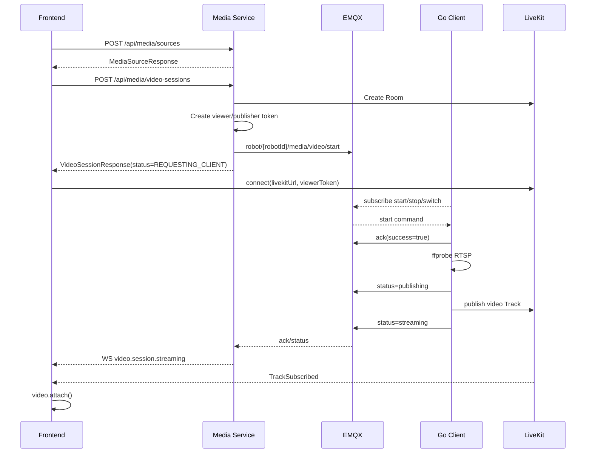
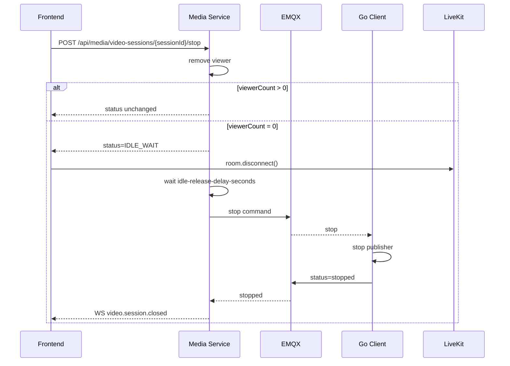

# 实时视频模块三端交互与接口文档

## 1. 适用范围

本文档描述实时视频模块当前实现中的前端、后端 Media Service、Go 云接入客户端、LiveKit、EMQX 之间的接口、事件和状态变化。

当前方案为方案 A：

```text
机器人侧 Go 云接入客户端直接接入 LiveKit，作为 publisher 发布视频 Track。
```

当前默认 RTSP 流地址：

```text
rtsp://192.168.124.204:8554/camera01
```

## 2. 参与方

| 参与方 | 职责 |
|---|---|
| 前端 Vue2 调试台 | 创建观看会话、加入 LiveKit Room、订阅 Track、停止观看、异常恢复、抓拍 |
| Media Service | 会话编排、LiveKit Token 签发、MQTT 指令下发、状态机维护、WebSocket 事件推送 |
| Go 云接入客户端 | 订阅 MQTT 指令、探测 RTSP、启动 GStreamer Publisher、发布 LiveKit Track、上报状态 |
| EMQX | 承载平台与机器人侧客户端的控制消息 |
| LiveKit | 实时媒体 Room/Track 转发 |
| MinIO | 抓拍图片对象存储 |

## 3. 枚举定义

### 3.1 视频通道 `VideoChannel`

| 值 | 说明 |
|---|---|
| `visible` | 可见光 |
| `thermal` | 热成像 |
| `fusion` | 融合通道，当前预留 |

### 3.2 清晰度 `VideoQuality`

| 值 | 说明 |
|---|---|
| `sub` | 视频墙低码流 |
| `main` | 单路详情高清码流 |
| `auto` | 自动，当前后端媒体源解析时按 `sub` 兜底 |

### 3.3 会话状态 `VideoSessionStatus`

| 状态 | 说明 |
|---|---|
| `INIT` | 会话已创建 |
| `REQUESTING_CLIENT` | 已向机器人客户端下发 start |
| `CLIENT_ACKED` | 客户端已 ACK |
| `ROOM_READY` | RTSP 探测通过或 Room 已准备 |
| `STREAMING` | 客户端上报正在推流 |
| `INTERRUPTED` | Track 或发布者中断 |
| `IDLE_WAIT` | 无观看者，等待延迟释放 |
| `STOPPING` | 正在释放机器人端推流 |
| `CLOSED` | 已关闭 |
| `TIMEOUT` | 超时 |
| `FAILED` | 失败 |

## 4. 通用 HTTP 约定

### 4.1 Base URL

开发环境：

```text
http://localhost:8090
```

前端开发服务器代理：

```text
/api      -> http://localhost:8088
/ws/media -> http://localhost:8088/ws/media
```

### 4.2 请求头

当前为 Mock 鉴权，请求头如下：

```http
X-User-Id: u1001
X-Org-Id: org001
X-Roles: MEDIA_VIEWER,MEDIA_OPERATOR
Content-Type: application/json
```

### 4.3 错误响应

当前异常统一由 `ApiExceptionHandler` 返回，典型结构：

```json
{
  "code": "BAD_REQUEST",
  "message": "Video session not found: vs_xxx"
}
```

## 5. REST 接口

### 5.1 保存媒体源

前端在开始播放前，可先保存 robot/device/channel/quality 对应 RTSP。

| 项 | 内容 |
|---|---|
| 请求方法 | `POST` |
| 请求路径 | `/api/media/sources` |
| 请求类型 | `application/json` |
| 调用方 | 前端 -> 后端 |

请求参数：

```json
{
  "robotId": "robot-001",
  "deviceId": "gimbal-001",
  "channel": "visible",
  "quality": "sub",
  "rtspUrl": "rtsp://192.168.124.204:8554/camera01",
  "enabled": true,
  "name": "robot-001-gimbal-001-visible-sub"
}
```

响应参数：

```json
{
  "sourceId": "src_xxx",
  "robotId": "robot-001",
  "deviceId": "gimbal-001",
  "channel": "visible",
  "quality": "sub",
  "rtspUrl": "rtsp://192.168.124.204:8554/camera01",
  "enabled": true,
  "name": "robot-001-gimbal-001-visible-sub",
  "createdAt": "2026-05-21T00:00:00Z",
  "updatedAt": "2026-05-21T00:00:00Z"
}
```

### 5.2 查询媒体源列表

| 项 | 内容 |
|---|---|
| 请求方法 | `GET` |
| 请求路径 | `/api/media/sources` |
| 请求类型 | Query |
| 调用方 | 前端 -> 后端 |

响应参数：

```json
[
  {
    "sourceId": "src_xxx",
    "robotId": "robot-001",
    "deviceId": "gimbal-001",
    "channel": "visible",
    "quality": "sub",
    "rtspUrl": "rtsp://192.168.124.204:8554/camera01",
    "enabled": true,
    "name": "robot-001-gimbal-001-visible-sub",
    "createdAt": "2026-05-21T00:00:00Z",
    "updatedAt": "2026-05-21T00:00:00Z"
  }
]
```

### 5.3 更新媒体源

| 项 | 内容 |
|---|---|
| 请求方法 | `PUT` |
| 请求路径 | `/api/media/sources/{sourceId}` |
| 请求类型 | `application/json` |
| 调用方 | 前端 -> 后端 |

请求体同 `POST /api/media/sources`。

### 5.4 删除媒体源

| 项 | 内容 |
|---|---|
| 请求方法 | `DELETE` |
| 请求路径 | `/api/media/sources/{sourceId}` |
| 请求类型 | Path |
| 调用方 | 前端 -> 后端 |

响应为空。

### 5.5 RTSP 探测

| 项 | 内容 |
|---|---|
| 请求方法 | `GET` |
| 请求路径 | `/api/media/rtsp/probe?url={rtspUrl}` |
| 请求类型 | Query |
| 调用方 | 前端/调试工具 -> 后端 |

响应参数：

```json
{
  "success": true,
  "url": "rtsp://192.168.124.204:8554/camera01",
  "codec": "h264",
  "width": 1920,
  "height": 1080,
  "message": "ok"
}
```

### 5.6 创建实时视频会话

| 项 | 内容 |
|---|---|
| 请求方法 | `POST` |
| 请求路径 | `/api/media/video-sessions` |
| 请求类型 | `application/json` |
| 调用方 | 前端 -> 后端 |

请求参数：

```json
{
  "robotId": "robot-001",
  "deviceId": "gimbal-001",
  "channel": "visible",
  "quality": "sub",
  "reuse": false,
  "clientRequestId": "optional-request-id"
}
```

参数说明：

| 字段 | 类型 | 必填 | 说明 |
|---|---|---:|---|
| `robotId` | string | 是 | 机器人 ID，必须与 Go 客户端 `ROBOT_ID` 一致 |
| `deviceId` | string | 是 | 上装设备 ID |
| `channel` | string | 是 | `visible` / `thermal` / `fusion` |
| `quality` | string | 是 | `sub` / `main` / `auto` |
| `reuse` | boolean | 否 | 是否复用同一路已有会话，调试阶段默认 `false` |
| `clientRequestId` | string | 否 | 前端请求幂等 ID，当前预留 |

响应参数：

```json
{
  "sessionId": "vs_xxx",
  "robotId": "robot-001",
  "deviceId": "gimbal-001",
  "channel": "visible",
  "quality": "sub",
  "status": "REQUESTING_CLIENT",
  "roomName": "media.robot-001.gimbal-001.visible",
  "livekitUrl": "ws://localhost:7880",
  "viewerToken": "eyJhbGciOiJIUzI1NiJ9...",
  "trackSid": null,
  "trackName": null,
  "viewerCount": 1,
  "lastErrorCode": null,
  "lastErrorMessage": null,
  "createdAt": "2026-05-21T00:00:00Z",
  "updatedAt": "2026-05-21T00:00:00Z"
}
```

前端收到响应后应立即：

1. 保存 `sessionId`。
2. 使用 `livekitUrl + viewerToken` 连接 LiveKit。
3. 等待 `TrackSubscribed`。
4. 监听 `/ws/media` 推送的状态变化。

### 5.7 查询当前用户最近会话

| 项 | 内容 |
|---|---|
| 请求方法 | `GET` |
| 请求路径 | `/api/media/video-sessions` |
| 请求类型 | Query |
| 调用方 | 前端 -> 后端 |

响应为 `VideoSessionResponse[]`。

### 5.8 查询活跃视频墙会话

| 项 | 内容 |
|---|---|
| 请求方法 | `GET` |
| 请求路径 | `/api/media/video-sessions/active` |
| 请求类型 | Query |
| 调用方 | 前端 -> 后端 |

响应为最多 16 条 `VideoSessionResponse[]`。

### 5.9 查询单个会话

| 项 | 内容 |
|---|---|
| 请求方法 | `GET` |
| 请求路径 | `/api/media/video-sessions/{sessionId}` |
| 请求类型 | Path |
| 调用方 | 前端 -> 后端 |

响应为 `VideoSessionResponse`，并会重新签发 viewer token。

### 5.10 重新签发观看 Token

| 项 | 内容 |
|---|---|
| 请求方法 | `POST` |
| 请求路径 | `/api/media/video-sessions/{sessionId}/token` |
| 请求类型 | Path |
| 调用方 | 前端 -> 后端 |

响应参数：

```json
{
  "livekitUrl": "ws://localhost:7880",
  "roomName": "media.robot-001.gimbal-001.visible",
  "token": "eyJhbGciOiJIUzI1NiJ9...",
  "expiresAt": "2026-05-21T00:10:00Z"
}
```

使用场景：

```text
前端页面刷新
LiveKit token 过期
断线恢复后重新加入 Room
```

### 5.11 停止观看

| 项 | 内容 |
|---|---|
| 请求方法 | `POST` |
| 请求路径 | `/api/media/video-sessions/{sessionId}/stop` |
| 请求类型 | Path |
| 调用方 | 前端 -> 后端 |

响应参数：

```json
{
  "sessionId": "vs_xxx",
  "status": "IDLE_WAIT",
  "viewerCount": 0,
  "livekitUrl": "ws://localhost:7880",
  "viewerToken": null
}
```

逻辑说明：

```text
当前用户离开 -> viewerCount - 1
viewerCount > 0 -> 仅更新观看人数，不停止机器人端推流
viewerCount = 0 -> 状态进入 IDLE_WAIT
IDLE_WAIT 超过 idle-release-delay-seconds -> 后端下发 MQTT stop
```

前端注意：

```text
用户主动点击停止时，必须设置本地 stopping=true。
LiveKit Disconnected 回调由主动停止触发时，不允许调用 restart。
```

### 5.12 断线恢复/重启推流

| 项 | 内容 |
|---|---|
| 请求方法 | `POST` |
| 请求路径 | `/api/media/video-sessions/{sessionId}/restart` |
| 请求类型 | Path |
| 调用方 | 前端 -> 后端 |

响应参数：

```json
{
  "sessionId": "vs_xxx",
  "status": "REQUESTING_CLIENT",
  "viewerCount": 1,
  "roomName": "media.robot-001.gimbal-001.visible",
  "livekitUrl": "ws://localhost:7880",
  "viewerToken": null
}
```

后端行为：

```text
补充当前用户 viewer
viewerCount 重新计算
重新创建/确认 LiveKit Room
重新签发 publisher token
重新下发 MQTT start
状态变更 REQUESTING_CLIENT
```

前端调用条件：

```text
仅在非用户主动停止场景调用
仅当当前 session.status 为 STREAMING 或 INTERRUPTED 时调用
需要 restarting 防抖锁，避免循环请求
建议 5 秒内最多一次
```

前端断线恢复伪代码：

```js
onTrackUnsubscribed() {
  hasVideo = false
  restartCurrentSession()
}

onLiveKitDisconnected() {
  hasVideo = false
  if (!stopping) {
    restartCurrentSession()
  }
}

async function restartCurrentSession() {
  if (stopping) return
  if (!session || session.status === 'CLOSED') return
  if (!['STREAMING', 'INTERRUPTED'].includes(session.status)) return
  if (restarting) return
  restarting = true
  await POST /api/media/video-sessions/{sessionId}/restart
  setTimeout(() => restarting = false, 5000)
}
```

### 5.13 切换通道

| 项 | 内容 |
|---|---|
| 请求方法 | `POST` |
| 请求路径 | `/api/media/video-sessions/{sessionId}/switch-channel` |
| 请求类型 | `application/json` |
| 调用方 | 前端 -> 后端 |

请求参数：

```json
{
  "channel": "thermal",
  "quality": "sub"
}
```

响应参数：

```json
{
  "sessionId": "vs_xxx",
  "channel": "thermal",
  "quality": "sub",
  "status": "REQUESTING_CLIENT",
  "roomName": "media.robot-001.gimbal-001.thermal"
}
```

后端行为：

```text
更新 session.channel / quality / roomName
创建/确认新 Room
签发新的 publisher token
下发 MQTT switch-channel
客户端按新通道重新拉 RTSP 并发布 Track
```

### 5.14 抓拍

| 项 | 内容 |
|---|---|
| 请求方法 | `POST` |
| 请求路径 | `/api/media/video-sessions/{sessionId}/snapshots` |
| 请求类型 | `application/json` |
| 调用方 | 前端 -> 后端 |

请求参数：

```json
{
  "trackSid": "TR_xxx",
  "reason": "manual_abnormal",
  "remark": "调试台手动抓拍",
  "clientCapturedAt": "2026-05-21T00:00:00+08:00",
  "clientPreviewObjectKey": null,
  "previewImageHash": "123456"
}
```

响应参数：

```json
{
  "snapshotId": "snap_xxx",
  "status": "PROCESSING",
  "mode": "livekit_track",
  "previewAccepted": false,
  "officialObjectKey": null,
  "previewObjectKey": null,
  "errorCode": null,
  "errorMessage": null,
  "officialCapturedAt": null,
  "createdAt": "2026-05-21T00:00:00Z"
}
```

后续由 `SnapshotWorkerScheduler` 使用 ffmpeg 从 RTSP 截帧并写入 MinIO。

### 5.15 查询抓拍列表

| 项 | 内容 |
|---|---|
| 请求方法 | `GET` |
| 请求路径 | `/api/media/video-sessions/{sessionId}/snapshots` |
| 请求类型 | Path |
| 调用方 | 前端 -> 后端 |

响应为 `SnapshotResponse[]`。

### 5.16 查询事件日志

| 项 | 内容 |
|---|---|
| 请求方法 | `GET` |
| 请求路径 | `/api/media/video-sessions/{sessionId}/events` |
| 请求类型 | Path |
| 调用方 | 前端 -> 后端 |

响应参数：

```json
[
  {
    "eventId": "evt_xxx",
    "sessionId": "vs_xxx",
    "eventType": "video.session.streaming",
    "eventPayload": "{\"sessionId\":\"vs_xxx\"}",
    "traceId": null,
    "createdAt": "2026-05-21T00:00:00Z"
  }
]
```

### 5.17 查询 Track 列表

| 项 | 内容 |
|---|---|
| 请求方法 | `GET` |
| 请求路径 | `/api/media/video-sessions/{sessionId}/tracks` |
| 请求类型 | Path |
| 调用方 | 前端 -> 后端 |

响应参数：

```json
[
  {
    "trackId": "track_xxx",
    "sessionId": "vs_xxx",
    "trackSid": "TR_xxx",
    "trackName": "video.visible.sub",
    "participantIdentity": "robot:robot-001:gimbal-001",
    "kind": "video",
    "channel": "visible",
    "quality": "sub",
    "publishedAt": "2026-05-21T00:00:00Z",
    "unpublishedAt": null
  }
]
```

## 6. WebSocket 事件

### 6.1 连接地址

| 项 | 内容 |
|---|---|
| 协议 | WebSocket |
| 路径 | `/ws/media` |
| 开发地址 | `ws://localhost:8090/ws/media` |
| 实际后端 | `ws://localhost:8088/ws/media` |

### 6.2 推送格式

```json
{
  "event": "video.session.streaming",
  "data": {
    "sessionId": "vs_xxx",
    "status": "STREAMING"
  },
  "timestamp": "2026-05-21T00:00:00+08:00"
}
```

### 6.3 当前事件类型

| 事件 | 触发时机 |
|---|---|
| `video.session.created` | 后端创建业务会话 |
| `video.room.ready` | LiveKit Room 创建或客户端上报 publishing |
| `video.client.requested` | 后端下发 MQTT start |
| `video.client.acked` | 客户端 ACK |
| `video.session.streaming` | 客户端上报 streaming |
| `video.track.published` | LiveKit webhook 上报 Track published |
| `video.session.interrupted` | Track 中断、发布者离开 |
| `video.session.failed` | RTSP、发布、超时等失败 |
| `video.session.stopping` | 后端准备释放空闲会话 |
| `video.session.closed` | 会话关闭 |
| `video.session.restart` | 前端主动请求 restart |
| `video.session.auto_restart` | 后端自动 restart |
| `video.client.online_restart` | 客户端上线触发 restart |
| `snapshot.requested` | 创建抓拍任务 |
| `snapshot.completed` | 抓拍完成 |
| `snapshot.failed` | 抓拍失败 |

## 7. MQTT 接口

### 7.1 后端下发 start

| 项 | 内容 |
|---|---|
| Topic | `robot/{robotId}/media/video/start` |
| QoS | 1 |
| 方向 | 后端 -> Go 客户端 |
| Payload | JSON |

Payload：

```json
{
  "commandId": "cmd_xxx",
  "sessionId": "vs_xxx",
  "robotId": "robot-001",
  "deviceId": "gimbal-001",
  "channel": "visible",
  "quality": "sub",
  "livekitUrl": "ws://localhost:7880",
  "roomName": "media.robot-001.gimbal-001.visible",
  "publisherToken": "eyJhbGciOiJIUzI1NiJ9...",
  "publishIdentity": "robot:robot-001:gimbal-001",
  "rtspUrl": "rtsp://192.168.124.204:8554/camera01",
  "expiresAt": "2026-05-21T00:10:00Z"
}
```

Go 客户端行为：

```text
解析 command
上报 ACK
ffprobe 探测 rtspUrl
启动 gstreamer-publisher 连接 LiveKit
上报 publishing / streaming / failed
```

### 7.2 后端下发 stop

| 项 | 内容 |
|---|---|
| Topic | `robot/{robotId}/media/video/stop` |
| QoS | 1 |
| 方向 | 后端 -> Go 客户端 |
| Payload | JSON |

Payload：

```json
{
  "commandId": "cmd_xxx",
  "sessionId": "vs_xxx",
  "roomName": "media.robot-001.gimbal-001.visible"
}
```

Go 客户端行为：

```text
停止当前 publisher 进程
上报 status=stopped
```

### 7.3 后端下发 switch-channel

| 项 | 内容 |
|---|---|
| Topic | `robot/{robotId}/media/video/switch-channel` |
| QoS | 1 |
| 方向 | 后端 -> Go 客户端 |
| Payload | JSON |

Payload 当前与 start 一致：

```json
{
  "commandId": "cmd_xxx",
  "sessionId": "vs_xxx",
  "robotId": "robot-001",
  "deviceId": "gimbal-001",
  "channel": "thermal",
  "quality": "sub",
  "livekitUrl": "ws://localhost:7880",
  "roomName": "media.robot-001.gimbal-001.thermal",
  "publisherToken": "eyJhbGciOiJIUzI1NiJ9...",
  "publishIdentity": "robot:robot-001:gimbal-001",
  "rtspUrl": "rtsp://192.168.124.204:8554/camera01",
  "expiresAt": "2026-05-21T00:10:00Z"
}
```

Go 客户端行为：

```text
停止旧 publisher
按新通道拉流
重新发布 Track
上报 streaming
```

### 7.4 客户端 ACK

| 项 | 内容 |
|---|---|
| Topic | `robot/{robotId}/media/video/ack` |
| QoS | 1 |
| 方向 | Go 客户端 -> 后端 |
| Payload | JSON |

Payload：

```json
{
  "commandId": "cmd_xxx",
  "sessionId": "vs_xxx",
  "success": true,
  "message": "accepted",
  "timestamp": "2026-05-21T00:00:00+08:00"
}
```

后端状态变化：

```text
success=true  -> CLIENT_ACKED
success=false -> FAILED
```

### 7.5 客户端媒体状态

| 项 | 内容 |
|---|---|
| Topic | `robot/{robotId}/media/video/status` |
| QoS | 1 |
| 方向 | Go 客户端 -> 后端 |
| Payload | JSON |

Payload：

```json
{
  "sessionId": "vs_xxx",
  "status": "streaming",
  "trackSid": "TR_vs_xxx",
  "trackName": "video.visible.sub",
  "errorCode": null,
  "message": "track published",
  "timestamp": "2026-05-21T00:00:00+08:00"
}
```

支持的 status：

| status | 后端状态 |
|---|---|
| `ack` / `acked` | `CLIENT_ACKED` |
| `room_ready` / `publishing` | `ROOM_READY` |
| `streaming` / `track_published` | `STREAMING` |
| `interrupted` | `INTERRUPTED` |
| `stopped` / `closed` | `CLOSED` |
| `failed` / `error` | `FAILED` |

常见错误码：

| errorCode | 说明 |
|---|---|
| `RTSP_PROBE_FAILED` | ffprobe 探测失败 |
| `PUBLISH_FAILED` | gstreamer-publisher 启动或推流失败 |
| `CLIENT_ACK_FAILED` | 客户端拒绝指令 |
| `CLIENT_ACK_TIMEOUT` | 后端等待 ACK 超时 |
| `LK_PUBLISH_TIMEOUT` | 等待 Track 发布超时 |
| `TRACK_INTERRUPTED_TIMEOUT` | Track 中断恢复超时 |

### 7.6 客户端在线状态

| 项 | 内容 |
|---|---|
| Topic | `robot/{robotId}/media/client/status` |
| QoS | 1 |
| 方向 | Go 客户端 -> 后端 |
| Payload | JSON |

Payload：

```json
{
  "robotId": "robot-001",
  "clientId": "robot-media-client",
  "status": "online",
  "timestamp": "2026-05-21T00:00:00+08:00"
}
```

支持状态：

| status | 说明 |
|---|---|
| `online` | 客户端上线或重连 |
| `offline` | 客户端正常退出时上报 |

后端收到 `online` 后：

```text
查询该 robotId 下 viewerCount > 0 且状态为 INTERRUPTED / FAILED / TIMEOUT 的会话
对这些会话重新下发 start
事件为 video.client.online_restart
```

## 8. LiveKit 交互

### 8.1 前端加入 Room

前端使用 `VideoSessionResponse` 中的：

```text
livekitUrl
viewerToken
roomName
```

调用 LiveKit JS SDK：

```js
await room.connect(session.livekitUrl, session.viewerToken)
```

监听事件：

| LiveKit 事件 | 前端行为 |
|---|---|
| `TrackSubscribed` | `track.attach(video)`，显示画面 |
| `TrackUnsubscribed` | `track.detach()`，标记无画面，触发恢复判断 |
| `Disconnected` | 标记无画面，非主动停止时触发恢复判断 |

### 8.2 Go 客户端发布 Track

当前默认通过 `gstreamer-publisher`：

```text
gstreamer-publisher --url {livekitUrl} --token {publisherToken} -- {pipeline}
```

默认 pipeline：

```text
rtspsrc location={rtsp} protocols=tcp latency=100 ! queue ! rtph264depay ! h264parse config-interval=1
```

### 8.3 LiveKit Webhook

| 项 | 内容 |
|---|---|
| 请求方法 | `POST` |
| 请求路径 | `/api/internal/livekit/webhook` |
| 请求类型 | `application/json` |
| 调用方 | LiveKit -> 后端 |

可选请求头：

```http
X-LiveKit-Webhook-Token: configured-token
```

当前处理事件：

| event | 后端行为 |
|---|---|
| `track_published` | `STREAMING` |
| `track_unpublished` | `INTERRUPTED` |
| `participant_left` | robot participant 离开时 `INTERRUPTED` |
| `room_finished` | `CLOSED` |

## 9. 正常播放完整流程



状态变化：

```text
INIT -> REQUESTING_CLIENT -> CLIENT_ACKED -> ROOM_READY -> STREAMING
```

## 10. 主动停止流程



前端规则：

```text
点击停止前设置 stopping=true
stop 接口返回后主动 room.disconnect()
Disconnected 回调中如果 stopping=true，不允许请求 restart
```

## 11. 客户端断联恢复流程

### 11.1 Go 客户端被停止

可能情况：

```text
进程正常退出 -> 尝试上报 offline
进程被 kill / 机器断电 / 网络断开 -> 可能无法上报 offline
LiveKit 会触发 TrackUnsubscribed 或 Disconnected
```

前端处理：

```text
TrackUnsubscribed 或 Disconnected
hasVideo=false
如果不是 stopping，且 session.status 为 STREAMING/INTERRUPTED
调用 POST /api/media/video-sessions/{sessionId}/restart
```

后端处理：

```text
重新签发 publisher token
重新下发 MQTT start
状态置为 REQUESTING_CLIENT
```

如果此时 Go 客户端还未上线：

```text
MQTT start 不会被消费
后端等待 ACK 超时后可能进入 FAILED/TIMEOUT
```

### 11.2 Go 客户端重新启动

Go 客户端启动后：

```text
连接 EMQX
订阅 start/stop/switch-channel
发布 robot/{robotId}/media/client/status online
```

后端收到 online：

```text
查询该 robotId 有观看者且状态为 INTERRUPTED/FAILED/TIMEOUT 的会话
重新调用 restartSession
重新下发 start
```

Go 客户端收到 start 后：

```text
重新探测 RTSP
重新发布 LiveKit Track
上报 streaming
```

前端收到恢复事件：

```text
WS video.session.streaming
如果 LiveKit room 已断开，则重新 connect
等待 TrackSubscribed 后恢复画面
```

## 12. 异常流程

### 12.1 RTSP 探测失败

Go 客户端：

```json
{
  "sessionId": "vs_xxx",
  "status": "failed",
  "errorCode": "RTSP_PROBE_FAILED",
  "message": "exit status 1",
  "timestamp": "2026-05-21T00:00:00+08:00"
}
```

后端：

```text
状态置为 FAILED
推送 WS video.session.failed
```

前端：

```text
显示错误日志
不应重复 restart，除非用户手动点击开始观看或客户端重新 online 后触发恢复
```

### 12.2 发布器启动失败

Go 客户端：

```json
{
  "sessionId": "vs_xxx",
  "status": "failed",
  "errorCode": "PUBLISH_FAILED",
  "message": "publisher exited",
  "timestamp": "2026-05-21T00:00:00+08:00"
}
```

后端：

```text
状态置为 FAILED
推送 WS video.session.failed
```

常见原因：

```text
gstreamer-publisher 未安装
GStreamer pipeline 错误
LiveKit URL 不通
publisher token 过期
RTSP 编码不是当前 pipeline 支持的 H264
```

### 12.3 客户端 ACK 超时

后端条件：

```text
状态 REQUESTING_CLIENT 超过 client-ack-timeout-seconds
```

后端行为：

```text
状态置为 FAILED/TIMEOUT
事件 video.session.failed
errorCode=CLIENT_ACK_TIMEOUT
```

### 12.4 Track 发布超时

后端条件：

```text
状态 CLIENT_ACKED 或 ROOM_READY 超过 track-publish-timeout-seconds
```

后端行为：

```text
errorCode=LK_PUBLISH_TIMEOUT
```

### 12.5 Track 中断

触发来源：

```text
LiveKit webhook track_unpublished
LiveKit webhook participant_left 且 identity 以 robot: 开头
客户端主动上报 interrupted
```

后端行为：

```text
状态置为 INTERRUPTED
如果 viewerCount > 0，定时器后续会尝试 restart
```

前端行为：

```text
TrackUnsubscribed/Disconnected 后调用 restart
```

## 13. 前端当前推荐状态控制

前端至少维护：

| 字段 | 说明 |
|---|---|
| `session` | 当前 VideoSessionResponse |
| `room` | LiveKit Room 实例 |
| `hasVideo` | 是否已 attach 视频 Track |
| `stopping` | 是否用户主动停止 |
| `restarting` | 是否正在恢复请求中 |
| `wsConnected` | 业务 WebSocket 连接状态 |

推荐规则：

```text
开始观看:
  POST create
  保存 session
  connect LiveKit

收到 WS:
  如果 data.sessionId 等于当前 sessionId
  且 data 包含 status
  同步 session

TrackSubscribed:
  hasVideo=true
  attach video

TrackUnsubscribed:
  hasVideo=false
  如果非 stopping，触发 restartCurrentSession

Disconnected:
  hasVideo=false
  如果非 stopping，触发 restartCurrentSession

停止观看:
  stopping=true
  POST stop
  room.disconnect()
  session=stop response
  stopping=false

恢复:
  只在 session.status 属于 STREAMING/INTERRUPTED 时调用
  5 秒内最多一次
```

## 14. Go 客户端当前推荐状态控制

启动：

```text
Load env
Connect MQTT
Subscribe start/stop/switch-channel
Publish client/status online
Wait
```

收到 start：

```text
Unmarshal StartCommand
ACK success
Resolve RTSP URL
ffprobe
status=publishing
Start gstreamer-publisher
status=streaming
```

收到 stop：

```text
Stop publisher
status=stopped
```

MQTT 断开：

```text
Stop publisher
等待自动重连
重连后上报 online
```

退出：

```text
Stop publisher
Publish client/status offline
Disconnect MQTT
```

## 15. 当前调试接口

仅开发联调用：

| 方法 | 路径 | 说明 |
|---|---|---|
| `POST` | `/api/media/video-sessions/{sessionId}/_mock/client-acked` | 模拟客户端 ACK |
| `POST` | `/api/media/video-sessions/{sessionId}/_mock/track-published/{trackSid}` | 模拟 Track 已发布 |

生产环境应关闭或通过权限限制。

## 16. 当前关键配置

后端：

```yaml
media:
  livekit:
    url: ws://localhost:7880
  mqtt:
    broker-url: tcp://localhost:1883
    enabled: true
  rtsp:
    default-url: rtsp://192.168.124.204:8554/camera01
  session:
    client-ack-timeout-seconds: 10
    track-publish-timeout-seconds: 20
    interrupted-grace-seconds: 15
    idle-release-delay-seconds: 600
```

Go 客户端：

```bash
export ROBOT_ID='robot-001'
export MQTT_BROKER_URL='tcp://localhost:1883'
export GSTREAMER_PUBLISHER_PATH="$HOME/.local/bin/gstreamer-publisher"
export GSTREAMER_PIPELINE='rtspsrc location={rtsp} protocols=tcp latency=100 ! queue ! rtph264depay ! h264parse config-interval=1'
```

## 17. 联调验收清单

正常播放：

```text
前端 CLICK startSession
后端 create video session
后端 MQTT published topic=robot/robot-001/media/video/start
Go 客户端 video start
Go 客户端 publisher command
前端 WS video.session.streaming
前端 LiveKit TrackSubscribed
画面出现
```

主动停止：

```text
前端 POST stop
前端不请求 restart
Go 客户端收到 video stop
画面消失
```

客户端断联恢复：

```text
观看中停止 Go 客户端
前端 TrackUnsubscribed 或 Disconnected
前端 POST restart
重新启动 Go 客户端
Go 客户端 online
后端重新 MQTT start
Go 客户端 video start
前端 TrackSubscribed
画面恢复
```

异常：

```text
RTSP 不通 -> RTSP_PROBE_FAILED
发布器异常 -> PUBLISH_FAILED
客户端未启动 -> CLIENT_ACK_TIMEOUT
LiveKit 未发布 -> LK_PUBLISH_TIMEOUT
```
