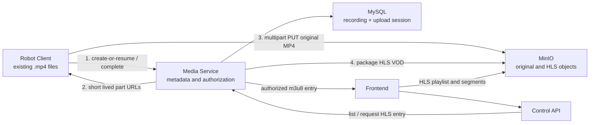
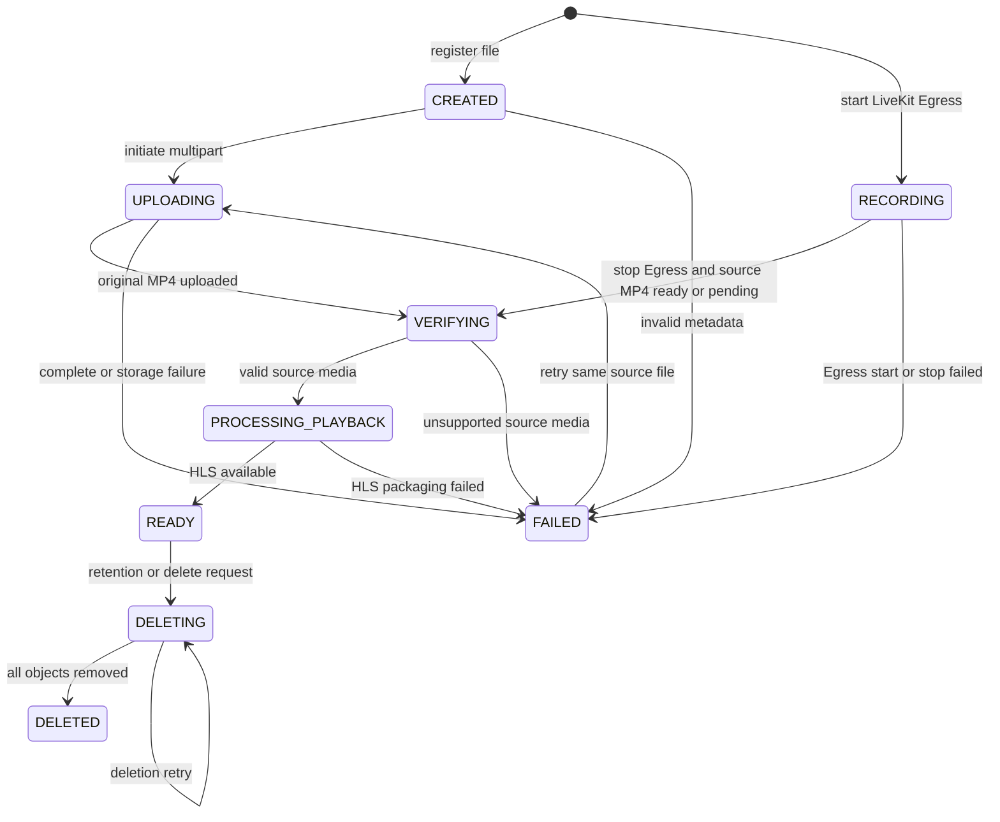

# 巡逻视频上传与播放方案

> 状态：已废弃，仅作为历史设计参考。
>
> 当前实现已统一为通用文件上传、存储与播放方案，录像、抓拍、任务产物、日志、配置和其他附件均使用 `media_file` / `media_file_upload` / `media_video_file` 以及 `/api/media/files`、`/api/control/files` 接口。请以 [通用文件上传、存储与播放方案](./file-upload-design.md) 为准。旧的 `/api/media/recording-uploads`、`/api/media/recordings`、`/api/control/recordings`、`media.recording.*` 配置和 `recording/` 后端模块已移除。

## 1. 范围

机器人端已经生成巡逻视频文件，单文件时长可能从几分钟到数小时不等。平台也支持在实时视频观看过程中由控制端发起 LiveKit Egress 录像。两类来源最终都落到统一的录像元数据、对象存储和 HLS VOD 回放资产模型。本方案解决：

1. 机器人可靠上传已有大视频文件。
2. 上传中断后续传，避免从头重传。
3. 多机器人、单机器人多个文件同时上传时的资源控制。
4. 实时视频会话中的手动录像控制、Egress 资源收尾和发起端归属。
5. 原始视频存储、HLS 播放资产生成、元数据检索和多端播放。

本期不负责机器人本地录制策略、缩略图和 AI 分析。实时手动录像绑定到 `VideoSession`，但正式回放不直接使用 live HLS，而是先生成源 MP4，再复用本文定义的 HLS VOD 播放资产模型。

## 2. 方案结论

```text
机器人已有 MP4 文件
  -> Media Service 注册录像并创建 multipart upload
  -> Media Service 签发短效分片上传 URL
  -> 机器人分片直传 MinIO 保存原始 MP4
  -> Media Service 完成合并并生成 HLS 播放资产
  -> HLS 准备完成后将录像置为 READY
  -> 平台查询录像元数据
  -> Media Service 返回受控 HLS 播放入口
  -> 浏览器/移动端播放 HLS
```

```text
浏览器在实时 VideoSession 上点击录像
  -> Media Service 创建 LIVEKIT_EGRESS 录像记录并保存 startedClientId
  -> LiveKit Egress 将当前 Room 录制为 original/source.mp4
  -> 同一路视频已有 RECORDING 时拒绝重复开始并提示“当前视频正在录制中”
  -> 发起浏览器点击停录/停止观看，或其 viewer 心跳超时后，Media Service 停止该 Egress
  -> 录像进入 VERIFYING / PROCESSING_PLAYBACK
  -> HLS 准备完成后将录像置为 READY
```

核心决策：

| 项目 | 方案 |
|---|---|
| 源文件格式 | 机器人上传并保留 H.264/AAC MP4 原始对象 |
| 大文件上传 | MinIO/S3 Multipart Upload，机器人直接上传数据 |
| 断点续传 | 服务端保存 upload 会话，恢复时从 MinIO 查询已完成 part |
| 元数据模型 | `media_recording` + `media_recording_upload` 两张表 |
| part 明细表 | 首期不建，以 MinIO `ListParts` 为实际上传进度来源 |
| 视频存储 | MinIO 同时保存 `original/` 原始 MP4 与 `hls/` 播放资产 |
| 播放 | 统一采用 HLS VOD：`m3u8 + ts` |
| 并发控制 | 限制每机器人活跃文件数和单文件并行 part 数 |
| 实时录像并发 | 同一 `VideoSession` 同时只允许一条 `LIVEKIT_EGRESS` 录像 |
| 机器人接入安全 | 首期采用机器人专网可信接入，不依赖设备 token；接口不得暴露至公网 |
| Control 边界 | 上传入口属于 Media Service；管理端查询/播放经 Control 转发 |

这个范围比“整文件经后端上传”多出 multipart 上传会话、实时 Egress 源文件生成和 HLS 播放资产生成，但这是变长大文件可靠回传、未来多端统一播放与复用同一播放技术所需的主链路。

## 3. 与当前工程的衔接

| 当前能力 | 本方案改造 |
|---|---|
| `MinioStorageService` 已用于抓拍小对象上传 | 保留现有方法，新增 `RecordingObjectStorageService` 承担 multipart、列出 parts 与 HLS 对象访问 |
| MySQL + JPA | 新增录像及上传会话实体 |
| Control/Media 已通过 `/internal/media/**` 分层 | 查询、HLS 播放入口由 Control 调 Media；机器人上传直接请求 Media |
| Go 客户端已随机器人部署 | 增加文件 uploader 与本地待上传清单，不影响 LiveKit/MQTT |
| Nginx 当前代理页面/API/LiveKit | 上传字节直达 MinIO 后，不需让 Nginx/Spring 承载 GB 级请求 |
| LiveKit / MQTT | 本文机器人上传链路不经过这两个组件；未来其他来源只需写入同一 HLS 播放资产模型 |

## 4. 架构



### 4.1 数据面与控制面

| 类型 | 经过 Media Service 的数据 | 不经过 Media Service 的数据 |
|---|---|---|
| 上传控制面 | 文件元数据、创建上传、获取 URL、查询 part、完成上传 | - |
| 上传数据面 | - | 视频分片字节：机器人 -> MinIO |
| 播放控制面 | 列表查询、权限检查、HLS 播放入口签发 | - |
| 播放数据面 | - | HLS playlist/segment 字节：播放器 -> 受控对象访问路径 |

上传正文不经过 Media Service。HLS 播放正文应优先由 Nginx 鉴权媒体入口或后续 CDN 读取 MinIO 返回，Media Service 只参与播放授权；低并发联调阶段允许由应用代理播放路径。

## 5. 存储设计

### 5.1 视频对象存储

继续使用 MinIO bucket `robot-media`。机器人上传的 MP4 作为原始对象保存，HLS 作为统一播放资产保存：

```text
recordings/{orgId}/{robotId}/{deviceId}/{yyyy}/{MM}/{dd}/{recordingId}/original/source.mp4
recordings/{orgId}/{robotId}/{deviceId}/{yyyy}/{MM}/{dd}/{recordingId}/hls/index.m3u8
recordings/{orgId}/{robotId}/{deviceId}/{yyyy}/{MM}/{dd}/{recordingId}/hls/segment_000001.ts
```

示例：

```text
recordings/org001/robot-001/camera01/2026/05/27/rec_9f8e/original/source.mp4
recordings/org001/robot-001/camera01/2026/05/27/rec_9f8e/hls/index.m3u8
```

规则：

1. `objectKey` 由 Media Service 生成，机器人只能上传到服务端授权的对象。
2. 一个本地 MP4 对应一个 `recordingId` 和一个原始对象，不要求机器人上传 HLS 文件。
3. 所有正式回放以 `hls/index.m3u8` 为入口，原始 MP4 用于归档、重处理和问题排查。
4. 本方案采用与未来统一输出兼容的 HLS VOD `m3u8 + ts` 对象组织。
5. Multipart 临时 part 由 MinIO 管理；HLS 生成完成前录像不可播放。
6. 上传失败或长时间未完成的 multipart 由定时清理任务 abort。

### 5.2 元数据存储

#### `media_recording`

一行代表一个完整巡逻视频文件。

| 字段 | 类型 | 说明 |
|---|---|---|
| `recording_id` | varchar(64) PK | `rec_<uuid>` |
| `org_id` | varchar(64) | 组织隔离 |
| `robot_id` | varchar(64) | 上传机器人 |
| `device_id` | varchar(64) | 摄像头/设备 |
| `source_file_id` | varchar(128) | 源文件唯一标识。机器人上传使用本地文件标识；实时录像使用 `livekit-egress:{sessionId}:{epochSecond}` |
| `source_type` | varchar(32) | 来源类型：`ROBOT_UPLOAD` / `LIVEKIT_EGRESS` |
| `session_id` | varchar(64) nullable | 实时录像关联的 `VideoSession` |
| `room_name` | varchar(128) nullable | 实时录像关联的 LiveKit Room |
| `track_sid` | varchar(128) nullable | 实时录像开始时关联的视频 Track |
| `egress_id` / `egress_status` | varchar nullable | LiveKit Egress 任务 ID 与最后状态 |
| `started_client_id` | varchar(128) nullable | 发起实时录像的浏览器 `X-Client-Id`，用于手动停录和心跳超时自动收尾 |
| `file_name` | varchar(256) | 展示文件名 |
| `source_content_type` | varchar(64) | 机器人源文件类型，首期 `video/mp4` |
| `video_codec` / `audio_codec` | varchar(32) nullable | 源媒体检查结果，目标为 `h264` / `aac` 或无音频 |
| `file_size` | bigint | 文件总字节数 |
| `sha256` | char(64) nullable | 客户端可选上报，完成后用于完整性校验扩展 |
| `recorded_started_at` | datetime nullable | 录制开始时间，由机器人上报 |
| `recorded_ended_at` | datetime nullable | 录制结束时间，实时录像停录时写入 |
| `reported_duration_seconds` | int nullable | 机器人上报时长，仅作上传前参考 |
| `duration_seconds` | int nullable | 服务端媒体检查确认后的时长，用于检索和播放展示 |
| `source_object_key` | varchar(512) | MinIO 原始 MP4 对象键 |
| `hls_playlist_object_key` | varchar(512) nullable | HLS `index.m3u8` 对象键 |
| `hls_segment_count` | int nullable | 生成的 HLS 分片数量，用于容量与排障统计 |
| `hls_total_size` | bigint nullable | HLS 资产总字节数 |
| `playback_format` | varchar(16) | 固定 `HLS` |
| `status` | varchar(24) | `CREATED` / `UPLOADING` / `VERIFYING` / `PROCESSING_PLAYBACK` / `READY` / `FAILED` / `DELETING` / `DELETED` |
| `error_code` / `error_message` | varchar | 最后失败信息 |
| `created_at` / `updated_at` / `uploaded_at` | datetime | 上传状态时间 |
| `processing_started_at` / `processing_completed_at` | datetime nullable | HLS 处理耗时统计 |
| `processing_lease_until` | datetime nullable | worker 处理租约；超时任务可被安全重新领取 |

索引：

```text
unique(robot_id, source_file_id)
index(org_id, robot_id, recorded_started_at)
index(org_id, device_id, recorded_started_at)
index(status, updated_at)
```

`sourceFileId` 是上传幂等的关键。机器人对同一本地视频重试注册时必须传相同值，例如本地巡逻任务 ID 与文件路径哈希组合。

#### `media_recording_upload`

只保存当前 multipart 会话，不逐条保存 part。

| 字段 | 类型 | 说明 |
|---|---|---|
| `upload_id` | varchar(64) PK | 平台上传会话 ID，`upl_<uuid>` |
| `recording_id` | varchar(64) | 对应录像 |
| `storage_upload_id` | varchar(256) | MinIO multipart upload ID |
| `part_size` | bigint | 固定分片大小 |
| `part_count` | int | 根据文件尺寸计算 |
| `status` | varchar(16) | `ACTIVE` / `COMPLETED` / `ABORTED` / `EXPIRED` |
| `expires_at` | datetime | 未完成会话过期时间 |
| `last_active_at` | datetime | 最近获取 URL/查询/完成时间 |
| `created_at` / `completed_at` | datetime | 会话时间 |

为什么不建 part 表：

1. MinIO 已保存 multipart 的 part 与 ETag，是完成合并的权威来源。
2. 客户端可在本地保存已上传 part，服务端恢复接口通过 MinIO `ListParts` 返回当前事实。
3. 首期减少数据库写放大，尤其适合多机器人并发上传。

## 6. 状态

### 6.1 录像状态



### 6.2 上传会话状态

| 状态 | 含义 |
|---|---|
| `ACTIVE` | 可上传或续传 parts |
| `COMPLETED` | MinIO 已合并为原始 MP4 对象 |
| `ABORTED` | 主动取消或录像失败 |
| `EXPIRED` | 超时清理后不可继续使用 |

只有录像 `READY` 状态可以出现在普通播放结果中。

### 6.3 实时录像状态与资源收尾

实时录像不把 LiveKit live HLS 直接作为回放入口。开始录像时，Media Service 调用 LiveKit RoomComposite Egress 输出 MP4 到 `original/source.mp4`；停录后进入 `VERIFYING`，由同一套 HLS worker 生成 VOD HLS，完成后才进入 `READY`。

实时录像收尾规则：

1. 同一 `VideoSession` 同一时间只允许一条 `LIVEKIT_EGRESS` 且 `RECORDING` 的录像。
2. 开始录像时必须保存 `startedClientId = X-Client-Id`。
3. 同一路视频已有录像时，新的开始请求返回 `RECORDING_ALREADY_ACTIVE`，前端提示“当前视频正在录制中”。
4. 发起浏览器点击“停录”或“停止观看”时，后端只允许同一 `startedClientId` 停止该录像。
5. 发起浏览器关闭、刷新、崩溃或断网时，viewer 心跳超时后，后端用 viewer `clientId` 匹配 `startedClientId`，自动停止对应 Egress。
6. 停止 Egress 后记录进入 `VERIFYING`；若源 MP4 尚未在 MinIO 可读，worker 以 `EGRESS_SOURCE_PENDING` 暂缓并重试。
7. 其他浏览器仍可继续观看同一路视频；录像结束后其他浏览器可重新发起新的录像。

## 7. 上传接口

机器人调用 `/api/media/recording-uploads/**`。首期采用内网可信接入：该路径只允许机器人专网/VPN 网段到达，不要求设备 token；机器人使用 `X-Robot-Id` 声明身份，Media Service 根据已登记的机器人关系确定 `orgId` 并记录来源 IP 审计。该方式依赖网络边界，若接口未来需要跨非可信网络开放，应升级为每机器人凭证或设备 token，接口业务协议无需改变。

首期上传操作只需要三个接口；考虑长视频上传后的 HLS 生成可能持续较久，再提供一个只读状态查询接口：

```text
POST /api/media/recording-uploads
POST /api/media/recording-uploads/{uploadId}/part-urls
POST /api/media/recording-uploads/{uploadId}/complete
GET  /api/media/recordings/{recordingId}/status
```

创建录像记录、初始化 MinIO multipart 和恢复上传进度在首个接口中统一处理；机器人不需要单独调用注册、初始化和分片进度查询接口。状态查询仅用于原始文件完成上传后等待 `READY` 或取得失败原因，不改变上传流程。主动取消接口首期不开放，废弃上传由服务端过期清理。

### 7.1 创建或恢复上传

```http
POST /api/media/recording-uploads
X-Robot-Id: robot-001
Content-Type: application/json
Idempotency-Key: <sourceFileId>
```

```json
{
  "sourceFileId": "patrol-task-991/camera01/20260527T020000.mp4",
  "deviceId": "camera01",
  "fileName": "patrol_20260527_100000.mp4",
  "contentType": "video/mp4",
  "fileSize": 734003200,
  "sha256": "optional-sha256",
  "recordedStartedAt": "2026-05-27T02:00:00Z",
  "durationSeconds": 1800
}
```

```json
{
  "recordingId": "rec_9f8e",
  "uploadId": "upl_b752",
  "recordingStatus": "UPLOADING",
  "uploadRequired": true,
  "partSize": 16777216,
  "partCount": 44,
  "uploadedParts": [
    {"partNumber": 1, "etag": "\"a1...\"", "size": 16777216},
    {"partNumber": 2, "etag": "\"b2...\"", "size": 16777216}
  ],
  "expiresAt": "2026-05-28T02:00:05Z"
}
```

该接口行为：

| 场景 | 服务端行为 |
|---|---|
| 首次上传合法文件 | 创建 `media_recording`、`media_recording_upload` 和 MinIO multipart，返回空的 `uploadedParts` |
| 相同 `sourceFileId` 已存在 `ACTIVE` 会话 | 调用 MinIO `ListParts`，返回原 `recordingId`、`uploadId` 和已完成 parts |
| 相同 `sourceFileId` 已完成且录像为 `READY` | 返回原 `recordingId`、`recordingStatus=READY`、`uploadRequired=false` |
| 会话已过期但本地文件仍可上传 | 复用录像记录，创建新的上传会话并返回新 `uploadId` |
| 相同 `sourceFileId` 但 `fileSize` 或 `sha256` 不同 | `409 SOURCE_FILE_CHANGED`，禁止把不同内容续传到已有录像 |
| 非 `video/mp4` 或文件大小为 0 | `400 INVALID_VIDEO_FILE` |
| 超过允许单文件上限 | `413 FILE_TOO_LARGE` |

服务端在首次创建或新建过期替代会话时检查单机器人与全局活跃上传配额；超过配额返回 `429 UPLOAD_CONCURRENCY_LIMIT`。

首期参数建议：

| 参数 | 建议值 | 说明 |
|---|---:|---|
| 单文件最大值 | 可配置，初始 20 GiB | 按最大录制时长与现场最高码率核算后调整 |
| `partSize` | 16 MiB | 大文件重传粒度与请求数的初始平衡值 |
| 上传会话过期 | 初始 72 小时，可按活跃续期 | 覆盖弱网下数小时录像回传；超时仍可重新初始化 |

为减少首次上传的一次往返，该接口响应可选携带首批 `parts` 预签名 URL；即便如此，后续刷新或获取缺失分片 URL 仍使用 7.2 接口。

### 7.2 获取分片上传地址

```http
POST /api/media/recording-uploads/{uploadId}/part-urls
X-Robot-Id: robot-001
Content-Type: application/json
```

```json
{
  "partNumbers": [1, 2, 3, 4]
}
```

```json
{
  "expiresAt": "2026-05-27T02:15:00Z",
  "parts": [
    {"partNumber": 1, "uploadUrl": "https://minio.example/signed-part-1"},
    {"partNumber": 2, "uploadUrl": "https://minio.example/signed-part-2"}
  ]
}
```

约束：

1. URL 有效期建议 15 分钟。
2. 一次最多申请当前可并行上传数的 URL，默认 2 个，避免大批 URL 泄露或过期。
3. 机器人用 `PUT` 上传 part，并本地记录 `partNumber` 和响应 `ETag`。
4. 创建或恢复上传、获取新 URL 与完成请求均刷新会话 `last_active_at` 与 `expires_at`，保证持续上传的长文件不会被清理任务误判为过期。

续传流程：

1. 上传进程启动或网络恢复时重新调用 7.1 创建或恢复接口。
2. 服务端调用 MinIO `ListParts` 并在 `uploadedParts` 中返回事实进度。
3. 客户端将返回的 `uploadedParts` 与本地文件分片数比较。
4. 只为缺失的 part 请求 URL 并重新发送。
5. URL 过期不影响已传 part，重新申请缺失部分即可。

### 7.3 完成上传

```http
POST /api/media/recording-uploads/{uploadId}/complete
X-Robot-Id: robot-001
Idempotency-Key: complete-upl_b752
```

服务端从 MinIO 获取已上传 part 列表并调用 complete multipart，不要求客户端重新提交全部 ETag。

```json
{
  "recordingId": "rec_9f8e",
  "status": "VERIFYING",
  "fileSize": 734003200,
  "uploadedAt": "2026-05-27T02:34:21Z",
  "verifyPending": true
}
```

完成处理：

1. 校验所有 `partNumber` 连续，合计尺寸等于注册时的 `fileSize`。
2. 调用 MinIO 完成 multipart 形成原始 MP4 对象，并通过 `stat` 确认最终对象尺寸。
3. 更新上传会话为 `COMPLETED`，录像为 `VERIFYING`。
4. 对原始 MP4 做媒体检查：容器可读取、视频为 H.264、音频为 AAC/无音频；通过后转为 `PROCESSING_PLAYBACK`。
5. 后台处理生成 HLS `index.m3u8` 与 `.ts` segments，播放资产就绪后更新为 `READY`。
6. HLS 处理由受并发限制的异步 worker 执行；任务排队期间录像保持 `PROCESSING_PLAYBACK`。
7. 重复调用 complete 若录像已经处于 `VERIFYING`、`PROCESSING_PLAYBACK` 或 `READY`，幂等返回该记录。

服务端媒体检查使用 `ffprobe` 确认可解析性、编码、实际时长、分辨率和旋转信息，使用确认后的 `durationSeconds` 供检索与播放展示；允许 H.264 + AAC 或无音频文件。源文件媒体检查与 HLS 生成不要求服务端重新扫描完整文件计算 SHA-256；可把客户端上报哈希存为元数据。需要强完整性校验时，后续增加异步校验任务，不影响上传协议。

### 7.4 查询处理状态

```http
GET /api/media/recordings/{recordingId}/status
X-Robot-Id: robot-001
```

```json
{
  "recordingId": "rec_9f8e",
  "status": "PROCESSING_PLAYBACK",
  "durationSeconds": 10800,
  "playable": false,
  "errorCode": null
}
```

机器人在 `complete` 返回 `VERIFYING` 后低频轮询该接口，直至得到 `READY` 或 `FAILED`，再决定本地原文件保留或清理。该接口仅返回 `X-Robot-Id` 对应的录像，不提供 HLS 播放地址；首期隔离保障来自受控专网，而不是设备级强身份鉴权。

## 8. 机器人端上传策略

客户端只管理已有文件的上传，不参与录制。

### 8.1 本地待上传队列

本地待上传队列不是服务端上传协议的一部分，但对于自动上传、断电/进程重启恢复、多个视频排队和避免重复上传是必要的。它只负责记住“哪些文件需要处理以及服务端是否已受理”，分片实际进度仍以服务端查询 MinIO `ListParts` 的结果为准。

机器人至少持久化以下字段，可使用一个简单 JSON 或 SQLite 文件：

| 字段 | 说明 |
|---|---|
| `sourceFileId` | 本地文件稳定标识 |
| `filePath` / `fileSize` | 文件位置与尺寸 |
| `recordingId` / `uploadId` | 服务端返回 ID |
| `status` | `PENDING` / `UPLOADING` / `COMPLETED` |
| `retryAt` | 失败后的退避重试时间 |
| `createdAt` / `uploadedAt` | 本地排队和清理排序依据 |
| `priority` | 网络或磁盘紧张时优先上传重要录像 |
| `localRetentionStatus` | 原文件待保留、可删除或删除完成状态 |

本地不保存每个 part 的 ETag、已上传 part 列表或预签名 URL。原因是 MinIO 才是 part 是否成功的事实来源，而预签名 URL 为短效凭据，不应持久化为本地长期状态。

### 8.2 单文件上传

1. 调用创建或恢复接口，获得 `recordingId`、`uploadId` 和 `uploadedParts`。
2. 若服务端返回 `uploadRequired=false`，将本地任务标记为 `COMPLETED`。
3. 按文件偏移读取 `16 MiB` 分片。
4. 默认并行上传 2 个 part。
5. 网络失败按 part 重试；进程重启或网络恢复后再次调用创建或恢复接口续传。
6. 调用完成上传接口，通过 7.4 状态接口待服务端确认录像为 `READY` 后将本地任务标记为 `COMPLETED`；原视频是否删除由机器人本地保留策略决定。

### 8.3 单机器人同时存在多个大视频

首期建议：

| 控制项 | 值 |
|---|---:|
| 每机器人同时上传文件数 | 默认 2，可配置为 `1-4` |
| 单文件并行 part 数 | 2 |
| 超出配额的待上传文件 | FIFO 排队，必要时按巡逻任务优先级调整 |

系统支持同一机器人同时补传多个文件，默认最大 2 个文件，每个文件并行 2 个 part，即单机器人最多 4 个数据 PUT 请求。带宽紧张或需要优先保证实时控制链路时，可将活跃文件数降为 1；接入专网且压测通过后再提高配额。

### 8.4 本地磁盘保护

视频持续产生而网络不可用时，机器人必须避免待上传文件耗尽磁盘。首期提供以下可配置策略：

| 配置 | 用途 |
|---|---|
| `local-cache-max-bytes` | 待上传及待本地清理的视频允许占用的最大容量 |
| `local-min-free-bytes` | 机器人磁盘必须保留的最低可用空间 |
| `local-file-retention-after-ready-hours` | 服务端已 `READY` 后原文件最短本地保留时间 |

执行规则：

1. 队列优先上传高优先级、时间更早的未上传文件。
2. 到达容量阈值时优先删除服务端已 `READY` 且超过本地保留期的文件。
3. 仍无法释放足够空间时记录告警并执行业务选定的保护动作，例如暂停接收新视频文件或删除最低优先级的最旧未上传文件。
4. 未经明确策略允许，不删除尚未确认 `READY` 的唯一原文件。

## 9. 多机器人并发控制

数据字节直传 MinIO，Media Service 仅承担短请求和元数据事务。仍需限制瞬时压力：

| 层级 | 控制措施 | 初始建议 |
|---|---|---:|
| 单机器人 | 活跃上传文件上限 | 2 |
| 单文件 | part 并行数 | 2 |
| 全系统 | 活跃上传文件数 | 配置化，例如 50 |
| 全系统 | 获取 part URL 请求限流 | 按来源网段与 `X-Robot-Id` 限流 |
| HLS 处理 | 同时执行 worker 数 | 配置化，初始每实例 2 |
| MinIO | 磁盘容量和写入吞吐监控 | 上线前压测确定 |
| 客户端 | 上传带宽限制 | 配置化，优先不影响机器人控制链路 |

服务端创建上传会话时检查配额：

```http
HTTP/1.1 429 Too Many Requests
Retry-After: 30

{"code":"UPLOAD_CONCURRENCY_LIMIT","message":"retry later"}
```

活跃数基于数据库中 `ACTIVE` 上传会话统计并在创建会话事务中控制，不能只使用单个 Media Service 实例内的内存计数，否则服务多实例部署后会失去全局配额约束。

多机器人公平性原则：

1. 不允许单个机器人通过同时发起多个文件耗尽系统上传名额。
2. 机器人收到限流后保留本地文件并退避重试。
3. 已经开始上传的 part 不被强行中断，只限制新会话或新 URL 签发。

HLS 处理任务与上传会话分别限流：原始 MP4 合并且媒体检查通过后即可释放上传名额，录像进入 `PROCESSING_PLAYBACK` 队列；worker 以固定并发执行 HLS 生成，并续签处理租约。定时任务重新领取租约已过期的处理任务，避免服务重启后录像永久不可播放。

## 10. 查询与播放

### 10.1 元数据检索

前端调用 Control API，Control 转发到 Media Internal API：

```http
GET /api/control/recordings?robotId=robot-001&deviceId=camera01&status=READY&from=2026-05-27T00:00:00Z&to=2026-05-28T00:00:00Z&page=0&size=20
```

```http
GET /internal/media/recordings?robotId=robot-001&deviceId=camera01&status=READY&from=2026-05-27T00:00:00Z&to=2026-05-28T00:00:00Z&page=0&size=20
```

播放视图传入 `status=READY` 返回可播放视频列表：

```json
{
  "items": [
    {
      "recordingId": "rec_9f8e",
      "robotId": "robot-001",
      "deviceId": "camera01",
      "fileName": "patrol_20260527_100000.mp4",
      "fileSize": 734003200,
      "durationSeconds": 1800,
      "recordedStartedAt": "2026-05-27T02:00:00Z",
      "status": "READY",
      "uploadedAt": "2026-05-27T02:34:21Z"
    }
  ],
  "page": 0,
  "size": 20,
  "total": 1
}
```

查询维度首期包括 `robotId`、`deviceId`、`status` 和录像时间范围，满足巡逻录像定位与处理状态展示需要。播放入口仅对 `READY` 录像签发；管理视图可查询 `PROCESSING_PLAYBACK`、`FAILED` 或 `DELETED` 状态。全文检索或 Elasticsearch 不在本期范围。

当前前端回放区按 tab 区分资源：

| Tab | 查询方式 | 说明 |
|---|---|---|
| 手动录像 | `GET /api/control/recordings`，参数包含 `robotId`、`status=READY`、`sourceType=LIVEKIT_EGRESS`、`page`、`size` | 展示由实时视频页面手动发起的 LiveKit Egress 录像 |
| 巡逻录像 | `GET /api/control/recordings`，参数包含 `robotId`、`status=READY`、`page`、`size`，前端过滤非 `LIVEKIT_EGRESS` | 展示机器人巡逻/上传类录像 |
| 抓拍列表 | `GET /api/control/snapshots`，参数包含 `robotId`、`page`、`pageSize` | 抓拍图片不属于录像资产，不走 `recordings` 列表；点击后通过图片预览接口展示 |

因此，“抓拍列表”只复用回放区的左侧列表和右侧预览布局，不复用录像播放授权和 HLS 播放链路。

### 10.2 播放授权

```http
POST /api/control/recordings/{recordingId}/play-url
  -> POST /internal/media/recordings/{recordingId}/play-url
```

```json
{
  "recordingId": "rec_9f8e",
  "playbackType": "hls",
  "mimeType": "application/vnd.apple.mpegurl",
  "playUrl": "https://media.example/api/control/recordings/rec_9f8e/hls/index.m3u8",
  "expiresAt": "2026-05-27T03:10:00Z"
}
```

`playbackType` 固定返回 `hls`。前端播放层在 Safari 可使用原生 HLS，在其他支持 MSE 的主流浏览器使用 `hls.js`；后续移动端也使用 HLS 播放入口。Web 首期建议由播放授权接口同时设置仅限 HLS 路径的短效安全 cookie，使 playlist 与后续 segment 请求自然携带相同授权；移动端若不能稳定复用 cookie，则由媒体入口生成带签名的 playlist/segment URL。

### 10.3 可拖动播放

HLS 播放器通过清单中的分段边界定位播放位置，拖动进度条后请求目标时间附近的 `.ts` segment；无需把完整原始 MP4 通过应用服务传给浏览器。

```text
/api/control/recordings/{recordingId}/hls/index.m3u8
/api/control/recordings/{recordingId}/hls/segment_000001.ts
```

必要配置：

1. HLS playlist 与其引用的每个 `.ts` segment 都必须通过同一鉴权机制可访问，不能只签发一个裸 `m3u8` URL 而令分段无权读取。
2. 正式部署建议使用 Nginx 鉴权媒体入口读取 MinIO，Media/Control 负责签发或校验播放权限；低并发联调可由应用代理，规模增大后可替换为 CDN token/cookie 方案。
3. 播放授权初始建议有效期 1 小时；数小时视频播放时，前端在过期前刷新授权并在需要时从当前播放位置恢复，不假定单个 token 覆盖完整观看时长。
4. 若播放器域名与页面跨域，需要配置 HLS 路径对应的 CORS 允许来源。

### 10.4 统一 HLS 播放资产

本方案从首期起统一以 HLS 作为正式播放协议：

```text
original/source.mp4
  -> HLS processing
  -> hls/index.m3u8
  -> hls/segment_000001.ts
  -> hls/segment_000002.ts
```

1. 原始 MP4 继续保留，作为归档、重处理和数据核验来源。
2. 首期生成单码率 HLS 已能统一 Web/移动端播放器与未来其他来源；自适应码率需要后续生成多个 rendition。
3. 本文不展开未来视频来源的产生流程，只约束其最终应注册相同录像元数据并提供同样的 HLS 播放资产。
4. 分片时长初始使用 6 秒；例如 3 小时视频约产生 1800 个 segment，应将分片对象数量、访问请求量和清理耗时纳入容量与压测观察项。

## 11. 安全与清理

### 11.1 权限

| 操作 | 要求 |
|---|---|
| 注册/上传/续传/完成/状态查询 | `/api/media/recording-uploads/**` 与机器人状态路径只向受控机器人专网/VPN 开放；服务端使用 `X-Robot-Id` 关联录像并记录来源 IP |
| object key | 只能由服务端生成并签发 URL |
| 查询/播放 | Control 校验用户组织和录像查看权限；HLS playlist 与 segments 继承同一授权 |
| MinIO 凭据 | 不下发给机器人或浏览器；上传仅下发短效 URL，播放通过受控 HLS 路径 |

首期“内网可信接入”要求：

1. Nginx、防火墙或网关只允许配置的机器人网段访问机器人上传与状态接口；公网和用户页面网络不得路由到这些路径。
2. `X-Robot-Id` 仅在可信内网边界内作为设备声明使用，服务端根据机器人登记信息解析 `orgId`，不接受客户端直接指定对象路径或组织归属。
3. 对来源 IP、`X-Robot-Id`、`recordingId`、结果码和上传流量保留审计日志，并按来源网段和机器人 ID 做配额与限流。
4. 该方式不能防止同一可信网络内的设备冒用其他 `robotId`；一旦存在跨组织接入、网络边界不可信或更强追责需求，应切换为每机器人 API Key 或设备 token。

### 11.2 超时对象清理

定时任务每小时扫描过期 `ACTIVE` 上传会话：

1. 调用 MinIO abort multipart 释放临时分片空间。
2. 上传会话置为 `EXPIRED`。
3. 若原始对象尚未合并，录像置为 `FAILED`，错误码 `UPLOAD_EXPIRED`。
4. 机器人仍持有本地文件时，以相同 `sourceFileId` 复用录像记录并创建新的上传会话，不创建重复录像对象。

### 11.3 正式对象保留与容量

首期不做归档分层，但必须提供完成对象的基础治理：

| 项目 | 首期做法 |
|---|---|
| `READY` 原始对象与 HLS 资产保留期 | 配置化，例如默认 30 天；具体天数由业务确认 |
| 到期删除 | 先置为 `DELETING`，删除原始 MP4 与关联 HLS 前缀对象，全部成功后置为 `DELETED`；失败任务可重试 |
| 空间告警 | 监控 MinIO 可用容量和增长速率，容量低于阈值停止接受新上传或告警 |
| 未完成 parts | 按 11.2 的可配置会话过期时间清理，不计入可播放录像 |
| 容量估算 | 上线初期按原始 MP4 加 HLS 资产约为源文件 2 倍估算，再以实测码率和生成结果修正 |

归档冷存储、长期留存分类可后续增加，不改变上传和播放接口。

## 12. 接入现有代码的实现清单

### 12.1 Media Service

新增：

```text
backend/src/main/java/com/robot/mediaserver/recording/
  api/RobotRecordingController.java
  api/RecordingInternalController.java
  dto/
  model/MediaRecording.java
  model/MediaRecordingUpload.java
  model/RecordingStatus.java
  model/UploadStatus.java
  repository/
  service/RecordingService.java
  service/HlsPlaybackAssetService.java
  scheduler/ExpiredUploadCleanupScheduler.java
  scheduler/StalledPlaybackProcessingScheduler.java
  scheduler/RecordingRetentionCleanupScheduler.java

backend/src/main/java/com/robot/mediaserver/storage/
  RecordingObjectStorageService.java
```

`RecordingObjectStorageService` 提供：

```java
initiateMultipart(objectKey, contentType);
presignUploadPart(objectKey, storageUploadId, partNumber, expiresAt);
listParts(objectKey, storageUploadId);
completeMultipart(objectKey, storageUploadId, parts);
abortMultipart(objectKey, storageUploadId);
stat(objectKey);
readHlsObject(objectKey);
```

现有 `MinioStorageService.upload(...)` 继续服务抓拍，无需为录像大文件改变其行为。

`HlsPlaybackAssetService` 在原始 MP4 上传完成并通过源媒体检查后，以配置的 worker 并发生成 `hls/index.m3u8` 和 `.ts` segments，回写实际时长、HLS 分片数量和大小，处理成功后把录像置为 `READY`。处理卡住与删除失败由 scheduler 重试补偿。

### 12.2 Control Server

新增转发接口：

```text
GET  /api/control/recordings
POST /api/control/recordings/{recordingId}/play-url
GET  /api/control/recordings/{recordingId}/hls/{objectName}  # 对外路径，由 Nginx 鉴权媒体入口承载正文
```

机器人上传接口不经过 Control，以免将设备数据面与浏览器业务入口混合。HLS 对外路径覆盖 playlist 与 segment 访问鉴权，正式部署由 Nginx 调用 Control 鉴权后直接回源 MinIO，不由 Control 应用转发视频正文。

### 12.3 Go 客户端

新增：

```text
client/internal/recordingupload/
  client.go        # 创建/恢复上传、获取分片 URL、完成和状态请求
  uploader.go      # 文件分片 PUT、并发和重试
  manifest.go      # 本地待上传队列持久化
  retention.go     # 本地容量检查和原文件清理策略
```

本模块接受现成文件路径作为输入，不扩展当前实时视频 MQTT topic。

### 12.4 配置

```yaml
media:
  recording:
    enabled: true
    max-file-size-bytes: 21474836480
    part-size-bytes: 16777216
    upload-url-ttl-seconds: 900
    upload-expire-hours: 72
    upload-session-refresh-enabled: true
    play-url-ttl-seconds: 3600
    hls-ffmpeg-path: ${FFMPEG_PATH:ffmpeg}
    hls-segment-duration-seconds: 6
    hls-output-format: ts
    hls-worker-concurrency: 2
    hls-processing-lease-seconds: 300
    max-active-uploads-per-robot: 2
    max-active-uploads-global: 50
    trusted-robot-network-enabled: true
    trusted-robot-cidrs:
      - 10.20.0.0/16
```

机器人本地另行配置容量保护参数，例如：

```yaml
recording-upload:
  local-cache-max-bytes: 107374182400
  local-min-free-bytes: 10737418240
  local-file-retention-after-ready-hours: 24
```

由于上传正文绕过 Spring/Nginx 后端代理，不需要将 Spring `multipart` 大小调到 GB 级，也不需要为 API 上传请求设置小时级代理超时。机器人上传控制接口仍必须由入口网关执行可信网段访问限制，不能仅依赖应用读取 `X-Robot-Id`。`max-file-size-bytes`、会话过期时间、HLS worker 并发和机器人本地容量阈值均应按现场码率、最长时长、网络和磁盘压测结果调整。HLS 播放流量当前经过受控播放路径，后续并发增长时可将同一鉴权模型迁移到 CDN。

## 13. 验收与压测

### 13.1 功能验收

| 用例 | 预期 |
|---|---|
| 上传符合约束的几分钟及数小时 MP4 | multipart 合并、源媒体检查和 HLS 生成后记录为 `READY`，实际时长正确且可播放 |
| 上传非 H.264/AAC MP4 | 原始对象可保留排障，录像为 `FAILED` 且不生成可播放 HLS |
| 上传无音频、带旋转信息或不同分辨率 MP4 | 媒体检查和 HLS 生成成功，播放方向与画面正常 |
| 上传过程中断网 | 重新调用创建或恢复接口后只上传缺失 part |
| 客户端上传过程中重启 | 根据服务端进度恢复，不重复上传完整文件 |
| 重复提交同一本地文件 | 创建或恢复接口返回相同录像记录，不产生重复视频 |
| 持续上传超过初始过期窗口 | 活跃会话被续期，不被过期清理误删 |
| HLS worker 排队或服务重启 | 状态可查询，卡住处理任务可恢复并最终进入 `READY` 或 `FAILED` |
| 拖动播放进度 | HLS 播放器获取目标时间附近 segments，浏览器可定位播放 |
| 数小时视频播放期间 URL 即将过期 | 前端刷新授权后继续播放或恢复到原位置 |
| 过期未完成上传 | multipart 被清理，状态可查询 |
| 机器人本地容量达到阈值 | 已确认 `READY` 的本地原文件优先清理，未上传唯一原文件按策略保护 |
| 到期录像部分对象删除失败 | 状态保持 `DELETING` 并重试，最终不残留原始或 HLS 对象 |

### 13.2 并发压测

至少验证：

| 场景 | 观察项 |
|---|---|
| 10 / 50 个机器人各上传一个大视频 | MinIO 写吞吐、失败率、Media API 延迟、MySQL 连接数 |
| 非机器人网段请求上传接口 | 网关拒绝访问，Media Service 不创建录像或上传会话 |
| 单机器人排队多个视频 | 公平限流、生效后的排队与重试行为 |
| 多个数小时视频同时完成上传 | HLS worker 排队时间、CPU/磁盘 IO、生成失败率、`PROCESSING_PLAYBACK` 积压 |
| 上传同时多人拖动回放 | MinIO 读写吞吐、HLS 鉴权路径吞吐、播放卡顿 |
| 长视频 HLS 生成与批量删除 | segment 对象数量、存储容量增长、列表及删除耗时 |
| 断网/MinIO 短暂不可用 | part 重试、上传恢复与临时空间释放 |

压测结果决定是否提高单机器人并发、拆分独立对象存储带宽或引入更完善的排队调度。本期接口和两张表无需因此变化。

## 14. 统一播放技术约定

1. 正式播放协议统一为 HLS VOD，当前对象格式约定为 `m3u8 + ts`。
2. 机器人上传的 MP4 是原始素材，不作为前端正式播放入口。
3. 后续新增视频来源时，复用 `media_recording` 及 HLS 播放资产路径约定即可；本文不描述其产生流程。
4. Web 播放端在 Safari 使用原生 HLS，在其他支持 MSE 的浏览器使用 `hls.js`；移动端使用原生或平台播放器的 HLS 支持。

## 15. 三端开发思路

### 15.1 机器人端

1. 监听或扫描本地已完成的视频文件，为每个文件生成稳定 `sourceFileId`，写入本地待上传队列。
2. 在本地容量策略允许时按优先级取任务，调用创建或恢复接口，从 MinIO 事实进度继续 multipart 上传。
3. 限制活跃文件数、单文件分片并发和带宽；网络中断、限流和进程重启后按退避策略恢复。
4. 完成原始 MP4 上传后轮询录像状态，仅在服务端返回 `READY` 且满足本地保留策略后清理原文件。
5. 周期性检查本地容量并上报告警，确保长时间离线时不会无控制地占满磁盘。

### 15.2 Media Service 端

1. 实现录像与上传会话模型、创建或恢复上传、短效 part URL、complete 和状态查询接口；首期按可信内网中的 `X-Robot-Id` 做归属关联、幂等和配额校验。
2. 使用 MinIO multipart 保存原始 MP4，通过 `ListParts` 恢复进度，并在活跃请求时续期上传会话。
3. 原始对象合并后异步执行 `ffprobe` 与 HLS 生成，采用固定 worker 并发，回写真实媒体信息、HLS 统计和处理状态。
4. 提供 Control 所需的录像查询和 HLS 播放授权能力，playlist 与 segment 统一鉴权。
5. 配合入口网关限制机器人上传路径的可访问网段，并实现来源审计、超时 multipart abort、卡住处理恢复、到期录像删除重试、容量及任务积压监控。

### 15.3 Web/移动播放端

1. 通过 Control 按机器人、设备、状态和录制时间查询录像，展示处理中、失败状态及服务端确认的时长；仅 `READY` 项可播放。
2. 播放前申请 HLS 播放入口；Web 端按浏览器能力选择原生 HLS 或 `hls.js`，移动端复用 HLS 入口。
3. 依赖 HLS 分片支持进度拖动、暂停恢复和错误重试，不直接请求原始 MP4。
4. 对长视频维护当前播放位置，在授权即将过期或返回鉴权失败时重新申请入口并恢复进度。
5. 展示转码处理中、失败或已删除等不可播放状态，并记录加载失败和卡顿指标供服务端容量与并发调优。
