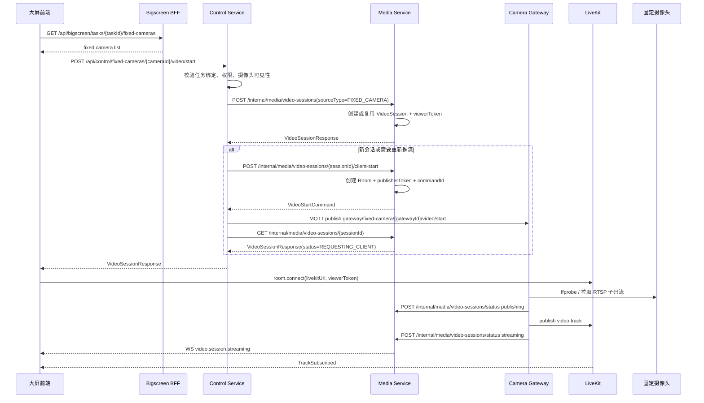

# 固定监控摄像头任务实时视频方案

## 1. 背景与目标

当前项目已经实现中心端向机器人端下发实时视频播放指令，机器人端收到指令后拉取本机摄像头 RTSP 并上行推流到 LiveKit，大屏通过 LiveKit 订阅实时画面。

新增需求是：管理端任务编排可能绑定多个固定监控摄像头，大屏需要在任务维度播放这些固定摄像头的实时视频。固定摄像头不是机器人下挂摄像头，不具备机器人侧 Go 客户端，因此不能继续依赖机器人 MQTT 指令完成推流。

本方案目标：

1. 最大化复用现有实时视频链路。
2. 大屏仍然只拿 LiveKit Token 播放，不直接访问 RTSP。
3. 固定摄像头接入不污染机器人控制链路。
4. 第一期开发成本可控，后续可平滑演进为独立 Camera Gateway。

## 2. 当前可复用能力

当前实时视频链路已经具备以下能力：

| 模块 | 已有能力 | 本需求复用方式 |
|---|---|---|
| `backend` Media Service | `VideoSession`、LiveKit Room、viewerToken、publisherToken、Track 状态、录像、抓拍、空闲释放 | 继续作为统一媒体会话中心 |
| `control-service` | 前端视频 API、创建/复用会话、请求 start command、状态编排 | 增加固定摄像头入口和 sourceType 分发 |
| `client` Go 云接入客户端 | RTSP 探测、外部 publisher 进程管理、RTSP -> LiveKit 推流思路 | Camera Gateway 复用其工程模式和部分代码思路 |
| `robot-ui` | LiveKit 连接、视频墙、多宫格播放、Track attach、停止、抓拍、录像 | 固定摄像头播放继续返回同样的 `VideoSessionResponse` |
| `bigscreen-bff` | 大屏 REST/WebSocket 聚合入口 | 聚合任务绑定的固定摄像头列表 |
| LiveKit | Room/Track 实时媒体转发 | 继续作为唯一实时播放通道 |

核心复用原则：

```text
复用 VideoSession + LiveKit + 大屏播放组件；
只替换原链路中的“机器人客户端推流”这一段。
```

## 3. 推荐总体方案

固定摄像头播放链路：

```text
大屏
  -> Bigscreen BFF 查询任务关联固定摄像头
  -> Control Service 调固定摄像头 start API
  -> Media Service 创建或复用 VideoSession，并生成 LiveKit Room/Token
  -> Control Service 通知 Camera Gateway 启动推流
  -> Camera Gateway 拉固定摄像头 RTSP/NVR/GB28181 转换流
  -> Camera Gateway 推流到 LiveKit
  -> 大屏订阅 LiveKit Room 中的 Track
```

对比机器人摄像头播放链路：

```text
机器人摄像头:
Control Service -> MQTT -> 机器人 Go Client -> RTSP -> LiveKit

固定摄像头:
Control Service -> Camera Gateway -> 固定摄像头 RTSP -> LiveKit
```

大屏前端不感知 RTSP、FFmpeg、GStreamer、摄像头账号密码等接入细节，只感知统一的 `VideoSessionResponse`。

## 4. Camera Gateway 定位

### 4.1 逻辑职责

Camera Gateway 是固定摄像头的中心侧推流执行器，职责类似机器人端 Go client，但运行在中心服务器或边缘服务器。

| 职责 | 说明 |
|---|---|
| 获取推流命令 | 接收 Control Service 的 start/stop/restart/switch 命令 |
| 查询摄像头码流 | 根据 `fixedCameraId` 获取主/子码流地址和认证信息 |
| RTSP 探测 | 使用 ffprobe 或等价能力检查固定摄像头流是否可达 |
| 推 LiveKit | 使用 gstreamer-publisher、FFmpeg 或 LiveKit SDK 将视频发布到 Room |
| 生命周期管理 | 按 `sessionId` 管理每路 publisher 进程 |
| 状态上报 | 上报 `publishing`、`streaming`、`failed`、`stopped` |
| 异常恢复 | 处理断流重连、进程退出、超时、空闲释放 |

### 4.2 是否必须独立部署

Camera Gateway **必须有独立逻辑边界**，但第一期不强制独立物理部署。

推荐分阶段：

| 阶段 | 部署形态 | 适用场景 |
|---|---|---|
| 一期 | 独立 Go 进程，和中心服务部署在同一服务器 | 复用 Go 客户端经验，边界清晰，部署成本可控 |
| 二期 | 独立 Camera Gateway 服务，可多实例部署 | 摄像头数量增多、现场网络复杂、需要横向扩展 |

本方案推荐一期直接使用 **Go 独立进程**。原因是当前项目已有 Go 版机器人客户端，Gateway 的任务模型、进程管理、RTSP 探测、推流方式与其高度相似。

## 5. 开发语言选择

### 5.1 推荐 Go

Camera Gateway 正式版本推荐使用 Go。

原因：

1. 当前项目已有 `client/` Go 机器人端，可复用工程结构和推流思路。
2. Gateway 是长驻进程，需要稳定管理多路推流、子进程、超时、重连和状态。
3. Go 的 goroutine、context、exec.Cmd 生命周期控制适合这类任务。
4. 单二进制部署简单，适合中心服务器或边缘节点。
5. 视频编解码压力主要在 FFmpeg/GStreamer/LiveKit publisher，不在 Go 本身。

### 5.2 Python 不纳入正式方案

Python 不作为正式 Camera Gateway 的主语言，原因：

1. 多路长生命周期任务和子进程治理更容易松散。
2. 部署依赖更重，现场环境一致性更难保证。
3. 与当前 Go 机器人客户端复用度低。
4. 长期维护断线重连、任务恢复、资源回收时工程约束弱于 Go。

结论：

```text
正式 Camera Gateway: Go
```

## 6. 数据模型扩展

### 6.1 视频源类型

为支持固定摄像头，视频会话只需要新增以下必须字段：

| 字段 | 类型 | 说明 |
|---|---|---|
| `sourceType` | string | `ROBOT_CAMERA` / `FIXED_CAMERA` |
| `sourceId` | string | 机器人 ID 或固定摄像头 ID |

说明：

1. `deviceId`、`quality`、`channel` 继续复用现有字段，不作为本需求新增字段。
2. `taskId` 不建议作为 `VideoSession` 必须字段。任务与固定摄像头的绑定关系由管理端保存，Control Service 在 start 前校验即可；如需审计，使用 metadata 记录。
3. `robotId` 保持现有机器人摄像头语义。固定摄像头会话不应强依赖 `robotId`，避免把固定摄像头伪装成机器人设备。

机器人摄像头示例：

```json
{
  "sourceType": "ROBOT_CAMERA",
  "sourceId": "robot-001",
  "deviceId": "camera01",
  "channel": "visible",
  "quality": "sub"
}
```

固定摄像头示例：

```json
{
  "sourceType": "FIXED_CAMERA",
  "sourceId": "fc_001",
  "deviceId": "fc_001",
  "channel": "visible",
  "quality": "sub"
}
```

### 6.2 不采用机器人字段兼容写法

固定摄像头不使用 `robotId = fixed-camera-gateway` 这类兼容写法。正式方案要求在 DTO 和数据库中显式增加 `sourceType/sourceId`，避免固定摄像头被伪装成机器人设备，影响权限、统计、状态恢复和设备列表展示。

## 7. 接口设计

### 7.1 大屏查询任务关联固定摄像头

由管理端或 BFF 提供聚合接口：

```http
GET /api/bigscreen/tasks/{taskId}/fixed-cameras
```

响应示例：

```json
{
  "taskId": "task_20260713_001",
  "cameras": [
    {
      "cameraId": "fc_001",
      "name": "东门枪机",
      "location": "东门",
      "sourceType": "FIXED_CAMERA",
      "defaultQuality": "sub",
      "status": "online"
    },
    {
      "cameraId": "fc_002",
      "name": "仓库球机",
      "location": "仓库",
      "sourceType": "FIXED_CAMERA",
      "defaultQuality": "sub",
      "status": "unknown"
    }
  ]
}
```

BFF 只聚合展示字段，不返回 RTSP 地址和认证信息。

### 7.2 固定摄像头开始播放

Control Service 新增入口：

```http
POST /api/control/fixed-cameras/{cameraId}/video/start
Content-Type: application/json
```

请求：

```json
{
  "taskId": "task_20260713_001",
  "quality": "sub",
  "reuse": true,
  "clientRequestId": "optional"
}
```

响应复用现有 `VideoSessionResponse`：

```json
{
  "sessionId": "vs_xxx",
  "roomName": "media.fixed.fc_001.visible",
  "livekitUrl": "wss://example.com/livekit",
  "viewerToken": "eyJ...",
  "status": "REQUESTING_CLIENT",
  "robotId": null,
  "deviceId": "fc_001",
  "quality": "sub",
  "channel": "visible"
}
```

### 7.3 任务批量开始播放

用于大屏一次性打开任务下多路固定摄像头：

```http
POST /api/control/tasks/{taskId}/fixed-cameras/video/start
Content-Type: application/json
```

请求：

```json
{
  "cameraIds": ["fc_001", "fc_002"],
  "quality": "sub",
  "reuse": true
}
```

响应：

```json
{
  "taskId": "task_20260713_001",
  "sessions": [
    {
      "cameraId": "fc_001",
      "session": {
        "sessionId": "vs_001",
        "roomName": "media.fixed.fc_001.visible",
        "livekitUrl": "wss://example.com/livekit",
        "viewerToken": "eyJ...",
        "status": "REQUESTING_CLIENT"
      }
    }
  ],
  "failures": []
}
```

### 7.4 Control Service 到 Camera Gateway

推荐一期就按 MQTT 或消息通道设计，与现有机器人视频指令链路保持一致。这样 Camera Gateway 可以像中心侧虚拟客户端一样订阅固定摄像头推流命令，后续多实例、离线重连和状态恢复也更顺。

推荐 topic：

```text
gateway/fixed-camera/{gatewayId}/video/start
gateway/fixed-camera/{gatewayId}/video/stop
gateway/fixed-camera/{gatewayId}/video/restart
gateway/fixed-camera/{gatewayId}/status
```

单实例部署时，`gatewayId` 使用配置中的固定实例 ID：

```text
gateway/fixed-camera/{configuredGatewayId}/video/start
```

start payload 示例：

```json
{
  "commandId": "cmd_xxx",
  "sessionId": "vs_xxx",
  "sourceType": "FIXED_CAMERA",
  "sourceId": "fc_001",
  "deviceId": "fc_001",
  "quality": "sub",
  "roomName": "media.fixed.fc_001.visible",
  "liveKitUrl": "ws://livekit:7880",
  "publisherToken": "eyJ...",
  "timeoutSeconds": 10
}
```

stop payload 示例：

```json
{
  "commandId": "cmd_stop_xxx",
  "sessionId": "vs_xxx",
  "sourceType": "FIXED_CAMERA",
  "sourceId": "fc_001",
  "deviceId": "fc_001"
}
```

状态上报可以复用现有视频状态语义：

```json
{
  "sessionId": "vs_xxx",
  "commandId": "cmd_xxx",
  "sourceType": "FIXED_CAMERA",
  "sourceId": "fc_001",
  "deviceId": "fc_001",
  "status": "streaming",
  "message": "track published"
}
```

Gateway 不再提供 start/stop/restart HTTP 控制入口，避免同时存在两套控制链路。HTTP 仅保留 `/health`、`/metrics` 这类只读运维接口。

## 8. 时序流程

### 8.1 单路固定摄像头播放



### 8.2 状态机复用

固定摄像头继续复用现有状态：

```text
INIT -> REQUESTING_CLIENT -> ROOM_READY -> STREAMING
                                      -> FAILED
STREAMING -> INTERRUPTED -> REQUESTING_CLIENT -> STREAMING
STREAMING -> IDLE_WAIT -> STOPPING -> CLOSED
```

其中：

| 状态 | 固定摄像头含义 |
|---|---|
| `INIT` | Media 已创建会话，Gateway 尚未启动 |
| `REQUESTING_CLIENT` | Control 已通知 Gateway 启动推流 |
| `ROOM_READY` | Gateway 已开始发布或正在连接 LiveKit |
| `STREAMING` | Gateway 推流成功，LiveKit 已有 Track |
| `FAILED` | RTSP 不通、认证失败、publisher 启动失败或 LiveKit 推流失败 |
| `INTERRUPTED` | 推流进程退出、摄像头断流或 Track 中断 |
| `IDLE_WAIT` | 无观看者，等待延迟释放 |
| `CLOSED` | 会话和推流任务已关闭 |

## 9. Go Camera Gateway 设计

### 9.1 工程结构

建议新增目录：

```text
camera-gateway/
  go.mod
  cmd/camera-gateway/main.go
  internal/config/
  internal/api/
  internal/controlclient/
  internal/cameraclient/
  internal/rtsp/
  internal/publisher/
  internal/session/
  internal/status/
```

职责说明：

| 包 | 职责 |
|---|---|
| `config` | 读取 Gateway 配置、LiveKit/Control/Media 地址、publisher 命令模板 |
| `api` | 暴露 health、metrics 等只读运维接口 |
| `controlclient` | 调 Control 或 Media 接口，上报状态 |
| `cameraclient` | 查询管理端固定摄像头详情和码流地址 |
| `rtsp` | ffprobe 探测、解析码流基本信息 |
| `publisher` | 管理 gstreamer-publisher/FFmpeg 进程 |
| `session` | 按 `sessionId` 管理推流任务生命周期 |
| `status` | 状态转换、失败原因、重试策略 |

### 9.2 进程模型

Gateway 内部按 `sessionId` 管理推流任务：

```text
map[sessionId]*PublishSession
```

每个 `PublishSession` 包含：

| 字段 | 说明 |
|---|---|
| `sessionId` | 媒体会话 ID |
| `cameraId` | 固定摄像头 ID |
| `quality` | 主/子码流 |
| `rtspUrl` | 实际拉流地址，仅 Gateway 内部使用 |
| `roomName` | LiveKit Room |
| `publisherToken` | LiveKit 发布 Token |
| `cmd` | 外部 publisher 进程 |
| `cancel` | context cancel，用于停止任务 |
| `status` | 当前状态 |
| `lastError` | 最近失败原因 |

### 9.3 推流命令

第一期推荐继续使用当前机器人客户端同类方式：

```text
gstreamer-publisher --url {livekitUrl} --token {publisherToken} -- {pipeline}
```

或：

```text
ffmpeg-livekit-publisher.sh {rtspUrl} {livekitUrl} {publisherToken}
```

建议默认策略：

1. 大屏多宫格使用 `sub` 子码流。
2. 单路放大或详情页可切换 `main` 主码流。
3. 能转封装就不转码；只有编码不兼容时才转码。
4. 每路 publisher 都带超时、退出监听和日志采集。

### 9.4 状态上报

Gateway 启动后上报：

```json
{
  "sessionId": "vs_xxx",
  "commandId": "cmd_xxx",
  "sourceType": "FIXED_CAMERA",
  "sourceId": "fc_001",
  "deviceId": "fc_001",
  "status": "publishing",
  "message": "publisher starting"
}
```

推流成功后：

```json
{
  "sessionId": "vs_xxx",
  "commandId": "cmd_xxx",
  "sourceType": "FIXED_CAMERA",
  "sourceId": "fc_001",
  "deviceId": "fc_001",
  "status": "streaming",
  "message": "track published"
}
```

失败后：

```json
{
  "sessionId": "vs_xxx",
  "commandId": "cmd_xxx",
  "sourceType": "FIXED_CAMERA",
  "sourceId": "fc_001",
  "deviceId": "fc_001",
  "status": "failed",
  "errorCode": "RTSP_PROBE_FAILED",
  "message": "rtsp probe timeout"
}
```

## 10. 模块改造边界

### 10.1 管理端后端和前端

由同事开发，负责：

1. 固定摄像头注册、编辑、删除。
2. 摄像头码流地址和认证信息管理。
3. 摄像头任务绑定。
4. 任务关联摄像头查询。
5. 权限和组织隔离。

不负责：

1. LiveKit Room/Token。
2. 实时视频推流进程。
3. 大屏播放组件。

### 10.2 Bigscreen BFF

负责：

1. 聚合任务详情和固定摄像头列表。
2. 返回大屏展示字段。
3. 保持对前端友好的字段结构。

不负责：

1. 保存 RTSP 密码。
2. 承载媒体流。
3. 执行 FFmpeg/GStreamer。

### 10.3 Control Service

负责：

1. 新增固定摄像头播放入口。
2. 校验当前用户是否能观看任务绑定摄像头。
3. 创建或复用 Media Service 的 `VideoSession`。
4. 根据 `sourceType` 分发推流命令：

```text
ROBOT_CAMERA -> MQTT 下发到机器人 Go client
FIXED_CAMERA -> MQTT/消息通道下发到 Camera Gateway
```

5. 复用现有 restart、stop、heartbeat、switch-channel 的会话编排能力。

不负责：

1. 直接拉 RTSP。
2. 直接推 LiveKit Track。
3. 存储摄像头账号密码。

### 10.4 Media Service

负责：

1. 扩展 `VideoSession` 支持 `sourceType/sourceId`。
2. 继续生成 LiveKit viewerToken/publisherToken。
3. 继续维护 Room、Track、viewer、录像、抓拍。
4. 继续提供 `/internal/media/video-sessions/**` 能力。
5. 接收固定摄像头 Gateway 状态上报。

不负责：

1. 摄像头注册主数据维护。
2. 固定摄像头协议适配细节。
3. 大规模进程治理由独立 Camera Gateway 服务化阶段承接。

### 10.5 Camera Gateway

负责：

1. 查询固定摄像头码流配置。
2. 拉流和探活。
3. 管理 publisher 进程。
4. 上报推流状态。
5. 处理停止、重启、断线重连和资源回收。

不负责：

1. 用户权限。
2. 任务编排。
3. 大屏展示。
4. LiveKit viewerToken 签发。

### 10.6 大屏前端

负责：

1. 展示任务下关联的固定摄像头。
2. 调用固定摄像头 start API。
3. 使用返回的 `livekitUrl/viewerToken` 连接 LiveKit。
4. 复用现有视频格子播放、停止、抓拍、录像交互。

不负责：

1. RTSP 播放。
2. 摄像头账号密码处理。
3. 协议转换。

## 11. 一期开发清单

### 11.1 Media Service

1. `VideoSession` 增加 `sourceType`、`sourceId` 字段。
2. `CreateVideoSessionRequest` 增加 `sourceType/sourceId`，兼容旧字段。
3. Room 命名支持固定摄像头，例如：

```text
media.fixed.{cameraId}.visible
```

4. 会话复用逻辑增加 `sourceType + sourceId + deviceId + channel + quality` 维度。
5. 状态上报接口兼容 `FIXED_CAMERA`。

### 11.2 Control Service

1. 新增：

```text
POST /api/control/fixed-cameras/{cameraId}/video/start
```

2. 新增：

```text
POST /api/control/tasks/{taskId}/fixed-cameras/video/start
```

3. `ControlVideoCommandService` 增加 `startFixedCameraVideo`。
4. 下发命令时按 `sourceType` 路由到 Gateway。
5. `stop/restart/switch-channel` 对固定摄像头转发到 Gateway。

### 11.3 Camera Gateway Go 服务

1. 新建 `camera-gateway/`。
2. 实现 MQTT start/stop/restart 命令订阅和状态上报。
3. 实现固定摄像头详情查询 client。
4. 实现 ffprobe 探测。
5. 实现 gstreamer-publisher 或 FFmpeg publisher 进程管理。
6. 实现 health、metrics 等只读运维接口。
7. 实现按 `sessionId` 幂等启动和停止。

### 11.4 Bigscreen BFF

1. 新增或代理任务固定摄像头列表接口。
2. 字段统一为大屏可直接消费的结构。
3. 不返回 RTSP 地址和认证信息。

### 11.5 大屏前端

1. 任务监控页加载固定摄像头列表。
2. 固定摄像头拖入或自动填充视频格。
3. 调用固定摄像头 start API。
4. 复用 LiveKit 播放组件。
5. 区分机器人摄像头和固定摄像头的展示名称、状态和控制按钮。

## 12. 二期演进

可后续演进的能力：

1. Camera Gateway 多实例和负载分配。
2. 固定摄像头在线状态周期探测。
3. 摄像头主/子码流自动切换。
4. GB28181 接入。
5. NVR/厂商 SDK 接入。
6. 固定摄像头云台控制。
7. 任务开始时自动预热固定摄像头推流。
8. 无人观看自动停止推流，降低带宽和 CPU。
9. 固定摄像头录像策略和任务录像自动归档。

## 13. 风险与约束

| 风险 | 说明 | 建议 |
|---|---|---|
| RTSP 兼容性 | 不同厂商摄像头编码、鉴权、超时行为不同 | 先支持 RTSP H.264/H.265，建立失败原因码 |
| CPU 消耗 | 转码会显著消耗 CPU | 默认子码流，优先转封装，避免转码 |
| 带宽消耗 | 多路固定摄像头同时播放会占用上行和 LiveKit 转发带宽 | 视频墙默认子码流，空闲释放 |
| 凭证安全 | RTSP 地址可能包含账号密码 | 只在管理端和 Gateway 内部使用，不返回给前端 |
| 状态一致性 | Gateway 进程异常可能导致会话状态滞后 | Gateway 心跳、进程退出监听、Media 超时调度 |
| 部署复杂度 | 新增 Go Gateway 进程 | 单二进制部署，先同机部署，后续多实例 |

## 14. 推荐结论

本需求最高复用的实现方式是：

```text
大屏播放层继续复用 LiveKit；
Media Service 继续复用 VideoSession；
Control Service 继续复用视频会话编排；
新增 sourceType 区分 ROBOT_CAMERA 和 FIXED_CAMERA；
新增 Go Camera Gateway 承担固定摄像头拉流和推 LiveKit；
管理端只负责固定摄像头注册和任务绑定。
```

一期推荐落地形态：

```text
管理端注册/绑定固定摄像头
  -> Bigscreen BFF 聚合任务固定摄像头列表
  -> Control Service 新增 fixed-camera start API
  -> Media Service 扩展 sourceType/sourceId
  -> Go Camera Gateway 拉 RTSP 并推 LiveKit
  -> 大屏复用现有 LiveKit 视频格播放
```

Go 是正式 Gateway 的推荐语言；Python 不纳入正式 Gateway 方案。
