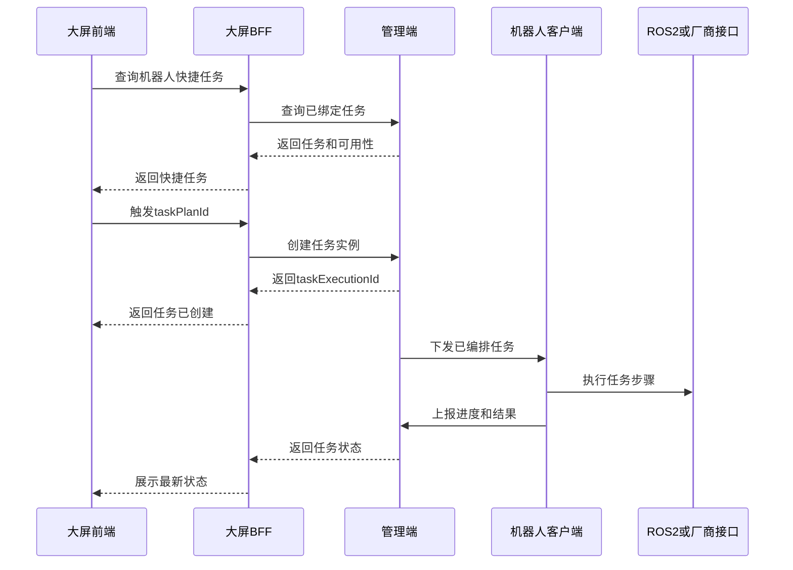

# 大屏快捷任务技术方案

文档状态：评审稿  
编制日期：2026-07-23

关联文档：

- [大屏快捷任务需求说明](大屏快捷任务需求说明.md)
- [大屏快捷任务接口说明](大屏快捷任务接口说明.md)

## 1. 设计结论

返回驻点、自主回充和驶离充电桩属于管理端任务，不属于本体直接控制命令。

```text
大屏查询快捷任务
  -> 大屏触发任务计划
  -> 管理端创建任务实例
  -> 管理端下发已编排任务
  -> 机器人执行
  -> 管理端更新任务状态
  -> 大屏展示结果
```

大屏不编排导航步骤，不向本体控制 topic 发送返航或驶离指令。

## 2. 系统职责

| 系统 | 职责 |
|---|---|
| 大屏前端 | 展示快捷任务、触发任务、展示状态 |
| 大屏 BFF | 聚合任务和实时状态，代理管理端接口 |
| 管理端 | 管理任务计划、创建任务实例、下发任务、维护最终状态 |
| 控制服务 | 校验人工控制占用和接管关系 |
| 机器人客户端 | 执行任务步骤，调用 ROS2 或厂商接口，上报结果 |

管理端任务实例是最终状态的数据源。机器人实时状态用于及时刷新，BFF 不自行判定任务成功。

## 3. 执行流程



## 4. 快捷任务模型

管理端任务计划至少包含：

```jsonc
{
  "taskPlanId": 1001,
  "taskCode": "RETURN_HOME",
  "displayName": "返回二楼驻点",
  "taskType": "NAVIGATION",
  "quickAction": true,
  "requiresConfirm": true,
  "applicableRobotIds": ["robot-001"]
}
```

大屏只使用任务标识和展示信息，不读取任务内部步骤。

## 5. 可用性判断

通用校验：

- 机器人在线。
- 急停未生效。
- 没有冲突任务。
- 没有本体人工控制占用。
- 机器人具备任务需要的能力和资源。

返航增加：

- 当前地图已知。
- 定位可用。
- 当前地图配置了驻点。

驶离充电桩增加：

- 已绑定充电桩。
- 当前状态为 `DOCKED`。
- 驶离区域和充电机构状态允许执行。

## 6. 单地图返航

一期为每张地图配置一个返回驻点任务：

```text
map-floor-1 -> 返回一楼驻点任务
map-floor-2 -> 返回二楼驻点任务
```

创建任务实例时，管理端重新读取机器人最新 `currentMapId`，避免执行页面缓存的旧任务。

目标驻点坐标由管理端任务提供，不由前端传入。

## 7. 跨地图返航

跨地图返航放入二期，需要增加：

- 地图连接拓扑。
- 电梯、门禁或人工转换步骤。
- 地图切换。
- 目标地图重新定位。
- 跨地图进度和异常上报。

典型步骤：

```text
导航到转换入口
  -> 执行地图转换
  -> 切换目标地图
  -> 重新定位
  -> 导航到目标驻点
```

没有跨地图能力时，系统只返回当前地图驻点任务。

## 8. 驶离充电桩

建议任务步骤：

```text
检查停靠状态
  -> 停止充电
  -> 解锁充电机构
  -> 调用驶离接口或执行安全移动
  -> 验证状态为UNDOCKED
```

任何安全步骤失败时，任务停止并上报原因。

## 9. 任务状态

| 状态 | 含义 |
|---|---|
| `QUEUED` | 已创建，等待下发 |
| `DISPATCHED` | 已向机器人下发 |
| `ACCEPTED` | 机器人已接受 |
| `RUNNING` | 正在执行 |
| `PAUSED` | 已暂停 |
| `SUCCEEDED` | 执行成功 |
| `FAILED` | 执行失败 |
| `CANCELLED` | 已取消 |
| `TIMED_OUT` | 执行超时 |

HTTP 成功或消息发布成功不代表任务成功。

## 10. 人工控制冲突

一期采用严格互斥：

- 本体人工控制存在时，拒绝启动快捷任务。
- 任务运行时发起人工接管，先暂停或取消任务。
- 任务进入可接管状态后，再切换为手动模式并授予本体控制权。
- 前端不单独切换任务模式，模式由任务执行链路维护。

## 11. 机器人端处理

机器人客户端接收管理端任务实例，按步骤调用对应适配器：

```text
NAVIGATE_TO_POINT -> ROS2导航Action或厂商SDK
UNDOCK -> 充电桩或机器人厂商接口
VERIFY_ARRIVAL -> 定位和距离判断
```

不支持某个步骤时返回 `UNSUPPORTED_STEP`，不得静默忽略。

## 12. Topic 边界

快捷任务沿用管理端现有任务下发链路，不进入：

```text
robot/{robotId}/control/body/command
```

该 topic 继续用于本体直接控制。

机器人实时状态可以继续通过现有统一状态链路上报，但最终任务状态由管理端任务实例维护。

## 13. 异常处理

| 场景 | 处理 |
|---|---|
| 机器人离线 | 不创建任务或按策略保持排队 |
| 定位不可用 | 禁止返航 |
| 当前地图无驻点 | 禁止返航 |
| 路径规划失败 | 任务失败并返回原因 |
| 充电机构未解锁 | 停止驶离 |
| 驶离区域阻挡 | 停止驶离 |
| 重复提交 | 返回已有任务实例 |
| 状态不一致 | 记录告警，BFF 不覆盖任务终态 |

## 14. 实施顺序

一期：

1. 管理端建立快捷任务标识和机器人绑定。
2. 提供快捷任务查询和触发接口。
3. BFF 代理接口。
4. 前端动态展示和触发。
5. 机器人上报地图、定位、停靠和任务状态。
6. 实现人工控制互斥。

二期：

1. 任务取消和恢复。
2. 跨地图返航。
3. 最近驻点选择。
4. 电梯、门禁和地图转换联动。
