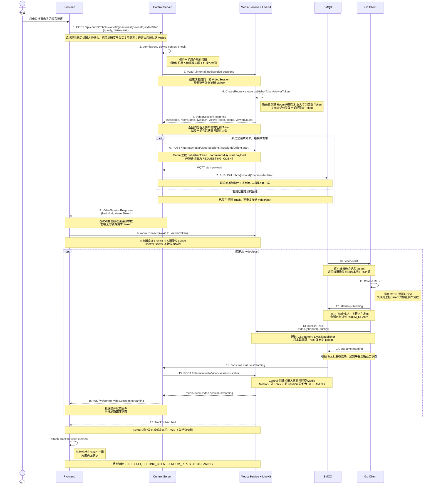

```mermaid
sequenceDiagram
    actor U as 用户
    participant FE as Frontend
    participant CS as Control Server
    participant ML as Media Service + LiveKit
    participant MQ as EMQX
    participant GO as Go Client

    U->>FE: 点击目标摄像头的观看按钮
    FE->>CS: 1. POST /api/control/robots/{robotId}/cameras/{deviceId}/video/start<br/>{quality, reuse=true}
    Note over FE,CS: 请求观看指定机器人摄像头，携带清晰度与会话复用意图；通道由后端默认 visible

    CS->>CS: 2. permission / device context check
    Note right of CS: 校验当前用户观看权限<br/>并确认机器人和摄像头属于可操作范围

    CS->>ML: 3. POST /internal/media/video-sessions
    Note over CS,ML: 创建或复用同一路 VideoSession<br/>并登记当前浏览器 viewer

    ML->>ML: 4. CreateRoom + create publisherToken/viewerToken
    Note right of ML: 新会话创建 Room 并签发机器人与浏览器 Token<br/>复用会话仅签发当前观看者 Token

    ML-->>CS: 5. VideoSessionResponse<br/>{sessionId, roomName, livekitUrl, viewerToken, status, viewerCount}
    Note over ML,CS: 返回浏览器入房所需地址和 Token<br/>以及当前会话状态与观看人数

    alt 新建会话或尚未开始视频发布
        CS->>ML: 6. POST /internal/media/video-sessions/{sessionId}/client-start
        Note over CS,ML: Media 生成 publisherToken、commandId 与 start payload<br/>并将会话置为 REQUESTING_CLIENT
        ML-->>CS: MQTT start payload
        CS->>MQ: 7. PUBLISH robot/{robotId}/media/video/start
        Note over CS,MQ: 将启动推流指令下发到目标机器人客户端
    else 复用已在推流的会话
        Note over CS,MQ: 已存在视频 Track，不重复发送 video/start
    end

    CS-->>FE: 8. VideoSessionResponse<br/>{livekitUrl, viewerToken}
    Note over CS,FE: 首次观看直接返回连接参数<br/>前端无需额外请求 /token

    FE->>ML: 9. room.connect(livekitUrl, viewerToken)
    Note over FE,ML: 浏览器直连 LiveKit 加入摄像头 Room<br/>Control Server 不转发媒体流

    opt 已执行 video/start
        MQ->>GO: 10. video/start
        Note over MQ,GO: 客户端接收会话和 Token<br/>定位该摄像头对应的本地 RTSP 源

        GO->>GO: 11. ffprobe RTSP
        Note right of GO: 预检 RTSP 是否可拉流<br/>失败则上报 failed 并停止发布流程

        GO->>MQ: 12. status=publishing
        Note over GO,MQ: RTSP 检查成功，上报正在发布<br/>会话可推进到 ROOM_READY

        GO->>ML: 13. publish Track<br/>video.{channel}.{quality}
        Note over GO,ML: 通过 GStreamer / LiveKit publisher<br/>将本路视频 Track 发布到 Room

        GO->>MQ: 14. status=streaming
        Note over GO,MQ: 视频 Track 发布成功，通知平台更新业务状态

        MQ->>CS: 15. consume status=streaming
        CS->>ML: 15. POST /internal/media/video-sessions/status
        Note over MQ,ML: Control 消费机器人状态并转交 Media<br/>Media 记录 Track 并将 session 更新为 STREAMING

        ML-->>CS: media event video.session.streaming
        CS-->>FE: 16. WS /ws/control video.session.streaming
        Note over CS,FE: 推送媒体状态事件<br/>前端刷新画面状态
    end

    ML-->>FE: 17. TrackSubscribed
    Note over ML,FE: LiveKit 将已发布或新发布的 Track 下发给浏览器
    FE->>FE: attach Track to video element
    Note right of FE: 绑定到对应 video 元素<br/>完成画面展示

    Note over FE,ML: 状态流转：INIT -> REQUESTING_CLIENT -> ROOM_READY -> STREAMING
```
