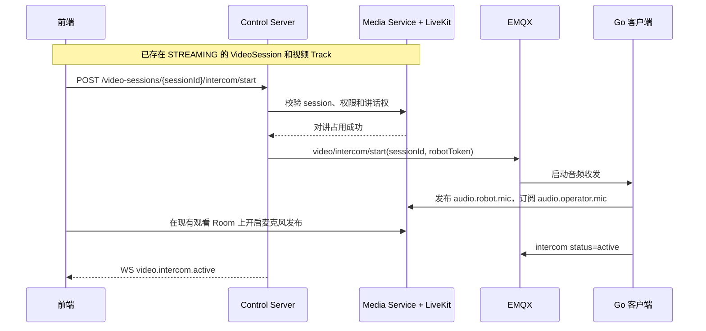
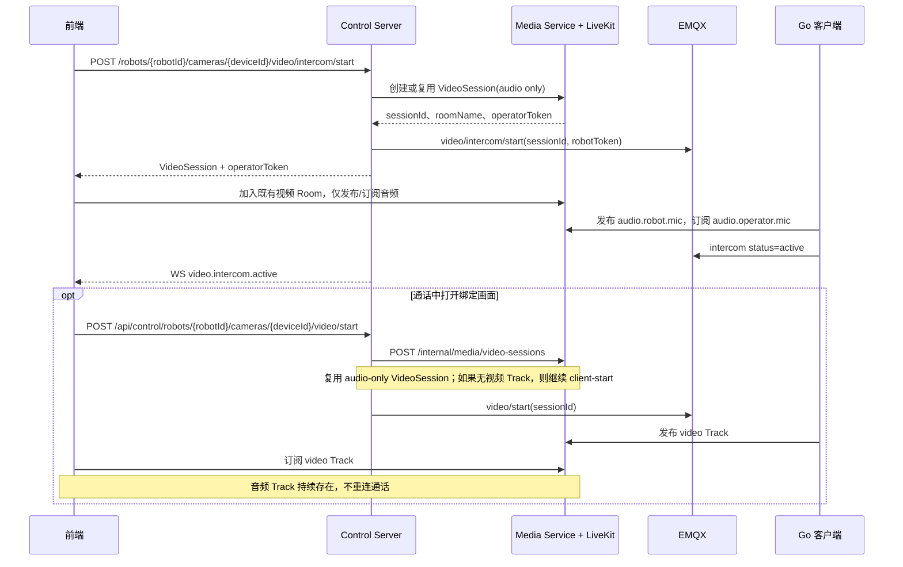

# 基于实时视频会话的双向语音对讲方案

## 1. 设计结论

双向语音对讲作为实时视频会话的扩展能力实现，不创建独立语音会话，也不创建独立语音 Room。

核心约束：

| 项目 | 设计 |
|---|---|
| 会话主体 | 继续使用 `VideoSession` 和 `sessionId` |
| LiveKit Room | 继续使用实时视频 Room，当前实现为 `media.{robotId}.{deviceId}.{channel}.{quality}` |
| 语音 Track | 在当前视频 Room 中增加上下行音频 Track |
| 先通话后看视频 | 先创建或复用视频会话 Room，仅启动音频；需要观看时再启动或订阅视频 Track |
| 长时间通话 | 对讲进行中禁止因无人观看而释放当前视频会话 |
| 禁止项 | 不增加 `AudioSession`、`audioSessionId`、`audio.{robotId}` 独立 Room |

## 2. 适用场景

本方案支持以下业务流程：

1. 用户正在观看某路视频，点击对讲，与该画面关联的机器人进行通话。
2. 用户尚未观看视频，先点击通话按钮，与机器人进行长时间语音通话。
3. 通话过程中打开绑定摄像头画面，视频加入同一个 Room，语音不中断。

语音对讲始终绑定一路视频上下文。当前已实现的前端入口位于每个摄像头画面上，点击该画面的“通话”按钮时，直接使用该画面的 `robotId/deviceId/channel/quality`。机器人级通话入口和 `defaultIntercomDeviceId` 属于后续扩展，当前代码未单独实现。

## 3. 总体架构

```text
浏览器前端
  ├─ 发布 audio.operator.mic
  ├─ 订阅 audio.robot.mic
  └─ 可选订阅 video.visible.sub/main
                ⇅ WebRTC / SRTP
LiveKit Room: media.{robotId}.{deviceId}.{channel}.{quality}
                ⇅
机器人 Go 云接入客户端
  ├─ 发布 audio.robot.mic
  ├─ 订阅 audio.operator.mic -> 扬声器播放
  └─ 按需发布 video.visible.sub/main

Control Server / Media Service
  ├─ Control Server: 对外 API、MQTT 指令、状态订阅、定时释放/超时编排
  └─ Media Service: VideoSession、Room/Token、讲话权、媒体状态与事件
```

职责保持现有边界：

| 模块 | 新增职责 |
|---|---|
| 前端 | 发起/结束对讲、麦克风授权、发布和订阅音频 Track、展示通话状态 |
| Control Server | 校验入口、选择或校验绑定摄像头、调用 Media Internal API、编排 MQTT 指令、订阅客户端状态 |
| Media Service | 在 `VideoSession` 内维护对讲子状态、签发带音频发布权限的 Token、控制释放条件、记录并广播媒体事件 |
| Go 客户端 | 按 `sessionId` 管理音频收发，采集麦克风、播放下行音频、按需启动视频发布 |
| LiveKit | 在既有 Room 中转发视频与双向音频 Track |

## 4. Room 与 Track 设计

### 4.1 Room 规则

Room 命名保持不变：

```text
media.{robotId}.{deviceId}.{channel}.{quality}
```

示例：

```text
media.test111.camera01.visible.sub
```

不论是先观看视频还是先发起语音，都加入同一路摄像头、通道和清晰度对应的 Room。当前前端在同一个摄像头画面上发起通话和观看，会使用同一 `deviceId/channel/quality`，从而复用同一 Room。

### 4.2 Track 规则

| Track 名称 | 发布方 | 订阅方 | 是否必需 |
|---|---|---|---|
| `audio.robot.mic` | Go 客户端 | 操作员前端 | 对讲开启后必需 |
| `audio.operator.mic` | 操作员前端 | Go 客户端 | 对讲开启后必需 |
| `video.{channel}.{quality}` | Go 客户端 | 前端 | 用户观看视频时启用 |

音频采用 WebRTC 音频能力，推荐 `Opus` 编码，并启用回声消除、降噪和自动增益。

## 5. 未观看视频先发起通话

### 5.1 绑定规则

当前实现以摄像头画面为入口，不做跨摄像头自动选择。绑定规则如下：

| 场景 | 规则 |
|---|---|
| 画面已经存在 `session` | 调用 `/api/control/video-sessions/{sessionId}/intercom/start`，在当前视频会话中开启对讲 |
| 画面尚未观看、没有 `session` | 调用 `/api/control/robots/{robotId}/cameras/{deviceId}/video/intercom/start`，由后端创建或复用该摄像头、通道、清晰度对应的 `VideoSession` |
| 机器人级入口 | 当前未实现；如后续增加，需要先解析为明确的 `deviceId/channel/quality` 后再走上述摄像头入口 |

语音一旦绑定到某个 `sessionId`，在本次通话结束前不自动迁移 Room。用户查看其他摄像头时，可以新建其他视频会话，但当前语音仍由原 `sessionId` 承载。

### 5.2 媒体启动策略

先通话后看视频时：

```text
创建/复用 VideoSession 和 LiveKit Room
-> 启动机器人音频发布与音频播放
-> 前端发布/订阅音频
-> 暂不拉取 RTSP，不发布视频 Track
-> 用户点击同一摄像头画面的观看后，再通过现有 video/start 入口启动视频 Track
```

这样语音仍依赖视频 Room，但不会因为通话本身产生不必要的视频带宽消耗。

## 6. 业务流程

### 6.1 已在观看视频时开启对讲



### 6.2 未观看视频时先开启对讲



## 7. VideoSession 扩展

不新增语音会话表。当前代码在现有 `VideoSession` 上维护对讲子状态：

| 字段 | 类型 | 说明 |
|---|---|---|
| `intercomStatus` | enum | `IDLE`、`STARTING`、`ACTIVE`、`INTERRUPTED`、`STOPPING`、`FAILED` |
| `intercomOperatorId` | string | 当前占用讲话权的用户 ID |
| `intercomClientId` | string | 当前讲话页面实例 ID |
| `intercomStartedAt` | datetime | 对讲开始时间 |
| `intercomHeartbeatAt` | datetime | 最近通话心跳时间 |
| `intercomAudioOnly` | boolean | 当前是否仅音频激活、尚未启动视频 Track |

视频主状态仍使用当前状态机。对讲状态作为子状态独立变化：

```text
VideoSession: ROOM_READY 或 STREAMING
Intercom:     IDLE -> STARTING -> ACTIVE -> STOPPING -> IDLE
                                  |
                             INTERRUPTED / FAILED
```

说明：

- 仅音频对讲时，Room 已准备完成，`intercomStatus` 从 `STARTING` 进入 `ACTIVE` 后即可通话，但不要求存在视频 Track。
- 视频 Track 故障不应立即中断已正常工作的语音 Track。
- Room 或机器人客户端整体中断时，视频与语音同时进入异常处理。

## 8. HTTP 接口

### 8.1 对讲接口

| 方法 | 接口 | 说明 |
|---|---|---|
| `POST` | `/api/control/video-sessions/{sessionId}/intercom/start` | 在已有视频会话中开启对讲 |
| `POST` | `/api/control/robots/{robotId}/cameras/{deviceId}/video/intercom/start` | 未观看视频时创建/复用视频会话并开启对讲 |
| `POST` | `/api/control/video-sessions/{sessionId}/intercom/heartbeat` | 对讲心跳及 Token 续期依据 |
| `POST` | `/api/control/video-sessions/{sessionId}/intercom/token` | 重连或 Token 过期时重新签发 |
| `POST` | `/api/control/video-sessions/{sessionId}/intercom/stop` | 关闭当前视频会话中的对讲能力 |

已在观看视频的操作员发起对讲后，该浏览器实例的观看 heartbeat 同时刷新其对讲占用有效期，避免视频持续在线时因独立对讲 heartbeat 短暂丢失而误释放讲话权。未观看视频直接通话时，仍依赖 `/intercom/heartbeat` 保活。

`video/intercom/start` 响应示例：

```json
{
  "sessionId": "vs_xxx",
  "robotId": "test111",
  "deviceId": "camera01",
  "channel": "visible",
  "roomName": "media.test111.camera01.visible.sub",
  "videoStatus": "ROOM_READY",
  "intercomStatus": "STARTING",
  "intercomAudioOnly": true,
  "livekitUrl": "ws://192.168.124.77:7880",
  "operatorToken": "eyJ...",
  "expiresAt": "2026-05-25T10:30:00Z"
}
```

### 8.2 后续开启视频

仅音频通话期间打开绑定画面时，当前实现不提供单独的 `/video-sessions/{sessionId}/video/start` 接口，而是沿用实时视频原有启动入口：

| 方法 | 接口 | 说明 |
|---|---|---|
| `POST` | `/api/control/robots/{robotId}/cameras/{deviceId}/video/start` | 同一摄像头画面开始观看，`reuse=true`，后端复用 audio-only 会话并补发视频 start |

后端复用规则依赖 `robotId/deviceId/channel/quality` 一致。Control Server 调用 Media Service 创建/复用会话；当复用到 `intercomAudioOnly=true` 且无视频 `trackSid` 的会话时，会继续调用 `client-start` 并向 Go 客户端下发 `robot/{robotId}/media/video/start`，在同一个 Room 内补充视频 Track。

## 9. Token 与权限

| Token | Room | 权限 |
|---|---|---|
| `viewerToken` | 当前视频 Room | 普通观看者仅订阅视频和机器人音频；具备 `MEDIA_OPERATOR` 角色时允许额外发布麦克风音频，用于观看中无缝开启对讲 |
| `operatorToken` | 当前视频 Room | 未建立观看连接时开始通话使用；订阅视频/机器人音频，允许发布操作员麦克风音频 |
| `robotToken` | 当前视频 Room | 对讲专用机器人 Token，仅发布机器人麦克风音频并订阅操作员音频；视频发布仍使用实时视频 `publisherToken` |

安全要求：

1. 所有 Token 仅绑定当前 `roomName`，不可跨 Room 使用。
2. 交互观看 Token 仅向具备 `MEDIA_OPERATOR` 角色的用户签发，并将发布源限制为麦克风；前端仅在成功占用讲话权后开启发布。
3. `operatorToken` 只向拥有对讲权限且成功占用讲话权的用户签发。
4. 同一 `VideoSession` 默认仅允许一个操作员发布上行语音。
5. `/intercom/heartbeat` 会刷新对讲占用心跳并返回新的 `operatorToken`；当前前端主要使用该接口维持占用状态，重连或 Token 过期时可通过 `/intercom/token` 重新签发，不创建新的语音会话。

## 10. MQTT 协议

语音控制消息仍以 `sessionId` 为唯一媒体会话标识。

| Topic | 方向 | 说明 |
|---|---|---|
| `robot/{robotId}/media/video/intercom/start` | Control -> Go 客户端 | 在指定视频会话 Room 内启动音频 |
| `robot/{robotId}/media/video/intercom/stop` | Control -> Go 客户端 | 停止指定视频会话内的音频 |
| `robot/{robotId}/media/video/intercom/status` | Go 客户端 -> Control | 上报对讲状态和音频 Track |

`intercom/start` Payload：

```json
{
  "commandId": "cmd_xxx",
  "sessionId": "vs_xxx",
  "robotId": "test111",
  "deviceId": "camera01",
  "roomName": "media.test111.camera01.visible.sub",
  "livekitUrl": "ws://192.168.124.77:7880",
  "robotToken": "eyJ...",
  "publishAudio": true,
  "subscribeOperatorAudio": true,
  "publishVideo": false,
  "expiresAt": "2026-05-25T10:30:00Z"
}
```

`intercom/status` Payload：

```json
{
  "sessionId": "vs_xxx",
  "status": "active",
  "robotAudioTrackSid": "TR_audio_robot_xxx",
  "robotAudioTrackName": "audio.robot.mic",
  "message": "intercom audio active",
  "timestamp": "2026-05-25T10:00:05+08:00"
}
```

## 11. WebSocket 事件

WebSocket 外层格式与实时视频一致。对讲状态由 Media Service 记录并发布，前端通过控制侧/BFF 暴露的 WebSocket 入口接收事件并刷新画面状态：

```json
{
  "event": "video.intercom.active",
  "timestamp": "2026-06-11T10:30:00+08:00",
  "data": {}
}
```

当前实现的对讲事件：

| 事件 | 说明 | data 参数 |
|---|---|---|
| `video.intercom.starting` | 已请求机器人建立音频链路 | `VideoSessionResponse` |
| `video.intercom.stopping` | 操作员主动停止对讲，进入挂断中 | `VideoSessionResponse`，其中 `intercomStatus=STOPPING` |
| `video.intercom.active` | 机器人与操作员音频 Track 可用 | `VideoSessionResponse`，包含 `robotAudioTrackSid`、`robotAudioTrackName` |
| `video.intercom.interrupted` | 音频链路中断，等待恢复或关闭 | `sessionId`、`message` |
| `video.intercom.failed` | 对讲启动或恢复失败 | `sessionId`、`errorCode`、`message` |
| `video.intercom.closed` | 当前视频会话的对讲已关闭 | `VideoSessionResponse` |
| `video.intercom.status` | 机器人端上报未显式映射的对讲状态 | `sessionId`、`status`、`message` |
| `video.session.idle_wait` | 对讲关闭后如果无人观看，会话进入空闲等待 | `sessionId`、`idleReleaseDelaySeconds` |

`VideoSessionResponse` 中与对讲相关的字段：

| 字段 | 类型 | 说明 |
|---|---|---|
| `sessionId` | string | 会话 ID |
| `robotId` | string | 机器人 ID |
| `deviceId` | string | 绑定摄像头或云台设备 ID |
| `roomName` | string | 复用的视频 LiveKit Room 名称 |
| `viewerCount` | number | 当前视频观看人数 |
| `intercomStatus` | string | `IDLE`、`STARTING`、`ACTIVE`、`INTERRUPTED`、`STOPPING`、`FAILED` |
| `intercomAudioOnly` | boolean | 当前会话是否仅保留对讲音频 |
| `intercomOperatorId` | string/null | 当前占用对讲的操作员用户 ID |
| `robotAudioTrackSid` | string/null | 机器人麦克风 Track SID |
| `robotAudioTrackName` | string/null | 机器人麦克风 Track 名称 |
| `lastErrorCode` | string/null | 最近一次失败错误码 |
| `lastErrorMessage` | string/null | 最近一次失败说明 |

## 12. 资源释放与异常策略

### 12.1 释放规则

现有视频会话的“无人观看空闲释放”已经增加对讲保护条件：

```text
只有 viewerCount=0 且 intercomStatus 不为 STARTING/ACTIVE 时，才允许进入 IDLE_WAIT 并释放 Room。
```

| 场景 | 处理 |
|---|---|
| 无人观看，但正在通话 | 保持 `VideoSession` 与 Room，不释放音频 |
| 正在通话时关闭视频画面 | 当前浏览器停止观看并清空 video 元素；若对讲仍 active，前端保留 LiveKit Room 和麦克风发布，语音继续 |
| 通话挂断且无人观看 | 按现有空闲释放策略关闭视频会话 |
| 对讲心跳超时 | Media Service 标记 `video.intercom.interrupted`，Control Server 下发 `intercom/stop`；无人观看时进入 `IDLE_WAIT` |
| 机器人离线或音频链路中断 | 前端收到异常事件，当前实现不自动恢复对讲，需要用户重新发起通话 |
| Token 过期/网络重连 | 正常 `/intercom/heartbeat` 会返回新 `operatorToken`；重连时可调用 `/intercom/token` 获取当前 `sessionId` 的新 Token |

说明：

- `INTERRUPTED`、`FAILED`、`IDLE` 不再保护 Room。若此时 `viewerCount=0`，会话可进入 `IDLE_WAIT` 并等待释放。
- 实时视频的 `/restart` 仍用于视频 Track 中断后的重启；对讲链路不通过 `/restart` 自动恢复。

### 12.2 多摄像头规则

| 场景 | 规则 |
|---|---|
| 通话时查看绑定摄像头 | 在同一 Room 中补充视频，无影响 |
| 通话时查看其他摄像头 | 新视频 Room 独立观看，语音仍留在原 Room |
| 希望对讲绑定另一摄像头 | 先结束当前对讲，再在目标视频会话上重新开始 |

该规则避免语音 Track 在多个 Room 之间自动迁移造成中断和权限混乱。

## 13. 当前实现状态

| 模块 | 当前实现 |
|---|---|
| 前端 | 在每个摄像头画面提供通话按钮；管理麦克风授权、挂断、对讲心跳和 Room 连接；机器人级通话入口暂未实现 |
| Control Server | 暴露 `/api/control/...` 对讲接口，调用 Media Service Internal API，占用成功后向机器人 MQTT 下发 `intercom/start` 或 `intercom/stop` |
| Media Service | 在 `VideoSession` 维护对讲状态、讲话权、音频 Track 信息、Token 签发、事件发布和释放保护 |
| Go 客户端 | 订阅 `robot/{robotId}/media/video/intercom/start|stop`，按 `sessionId` 加入 LiveKit Room，发布 `audio.robot.mic` 并订阅 `audio.operator.mic` |
| 运维 | 沿用 LiveKit 当前端口和媒体转发部署；长时间通话依赖前端心跳与 Control 定时超时扫描 |

机器人客户端音频依赖：

```text
LiveKit Go SDK: 负责加入 Room、Opus 编解码、发布和订阅 Audio Track
GStreamer: 仅作为客户端内置设备适配管线，负责 PCM 麦克风采集与扬声器播放
构建参数: -tags nolibopusfile，实时 PCM 对讲不引入 OGG 文件解码依赖
```

## 14. 验收要点

| 编号 | 验收场景 | 预期结果 |
|---:|---|---|
| 1 | 未观看视频直接点击通话 | 创建/复用视频 Room，仅出现音频 Track，通话成功 |
| 2 | 通话中打开绑定摄像头视频 | 原通话不中断，新增视频 Track 并正常播放 |
| 3 | 通话中关闭视频画面 | 当前浏览器停止视频观看，音频连接和麦克风发布保持；会话是否释放由 viewerCount 与对讲状态共同决定 |
| 4 | 无观看者但保持通话 30 分钟以上 | Room 不因视频空闲策略释放 |
| 5 | 通话中打开其他摄像头 | 新视频正常观看，原 Room 的语音不中断 |
| 6 | 挂断后无人观看 | 会话按现有延迟释放策略关闭 |
| 7 | 两个用户同时请求讲话 | 仅一个用户获得发布权限，另一个收到占用提示 |
| 8 | 机器人离线或网络中断 | 前端收到异常事件；视频可按现有重启流程恢复，对讲需要重新发起或结束 |

## 15. 结论

本方案将语音对讲作为 `VideoSession` 内的音频能力实现，通过在现有 LiveKit 视频 Room 中增加双向音频 Track，复用既有的 Room、Token、MQTT、WebSocket 和资源治理框架。

对于“先通话、后观看视频”的场景，系统先建立绑定摄像头的视频会话 Room，但仅激活音频 Track；视频在用户需要时再启动。该方案满足不引入独立语音会话的约束，同时支持长时间通话与后续视频观看。
