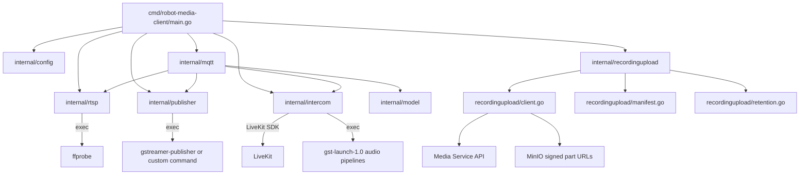

# Go Client 代码结构说明

## 1. 文档范围

本文档说明 `client/` 子项目的代码结构、模块职责、核心运行流程和主要配置项。

`client/` 是部署在机器人侧的 Go 云接入客户端，主要负责：

1. 启动后连接 MQTT，并周期性上报机器人与摄像头在线状态。
2. 接收实时视频 start/stop/switch 指令，探测 RTSP 后启动本地推流进程，将视频发布到 LiveKit。
3. 接收对讲 start/stop 指令，通过 LiveKit SDK 和本地 GStreamer 音频管线建立双向音频桥。
4. 后台扫描本地文件，按通用文件 multipart 协议续传到 Media Service/MinIO，并维护本地上传清单。

## 2. 顶层目录结构

```text
client/
  cmd/
    robot-media-client/
      main.go
  internal/
    config/
      config.go
    intercom/
      intercom.go
    model/
      model.go
    mqtt/
      client.go
    publisher/
      publisher.go
    recordingupload/
      client.go
      manifest.go
      retention.go
      runner.go
      uploader.go
    rtsp/
      probe.go
  recordings/
  scripts/
    ffmpeg-livekit-publisher.sh
    install-gstreamer-publisher.sh
  Dockerfile
  go.mod
  go.sum
  recording-upload-manifest-001.json
  recording-upload-manifest-002.json
```

| 路径 | 职责 |
|---|---|
| `cmd/robot-media-client/main.go` | 程序入口，加载配置，初始化 RTSP 探测、视频 publisher、对讲 manager、录像上传 runner 和 MQTT client |
| `internal/config/config.go` | 从环境变量加载机器人、MQTT、RTSP、GStreamer、文件上传和本地缓存配置 |
| `internal/model/model.go` | MQTT 指令、状态消息、机器人在线消息、摄像头信息等 JSON 数据模型 |
| `internal/mqtt/client.go` | MQTT 连接、订阅、心跳、指令分发、状态发布 |
| `internal/rtsp/probe.go` | 使用 `ffprobe` 检查 RTSP 视频流是否可达 |
| `internal/publisher/publisher.go` | 按 `sessionId` 管理外部视频推流进程，支持默认 GStreamer publisher、FFmpeg fallback 或自定义命令 |
| `internal/intercom/intercom.go` | 使用 LiveKit SDK 管理对讲会话，桥接本地麦克风、扬声器与 LiveKit 音频 Track |
| `internal/recordingupload/` | 本地文件发现、上传清单、断点续传、分片上传、完成上传和本地缓存清理 |
| `recordings/` | 默认本地文件扫描目录 |
| `scripts/` | 客户端部署或依赖安装脚本 |
| `Dockerfile` | 构建机器人侧客户端镜像 |

## 3. 启动入口

入口文件为 `cmd/robot-media-client/main.go`。

启动流程：

```text
main
  -> config.Load()
  -> 创建根 context，监听 SIGINT/SIGTERM
  -> 初始化 rtsp.Probe
  -> 初始化 publisher.ProcessPublisher
  -> 初始化 intercom.SDKManager
  -> 如果启用录像上传，后台启动 recordingupload.Runner
  -> 创建 mqtt.Client
  -> 循环执行 mqtt.Client.Run(ctx)，断线后 5 秒退避重连
```

进程退出时，根 `context` 会统一通知 MQTT、推流进程、对讲音频桥和录像上传 runner 收尾。

## 4. 配置模块

`internal/config/config.go` 定义 `Config`，所有配置从环境变量读取，并提供默认值。

### 4.1 机器人与 MQTT

| 字段 | 环境变量 | 说明 |
|---|---|---|
| `RobotID` | `ROBOT_ID` | 机器人 ID，默认 `test001` |
| `RobotName` | `ROBOT_NAME` | 机器人名称 |
| `Type` | `ROBOT_TYPE` | 机器人类型 |
| `Battery` | `ROBOT_BATTERY` | 电量百分比，会限制在 0 到 100 |
| `MQTTBroker` | `MQTT_BROKER_URL` | MQTT broker 地址 |
| `MQTTUsername` | `MQTT_USERNAME` | MQTT 用户名 |
| `MQTTPassword` | `MQTT_PASSWORD` | MQTT 密码 |
| `ClientID` | `ROBOT_CLIENT_ID` | MQTT clientId |
| `HeartbeatInterval` | `HEARTBEAT_INTERVAL_MS` | 在线心跳间隔 |

### 4.2 摄像头与 RTSP

| 字段 | 环境变量 | 说明 |
|---|---|---|
| `Cameras` | `CAMERA_{CAMERA_ID}_NAME` / `CAMERA_{CAMERA_ID}_GROUP_TYPE` / `CAMERA_{CAMERA_ID}_QUALITY` / `RTSP_{CAMERA_ID}` / `RTSP_{CAMERA_ID}_SUB` / `RTSP_{CAMERA_ID}_MAIN` | 摄像头列表，默认按 `test001` 或 `test002` 生成三路摄像头 |
| `RTSPVisibleSub` | `RTSP_VISIBLE_SUB` | 兼容旧配置的可见光低码流 RTSP |
| `RTSPVisibleMain` | `RTSP_VISIBLE_MAIN` | 可见光高清 RTSP |
| `RTSPThermalSub` | `RTSP_THERMAL_SUB` | 热成像低码流 RTSP |
| `RTSPThermalMain` | `RTSP_THERMAL_MAIN` | 热成像高清 RTSP |
| `FFprobePath` | `FFPROBE_PATH` | `ffprobe` 路径 |
| `ProbeTimeout` | `PROBE_TIMEOUT_MS` | RTSP 探测超时时间 |

默认摄像头 ID：`test001` 为 `camera01/camera02/camera03`，`test002` 为 `camera04/camera05/camera06`。每路摄像头会按 ID 生成环境变量前缀，例如 `camera01` 对应 `RTSP_CAMERA01`、`RTSP_CAMERA01_SUB`、`RTSP_CAMERA01_MAIN`。

当前实际选流逻辑优先按 `Cameras` 中的 `DeviceID/CameraID` 查找 RTSP URL。`quality=main` 时优先使用 `RTSP_{CAMERA_ID}_MAIN`，`quality=sub/auto/空` 时优先使用 `RTSP_{CAMERA_ID}_SUB`；如果没有命中摄像头配置，再回退到兼容旧配置的 `RTSPVisibleSub`。

### 4.3 推流与对讲

| 字段 | 环境变量 | 说明 |
|---|---|---|
| `PublisherCmd` | `PUBLISHER_CMD` | 自定义推流命令；为空时使用默认 GStreamer publisher |
| `FFmpegPublisherCmd` | `FFMPEG_PUBLISHER_CMD` | 默认 GStreamer publisher 启动失败时的 FFmpeg fallback 命令 |
| `GStreamerPublisherPath` | `GSTREAMER_PUBLISHER_PATH` | 默认 `gstreamer-publisher` |
| `GStreamerPipeline` | `GSTREAMER_PIPELINE` | RTSP 到 LiveKit publisher 的媒体 pipeline |
| `GSTLaunchPath` | `GST_LAUNCH_PATH` | 默认 `gst-launch-1.0` |
| `AudioCapturePipeline` | `AUDIO_CAPTURE_PIPELINE` | 本地麦克风采集 pipeline |
| `AudioPlaybackPipeline` | `AUDIO_PLAYBACK_PIPELINE` | 本地扬声器播放 pipeline |

### 4.4 文件上传

| 字段 | 环境变量 | 说明 |
|---|---|---|
| `RecordingUploadEnabled` | `RECORDING_UPLOAD_ENABLED` | 是否启用文件上传能力 |
| `MediaServiceURL` | `MEDIA_SERVICE_URL` | Media Service 地址 |
| `RecordingDirectory` | `RECORDING_DIRECTORY` | 本地文件扫描目录 |
| `RecordingManifestPath` | `RECORDING_MANIFEST_PATH` | 本地上传 manifest 路径 |
| `RecordingDeviceID` | `RECORDING_DEVICE_ID` | 文件所属设备 ID |
| `UploadScanInterval` | `RECORDING_UPLOAD_SCAN_INTERVAL_MS` | 扫描间隔 |
| `UploadPartConcurrency` | `RECORDING_UPLOAD_PART_CONCURRENCY` | 单文件分片上传并发 |
| `UploadPartURLBatchSize` | `RECORDING_UPLOAD_PART_URL_BATCH_SIZE` | 单批获取上传 URL 数量 |
| `UploadFileConcurrency` | `RECORDING_UPLOAD_FILE_CONCURRENCY` | 多文件上传并发 |
| `LocalCacheMaxBytes` | `RECORDING_LOCAL_CACHE_MAX_BYTES` | 本地文件缓存上限 |
| `LocalMinFreeBytes` | `RECORDING_LOCAL_MIN_FREE_BYTES` | 本地磁盘最小剩余空间 |
| `LocalRetentionAfterReady` | `RECORDING_LOCAL_RETENTION_AFTER_READY_HOURS` | 文件 READY 后本地保留时长 |

## 5. 数据模型

`internal/model/model.go` 定义 MQTT 交互模型。

| 类型 | 用途 |
|---|---|
| `StartCommand` | 实时视频启动或切换指令，包含 `sessionId`、`deviceId`、`channel`、`quality`、LiveKit URL/token 等 |
| `StopCommand` | 实时视频或对讲停止指令 |
| `IntercomStartCommand` | 对讲启动指令，包含 LiveKit room、机器人 token、音频发布/订阅开关和 `publishVideo` |
| `StatusMessage` | 实时视频状态上报，包含状态、Track SID、Track 名称、错误码 |
| `IntercomStatusMessage` | 对讲状态上报，包含机器人麦克风 Track 信息 |
| `OnlineMessage` | 客户端在线/离线和周期心跳，携带摄像头清单与 `devices[]` 能力/状态 |
| `Camera` | 上报给后端的摄像头信息 |
| `Device` | 上报给后端的本体和上装设备信息，包含 `actions`、`status`、`controlProfile` |

## 6. MQTT 模块

`internal/mqtt/client.go` 是实时控制链路的中心。

### 6.1 订阅 Topic

所有 topic 都按 `robotId` 分区。

| Topic | 处理函数 | 说明 |
|---|---|---|
| `robot/{robotId}/media/video/start` | `handleStart` | 启动一路实时视频 |
| `robot/{robotId}/media/video/stop` | `handleStop` | 停止指定 `sessionId` 的视频推流 |
| `robot/{robotId}/media/video/switch-channel` | `handleStart` | 切换通道，本地按重新 start 处理 |
| `robot/{robotId}/media/video/intercom/start` | `handleIntercomStart` | 启动对讲 |
| `robot/{robotId}/media/video/intercom/stop` | `handleIntercomStop` | 停止对讲 |
| `robot/{robotId}/control/#` | `handleControlCommand` | 接收本体、云台、音量、发射器、警示灯、车灯等装备控制命令 |

### 6.2 发布 Topic

| Topic | 消息类型 | 说明 |
|---|---|---|
| `robot/{robotId}/media/client/status` | `OnlineMessage` | 上线、下线和周期心跳，携带摄像头清单与 `devices[]` 能力/状态 |
| `robot/{robotId}/media/video/status` | `StatusMessage` | 实时视频状态 |
| `robot/{robotId}/media/video/intercom/status` | `IntercomStatusMessage` | 对讲状态 |

### 6.3 指令处理流程

实时视频 start/switch：

```text
收到 MQTT 指令
  -> 反序列化 StartCommand
  -> 按 sessionId + commandId 去重
  -> 解析 RTSP URL
  -> ffprobe 探测 RTSP
  -> 上报 publishing
  -> publisher.Start 启动推流进程
  -> 上报 streaming 或 failed
```

实时视频 stop：

```text
收到 StopCommand
  -> publisher.Stop(sessionId)
  -> 上报 stopped
```

装备控制命令：

```text
收到 robot/{robotId}/control/# 指令
  -> 反序列化 ControlCommand
  -> 按 action 更新本地 deviceState
  -> 立即通过 media/client/status 上报 devices[].status
```

当前客户端会回写的设备状态包括：音量/静音 `volume`、`muted`，发射器安全开关 `safetySwitchEnabled`，控制模式 `controlMode`，警示灯 `enabled`，云台自转 `autoRotateEnabled`、`panSpeed`，车灯 `front`、`rear`。车灯命令兼容前端状态结构 `params.front/rear` 和 ROS 结构 `params.msg.front_mode/rear_mode`，最终统一回写为 `devices[].status.front/rear`；`control.mode.set` 会更新在线心跳中的 `controlMode`。

连接丢失时：

```text
MQTT ConnectionLost
  -> publisher.StopAll()
  -> intercom.StopAll()
```

正常退出时：

```text
context 取消
  -> 停止全部视频推流
  -> 停止全部对讲
  -> 上报 offline
  -> MQTT Disconnect
```

## 7. RTSP 探测模块

`internal/rtsp/probe.go` 封装 `ffprobe`。

探测命令主要参数：

```text
ffprobe -v error
  -rtsp_transport tcp
  -select_streams v:0
  -show_entries stream=codec_name,width,height
  -of json
  {rtspUrl}
```

该模块只返回成功或错误，不解析探测结果。它的作用是让客户端在启动推流前快速判断 RTSP 是否可达，并在失败时立即向后端上报 `RTSP_PROBE_FAILED`。

## 8. 视频推流模块

`internal/publisher/publisher.go` 通过 `Publisher` 接口抽象视频发布能力。

```go
type Publisher interface {
    Start(ctx context.Context, command model.StartCommand, rtspURL string) (string, string, error)
    Stop(sessionID string) error
    StopAll() error
}
```

当前实现为 `ProcessPublisher`，内部用：

```text
map[sessionId]*exec.Cmd
```

管理每个视频会话对应的外部进程。

### 8.1 默认 GStreamer publisher

当 `PUBLISHER_CMD` 为空时，客户端执行：

```text
gstreamer-publisher --url {livekitUrl} --token {publisherToken} -- {pipeline}
```

其中 `pipeline` 来自 `GSTREAMER_PIPELINE`，默认包含：

```text
rtspsrc location={rtsp} protocols=tcp latency=100
  ! queue
  ! rtph264depay
  ! h264parse config-interval=1
```

如果默认 GStreamer publisher 启动失败，并且 `FFMPEG_PUBLISHER_CMD` 非空，客户端会记录 `publisher fallback ffmpeg` 并执行 FFmpeg fallback 命令。默认 fallback 脚本为：

```text
./scripts/ffmpeg-livekit-publisher.sh {rtsp} {livekitUrl} {token}
```

如果 `PUBLISHER_CMD` 非空，客户端优先执行自定义命令，不再进入默认 GStreamer 和 FFmpeg fallback 流程。

### 8.2 自定义 publisher 命令

当 `PUBLISHER_CMD` 非空时，客户端按空格拆分命令，并替换以下占位符：

| 占位符 | 含义 |
|---|---|
| `{rtsp}` | RTSP URL |
| `{livekitUrl}` | LiveKit URL |
| `{token}` | LiveKit publisher token |
| `{room}` | LiveKit room name |
| `{track}` | Track 名称 |

### 8.3 启动判定

外部进程启动后，客户端等待 2 秒：

1. 如果进程在 2 秒内退出，认为启动失败。
2. 如果进程运行超过 2 秒，认为启动成功，返回伪造的 `TR_{sessionId}` 和 Track 名称。

Track 名称规则：

```text
video.{channel}.{quality}
```

## 9. 对讲模块

`internal/intercom/intercom.go` 通过 LiveKit SDK 建立机器人端对讲。

核心资源按 `sessionId` 管理：

```text
session
  cancel context
  LiveKit Room
  robot microphone PCMLocalTrack
  GStreamer capture process
  GStreamer playback process
  playback stdin writer
  subscribed remote PCM tracks
```

### 9.1 机器人麦克风上行

```text
本地麦克风
  -> AUDIO_CAPTURE_PIPELINE
  -> gst-launch-1.0 stdout 输出 48k 单声道 S16LE PCM
  -> copyCapturePCM 以 20ms frame 写入 PCMLocalTrack
  -> LiveKit Track: audio.robot.mic
```

每帧大小：

```text
48000Hz * 20ms = 960 samples
```

### 9.2 操作员音频下行

```text
LiveKit remote Track: audio.operator.mic
  -> PCMRemoteTrack 转换为 48k 单声道 PCM
  -> pcmPlaybackWriter 写入 GStreamer playback stdin
  -> AUDIO_PLAYBACK_PIPELINE
  -> 本地扬声器播放
```

### 9.3 生命周期

启动对讲时，同一 `sessionId` 会先停止旧 session，再创建新的播放管线、连接 LiveKit、发布机器人麦克风 Track、启动采集管线。

停止对讲时，会：

1. 取消 context。
2. 关闭远端 PCM Track。
3. 关闭本地发布 Track。
4. 关闭 playback stdin。
5. 断开 LiveKit Room。

## 10. 文件上传模块

`internal/recordingupload/` 是独立于 MQTT 的后台轮询任务。

### 10.1 文件职责

| 文件 | 职责 |
|---|---|
| `runner.go` | 扫描本地文件、调度多文件上传、驱动单个任务状态流转 |
| `client.go` | Media Service HTTP API 客户端 |
| `uploader.go` | 按缺失 part 进行分片上传 |
| `manifest.go` | 本地上传清单读写，支持进程重启后续传 |
| `retention.go` | READY 后本地缓存清理和磁盘空间控制 |

### 10.2 任务发现

`Runner.discover()` 扫描 `RecordingDirectory` 下的普通文件，跳过目录、隐藏文件、读取失败或大小为 0 的文件。客户端按文件后缀映射 `VIDEO`、`IMAGE`、`LOG`、`CONFIG`、`MAP`、`DOCUMENT`、`OTHER`。

本地幂等键 `sourceFileId` 由以下信息组成：

```text
{recordingDeviceId}/{fileName}/{fileSize}/{modTimeUnix}
```

同名文件如果被覆盖，只要大小或修改时间变化，就会被识别为新的源文件。

### 10.3 上传状态流

```text
PENDING
  -> createOrResume
  -> UPLOADING
  -> uploadMissingParts
  -> complete
  -> PROCESSING 或 READY
  -> 视频 status polling
  -> READY
  -> LOCAL_DELETED
```

说明：

1. `createOrResume` 会向 Media Service 注册或恢复上传会话。
2. 服务端返回已上传 part 后，客户端只上传缺失部分。
3. 分片 URL 由 `/part-urls` 批量获取。
4. 所有缺失 part 上传完成后调用 `/complete`。
5. `complete` 后非视频通常直接进入 `READY`；视频进入 `PROCESSING`，客户端轮询文件状态，等待服务端生成 HLS。

### 10.4 HTTP API

`recordingupload.Client` 调用的 Media Service API：

| 方法 | 路径 | 说明 |
|---|---|---|
| `POST` | `/api/media/files/multipart-uploads` | 创建或恢复上传 |
| `POST` | `/api/media/files/multipart-uploads/{uploadId}/part-urls` | 批量获取 part 上传 URL |
| `PUT` | `uploadUrl` | 将单个 part 直传到对象存储签名 URL |
| `POST` | `/api/media/files/multipart-uploads/{uploadId}/complete` | 通知服务端完成 multipart |
| `GET` | `/api/media/files/{fileId}/status` | 查询文件处理状态 |

所有 JSON API 请求都会带：

```http
X-Robot-Id: {robotId}
```

### 10.5 本地 manifest

manifest 是本地断点续传索引，默认路径为：

```text
./recording-upload-manifest.json
```

核心结构：

```text
Manifest
  path
  tasks[sourceFileId]Task

Task
  sourceFileId
  filePath
  fileSize
  createdAt
  fileId
  uploadId
  status
  error
  updatedAt
```

每次任务状态变化都会写回 manifest，文件权限为 `0600`。

### 10.6 本地缓存清理

`retention.go` 只清理已经 `READY` 的本地文件。

触发条件：

1. 本地缓存总大小超过 `LocalCacheMaxBytes`。
2. 录像目录所在磁盘剩余空间小于 `LocalMinFreeBytes`。
3. 文件已 READY 且超过 `LocalRetentionAfterReady`。

删除后任务状态改为 `LOCAL_DELETED`。

## 11. Python 客户端上传模块

Python 客户端位于仓库根目录 `python-client/`，上传模块与 Go 客户端使用同一套通用文件接口：

```text
python-client/robot_media_client/recordingupload/
  client.py
  manifest.py
  runner.py
  uploader.py
```

职责与 Go 客户端一致：

```text
扫描 RECORDING_DIRECTORY 下的普通文件
按后缀识别 fileType
使用 sourceFileId 幂等恢复上传
批量申请 part URL
并发 PUT 分片到对象存储
complete 后记录 fileId
视频 PROCESSING 时轮询 /api/media/files/{fileId}/status
```

Python manifest 已统一写入 `fileId`，同时兼容读取旧 manifest 中的 `recordingId`，避免升级后丢失本地续传状态。

## 12. Docker 构建

`client/Dockerfile` 分两阶段构建：

1. `golang:1.24-alpine` 编译 Go 二进制，安装 `build-base`、`pkgconf`、`opus-dev`。
2. `alpine:3.20` 运行，安装 `ffmpeg`、`ca-certificates`、`opus`、`gstreamer`、`gst-plugins-base`、`gst-plugins-good`。

构建命令：

```text
go build -tags nolibopusfile -o /out/robot-media-client ./cmd/robot-media-client
```

镜像入口：

```text
robot-media-client
```

## 13. 主要依赖

| 依赖 | 用途 |
|---|---|
| `github.com/eclipse/paho.mqtt.golang` | MQTT 客户端 |
| `github.com/livekit/server-sdk-go/v2` | LiveKit Room、Track 发布与订阅 |
| `github.com/livekit/media-sdk` | PCM 音频 sample 处理 |
| `github.com/pion/webrtc/v4` | WebRTC track 类型判断 |
| `ffprobe` | RTSP 探测 |
| `gstreamer-publisher` | 默认 RTSP 到 LiveKit 视频发布 |
| `ffmpeg` | 默认 GStreamer publisher 启动失败时的 fallback 视频发布 |
| `gst-launch-1.0` | 本地音频采集与播放 |

## 14. 模块关系总览



## 15. 一次完整实时视频链路

```text
Control/Media Service 创建 LiveKit Room 和 publisher token
  -> 后端通过 MQTT 下发 robot/{robotId}/media/video/start
  -> Go Client 收到 StartCommand
  -> 按 deviceId 找到本地 RTSP URL
  -> ffprobe 探测 RTSP
  -> 上报 publishing
  -> 启动 gstreamer-publisher
  -> RTSP 摄像头视频发布到 LiveKit
  -> 上报 streaming + track 信息
  -> 前端使用 viewer token 订阅 LiveKit Track
```

## 16. 一次完整文件上传链路

```text
机器人本地生成文件
  -> recordingupload.Runner 扫描到文件
  -> 写入 manifest，状态 PENDING
  -> 调 Media Service createOrResume
  -> 获取缺失 part 和上传 URL
  -> 并发 PUT part 到签名 URL
  -> 调 complete
  -> 非视频进入 READY，视频进入 PROCESSING
  -> 视频轮询服务端状态
  -> 服务端 HLS 处理完成后变为 READY
  -> 满足本地保留策略后删除本地文件，状态 LOCAL_DELETED
```
