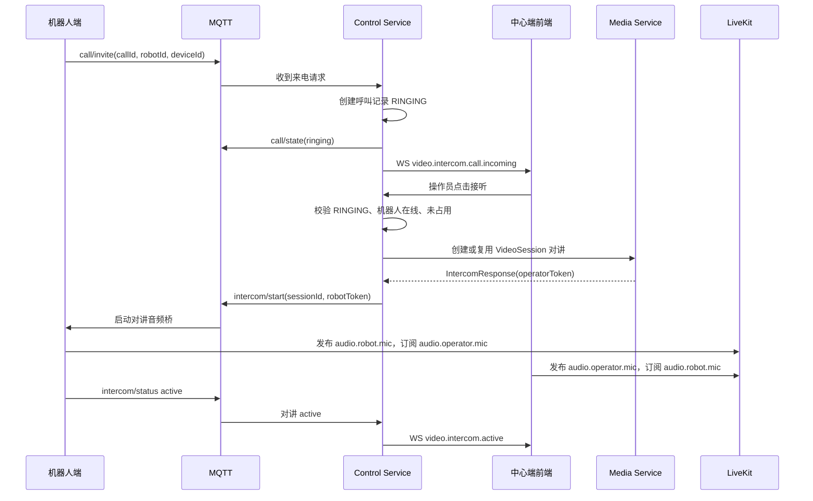

# 机器人主动呼叫中心端对讲方案

## 1. 目标

在现有“中心端主动呼叫机器人端”的对讲能力基础上，增加“机器人端主动呼叫中心端”的能力。

目标效果：

```text
机器人发起呼叫
-> 中心端收到来电弹窗
-> 操作员手动接听
-> 系统建立现有 LiveKit 对讲
-> 机器人与中心端开始语音通话
```

如果中心端拒接、无人接听、已有通话占用或机器人取消呼叫，则不启动语音通话，只回传对应状态给机器人端。

## 2. 设计结论

机器人主动呼叫中心端时，只新增“呼叫邀请/振铃/接听/拒接”的业务信令层，不新增独立语音媒体链路。

媒体通话仍复用现有方案：

| 项目 | 方案 |
|---|---|
| 媒体会话 | 继续使用 `VideoSession` |
| LiveKit Room | 继续使用现有 `media.{robotId}.{deviceId}.{channel}.{quality}` |
| 机器人上行音频 | `audio.robot.mic` |
| 中心端上行音频 | `audio.operator.mic` |
| 对讲启动命令 | 继续使用 `robot/{robotId}/media/video/intercom/start` |
| 对讲停止命令 | 继续使用 `robot/{robotId}/media/video/intercom/stop` |

关键原则：

1. 机器人端发起的是“来电请求”，不是直接发起媒体通话。
2. 中心端接听前，不创建 LiveKit Room，不签发 Token，不打开机器人麦克风。
3. 中心端接听后，再进入现有 `VideoSession + LiveKit + intercom/start` 对讲链路。
4. Media Service 不负责管理来电邀请；来电邀请由 Control Service 管理。

## 3. 模块分工

### 3.1 机器人端

开发功能：

- 增加“呼叫中心端”入口。
- 通过 MQTT 上报来电请求。
- 接收中心端返回的呼叫状态。
- 中心端接听后，复用现有 `intercom/start` 处理逻辑启动对讲。
- 呼叫取消、拒接、超时、占线时，停止本次呼叫流程并提示本地状态。

达到效果：

- 机器人可以主动请求与中心端通话。
- 机器人不会绕过中心端手动接听直接进入通话。

### 3.2 Control Service

开发功能：

- 订阅机器人来电 MQTT 消息。
- 维护来电状态。
- 向前端推送“机器人来电”WebSocket 事件。
- 提供接听、拒接操作入口。
- 接听后调用现有对讲能力，创建或复用 `VideoSession`。
- 接听后向机器人下发现有 `intercom/start` 命令。
- 拒接、超时、占线、取消时，向机器人下发呼叫状态。

达到效果：

- Control Service 成为机器人来电的调度中心。
- 只有中心端操作员手动接听后，通话才真正建立。

### 3.3 Media Service

开发功能：

- 原则上不新增来电邀请逻辑。
- 继续复用现有 `VideoSession`、LiveKit Token、Room、对讲状态、心跳和释放逻辑。
- 仅在 Control Service 接听呼叫后，参与创建或复用对讲会话。

达到效果：

- 媒体链路保持稳定，不引入第二套语音会话模型。
- 来电阶段不会占用媒体资源。

### 3.4 前端

开发功能：

- 接收 WebSocket 来电事件。
- 展示来电弹窗。
- 展示机器人名称、呼叫原因、倒计时。
- 提供“接听”和“拒接”按钮。
- 接听成功后进入现有对讲界面。
- 拒接、超时、被其他人接听、机器人取消时关闭弹窗并提示状态。

达到效果：

- 中心端像接电话一样处理机器人来电。
- 多个中心端在线时可以同时收到提醒，但只有一个人能接听成功。

## 4. 呼叫状态

新增呼叫邀请状态，与现有对讲状态分开管理。

| 状态 | 说明 |
|---|---|
| `RINGING` | 机器人已发起来电，等待中心端接听 |
| `ACCEPTED` | 中心端已接听，准备进入对讲链路 |
| `REJECTED` | 中心端主动拒接 |
| `TIMEOUT` | 超过等待时间，无人接听 |
| `CANCELED` | 机器人端取消呼叫 |
| `BUSY` | 当前机器人已有对讲或来电占用 |
| `ENDED` | 已接听后的通话结束 |
| `FAILED` | 呼叫或接听后的对讲启动失败 |

现有对讲状态继续表示媒体链路状态：

```text
IDLE -> STARTING -> ACTIVE -> STOPPING -> IDLE
                  -> INTERRUPTED / FAILED
```

注意：

- `RINGING` 不等于 `STARTING`。
- `RINGING` 阶段还没有启动 LiveKit 对讲。
- 中心端点击接听后，才进入 `STARTING`。

## 5. MQTT 协议

### 5.1 机器人发起来电

Topic：

```text
robot/{robotId}/media/video/intercom/call/invite
```

方向：

```text
Robot -> Control Service
```

Payload：

```json
{
  "callId": "call_20260714103000001",
  "robotId": "robot-001",
  "deviceId": "camera01",
  "channel": "visible",
  "quality": "sub",
  "reason": "机器人请求人工对讲",
  "timeoutSeconds": 30,
  "timestamp": "2026-07-14T10:30:00+08:00"
}
```

字段说明：

| 字段 | 必填 | 说明 |
|---|---|---|
| `callId` | 是 | 机器人端生成的本次呼叫 ID，用于幂等和状态回传 |
| `robotId` | 是 | 机器人 ID |
| `deviceId` | 是 | 默认绑定摄像头或对讲设备对应的摄像头 ID |
| `channel` | 否 | 默认 `visible` |
| `quality` | 否 | 默认 `sub` |
| `reason` | 否 | 呼叫原因 |
| `timeoutSeconds` | 否 | 中心端等待接听时间，默认 30 秒 |
| `timestamp` | 是 | 发起时间 |

### 5.2 中心端回传呼叫状态

Topic：

```text
robot/{robotId}/media/video/intercom/call/state
```

方向：

```text
Control Service -> Robot
```

Payload：

```json
{
  "callId": "call_20260714103000001",
  "robotId": "robot-001",
  "status": "accepted",
  "sessionId": "vs_xxx",
  "message": "operator accepted",
  "timestamp": "2026-07-14T10:30:08+08:00"
}
```

`status` 可选值：

| 值 | 说明 |
|---|---|
| `ringing` | 中心端已收到来电并推送前端 |
| `accepted` | 操作员已接听 |
| `rejected` | 操作员已拒接 |
| `timeout` | 呼叫超时 |
| `busy` | 当前机器人通话占用 |
| `canceled` | 呼叫已取消 |
| `failed` | 呼叫处理失败 |
| `ended` | 通话结束 |

### 5.3 机器人取消呼叫

Topic：

```text
robot/{robotId}/media/video/intercom/call/cancel
```

方向：

```text
Robot -> Control Service
```

Payload：

```json
{
  "callId": "call_20260714103000001",
  "robotId": "robot-001",
  "reason": "用户取消呼叫",
  "timestamp": "2026-07-14T10:30:10+08:00"
}
```

## 6. WebSocket 事件

### 6.1 机器人来电

事件：

```text
video.intercom.call.incoming
```

Payload：

```json
{
  "event": "video.intercom.call.incoming",
  "timestamp": "2026-07-14T10:30:00+08:00",
  "data": {
    "callId": "call_20260714103000001",
    "robotId": "robot-001",
    "robotName": "R1轮式机器人",
    "deviceId": "camera01",
    "cameraName": "前视摄像头",
    "reason": "机器人请求人工对讲",
    "status": "RINGING",
    "expiresAt": "2026-07-14T10:30:30+08:00"
  }
}
```

### 6.2 来电状态变化

事件：

```text
video.intercom.call.status
```

Payload：

```json
{
  "event": "video.intercom.call.status",
  "timestamp": "2026-07-14T10:30:08+08:00",
  "data": {
    "callId": "call_20260714103000001",
    "robotId": "robot-001",
    "status": "ACCEPTED",
    "sessionId": "vs_xxx",
    "acceptedBy": "operator-001"
  }
}
```

前端处理：

| 状态 | 前端动作 |
|---|---|
| `RINGING` | 展示来电弹窗 |
| `ACCEPTED` | 当前用户接听成功则进入对讲；其他用户关闭弹窗 |
| `REJECTED` | 关闭弹窗 |
| `TIMEOUT` | 关闭弹窗并提示无人接听 |
| `CANCELED` | 关闭弹窗并提示机器人已取消 |
| `BUSY` | 关闭弹窗并提示占线 |
| `FAILED` | 关闭弹窗并提示失败 |
| `ENDED` | 更新通话结束状态 |

## 7. 主流程

### 7.1 正常接听



### 7.2 拒接

```text
机器人 call/invite
-> Control Service 创建 RINGING
-> 前端展示弹窗
-> 操作员点击拒接
-> Control Service 更新 REJECTED
-> Control Service 通知机器人 rejected
-> 前端关闭弹窗
```

### 7.3 超时

```text
机器人 call/invite
-> Control Service 创建 RINGING
-> 超过 expiresAt 无人接听
-> 定时任务更新 TIMEOUT
-> Control Service 通知机器人 timeout
-> 前端关闭弹窗
```

### 7.4 占线

```text
机器人 call/invite
-> Control Service 检查该机器人已有 ACTIVE/STARTING 对讲或 RINGING 来电
-> 不创建新来电
-> Control Service 通知机器人 busy
```

### 7.5 机器人取消

```text
机器人 call/invite
-> Control Service 创建 RINGING
-> 机器人 call/cancel
-> Control Service 更新 CANCELED
-> 前端关闭弹窗
```

### 7.6 通话挂断

接听成功后，通话挂断复用现有对讲停止流程。

中心端挂断：

```text
操作员点击挂断
-> 前端停止本地麦克风发布
-> Control Service 停止当前对讲
-> Control Service 向机器人下发 intercom/stop
-> 机器人停止音频桥
-> Control Service 更新来电状态 ENDED
-> Control Service 向机器人回传 call/state ended
-> 前端退出对讲状态
```

机器人端挂断：

```text
机器人触发挂断
-> 机器人停止本地音频桥
-> 机器人上报对讲停止状态
-> Control Service 更新来电状态 ENDED
-> Control Service 向前端推送通话结束事件
-> 前端退出对讲状态
```

## 8. 异常处理

| 场景 | 处理 |
|---|---|
| 重复 `callId` | 幂等处理，返回当前呼叫状态 |
| 同一机器人重复来电 | 已有 `RINGING` 或对讲占用时返回 `busy` |
| 中心端多人同时接听 | 通过状态抢占保证只有一个成功，其余返回已被接听 |
| 接听时机器人离线 | 呼叫更新为 `FAILED`，前端提示机器人离线 |
| 接听后 `intercom/start` 下发失败 | 呼叫更新为 `FAILED`，对讲状态走现有失败处理 |
| 机器人收到 `intercom/start` 后启动失败 | 机器人上报 `intercom/status failed`，Media Service 更新对讲失败 |
| 通话中中心端挂断 | 下发 `intercom/stop`，机器人停止音频桥，来电状态更新为 `ENDED` |
| 通话中机器人端挂断 | 机器人停止音频桥并上报状态，前端退出对讲状态 |
| 前端 WebSocket 断开 | 重连后通过当前状态同步机制恢复未超时来电 |

## 9. 权限与安全

1. 只有具备对讲权限的用户可以接听。
2. 接听操作需要校验用户所在组织是否有权限访问该机器人。
3. LiveKit Token 仍由 Media Service 签发，机器人端不能自行生成。
4. 接听成功后才允许前端发布 `audio.operator.mic`。
5. 同一机器人同一时间只允许一个对讲操作员。
6. 所有 MQTT 消息使用 QoS 1，并通过 `callId`、`commandId` 做幂等。

## 10. 资源释放

振铃阶段：

- 不创建 `VideoSession`。
- 不创建 LiveKit Room。
- 不签发 Token。
- 不启动机器人麦克风。
- 不占用媒体资源。

接听后：

- 进入现有对讲资源治理。
- 对讲心跳超时按现有规则关闭。
- 对讲结束后，如果无人观看视频，会话按现有空闲释放策略释放。

## 11. 开发清单

### 11.1 机器人端

- 新增呼叫入口。
- 新增 `call/invite` 上报。
- 新增 `call/cancel` 上报。
- 新增 `call/state` 订阅。
- 保持现有 `intercom/start|stop` 处理逻辑不变。

### 11.2 Control Service

- 订阅机器人来电、取消呼叫 MQTT 消息。
- 维护机器人来电状态，包括振铃、接听、拒接、超时、取消、占线。
- 向前端推送来电和来电状态变化事件。
- 接听成功后复用现有对讲能力，创建或复用 `VideoSession`。
- 接听成功后向机器人下发 `intercom/start`。
- 拒接、超时、占线、取消时向机器人回传 `call/state`。

### 11.3 Media Service

- 不管理机器人来电流程。
- 不新增独立音频 Room。
- 接听后复用现有 `VideoSession`、LiveKit Token、Room、对讲状态、心跳和释放逻辑。

### 11.4 前端

- 新增来电弹窗组件。
- WebSocket 增加 `video.intercom.call.incoming` 和 `video.intercom.call.status` 事件处理。
- 新增接听、拒接操作。
- 接听成功后复用现有对讲连接逻辑。
- WebSocket 重连后恢复未处理来电。

## 12. 验收场景

| 编号 | 场景 | 预期结果 |
|---:|---|---|
| 1 | 机器人主动呼叫，中心端接听 | 前端进入对讲，双方语音可通 |
| 2 | 机器人主动呼叫，中心端拒接 | 机器人收到 `rejected`，不启动对讲 |
| 3 | 机器人主动呼叫，中心端无人接听 | 超时后机器人收到 `timeout` |
| 4 | 已有对讲时机器人再次呼叫 | 机器人收到 `busy` |
| 5 | 多个前端同时收到来电，一个人接听 | 接听者进入对讲，其他前端关闭弹窗 |
| 6 | 接听时机器人离线 | 前端提示失败，机器人不启动对讲 |
| 7 | 接听后机器人音频桥启动失败 | 前端收到对讲失败事件 |
| 8 | 机器人取消来电 | 前端弹窗关闭 |
| 9 | 前端 WebSocket 断开后恢复 | 仍能恢复未超时来电 |
