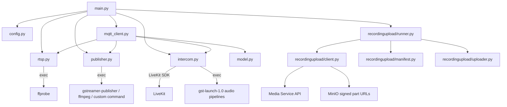

# robot-media-client Python 客户端

这是机器人媒体客户端的 Python 实现，功能边界与 Go 客户端保持一致，便于在 Jetson、Ubuntu 或其它 Python 运行环境中部署。

客户端主要负责：

- 连接 MQTT，并订阅机器人维度的实时视频、对讲和设备控制 Topic。
- 根据环境变量解析本地摄像头 RTSP 地址。
- 使用 `ffprobe` 探测 RTSP 视频流是否可用。
- 通过外部 publisher 进程把 RTSP 视频发布到 LiveKit。
- 扫描本地录像目录，并按通用文件 multipart 协议断点续传到媒体服务。
- 使用 LiveKit Python SDK 和 GStreamer 音频管线桥接机器人端对讲。
- 通过 TCP `8519/12345` 和 HTTP `8222` 控制机器人局域网内的多合一真实设备。
- 上报机器人在线、离线、实时视频、对讲和设备状态。

Go 客户端仍位于仓库 `client/` 目录，Python 客户端位于仓库根目录 `python-client/`。

## 目录结构

```text
python-client/
  robot_media_client/
    main.py
    config.py
    mqtt_client.py
    publisher.py
    rtsp.py
    intercom.py
    multifunction.py
    model.py
    timeutil.py
    recordingupload/
      client.py
      manifest.py
      runner.py
      uploader.py
  scripts/
    ffmpeg-livekit-publisher.sh
  Dockerfile
  requirements.txt
```

完整接口对接说明见 [Python 客户端任务视频上传对接指南](../docs/03-接口与协议/对接指南/Python客户端任务视频上传对接指南.md)。

## 安装

```bash
cd python-client
python3 -m venv .venv
. .venv/bin/activate
pip install -r requirements.txt
```

多合一实时喊话和收音通过系统 `libopus` 完成裸 Opus 帧编解码。macOS 使用
`brew install opus`，Ubuntu/Debian 使用 `apt install libopus0`。未安装时，
离散控制仍可运行，但多合一 LiveKit 音频桥会拒绝启动并输出明确错误。

运行环境还需要安装以下外部命令：

- `ffprobe`：RTSP 探测。
- `gstreamer-publisher`：默认 RTSP 到 LiveKit 推流。
- `ffmpeg`：默认 GStreamer publisher 失败时的 fallback 推流。
- `gst-launch-1.0`：本地对讲音频采集和播放。

## GStreamer 与 FFmpeg fallback

默认 `PUBLISHER_MODE=auto`。客户端会优先尝试 GStreamer 直推 RTSP，如果 GStreamer 启动失败或在观察窗口内退出，会自动回退到 `FFMPEG_PUBLISHER_CMD`。

默认 fallback 脚本：

```bash
./scripts/ffmpeg-livekit-publisher.sh {rtsp} {livekitUrl} {token}
```

Jetson/Ubuntu 环境可参考：

```bash
chmod +x scripts/ffmpeg-livekit-publisher.sh
sudo apt-get install -y ffmpeg
GOPROXY=https://goproxy.cn,direct sh ../client/scripts/install-gstreamer-publisher.sh
export PATH="$HOME/.local/bin:$PATH"
```

常用推流配置：

```bash
export PUBLISHER_MODE=auto
export PUBLISHER_FFMPEG_FIRST_DEVICE_IDS=
export PUBLISHER_FALLBACK_WATCH_SECONDS=8
```

如果希望所有视频都直接使用 FFmpeg：

```bash
export PUBLISHER_MODE=ffmpeg
export FFMPEG_PUBLISHER_CMD='/path/to/python-client/scripts/ffmpeg-livekit-publisher.sh {rtsp} {livekitUrl} {token}'
```

如果 `ffmpeg` 报 `Option rw_timeout not found` 或 `Unrecognized option 'stimeout'`，可调整：

```bash
export FFMPEG_RTSP_TIMEOUT_OPTION=auto
export FFMPEG_RTSP_TIMEOUT_OPTION=rw_timeout
export FFMPEG_RTSP_TIMEOUT_OPTION=stimeout
export FFMPEG_RTSP_TIMEOUT_OPTION=
```

## 启动

```bash
cd python-client
python -m robot_media_client
```

示例：

```bash
ROBOT_ID='test111' \
ROBOT_CLIENT_ID='robot-media-client-test111' \
RTSP_CAMERA01_MAIN='rtsp://192.168.124.204:8554/camera03' \
RTSP_CAMERA01_SUB='rtsp://192.168.124.204:8554/camera03' \
RTSP_CAMERA02_MAIN='rtsp://192.168.124.204:8554/camera03' \
RTSP_CAMERA02_SUB='rtsp://192.168.124.204:8554/camera03' \
RTSP_CAMERA03_MAIN='rtsp://192.168.124.204:8554/camera03' \
RTSP_CAMERA03_SUB='rtsp://192.168.124.204:8554/camera03' \
MEDIA_SERVICE_URL='http://192.168.124.77:8088' \
RECORDING_DIRECTORY='./recordings' \
PUBLISHER_MODE='auto' \
MULTI_FUNCTION_ENABLED='true' \
MULTI_FUNCTION_HOST='192.168.1.27' \
python -m robot_media_client
```

## 文件上传

默认开启本地文件上传：

```text
RECORDING_UPLOAD_ENABLED=true
RECORDING_DIRECTORY=./recordings
MEDIA_SERVICE_URL=http://192.168.124.77:8088
```

客户端扫描 `RECORDING_DIRECTORY` 下的普通文件，按文件后缀识别 `VIDEO`、`AUDIO`、`IMAGE`、`LOG`、`CONFIG`、`MAP`、`DOCUMENT` 或 `OTHER`，再调用媒体服务通用文件接口：

```text
POST /api/media/files/multipart-uploads
POST /api/media/files/multipart-uploads/{uploadId}/part-urls
PUT uploadUrl
POST /api/media/files/multipart-uploads/{uploadId}/complete
GET /api/media/files/{fileId}/status
```

本地断点续传状态写入：

```text
RECORDING_MANIFEST_PATH=./recording-upload-manifest.json
```

## 对讲

对讲默认开启：

```text
INTERCOM_AUDIO_ENABLED=true
```

对讲使用 LiveKit Python SDK，并复用以下音频管线配置：

```text
GST_LAUNCH_PATH
AUDIO_CAPTURE_PIPELINE
AUDIO_PLAYBACK_PIPELINE
```

如果只希望运行视频能力，可设置：

```bash
export INTERCOM_AUDIO_ENABLED=false
```

### 机器人主动呼叫中心端

启动客户端时应确保 `MQTT_BROKER_URL` 与 Control Service 使用同一个 Broker，例如：

```bash
export MQTT_BROKER_URL='tcp://192.168.124.235:1884'
```

机器人本地按钮或业务模块可以调用 `RobotMQTTClient`：

```python
call_id = client.invite_intercom_call("camera01", "机器人请求人工对讲", 30)
# 振铃阶段由机器人取消
client.cancel_intercom_call(call_id, "用户取消呼叫")
# 或者中心端接听后，由机器人挂断
client.end_intercom_call(call_id)
```

可通过状态回调更新机器人屏幕或语音提示：

```python
client.set_intercom_call_state_handler(
    lambda state: print(state.call_id, state.status, state.message)
)
```

客户端只发起来电邀请；中心端接听后，仍由现有 `intercom/start` 启动 LiveKit 音频桥。

## Docker

```bash
cd python-client
docker build -t robot-media-client-python:dev .
docker run --rm \
  -e ROBOT_ID='test111' \
  -e ROBOT_CLIENT_ID='robot-media-client-test111' \
  -e RTSP_CAMERA01_MAIN='rtsp://192.168.124.204:8554/camera03' \
  -e RTSP_CAMERA01_SUB='rtsp://192.168.124.204:8554/camera03' \
  -e RTSP_CAMERA02_MAIN='rtsp://192.168.124.204:8554/camera03' \
  -e RTSP_CAMERA02_SUB='rtsp://192.168.124.204:8554/camera03' \
  -e RTSP_CAMERA03_MAIN='rtsp://192.168.124.204:8554/camera03' \
  -e RTSP_CAMERA03_SUB='rtsp://192.168.124.204:8554/camera03' \
  robot-media-client-python:dev
```

## 设备状态上报

客户端通过 `robot/{robotId}/media/client/status` 上报 `devices[]`。设备控制指令会更新本地可确认状态，并立即重新上报，例如：

- 音量、静音：`volume`、`volumePercent`、`muted`
- 发射器安全开关：`safetySwitchEnabled`
- 控制模式：`controlMode`
- 警示灯：`enabled`、`powerOn`、`mode`
- 云台自转：`autoRotateEnabled`、`panSpeed`
- 车灯：`front`、`rear`
- 多合一设备：`volumePercent`、`audioSession.broadcastActive`、`audioSession.monitorActive`、`audioSession.monitorSuppressed`

多合一逻辑订阅统一 `control/#`，并把 `MULTI_FUNCTION_BROADCASTER` action 转为 TCP `8519/12345` 或 HTTP `8222` 真实调用。设备连接、音量、温度和文件列表按真实结果上报；`audioPlayback` 记录客户端已成功写入的播放命令和文件名，不等同于设备查询状态；照明和警报不写入设备真实状态。

`upload_audio_file` 由后台线程根据 `fileId` 和 `MEDIA_SERVICE_URL` 从 Media Service
下载文件，校验 `fileSize` 后以原文件名调用机器人局域网内 `POST /upload-file`。
MQTT 只传文件元数据，不传文件内容或分片。

多合一实时喊话和收音复用平台现有 LiveKit 对讲会话。目标 `deviceId` 等于
`MULTI_FUNCTION_DEVICE_ID` 时，Python 客户端不使用本机默认声卡，而是执行：

- 浏览器 `audio.operator.mic` -> 48kHz PCM -> 8kHz/60ms Opus -> 设备 `[10]+Opus`。
- 设备 `[40]+Opus` -> 16kHz/20ms PCM -> 48kHz -> LiveKit `audio.robot.mic`。

大屏发送 `start_broadcast` 和 `start_monitor` 分别控制两个方向；两者共用一个
`mediaSessionId`，并由大屏每 5 秒刷新音频会话心跳。

## 代码结构与实现说明

### 1. 文档范围

本文档说明 `python-client/` 子项目的代码结构、模块职责、核心运行流程和主要配置项。

Python 客户端是机器人侧媒体接入进程，主要能力包括：

1. 启动后连接 MQTT，并周期性上报机器人、摄像头和设备状态。
2. 接收实时视频 start/stop/switch 指令，探测 RTSP 后启动本地推流进程，将视频发布到 LiveKit。
3. 接收对讲 start/stop 指令，通过 LiveKit Python SDK 和本地 GStreamer 音频管线建立双向音频桥。
4. 后台扫描本地文件，按通用文件 multipart 协议续传到 Media Service/MinIO，并维护本地上传清单。

### 2. 顶层目录结构

```text
python-client/
  robot_media_client/
    __init__.py
    __main__.py
    main.py
    config.py
    model.py
    mqtt_client.py
    publisher.py
    rtsp.py
    intercom.py
    timeutil.py
    recordingupload/
      __init__.py
      client.py
      manifest.py
      runner.py
      uploader.py
  scripts/
    ffmpeg-livekit-publisher.sh
  recordings/
    *.mp4
  Dockerfile
  README.md
  requirements.txt
  recording-upload-manifest-001.json
```

| 路径 | 职责 |
|---|---|
| `robot_media_client/__main__.py` | 支持 `python -m robot_media_client` 启动 |
| `robot_media_client/main.py` | 程序入口，加载配置，初始化 RTSP 探测、视频 publisher、对讲 manager、录像上传 runner 和 MQTT client |
| `robot_media_client/config.py` | 从环境变量加载机器人、MQTT、RTSP、推流、对讲、上传和本地缓存配置 |
| `robot_media_client/model.py` | MQTT 指令数据模型，包括实时视频、对讲和设备控制 |
| `robot_media_client/mqtt_client.py` | MQTT 连接、订阅、心跳、指令分发、状态发布和设备状态回写 |
| `robot_media_client/rtsp.py` | 使用 `ffprobe` 检查 RTSP 视频流是否可达 |
| `robot_media_client/publisher.py` | 按 `sessionId` 管理外部视频推流进程，支持 GStreamer、FFmpeg fallback 和自定义命令 |
| `robot_media_client/intercom.py` | 使用 LiveKit Python SDK 管理对讲会话，桥接本地麦克风、扬声器与 LiveKit 音频 Track |
| `robot_media_client/recordingupload/` | 本地文件发现、上传清单、断点续传、分片上传、完成上传和本地缓存清理 |
| `robot_media_client/timeutil.py` | UTC 时间生成、格式化和解析 |
| `scripts/ffmpeg-livekit-publisher.sh` | FFmpeg fallback 推流脚本 |
| `recordings/` | 本地录像/文件扫描目录，可放置待上传视频文件 |
| `recording-upload-manifest-001.json` | 本地上传 manifest 示例或测试文件 |
| `Dockerfile` | 构建 Python 客户端镜像 |

### 3. 启动入口

入口为 `robot_media_client/main.py`，通过 `python -m robot_media_client` 调用。

启动流程：

```text
main
  -> config.load()
  -> 注册 SIGINT/SIGTERM
  -> 初始化 rtsp.Probe
  -> 初始化 publisher.ProcessPublisher
  -> 初始化 intercom.IntercomManager
  -> 如果启用文件上传，后台启动 recordingupload.Runner
  -> 循环创建 RobotMQTTClient 并连接 MQTT
  -> MQTT 断线后清理本地资源，5 秒后重连
```

`Probe`、`ProcessPublisher`、`IntercomManager` 在 MQTT 重连之间复用。MQTT client 对象按连接生命周期创建，断开后会停止本地视频和对讲资源，并在主循环中退避重连。

进程退出时会统一停止视频 publisher、对讲 session 和上传 runner。

### 4. 核心模块与类

| 模块 | 核心类型/函数 | 说明 |
|---|---|---|
| `main.py` | `main()` | 进程入口，负责装配配置、信号处理、后台上传线程和 MQTT 重连循环 |
| `config.py` | `Config`、`Camera`、`Device`、`load()` | 环境变量解析和默认设备/摄像头配置生成 |
| `model.py` | `StartCommand`、`StopCommand`、`IntercomStartCommand`、`ControlCommand` | MQTT JSON payload 的结构化模型 |
| `mqtt_client.py` | `RobotMQTTClient` | MQTT 订阅、消息分发、实时视频状态、对讲状态和在线心跳上报 |
| `rtsp.py` | `Probe`、`StreamInfo` | 通过 `ffprobe` 做 RTSP 启动前探测 |
| `publisher.py` | `ProcessPublisher` | 管理 GStreamer、FFmpeg 或自定义 publisher 进程 |
| `intercom.py` | `IntercomManager`、`IntercomSession` | 管理 LiveKit 对讲音频桥 |
| `multifunction.py` | `MultiFunctionClient`、`StreamParser` | 多合一真实设备 TCP/HTTP 适配、CRC、流式拆包和 Opus 帧入口 |
| `recordingupload/runner.py` | `Runner`、`file_type()`、`content_type()` | 文件发现、上传状态机、本地缓存清理 |
| `recordingupload/client.py` | `Client`、`UploadResponse`、`StatusResponse` | Media Service 上传接口封装 |
| `recordingupload/uploader.py` | `upload_missing_parts()`、`PreadReader` | multipart 分片并发 PUT |
| `recordingupload/manifest.py` | `Manifest`、`Task` | 本地断点续传清单持久化 |
| `timeutil.py` | `now_utc()`、`isoformat()`、`parse_time()` | UTC 时间工具 |

### 5. 配置模块

`robot_media_client/config.py` 定义 `Config`，所有配置从环境变量读取，并提供默认值。

#### 5.1 机器人与 MQTT

| 字段 | 环境变量 | 说明 |
|---|---|---|
| `robot_id` | `ROBOT_ID` | 机器人 ID，默认 `test111` |
| `robot_name` | `ROBOT_NAME` | 机器人名称 |
| `type` | `ROBOT_TYPE` | 机器人类型 |
| `battery` | `ROBOT_BATTERY` | 电量百分比，会限制在 0 到 100 |
| `mqtt_broker` | `MQTT_BROKER_URL` | MQTT broker 地址 |
| `mqtt_username` | `MQTT_USERNAME` | MQTT 用户名 |
| `mqtt_password` | `MQTT_PASSWORD` | MQTT 密码 |
| `client_id` | `ROBOT_CLIENT_ID` | MQTT clientId |
| `heartbeat_interval` | `HEARTBEAT_INTERVAL_MS` | 在线心跳间隔 |

#### 5.2 摄像头与 RTSP

| 字段 | 环境变量 | 说明 |
|---|---|---|
| `cameras` | `CAMERA_{CAMERA_ID}_NAME` / `CAMERA_{CAMERA_ID}_GROUP_TYPE` / `CAMERA_{CAMERA_ID}_QUALITY` / `RTSP_{CAMERA_ID}` / `RTSP_{CAMERA_ID}_SUB` / `RTSP_{CAMERA_ID}_MAIN` | 摄像头列表，默认按 `test111` 或 `SN006` 生成三路摄像头 |
| `rtsp_visible_sub` | `RTSP_VISIBLE_SUB` | 兼容旧配置的可见光低码流 RTSP |
| `rtsp_visible_main` | `RTSP_VISIBLE_MAIN` | 可见光高清 RTSP |
| `rtsp_thermal_sub` | `RTSP_THERMAL_SUB` | 热成像低码流 RTSP |
| `rtsp_thermal_main` | `RTSP_THERMAL_MAIN` | 热成像高清 RTSP |
| `ffprobe_path` | `FFPROBE_PATH` | `ffprobe` 路径 |
| `probe_timeout` | `PROBE_TIMEOUT_MS` | RTSP 探测超时时间 |

默认摄像头 ID：`test111` 为 `camera01/camera02/camera03`，`SN006` 为 `camera04/camera05/camera06`。实际选流优先按 `deviceId/cameraId` 找摄像头配置，再根据 `quality` 使用 main 或 sub RTSP。

#### 5.3 推流与对讲

| 字段 | 环境变量 | 说明 |
|---|---|---|
| `publisher_cmd` | `PUBLISHER_CMD` | 自定义推流命令；非空时优先使用 |
| `publisher_mode` | `PUBLISHER_MODE` | 推流模式，支持 `auto`、`gstreamer`、`ffmpeg` |
| `publisher_fallback_watch_seconds` | `PUBLISHER_FALLBACK_WATCH_SECONDS` | auto 模式下观察 GStreamer 是否异常退出的秒数 |
| `publisher_gstreamer_retry_seconds` | `PUBLISHER_GSTREAMER_RETRY_SECONDS` | GStreamer 失败后使用 FFmpeg 的冷却秒数，默认 60 |
| `publisher_ffmpeg_first_device_ids` | `PUBLISHER_FFMPEG_FIRST_DEVICE_IDS` | auto 模式下优先使用 FFmpeg 的设备 ID 列表 |
| `ffmpeg_publisher_cmd` | `FFMPEG_PUBLISHER_CMD` | FFmpeg fallback 命令 |
| `gstreamer_publisher_path` | `GSTREAMER_PUBLISHER_PATH` | 默认 `gstreamer-publisher` |
| `gstreamer_pipeline` | `GSTREAMER_PIPELINE` | RTSP 到 LiveKit publisher 的媒体 pipeline |
| `gst_launch_path` | `GST_LAUNCH_PATH` | 默认 `gst-launch-1.0` |
| `audio_capture_pipeline` | `AUDIO_CAPTURE_PIPELINE` | 本地麦克风采集 pipeline |
| `audio_playback_pipeline` | `AUDIO_PLAYBACK_PIPELINE` | 本地扬声器播放 pipeline |
| `intercom_audio_enabled` | `INTERCOM_AUDIO_ENABLED` | 是否启用对讲音频桥 |

#### 5.4 文件上传

| 字段 | 环境变量 | 说明 |
|---|---|---|
| `recording_upload_enabled` | `RECORDING_UPLOAD_ENABLED` | 是否启用文件上传能力 |
| `media_service_url` | `MEDIA_SERVICE_URL` | Media Service 地址 |
| `recording_directory` | `RECORDING_DIRECTORY` | 本地文件扫描目录 |
| `recording_manifest_path` | `RECORDING_MANIFEST_PATH` | 本地上传 manifest 路径 |
| `recording_device_id` | `RECORDING_DEVICE_ID` | 文件所属设备 ID |
| `upload_scan_interval` | `RECORDING_UPLOAD_SCAN_INTERVAL_MS` | 扫描间隔 |
| `upload_part_concurrency` | `RECORDING_UPLOAD_PART_CONCURRENCY` | 单文件分片上传并发 |
| `upload_part_url_batch_size` | `RECORDING_UPLOAD_PART_URL_BATCH_SIZE` | 单批获取上传 URL 数量 |
| `upload_file_concurrency` | `RECORDING_UPLOAD_FILE_CONCURRENCY` | 多文件上传并发 |
| `local_cache_max_bytes` | `RECORDING_LOCAL_CACHE_MAX_BYTES` | 本地文件缓存上限 |
| `local_min_free_bytes` | `RECORDING_LOCAL_MIN_FREE_BYTES` | 本地磁盘最小剩余空间 |
| `local_retention_after_ready` | `RECORDING_LOCAL_RETENTION_AFTER_READY_HOURS` | 文件 READY 后本地保留时长 |

#### 5.5 多合一设备

Go/Python 使用同一组环境变量：

```text
MULTI_FUNCTION_ENABLED=false
MULTI_FUNCTION_DEVICE_ID=broadcaster-001
MULTI_FUNCTION_HOST=192.168.1.27
MULTI_FUNCTION_CONTROL_PORT=8519
MULTI_FUNCTION_TILT_PORT=12345
MULTI_FUNCTION_HTTP_PORT=8222
MULTI_FUNCTION_DIAL_TIMEOUT_MS=3000
MULTI_FUNCTION_WRITE_TIMEOUT_MS=3000
MULTI_FUNCTION_HTTP_TIMEOUT_MS=5000
MULTI_FUNCTION_KEEPALIVE_ENABLED=true
MULTI_FUNCTION_KEEPALIVE_INTERVAL_MS=2000
```

### 6. MQTT 模块

`robot_media_client/mqtt_client.py` 订阅的 Topic：

| Topic | 说明 |
|---|---|
| `robot/{robotId}/media/video/start` | 启动一路实时视频 |
| `robot/{robotId}/media/video/stop` | 停止指定 `sessionId` 的视频推流 |
| `robot/{robotId}/media/video/switch-channel` | 切换通道，本地按重新 start 处理 |
| `robot/{robotId}/media/video/intercom/start` | 启动对讲 |
| `robot/{robotId}/media/video/intercom/stop` | 停止对讲 |
| `robot/{robotId}/control/#` | 接收本体、云台、音量、发射器、警示灯、车灯等装备控制命令 |

发布的 Topic：

| Topic | 说明 |
|---|---|
| `robot/{robotId}/media/client/status` | 媒体客户端上线、下线和周期心跳；机器人 ID 以 topic 为准，仅携带摄像头清单和 `devices[].deviceId/deviceType/onlineStatus/status` 运行态，不携带本体业务状态 |
| `robot/{robotId}/media/video/status` | 实时视频状态 |
| `robot/{robotId}/media/video/intercom/status` | 对讲状态 |

实时视频 start/switch 流程：

```text
收到 MQTT 指令
  -> 解析 StartCommand
  -> 按 sessionId + commandId 去重
  -> 解析 RTSP URL
  -> ffprobe 探测 RTSP
  -> 上报 publishing
  -> publisher.start 启动推流进程
  -> 上报 streaming 或 failed
```

设备控制处理：

```text
收到 robot/{robotId}/control/# 指令
  -> 解析 ControlCommand
  -> 按 action 更新本地 deviceState/controlMode
  -> 立即发布 media/client/status
```

当前可回写的状态包括音量、静音、发射器安全开关、控制模式、警示灯、云台自转和车灯。

### 7. 视频推流模块

`robot_media_client/publisher.py` 使用外部进程完成 RTSP 到 LiveKit 的发布。

优先级：

```text
PUBLISHER_CMD 非空
  -> 执行自定义命令
否则 PUBLISHER_MODE=ffmpeg
  -> 执行 FFMPEG_PUBLISHER_CMD
否则 PUBLISHER_MODE=auto/gstreamer
  -> 执行 gstreamer-publisher
  -> auto 模式下如果 GStreamer 失败，可回退到 FFmpeg
```

#### 7.1 RTSP 解析与探测

实时视频指令进入 `RobotMQTTClient._handle_start()` 后，RTSP 地址来源有两种：

1. 后端指令里显式携带 `rtspUrl`，客户端直接使用。
2. 指令未携带 `rtspUrl`，客户端按 `deviceId` 和 `quality` 从 `Config.cameras` 中查找。

启动 publisher 前会先调用 `Probe.check()`：

```text
ffprobe -v error
  -rtsp_transport tcp
  -select_streams v:0
  -show_entries stream=codec_name,width,height
  -of json
  {rtspUrl}
```

探测失败时不会启动 publisher，而是上报：

```text
status=failed
errorCode=RTSP_PROBE_FAILED
```

#### 7.2 Publisher 进程管理

`ProcessPublisher` 内部用：

```text
dict[sessionId, subprocess.Popen]
```

管理推流进程。同一个 `sessionId` 重复 start 时，会先停止旧进程，再启动新进程。`stop`、MQTT 断线或客户端退出时会停止对应进程。

外部进程启动时使用 `start_new_session=True`，停止时优先 kill 进程组，确保脚本内部拉起的 `ffmpeg`、`gstreamer-publisher` 子进程也能退出。

#### 7.3 GStreamer 默认推流

默认 GStreamer 命令：

```text
gstreamer-publisher --url {livekitUrl} --token {publisherToken} -- {pipeline}
```

默认 pipeline：

```text
rtspsrc location={rtsp} protocols=tcp latency=100
  drop-on-latency=true
  ! queue max-size-buffers=0 max-size-bytes=0 max-size-time=200000000 leaky=downstream
  ! rtph264depay
  ! h264parse config-interval=1
```

启动后客户端观察 2 秒。如果进程在 2 秒内退出，认为启动失败；如果超过 2 秒仍在运行，认为推流进程启动成功。

#### 7.4 FFmpeg fallback

`PUBLISHER_MODE=auto` 时，客户端优先启动 GStreamer。如果 GStreamer 启动失败，或在 `PUBLISHER_FALLBACK_WATCH_SECONDS` 窗口内退出，会切换到 FFmpeg fallback。

默认 fallback 命令：

```text
./scripts/ffmpeg-livekit-publisher.sh {rtsp} {livekitUrl} {token}
```

fallback 脚本链路：

```text
RTSP
  -> ffmpeg 拉流并转为低延迟 H264
  -> stdout 管道
  -> gstreamer-publisher fdsrc fd=0
  -> LiveKit
```

某个 RTSP URL 触发 GStreamer 失败后，在 `PUBLISHER_GSTREAMER_RETRY_SECONDS` 冷却期内优先使用 FFmpeg；冷却结束后会恢复尝试 GStreamer 直推。

#### 7.5 自定义命令与 Track

命令模板支持占位符：

| 占位符 | 含义 |
|---|---|
| `{rtsp}` | RTSP URL |
| `{livekitUrl}` | LiveKit URL |
| `{token}` | LiveKit publisher token |
| `{room}` | LiveKit room name |
| `{track}` | Track 名称 |

Track 名称规则：

```text
video.{channel}.{quality}
```

当前外部 publisher 不会把真实 LiveKit Track SID 回传给父进程，客户端先返回稳定占位值：

```text
TR_{sessionId}
```

### 8. 对讲模块

`robot_media_client/intercom.py` 通过 LiveKit Python SDK 建立机器人端对讲。

核心流程：

```text
启动对讲
  -> 连接 LiveKit Room
  -> 创建 audio.robot.mic 本地 Track
  -> 启动 AUDIO_CAPTURE_PIPELINE 读取本地麦克风 PCM
  -> 把 PCM 帧写入 LiveKit AudioSource
  -> 订阅 audio.operator.mic
  -> 把远端 PCM 写入 AUDIO_PLAYBACK_PIPELINE 播放
```

每帧音频为 48kHz、单声道、S16LE、20ms：

```text
48000Hz * 20ms = 960 samples
```

### 9. 文件上传模块

`robot_media_client/recordingupload/` 是独立于 MQTT 的后台轮询任务。

| 文件 | 职责 |
|---|---|
| `runner.py` | 扫描本地文件、调度多文件上传、驱动单个任务状态流转、本地缓存清理 |
| `client.py` | Media Service HTTP API 客户端 |
| `uploader.py` | 按缺失 part 并发上传分片 |
| `manifest.py` | 本地上传清单读写，支持进程重启后续传 |

#### 9.1 任务发现

`Runner.discover()` 扫描 `RECORDING_DIRECTORY` 第一层普通文件，跳过目录、隐藏文件和 0 字节文件。客户端按后缀映射文件类型：

| 后缀 | fileType |
|---|---|
| `.mp4` / `.mov` / `.m4v` | `VIDEO` |
| `.mp3` / `.wav` / `.aac` / `.m4a` / `.ogg` / `.flac` | `AUDIO` |
| `.jpg` / `.jpeg` / `.png` / `.webp` | `IMAGE` |
| `.log` / `.txt` | `LOG` |
| `.json` / `.yaml` / `.yml` / `.toml` / `.ini` / `.conf` | `CONFIG` |
| `.map` | `MAP` |
| `.pdf` / `.doc` / `.docx` / `.xls` / `.xlsx` | `DOCUMENT` |
| 其它 | `OTHER` |

本地幂等键：

```text
{recordingDeviceId}/{fileName}/{fileSize}/{mtime}
```

同一个文件重复启动客户端不会重复上传；同名文件被覆盖后，只要大小或修改时间变化，会被识别为新任务。

#### 9.2 状态机

上传状态流：

```text
PENDING
  -> create_or_resume
  -> UPLOADING
  -> upload_missing_parts
  -> complete
  -> PROCESSING 或 READY
  -> status polling
  -> READY
  -> LOCAL_DELETED
```

说明：

1. `create_or_resume` 会向 Media Service 注册或恢复上传会话。
2. 服务端返回 `uploadedParts` 后，客户端只上传缺失 part。
3. part URL 由 `/part-urls` 批量获取。
4. 所有缺失 part 上传完成后调用 `/complete`。
5. 非视频可能直接 `READY`；视频通常进入 `PROCESSING`，等待服务端 HLS 切片、封面和预览图处理。
6. `READY` 后本地文件才允许被缓存清理策略删除，manifest 状态改为 `LOCAL_DELETED`。

#### 9.3 HTTP API

调用的 Media Service API：

| 方法 | 路径 | 说明 |
|---|---|---|
| `POST` | `/api/media/files/multipart-uploads` | 创建或恢复上传 |
| `POST` | `/api/media/files/multipart-uploads/{uploadId}/part-urls` | 批量获取 part 上传 URL |
| `PUT` | `uploadUrl` | 将单个 part 直传到对象存储签名 URL |
| `POST` | `/api/media/files/multipart-uploads/{uploadId}/complete` | 通知服务端完成 multipart |
| `GET` | `/api/media/files/{fileId}/status` | 查询文件处理状态 |

所有 Media Service JSON 请求都会带：

```http
X-Robot-Id: {robotId}
```

`PUT uploadUrl` 是对象存储预签名 URL，鉴权信息已经包含在 URL 中。

#### 9.4 并发与断点续传

多文件并发由 `RECORDING_UPLOAD_FILE_CONCURRENCY` 控制；单文件分片 PUT 并发由 `RECORDING_UPLOAD_PART_CONCURRENCY` 控制；单批申请 part URL 数量由 `RECORDING_UPLOAD_PART_URL_BATCH_SIZE` 控制。

`RECORDING_UPLOAD_PART_URL_BATCH_SIZE` 可以大于 PUT 并发数，表示一次多申请一些 URL，减少接口往返；实际同时上传数量仍由线程池限制。

分片读取使用 `os.pread`，避免多个上传线程共享同一个文件游标导致错位读取。

#### 9.5 Manifest

manifest 默认路径：

```text
./recording-upload-manifest.json
```

核心结构：

```text
Manifest
  tasks[sourceFileId]Task

Task
  sourceFileId
  filePath
  fileSize
  createdAt
  fileId
  uploadId
  status
  error
  updatedAt
```

manifest 的作用：

1. 客户端重启后恢复已发现任务。
2. 上传中断后继续使用同一个 `sourceFileId` 恢复上传。
3. 视频进入 `PROCESSING` 后继续用 `fileId` 轮询状态。
4. 本地删除后保留 `LOCAL_DELETED`，避免重复处理。

### 10. 对外运行依赖

| 依赖 | 用途 |
|---|---|
| `paho-mqtt` | MQTT 客户端 |
| `requests` | Media Service 和对象存储 HTTP 请求 |
| `livekit` | LiveKit Room、Track 发布与订阅 |
| `ffprobe` | RTSP 探测 |
| `gstreamer-publisher` | 默认 RTSP 到 LiveKit 视频发布 |
| `ffmpeg` | fallback 视频发布 |
| `gst-launch-1.0` | 本地对讲音频采集与播放 |

### 11. 运行链路总览


